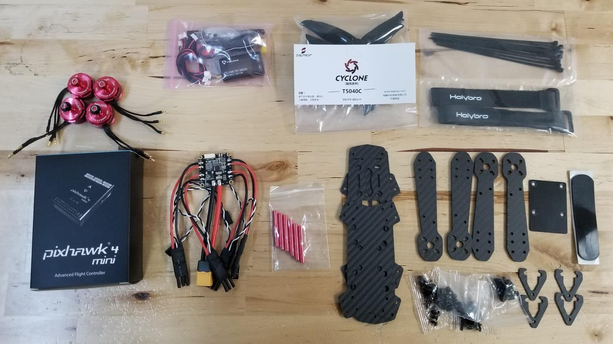
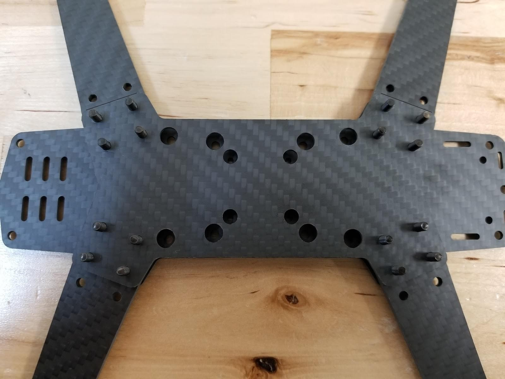
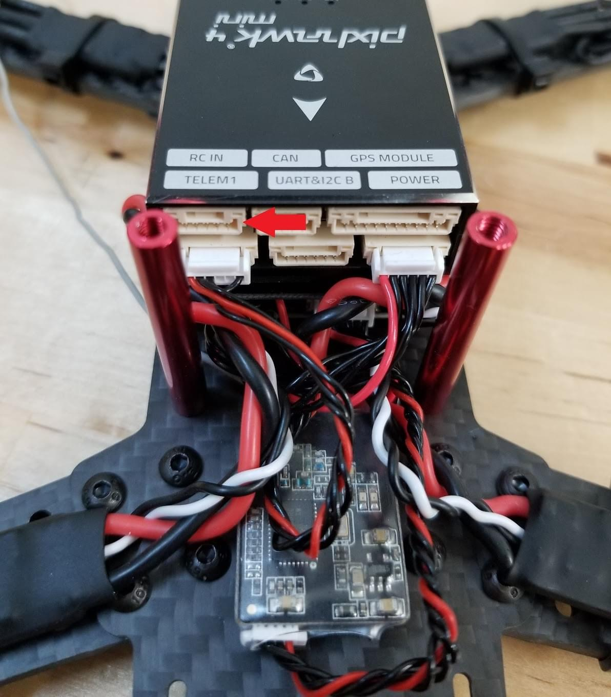

# Holybro QAV250 + Pixhawk 4 Mini Build (Припинено)

:::info _Комплект Holybro Pixhawk 4 Mini QAV250_ більше не доступний.

Інструкції залишено тут, оскільки дуже схожі комплекти на основі Pix32 v6 доступні [тут](https://holybro.com/products/qav250-kit). Ці інструкції все ще можна виконувати (і можуть бути оновлені до Pix32 v6).
:::

Повні комплекти включають карбонову раму для гонок QAV250, контролер польоту та майже всі інші необхідні компоненти (окрім акумулятора та приймача). Є варіанти набору як з підтримкою FPV, так і без неї. Ця тема надає повні інструкції для збирання комплекту та налаштування PX4 з використанням *QGroundControl*.

Основна Інформація

- **Каркас:** Holybro QAV250
- **Контролер польоту:** [Pixhawk 4 Mini](../flight_controller/pixhawk4_mini.md)
- **Час зборки (приблизно):** 3.5 hours (2 for frame, 1.5 autopilot installation/configuration)

## Швидкий старт керівництво

[Керівництво початку роботи з комплектом Pixhawk 4 Mini QAV250](https://github.com/PX4/PX4-user_guide/raw/main/assets/flight_controller/pixhawk4mini/pixhawk4mini_qav250kit_quickstart_web.pdf)

## Специфікація матеріалів

Набір Holybro [QAV250 Kit](https://holybro.com/products/qav250-kit) включає майже всі необхідні компоненти:
* [Holybro Transceiver Telemetry Radio V3](../telemetry/holybro_sik_radio.md)
* Power module holybro
* Fully assembled Power Management Board with ESCs
* Motors - DR2205 KV2300
* 5” Plastic Props
* Carbon fiber 250 airframe with hardware
* Foxer camera
* Vtx 5.8ghz

Additionally you will need a battery and receiver (+compatible transmitter). This build uses:
- Receiver: [FrSSKY D4R-II](https://www.frsky-rc.com/product/d4r-ii/)
- Battery: [4S 1300 mAh](http://www.getfpv.com/lumenier-1300mah-4s-60c-lipo-battery-xt60.html)

## Обладнання

This section lists all hardware for the frame and the autopilot installation.

### Frame QAV250

| Description                   | Quantity |
| ----------------------------- | -------- |
| Unibody frame plate           | 1        |
| Flight controller cover plate | 1        |
| PDB                           | 1        |
| Camera plate                  | 1        |
| 35mm standoffs                | 6        |
| Vinyl screws and nuts         | 4        |
| 15mm steel screws             | 8        |
| Steel nuts                    | 8        |
| 7mm steel screws              | 12       |
| Velcro battery strap          | 1        |
| Foam for battery              | 1        |
| Landing pads                  | 4        |

### Electronics

| Description                                                                 | Quantity |
| --------------------------------------------------------------------------- | -------- |
| Motors - DR2205 KV2300                                                      | 4        |
| Fully assembled Power Management Board with ESCs                            | 4        |
| Holybro power module                                                        | 1        |
| Fr-sky D4R-II receiver                                                      | 1        |
| Pixhawk 4 mini                                                              | 1        |
| Holybro GPS Neo-M8N                                                         | 1        |
| [Holybro Transceiver Telemetry Radio V3](../telemetry/holybro_sik_radio.md) | 1        |
| Battery lumenier 1300 mAh 4S 14.8V                                          | 1        |
| Vtx 5.8gHz                                                                  | 1        |
| FPV camera (Complete Kit - only)                                            | 1        |

The image below shows both frame and electronic components.

## Assembly

Очікуваний час для складання каркасу - 2 години, а для встановлення автопілоту та налаштування конструкції повітряного каркасу в *QGroundControl* - 1,5 години.

### Необхідні інструменти

Наступні інструменти використовуються у цій збірці:

- 2.0mm Hex screwdriver
- 3mm Phillips screwdriver
- Wire cutters
- Precision tweezers

### Збірка рами

1. Прикріпіть руки до плати кнопки за допомогою гвинтів довжиною 15 мм, як показано:

   
1. Покладіть коротку пластину над руками

   
1. Покладіть гайки на відносно 15 мм гвинти (показано в наступному кроці)
1. Вставте пластикові гвинти в показані отвори (зверніть увагу, що ця частина рами звернена донизу, коли транспортний засіб буде готовий). 
1. Додайте пластикові гайки на гвинти (переверніть, як показано) 
1. Опустіть модуль живлення над пластиковими гвинтами, а потім додайте пластикові опори 
1. Встановіть плату керування польотом на стойки (над модулем живлення) 
1. Підключіть двигуни. Двигуни мають стрілку, що показує напрямок обертання. 
1. Використовуйте двосторонній скотч з комплекту для кріплення *Pixhawk 4 Mini* до пластини керування польотом. 
1. Підключіть кабель живлення модуля живлення до *Pixhawk 4 mini*. 
1. Прикріпіть алюмінієві опори до платформи кнопок 
1. Підключіть ESC з моторами та утримуйте. На цьому зображенні показаний порядок розташування двигунів та напрямок обертання. 

   Підключіть двигуни на ESC, переконайтеся, що двигуни обертаються у правильному напрямку, якщо двигун обертається у протилежний бік, змініть кабель A на плату C та C на плату A ESC.

   :::warning
Перевірте напрямки руху моторів без гвинтів.
:::

   
1. Підключіть кабелі сигналу ESC до виходів PWM Pixhawk у правильному порядку (див. попереднє зображення)

   
1. Підключіть приймач.
   * Якщо використовуєте приймач PPM, підключіть його до порту PPM.

     
   * Якщо використовується приймач SBUS, підключіть його до порту RC IN

     
1. Підключіть модуль телеметрії. Вставте модуль за допомогою двостворчастої стрічки та підключіть його до порту телеметрії.

   
1. Підключіть модуль GPS

   

   Прикріпіть модуль на верхню плату (використовуючи наданий стрічку 3M, або пастою). Потім покладіть верхню плиту на стойки, як показано

   
1. Останнім "обов'язковим" кроком зборки є додавання липучки для утримання батареї

   

"Базова" конструкція рами тепер завершена (хоча, якщо вам потрібна, ви можете знайти більше інформації про підключення компонентів у [Швидкі початкові вказівки з підключення Pixhawk 4](../assembly/quick_start_pixhawk4.md)).

Якщо у вас є "базова" версія комплекту, ви можете перейти безпосередньо до інструкцій з того, як [встановити/налаштувати PX4](#px4-configuration).

### Збирання FPV

"Complete" версія комплекту додатково поставляється з системою FPV, яка встановлена на передній частині транспортного засобу, як показано.

Кроки для встановлення комплекту:

1. Встановіть кріплення камери на раму 
1. Встановіть камеру на кріплення 
1. Модуль живлення на комплекті має проводку, готову для підключення відеопередавача та камери: 
   - Прикріпіть роз'єм камери  Проводи: синій=вольтажний датчик, жовтий=відеовихід, чорний=земля, червоний=+вольтаж.
   - Підключіть роз'єм відеопередавача (VTX)  Жили: жовтий = відео вихід, чорний = земля, червоний = напруга.
1. Закріпіть відеопередавач і плату OSD на рамку за допомогою стрічки.

:::info Якщо вам потрібно підключити систему самостійно, на діаграмі нижче показані всі з'єднання між камерою, VTX та модулем живлення: 
:::

## Налаштування PX4

*QGroundControl* використовується для встановлення автопілота PX4 та його налаштування / налаштування для рами QAV250. [Завантажте та встановіть](http://qgroundcontrol.com/downloads/) *QGroundControl* для вашої платформи.

:::tip
Повні інструкції щодо встановлення та налаштування PX4 можна знайти в [Основна конфігурація](../config/index.md).
:::

Спочатку оновіть прошивку, конструкцію та відображення приводів:

- [Прошивки](../config/firmware.md)
- [Планер](../config/airframe.md)

  :::info Вам потрібно буде вибрати шасі *HolyBro QAV250* (**Квадрокоптер x > HolyBro QAV250**).

  
:::

- [Приводи](../config/actuators.md)
  - Вам не потрібно оновлювати геометрію транспортного засобу (оскільки це попередньо налаштована конструкція повітряного каркасу).
  - Призначте функції приводу до виходів, щоб відповідати вашому підключенню.
    - Для Pixhawk 4 Mini та інших контролерів, які не мають [плати вводу/виводу (I/O board)](../hardware/reference_design.md#main-io-function-breakdown), вам потрібно призначити приводи до виходів на вкладці `PWM AUX` на екрані конфігурації.
    - Pix32 v6 має плату введення/виведення, щоб ви могли призначити його до AUX або MAIN.
  - Перевірте конфігурацію, використовуючи слайдери.

Потім виконайте обов'язкове налаштування / калібрування:

- [Орієнтація сенсорів](../config/flight_controller_orientation.md)
- [Компас](../config/compass.md)
- [Акселерометр](../config/accelerometer.md)
- [Калібрування рівня горизонту](../config/level_horizon_calibration.md)
- [Налаштування радіо](../config/radio.md)
- [Режими польоту](../config/flight_mode.md)

В ідеалі ви також повинні зробити:

- [Калібрування ESC](../advanced_config/esc_calibration.md)
- [Налаштування оцінки заряду батареї](../config/battery.md)
- [Загальна безпека](../config/safety.md)

## Вдосконалення

Набори вибору конструкції встановлюють параметри автопілота *за замовчуванням* для рами. Ці можуть бути достатньо хороші для польоту, але вам слід налаштувати кожну конструкцію рами.

Для інструкцій щодо того, як розпочати, почніть з [Автоналаштування](../config/autotune.md).

## Подяки

Цей журнал збірки був наданий Командою тестового польоту PX4.
