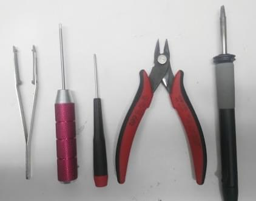
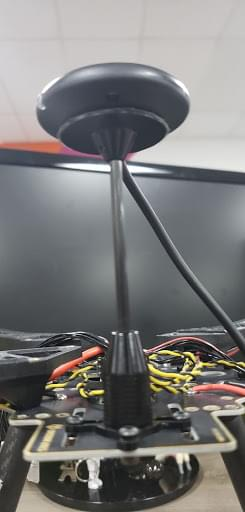
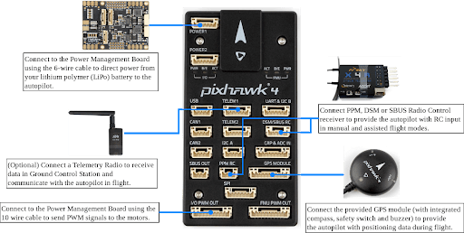
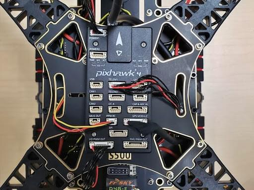

# Побудова Holybro S500 V2 + Pixhawk 4

Ця тема надає повні інструкції для збирання комплекту та налаштування PX4 з використанням *QGroundControl*.

:::info Holybro спочатку постачав цей комплект з [Holybro Pixhawk 4](../flight_controller/pixhawk4.md), але на момент написання це було оновлено до більш пізнього Pixhawk (6C). Цей журнал збірки все ще актуальний, оскільки збірка комплекту практично однакова і, ймовірно, залишиться такою ж, оскільки контролер польоту оновлюється.
:::

## Основна Інформація

- **Каркас:** Holybro S500
- **Контролер польоту:** [Pixhawk 4](../flight_controller/pixhawk4.md)
- **Час зборки (приблизно):** 90 minutes (45 minutes for frame, 45 minutes for autopilot installation/configuration)

## Специфікація матеріалів

Набір Holybro [S500 V2 Kit](https://holybro.com/collections/s500/products/s500-v2-development-kit) включає майже всі необхідні компоненти:

* Останній автопілот Pixhawk
  - Для цього журналу був використаний Pixhawk 4, але зараз включені набагато більш нові версії.
* Керування живленням PM02 (зібране)
* ARM використовує високоміцні пластмаси
* Двигуни - 2216 KV880 (версія V2）
* Пропелер 1045 (версія V2)
* Pixhawk4 GPS
* Повністю зібрана плата керування живленням з ESC
* 433 МГц / 915 МГц [Телеметричне радіо Holybro](../telemetry/holybro_sik_radio.md)
* Живлення та радіокабелі
* Ремені для акумуляторів
* Розміри:383*385*240мм
* Колісна база: 480мм

::: info
До комплекту не входить LiPo акумулятор. 
Крім того, ми використовуємо контролер FrSky Taranis.
:::

## Апаратне забезпечення (Hardware)

| Опис предмету             | Кількість |
| ------------------------- | --------- |
| Колісна база: 480мм       | 1         |
| Кронштейн                 | 4         |
| Комплект шасі             | 2         |
| Гвинти M3*8               | 18        |
| Гвинти M2 5*6             | 24        |
| Ремені для акумуляторів   | 1         |
| Пропелер 1045 (версія V2) | 1         |

## Набір
| Елементи                                  | Пакет |
| ----------------------------------------- | ----- |
| Pixhawk 4                                 | 1     |
| Pixhawk4 GPS MODULE                       | 1     |
| Плата розгалужувача I2C                   | 2     |
| Кабель з 6 на 6 контактів (живлення)      | 3     |
| Кабель з 4 на 4 контакти (CAN)            | 2     |
| Кабель з 6 на 4 контакти (Data)           | 1     |
| Кабель з 10 на 10 контакт (PWM)           | 2     |
| Кабель з 8 на 8 контактів (AUX)           | 1     |
| Кабель з 7 на 7 контактів (SPI)           | 1     |
| Кабель з 6 на 6 контактів (Debug)         | 1     |
| Кабель виходу PPM/SBUS                    | 1     |
| Кабель приймача XSR                       | 1     |
| Кабель приймача DSMX                      | 1     |
| Кабель приймача SBUS                      | 1     |
| USB кабель                                | 1     |
| Складне кріплення для п'єдесталу типу 'X' | 1     |
| 70 мм & 140 мм карбоновий стрижень опори  | 2     |
| Горизонтальний штифт 6*3 з кроком 2,54 мм | 1     |
| Горизонтальний штифт 8*3 з кроком 2,54 мм | 2     |
| Набір для піноутворення                   | 1     |
| Короткий посібник користувача Pixhawk4    | 1     |
| Розведення Pixhawk4                       | 1     |
| Короткий посібник з використання GPS      | 1     |

### Електроніка
| Опис предмету                                           | Кількість |
| ------------------------------------------------------- | --------- |
| Автопілот Pixhawk 4 (PM06 не входить до комплекту)      | 1         |
| Управління живленням PM02 (в комплекті)                 | 1         |
| Двигуни - 2216 KV880 (версія V2)                        | 4         |
| Pixhawk 4 GPS                                           | 1         |
| Повністю зібрана плата керування живленням з ESC        | 1         |
| Телеметричне радіо 433 МГц / Телеметричне радіо 915 МГц | 1         |

### Необхідні інструменти

У цій збірці використовуються наступні інструменти:

- Викрутка з шестигранником 1,5 мм
- Викрутка з шестигранником 2,0 мм
- Викрутка з шестигранником 2,5 мм
- Хрестоподібна викрутка 3 мм
- Кусачки
- Прецизійний пінцет

## Збірка

Оцінкований час для збирання - 90 хвилин, близько 45 хвилин на збірку рами та 45 хвилин на встановлення та налаштування автопілота в QGroundControl.

1. Збірка шасі. Ми збираємося почати зі складання шасі на вертикальний стовп. Відкрутіть гвинти стійки посадки та вставте вертикальний стовп, як показано нижче.

   

   

1. Зібрати плату управління живленням до стільникового шасі. Закрутіть шасі з вертикальним полем на повністю зібрану плату управління живленням.

  Дошка має 4 отвори (див. стрілки нижче).

  

  Підключіть за допомогою винтів M3X8, всього 8 штук, по 4 з кожного боку.

  

1. Зберігайте зброю на плату керування живленням. Прикріпіть руку до плати управління живленням.

   

   

   Використовуйте гвинти M2 5X6 по 2 штуки в кожній руці. Вставте гвинти знизу пластини.

   

   Переконайтеся, що кабелі ESC прокладені через середину руки.

   

1. Зібрати 8*3 2.54 мм штекер горизонтальної орієнтації до 10 до 10-контактного кабелю (ШШІ) до плати управління живленням. Підключіть кабель 10 до 10 контактів (PWM) до 8*3 2.54 мм кроку горизонтального контакту.

   

   Виріжте шматок стрічки 3M та прикріпіть його до нижньої частини горизонтального штиря:

   

   Stick the Horizontal Pin to the Power Management Board:

   

   

1. Зберіть двигуни на руки. Для цього нам знадобляться 16 шурупів M3X7, 4 мотори та 4 руки.

   Встановіть двигуни в кожну руку, пропустіть гвинт через дно руки:

   

   

   Після того, як 4 мотори встановлені на руку, візьміть кабелі (червоний, синій, чорний) і пропустіть їх через різьбу руки. 3 кабелі, які мають колірну маркування, підключаються до ESC.

   

   

1. Монтаж GPS на рамці. Для цього нам знадобиться GPS Pixhawk 4 та монтажна плита.

   

   Встановіть мачту GPS на задню частину дошки, використовуйте 4 гвинти:

   

   

   Використовуйте стрічку та приклейте GPS на верх мачти GPS:

   

1. Вставте FrSky на дошку. Наклейте FrSky за допомогою двосторонньої стрічки (3M) на нижню плату. Прикріпіть FrSky до рами:

   

   

1. Прикріпіть телеметрію до рами. Наступним кроком є взяти телеметричне радіо Holybro та прикріпити його до рами, використовуйте стрічку 3M.

   

   

   Цей збірний вузол прикріплений всередину рами, спрямований на зовнішню сторону вперед автомобіля. На нижче наведеному зображенні показано радіо, яке знаходиться всередині нижньої частини рами.

   

1. Монтаж Pixhawk 4 на плату. Використовуйте двосторонній скотч для кріплення Pixhawk 4 до центральної пластини:

   

   

   

   Наступним кроком є монтаж Pixhawk 4 на плату до рами. Для цього нам знадобляться винти M2 5X6. Вирівняйте пластину з рамою та вставте гвинти. Перед тим як встановлювати плату, ми рекомендуємо накласти стрічку на модуль живлення (таким чином він буде щільно фіксуватися).

   

   

1. Збирання кронштейну батареї до рами. Для цього нам знадобляться винти M2 5X6 та кріплення батареї:

   

   Вставте довгі важі в маленькі кільця:

   

   

   Додайте це до рами, переконайтеся, що всі чотири сторони вирівняні для вставки гвинтів:

   

   Зберіть маленьку пластину до ніг та відкрутіть по всіх чотирьох сторонах.

   

   Останнім кроком є закріплення плати:

   

1. Підключення Pixhawk 4. Pixhawk 4, який має кілька різних дротів та з'єднань з ним. Нижче наведено зображення кожного дроту, який потрібен з Pixhawk, і його вигляд підключення.

1. Підключіть модуль телеметрії та GPS до контролера польоту, як показано на рисунку 37; підключіть RC приймач, всі 4 ESC до контролера польоту, а також модуль живлення.

   

Після повної збірки комплект виглядає як показано нижче:

## Конфігурація PX4

*QGroundControl* використовується для встановлення автопілота PX4 та його налаштування / налаштування для рами QAV250. [Завантажте та встановіть](http://qgroundcontrol.com/downloads/) *QGroundControl* для вашої платформи.

:::tip
Повні інструкції щодо встановлення та налаштування PX4 можна знайти в [Основна конфігурація](../config/index.md).
:::

Спочатку оновіть прошивку та конструкцію:

* [Прошивка](../config/firmware.md)
* [Рама або планер](../config/airframe.md)

  Вам потрібно буде вибрати шасі *Holybro S500* (**Квадрокоптер x > Holybro S500**).

  

Потім налаштуйте виходи привода:

- [Приводи](../config/actuators.md)
  - Вам не потрібно оновлювати геометрію транспортного засобу (оскільки це попередньо сконфігурований повітряний каркас).
  - Призначте функції приводу до виходів, щоб відповідати вашому підключенню.
  - Перевірте конфігурацію, використовуючи слайдери.

Потім виконайте обов'язкове налаштування / калібрування:

* [Орієнтація сенсора](../config/flight_controller_orientation.md)
* [Компас](../config/compass.md)
* [Акселерометр](../config/accelerometer.md)
* [Калібрування рівня горизонту](../config/level_horizon_calibration.md)
* [Налаштування радіо](../config/radio.md)
* [Режими польоту](../config/flight_mode.md)

В ідеалі ви також повинні зробити:

* [Калібрування ESC](../advanced_config/esc_calibration.md)
* [Налаштування оцінки заряду батареї](../config/battery.md)
* [Безпека](../config/safety.md)

## Вдосконалення

Набори вибору конструкції встановлюють параметри автопілота *за замовчуванням* для рами. Ці вистачають для польоту, але це добра ідея налаштувати параметри для конкретної конструкції рами.

Для інструкцій щодо того, як розпочати, почніть з [Автоналаштування](../config/autotune.md).

## Подяки

Цей журнал збірки був наданий Командою тестового польоту PX4.
