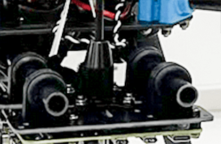

# Holybro X500 V2 (Побудова Pixhawk 5X)

:::info Holybro спочатку постачав цей комплект з [Pixhawk 5X](../flight_controller/pixhawk5x.md), але на момент написання це було оновлено до [Holybro Pixhawk 6C](../flight_controller/pixhawk6c.md). Цей журнал збірки все ще актуальний, оскільки збірка комплекту практично однакова і, ймовірно, залишиться такою ж, оскільки контролер польоту оновлюється.
:::

Ця тема надає повні інструкції для збирання [Комплекту Holybro X500 V2 ARF](https://holybro.com/collections/x500-kits) та налаштування PX4 з використанням *QGroundControl*.

Набір ARF ("Майже готовий до польоту") забезпечує найкоротший і простий досвід збирання для тих, хто хоче зайнятися розробкою дронів і не витрачати багато часу на налаштування апаратного забезпечення. Воно включає в себе раму, двигуни, ESC, пропелери та плату розподілу потужності.

Крім комплекту вам знадобиться платформа керування польотом, радіопередавачі, GPS та пульт дистанційного керування. Набір ARF може бути використаний з більшістю контролерів польоту, які підтримуються PX4.

## Основна Інформація

- **Комплект:** [Holybro X500 V2 ARF Kit](https://holybro.com/collections/x500-kits)
- **Польотний контролер:** [Pixhawk 5X](../flight_controller/pixhawk5x.md)
- **Час збірки (приблизно):** 55 хвилин (25 хвилин на раму, 30 хвилин на встановлення/налаштування автопілота)

## Специфікація матеріалів

Набір Holybro [X500 V2 Kit](https://holybro.com/collections/x500-kits) включає майже всі необхідні компоненти:

* X500V2 Frame Kit
  * Корпус - верхня & нижня плити з повним вуглецевим волокном (144 х 144 мм, товщиною 2 мм)
  * Кронштейн - Високоміцні & надлегкі 16-міліметрові вуглецеві труби
  * Стільники - трубки з вуглецевого волокна діаметром 16 мм & 10 мм
  * Платформа - З отворами для кріплення GPS & популярного компаньйон-комп'ютера
  * Система кріплення з подвійними пружинними валиками 10 мм Ø та довжиною 250 мм
  * Кріплення батареї з двома стропами для батареї
  * Ручні інструменти для встановлення
* Двигуни Holybro - 2216 KV880 x6 (зупинено - перевірте [список запасних частин](https://holybro.com/products/spare-parts-x500-v2-kit) для поточної версії).
* ESC Holybro BLHeli S 20A x4 (зупинено - перевірте [список запасних частин](https://holybro.com/products/spare-parts-x500-v2-kit) для поточної версії).
* Пропелери - 1045 x4 (зупинено - перевірте [список запчастин](https://holybro.com/products/spare-parts-x500-v2-kit) для поточної версії).
* Розподільча плата живлення – роз'єм XT60 для акумулятора & роз'єм XT30 для ESC & периферійних пристроїв
* Кріплення для камери (необов'язкове, а 3D-файл можна завантажити [тут](https://cdn.shopify.com/s/files/1/0604/5905/7341/files/Holybro_X500_V2_3D_Print.rar?v=1665561017))

Інші частини у цій збірці(**Не включені в комплект ARF**):
* [Pixhawk 5X автопілот](../flight_controller/pixhawk5x.md)
* [M8N GPS](https://holybro.com/products/m8n-gps)
* [Модуль живлення - PM02D](../power_module/holybro_pm02d.md)
* [433/915 MHz Радіо телеметрія](../telemetry/holybro_sik_radio.md)

Додатково вам знадобиться акумулятор (Holybro рекомендує 4S 5000mAh) і приймач ([сумісна радіосистема](../getting_started/rc_transmitter_receiver.md)), якщо ви хочете керувати дроном вручну.

## Комплект апаратного забезпечення

У цьому розділі перераховано все обладнання для встановлення рами та автопілота.

| Елемент                                | Опис                                                    | Кількість |
| -------------------------------------- | ------------------------------------------------------- | --------- |
| Нижня пластина                         | Вуглецеве волокно (товщиною 2 мм)                       | 1         |
| Верхня пластина                        | Вуглецеве волокно (товщиною 1.5мм)                      | 1         |
| Кронштейн                              | Вуглецева труба (складена з монтованими двигунами)      | 4         |
| Шасі - Вертикальна стійка              | Вуглепластикова трубка + інженерний пластик             | 2         |
| Шасі - Поперечна балка                 | Вуглепластикова трубка + інженерний пластик + пінопласт | 2         |
| Монтажна рейка                         | Діаметр: 10мм довжина: 250мм                            | 2         |
| Плата кріплення акумулятора            | Товщина: 2мм                                            | 1         |
| Підставка для батареї                  | Чорний лист силікону товщиною 3 мм                      | 1         |
| Плата платформи                        | Товщина: 2мм                                            | 1         |
| Кріплення & гумове кільцеве ущільнення | Діаметр внутрішнього отвору: 10 мм чорний               | 8         |

 

   _Рисунок 1_: Набір X500 V2 ARF - що всередині

### Електроніка

| Опис предмету                                                                     | Кількість |
| --------------------------------------------------------------------------------- | --------- |
| Pixhawk5x & Assorted Cables                                                       | 1         |
| Модуль GPS M8N                                                                    | 1         |
| Модуль живлення PM02D (з попередньо припаяними кабелями живлення ESC)             | 1         |
| Двигуни 2216 KV880 (оновлення V2)                                                 | 4         |
| Holybro BLHeli S ESC 20A x4                                                       | 1         |
| Holybro BLHeli S ESC 20A x4                                                       | 1         |
| 433 МГц / 915 МГц [Телеметричне радіо Holybro](../telemetry/holybro_sik_radio.md) | 1         |

### Необхідні інструменти

У комплект включені інструменти для зборки, проте вам може знадобитися:

- Кусачки
- Прецизійний пінцет

## Збірка

Орієнтовний час збірки - 55 хвилин (25 хвилин на раму, 30 хвилин на встановлення/налаштування автопілота)

1. Почніть зі складання корисного навантаження & тримача акумулятора. Втисніть гумки в захоплювачі (не використовуйте гострі предмети, щоб їх втиснути в них!). Далі пропустіть тримачі через планки тримача з основами тримача батарей, як показано на рисунку 3.

   

   _Рисунок 2_: Компоненти тримача вантажу

   

   _Рисунок 3_: Встановлювач навантаження складений

1. Наступним кроком буде прикріплення нижньої пластини до тримача вантажу.

   Вам знадобляться деталі, як показано на рисунку 4. Потім встановіть основу для розподільної плати живлення, використовуючи нейлонові гайки, як зображено на Рис. 5. Нарешті, використовуючи 8 шестигранних гвинтів, ви можете приєднати нижню пластину до тримача навантаження (Рисунок 7)

   

   _Рисунок 4_: Необхідні матеріали

   

   _Рисунок 5_: База кріплення PDB

   

   _Рисунок 6_: Змонтований pdb з поліамідними гайками

   

   _Рисунок 7_: Встановлена плата на тримач для навантаження

1. Давайте зберемо речі, необхідні для монтажу посадкового шасі, як на рисунку 8. Використовуйте гвинти, щоб приєднати посадкові шасі до нижньої пластини. Також потрібно відкрити три шестигранних гвинти на кожній з ніжок, щоб ви могли вставити їх у вуглецеві труби. Не забудьте знову їх затягнути.

   

   _Рисунок 8_: Обов'язкові частини для кріплення посадочного шасі

   

   _Рисунок 9_: Кріплення посадочно шасі до корпусу

1. Зараз ми зберемо все оснащення, щоб встановити верхню пластину. Прошу звернути увагу, що номери моторів на кронштейнах відповідають тим, що згадані на верхній платі. На щастя, мотори встановлені, а ESCs були з'єднані заздалегідь. Почніть, проходячи через всі гвинти, так як ви зафіксували кронштейни на їхніх власних місцях (Вони мають направляючий елемент, як показано на рисунку 11, щоб переконатися, що вони на місці), і трохи підтягніть всі нейлонові гайки. Потім ви зможете підключити роз'єми живлення XT30 до плати живлення. Пам'ятайте, що дроти сигналу повинні бути проведені через верхню пластину так, що ми зможемо пізніше їх підключити до Pixhawk.

   

   _Рисунок 10_: Потрібні матеріали для підключення кронштейнів.

   

   _Рисунок 11_: Керівництво для установки кронштенів

1. Для затягування всіх 16 гвинтів і гайок використовуйте як шестигранний ключ, так і гайковий ключ.

   

   _Рисунок 12_: Монтуємо верхню панель

1. Наступним кроком ви можете закріпити свій pixhawk на верхній плиті, використовуючи наклейки. Рекомендується мати напрямок стрілки вашого Pixhawk таким же, як зазначено на верхній плиті.

   

   _Рисунок 13_: Наклейки на Pixhawk

1. Якщо ви хочете встановити GPS на плату компаньйона-комп'ютера, тепер ви можете закріпити кріплення GPS на ній за допомогою 4 гвинтів і гайок.

   

   _Зображення 14_: Кріплення GPS на додатковій панелі

1. За допомогою скотча приклейте GPS до верхньої частини GPS-щогли і встановіть її на щоглу. Переконайтеся, що стрілка на gps вказує вперед (зображення 15).

   

   _Рисунок 15_: GPS та щогла

1. Наразі ви можете підключити інтерфейси Pixhawk, такі як телеметрійне радіо до 'TELEM1' та відповідно кабелі сигналів для моторів.

Будь ласка, зверніться до [Pixhawk 5X Посібник зі швидкого старту](../assembly/quick_start_pixhawk5x.md) для отримання додаткової інформації.

Ось і все. Повністю зібраний комплект показаний нижче (глибинна камера не входить до комплекту):

## Конфігурація PX4

:::tip
Повні інструкції щодо встановлення та налаштування PX4 можна знайти в [Основна конфігурація](../config/index.md).
:::

*QGroundControl* використовується для встановлення автопілота PX4 та його налаштування / налаштування для рами X500. [Завантажте та встановіть](http://qgroundcontrol.com/downloads/) *QGroundControl* для вашої платформи.

Спочатку оновіть прошивку, конструкцію та відображення приводів:

- [Прошивка](../config/firmware.md)
- [Планер](../config/airframe.md)

  Вам потрібно буде вибрати шасі *Holybro X500 V2* (**Квадрокоптер x > Holybro 500 V2**)

  

- [Приводи](../config/actuators.md)
  - Вам не потрібно оновлювати геометрію транспортного засобу (оскільки це попередньо налаштована конструкція повітряного каркасу).
  - Призначте функції приводу до виходів, щоб відповідати вашому підключенню.
  - Перевірте конфігурацію, використовуючи слайдери.

Потім виконайте обов'язкове налаштування / калібрування:

- [Орієнтація сенсора](../config/flight_controller_orientation.md)
- [Компас](../config/compass.md)
- [Акселерометр](../config/accelerometer.md)
- [Калібрування рівня горизонту](../config/level_horizon_calibration.md)
- [Налаштування радіо](../config/radio.md)
- [Режими польоту](../config/flight_mode.md)

В ідеалі ви також повинні зробити:

- [Калібрування ESC](../advanced_config/esc_calibration.md)
- [Налаштування оцінки заряду батареї](../config/battery.md)
- [Безпека](../config/safety.md)

## Вдосконалення

Набори вибору конструкції встановлюють параметри автопілота *за замовчуванням* для каркасу. Ці вистачають для польоту, але це добра ідея налаштувати параметри для конкретної конструкції рами.

Для інструкцій щодо того, як розпочати, почніть з [Автоналаштування](../config/autotune.md).

## Подяки

Цей журнал збірки був наданий Командою PX4.
