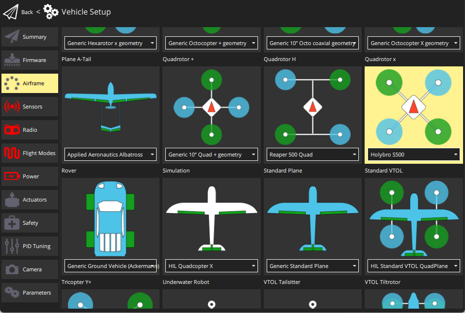

# Holybro X500 + Pixhawk4 Build

:::info Holybro спочатку постачав цей комплект з [Holybro Pixhawk 4](../flight_controller/pixhawk4.md)), але на момент написання це було оновлено до [Holybro Pixhawk 6C](../flight_controller/pixhawk6c.md). Цей журнал збірки все ще актуальний, оскільки збірка комплекту практично однакова і, ймовірно, залишиться такою ж, оскільки контролер польоту оновлюється.
:::

Ця тема надає повні інструкції для збирання комплекту та налаштування PX4 з використанням *QGroundControl*.

## Основна Інформація

- **Повний комплект:** [Комплект Holybro X500](https://holybro.com/products/px4-development-kit-x500-v2)
- **Контролер польоту:** [Pixhawk 4](../flight_controller/pixhawk4.md)
- **Час зборки (приблизно):** 3.75 години (180 хвилин на раму, 45 хвилин на встановлення/налаштування автопілота)

## Специфікація матеріалів

Набір Holybro [X500 Kit](https://holybro.com/products/px4-development-kit-x500-v2) включає майже всі необхідні компоненти:

* [Pixhawk 4 автопілот](../flight_controller/pixhawk4.md)
* [Holybro M9N GPS](https://holybro.com/collections/gps/products/m8n-gps)
* [Керування живленням - PM07](../power_module/holybro_pm07_pixhawk4_power_module.md)
* Двигуни Holybro - 2216 KV880 x4 (скасовано - перевірте [список запасних частин](https://holybro.com/products/spare-parts-x500-v2-kit) для поточної версії).
* ESC Holybro BLHeli S 20A x4 (скасовано - перевірте [список запасних частин](https://holybro.com/products/spare-parts-x500-v2-kit) для поточної версії).
* Пропелери - 1045 x4 (скасовано - перевірте [список запчастин](https://holybro.com/products/spare-parts-x500-v2-kit) для поточної версії).
* Ремінь для акумулятора
* Живлення та радіокабелі
* Колісна база - 500 мм
* Розміри - 410x410x300 мм
* 433 МГц / 915 МГц [Телеметричне радіо Holybro](../telemetry/holybro_sik_radio.md)

Додатково вам знадобиться акумулятор і приймач ([сумісна радіосистема](../getting_started/rc_transmitter_receiver.md)), якщо ви хочете керувати дроном вручну.

## Головне апаратне забезпечення

У цьому розділі перераховано все обладнання для встановлення рами та автопілота.

| Елемент                                 | Опис                                                     | Кількість |
| --------------------------------------- | -------------------------------------------------------- | --------- |
| Нижня пластина                          | Вуглецеве волокно (товщиною 2 мм)                        | 1         |
| Верхня пластина                         | Вуглецеве волокно (товщиною 1.5мм)                       | 1         |
| Кронштейн                               | Вуглепластикова трубка (діаметр: 16 мм, довжина: 200 мм) | 4         |
| Шасі - Вертикальна стійка               | Вуглепластикова трубка + інженерний пластик              | 2         |
| Шасі - Поперечна балка                  | Вуглепластикова трубка + інженерний пластик + пінопласт  | 2         |
| Моторна база                            | Складається з 6 частин і 4 гвинтів 4 гайок               | 4         |
| Бокова панель                           | Діаметр: 10мм довжина: 250мм                             | 2         |
| Плата кріплення акумулятора             | Товщина: 2мм                                             | 1         |
| Підставка для батареї                   | Чорний лист силікону товщиною 3 мм                       | 1         |
| Дошка платформи                         | Товщина: 2мм                                             | 1         |
| Кріплення та гумове кільцеве ущільнення | Діаметр внутрішнього отвору: 10 мм чорний                | 8         |

### Електроніка

| Опис предмету                                                                     | Кількість |
| --------------------------------------------------------------------------------- | --------- |
| Pixhawk4 & Assorted Cables                                                        | 1         |
| Pixhawk4 GPS Module                                                               | 1         |
| Управління живленням PM07 (з попередньо припаяними кабелями живлення ESC)         | 1         |
| Двигуни 2216 KV880 (оновлення V2)                                                 | 4         |
| Holybro BLHeli S ESC 20A x4                                                       | 1         |
| 433 МГц / 915 МГц [Телеметричне радіо Holybro](../telemetry/holybro_sik_radio.md) | 1         |

### Необхідні інструменти

У цій збірці використовуються наступні інструменти:

- Викрутка з шестигранником 1,5 мм
- Викрутка з шестигранником 2,0 мм
- Викрутка з шестигранником 2,5 мм
- Хрестоподібна викрутка 3 мм
- Торцевий ключ 5,5 мм або невелика викрутка
- Кусачки
- Прецизійний пінцет

## Збірка

Час збірки (приблизно): 3.75 години (180 хвилин на раму, 45 хвилин на встановлення/налаштування автопілота)

1. Почніть зі збирання шасі. Відкрутіть гвинти шасі і вставте вертикальну стійку (зобр. 1 і 2).

   

   _Зображення 1_: Компоненти шасі

   

   _Зображення 2_: Шасі в зібраному вигляді

1. Потім просуньте 4 кронштейни через 4 основи двигуна, як показано на малюнку 3. Переконайтеся, що штанги злегка виступають з основи і є однаковими на всіх 4-х плечах, а також переконайтеся, що дроти електродвигуна спрямовані назовні.

   

   _Зображення 3_: Приєднання кронштейнів до основи двигуна

1. Вставте 4 нейлонові гвинти та нейлонові стійки і прикріпіть модуль живлення PM07 до нижньої панелі за допомогою 4 нейлонових гайок, як показано на зображенні 4.

   

   _Зображення 4_: Приєднання модуля живлення

1. Протягніть 4 двигуни ESC через кожне з кронштейнів і підключіть трижильні дроти до двигунів, як показано на зображенні 5.

   

   _Зображення 5_: Підключення двигунів

1. Підключіть дроти живлення ESC до модуля живлення PM07, чорний - до чорного, червоний - до червоного, дроти сигналу ШІМ ESC йдуть на "FMU-PWM-Out". Переконайтеся, що ви підключили дроти ШІМ ESC двигуна в правильному порядку. Номер двигуна повітряного корпусу дивіться на зображенні 7 і підключіть його до відповідного номера на платі PM07.

    _Зображення 7_: Модуль живлення ESC та сигнальна проводка

   Колір на верхній частині двигуна вказує на напрямок обертання (зображення 7-1), чорний кінчик - за годинниковою стрілкою, а білий - проти годинникової стрілки. Переконайтеся, що при виборі напрямку двигуна ви дотримуєтесь орієнтира px4 quadrotor x airframe (зображення 7-2).

   

   _Зображення 7_: Діаграма порядку/напряму руху двигуна

   

   _Зображення 7-1_: Напрямок руху двигуна

1. Підключіть 10-контактні кабелі до FMU-PWM-in, а 6-контактні - до PWR1 на модулі живлення PM07.

   

   _Зображення 8_: Модуль живлення ШІМ і силова проводка

1. Якщо ви хочете встановити GPS на верхній панелі, то тепер ви можете закріпити кріплення GPS на верхній панелі за допомогою 4 гвинтів і гайок.

   

   _Зображення 9_: Кріплення GPS на верхній панелі

1. Протягніть кабелі PM07 через верхню пластину. З'єднайте верхню і нижню пластини за допомогою 4 U-подібних нейлонових ременів, гвинтів і гайок з кожного боку, переконайтеся, що кабелі ESC двигуна знаходяться всередині U-подібних нейлонових ременів, як показано на зображенні 10, гайки не затягуйте.

   

   _Зображення 10-1_: Кабелі силового модуля прокладені через верхню панель

   

   _Figure 10-2_: Connecting top and bottom plate

1. Push the arm tubes a bit into the frame and make sure the amount of protrusion (red square from Figure 11) are consistent on all 4 arms. Ensure all the motors are pointed directly upward, then tighten all the nuts and screws.

   

1. Put the hanger gaskets into the 4 hangers and mount them onto the bottom plate using 8 hex screws (Figure 11). The screw holes are noted by the white arrow in Figure 12. We recommend tilting the drone sideway to make the installation easier.

   

   _Figure 11_: Hanger gaskets

   

   _Figure 12_: Screw holes

1. Insert the slide bars onto the hanger rings (Figure 13). Assemble the battery mount and platform board and mount them onto the slide bars as shown in Figure 14.

   

   _Figure 13_: Slide bars

   

   _Figure 14_: Battery mount on slide bars

1. Mount the landing gear onto the bottom plate. We recommend tilting the drone sideway to make this installation process easier.

   

   _Figure 15_: Landing Gear

1. Use the tape and stick the GPS to the top of the GPS mast and mount the GPS mast. Make sure the arrow on the gps is pointing forward (Figure 16).

   

   _Figure 16_: GPS and mast

1. Mount the telemetry radio onto the top plate. Plug the telemetry cable into `TELEM1` port and GPS module to `GPS MODULE` port on the flight controller. Plug the cable from PM07 `FMU-PWM-in` to `I/O-PWM-out`on the FC and PM07 `PWR1` to `POWER1` on the FC, as shown in Figure 17.

   

   _Figure 17_: Mount telemetry radio/plug in PWM and Power cables to Flight controller.

Please refer to [Pixhawk 4 Quick Start](../assembly/quick_start_pixhawk4.md) for more information.

That's it. The fully assembled kit is shown below:

## Конфігурація PX4

:::tip
Повні інструкції щодо встановлення та налаштування PX4 можна знайти в [Основна конфігурація](../config/index.md).
:::

*QGroundControl* використовується для встановлення автопілота PX4 та його налаштування / налаштування для рами X500. [Завантажте та встановіть](http://qgroundcontrol.com/downloads/) *QGroundControl* для вашої платформи.

Спочатку оновіть прошивку, конструкцію та відображення приводів:

- [Прошивка](../config/firmware.md)
- [Рама або планер](../config/airframe.md)

  Вам потрібно буде вибрати шасі *Holybro S500* (**Квадрокоптер x >  Holybro S500**).

  

- [Приводи](../config/actuators.md)
  - Вам не потрібно оновлювати геометрію транспортного засобу (оскільки це попередньо налаштована конструкція повітряного каркасу).
  - Призначте функції приводу до виходів, щоб відповідати вашому підключенню.
  - Перевірте конфігурацію, використовуючи слайдери.

Потім виконайте обов'язкове налаштування / калібрування:

- [Орієнтація сенсора](../config/flight_controller_orientation.md)
- [Compass](../config/compass.md)
- [Accelerometer](../config/accelerometer.md)
- [Level Horizon Calibration](../config/level_horizon_calibration.md)
- [Radio Setup](../config/radio.md)
- [Flight Modes](../config/flight_mode.md)

Ideally you should also do:

- [ESC Calibration](../advanced_config/esc_calibration.md)
- [Battery Estimation Tuning](../config/battery.md)
- [Safety](../config/safety.md)

## Вдосконалення

Набори вибору конструкції встановлюють параметри автопілота *за замовчуванням* для рами. Ці вистачають для польоту, але це добра ідея налаштувати параметри для конкретної конструкції рами.

Для інструкцій щодо того, як розпочати, почніть з [Автоналаштування](../config/autotune.md).

## Подяки

Цей журнал збірки був наданий Командою тестового польоту Dronecode.
