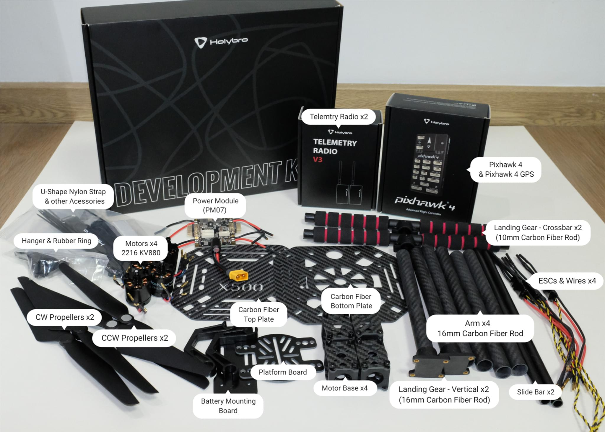
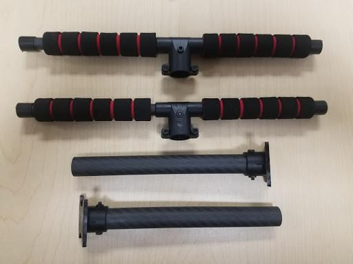
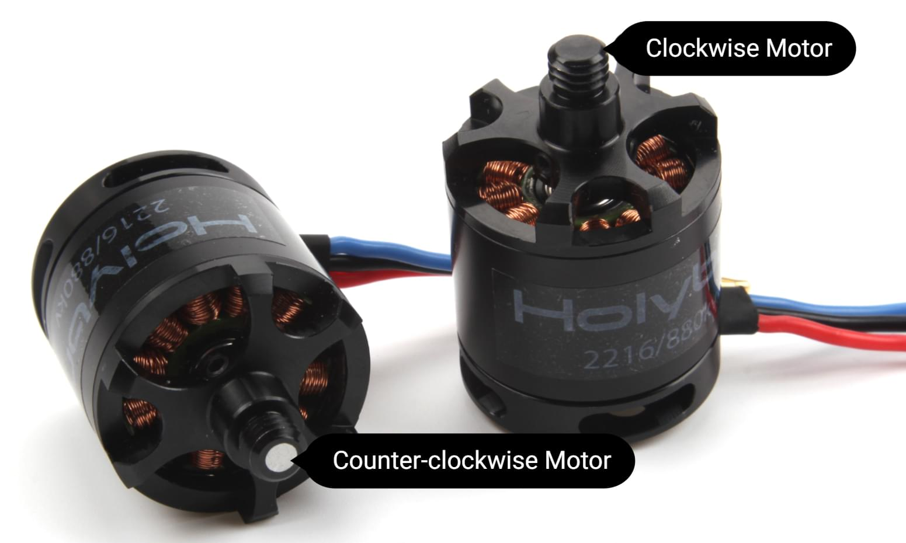
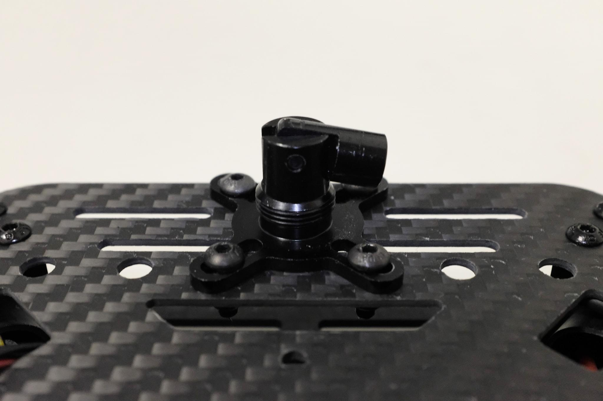

# Holybro X500 + Pixhawk4 Build

:::info Holybro спочатку постачав цей комплект з [Holybro Pixhawk 4](../flight_controller/pixhawk4.md)), але на момент написання це було оновлено до [Holybro Pixhawk 6C](../flight_controller/pixhawk6c.md). Цей журнал збірки все ще актуальний, оскільки збірка комплекту практично однакова і, ймовірно, залишиться такою ж, оскільки контролер польоту оновлюється.
:::

Ця тема надає повні інструкції для збирання комплекту та налаштування PX4 з використанням *QGroundControl*.

## Основна Інформація

- **Повний комплект:** [Комплект Holybro X500](https://holybro.com/products/px4-development-kit-x500-v2)
- **Контролер польоту:** [Pixhawk 4](../flight_controller/pixhawk4.md)
- **Час зборки (приблизно):** 3.75 години (180 хвилин на раму, 45 хвилин на встановлення/налаштування автопілота)

## Специфікація матеріалів

Набір Holybro [X500 Kit](https://holybro.com/products/px4-development-kit-x500-v2) включає майже всі необхідні компоненти:

* [Pixhawk 4 автопілот](../flight_controller/pixhawk4.md)
* [Holybro M9N GPS](https://holybro.com/collections/gps/products/m8n-gps)
* [Керування живленням - PM07](../power_module/holybro_pm07_pixhawk4_power_module.md)
* Двигуни Holybro - 2216 KV880 x4 (скасовано - перевірте [список запасних частин](https://holybro.com/products/spare-parts-x500-v2-kit) для поточної версії).
* ESC Holybro BLHeli S 20A x4 (скасовано - перевірте [список запасних частин](https://holybro.com/products/spare-parts-x500-v2-kit) для поточної версії).
* Пропелери - 1045 x4 (скасовано - перевірте [список запчастин](https://holybro.com/products/spare-parts-x500-v2-kit) для поточної версії).
* Ремінь для акумулятора
* Живлення та радіокабелі
* Колісна база - 500 мм
* Розміри - 410x410x300 мм
* 433 МГц / 915 МГц [Телеметричне радіо Holybro](../telemetry/holybro_sik_radio.md)

Додатково вам знадобиться акумулятор і приймач ([сумісна радіосистема](../getting_started/rc_transmitter_receiver.md)), якщо ви хочете керувати дроном вручну.

## Головне апаратне забезпечення

У цьому розділі перераховано все обладнання для встановлення рами та автопілота.

| Елемент                                 | Опис                                                     | Кількість |
| --------------------------------------- | -------------------------------------------------------- | --------- |
| Нижня пластина                          | Вуглецеве волокно (товщиною 2 мм)                        | 1         |
| Верхня пластина                         | Вуглецеве волокно (товщиною 1.5мм)                       | 1         |
| Кронштейн                               | Вуглепластикова трубка (діаметр: 16 мм, довжина: 200 мм) | 4         |
| Шасі - Вертикальна стійка               | Вуглепластикова трубка + інженерний пластик              | 2         |
| Шасі - Поперечна балка                  | Вуглепластикова трубка + інженерний пластик + пінопласт  | 2         |
| Моторна база                            | Складається з 6 частин і 4 гвинтів 4 гайок               | 4         |
| Бокова панель                           | Діаметр: 10мм довжина: 250мм                             | 2         |
| Плата кріплення акумулятора             | Товщина: 2мм                                             | 1         |
| Підставка для батареї                   | Чорний лист силікону товщиною 3 мм                       | 1         |
| Дошка платформи                         | Товщина: 2мм                                             | 1         |
| Кріплення та гумове кільцеве ущільнення | Діаметр внутрішнього отвору: 10 мм чорний                | 8         |

### Електроніка

| Опис предмету                                                                     | Кількість |
| --------------------------------------------------------------------------------- | --------- |
| Pixhawk4 & Assorted Cables                                                        | 1         |
| Pixhawk4 GPS Module                                                               | 1         |
| Управління живленням PM07 (з попередньо припаяними кабелями живлення ESC)         | 1         |
| Двигуни 2216 KV880 (оновлення V2)                                                 | 4         |
| Holybro BLHeli S ESC 20A x4                                                       | 1         |
| 433 МГц / 915 МГц [Телеметричне радіо Holybro](../telemetry/holybro_sik_radio.md) | 1         |

### Необхідні інструменти

У цій збірці використовуються наступні інструменти:

- Викрутка з шестигранником 1,5 мм
- Викрутка з шестигранником 2,0 мм
- Викрутка з шестигранником 2,5 мм
- Хрестоподібна викрутка 3 мм
- Торцевий ключ 5,5 мм або невелика викрутка
- Кусачки
- Прецизійний пінцет

## Збірка

Час збірки (приблизно): 3.75 години (180 хвилин на раму, 45 хвилин на встановлення/налаштування автопілота)

1. Почніть зі збирання шасі. Відкрутіть гвинти шасі і вставте вертикальну стійку (зобр. 1 і 2).

   

   _Зображення 1_: Компоненти шасі

   

   _Зображення 2_: Шасі в зібраному вигляді

1. Потім просуньте 4 кронштейни через 4 основи двигуна, як показано на малюнку 3. Переконайтеся, що штанги злегка виступають з основи і є однаковими на всіх 4-х плечах, а також переконайтеся, що дроти електродвигуна спрямовані назовні.

   

   _Зображення 3_: Приєднання кронштейнів до основи двигуна

1. Вставте 4 нейлонові гвинти та нейлонові стійки і прикріпіть модуль живлення PM07 до нижньої панелі за допомогою 4 нейлонових гайок, як показано на зображенні 4.

   

   _Зображення 4_: Приєднання модуля живлення

1. Протягніть 4 двигуни ESC через кожне з кронштейнів і підключіть трижильні дроти до двигунів, як показано на зображенні 5.

   

   _Зображення 5_: Підключення двигунів

1. Підключіть дроти живлення ESC до модуля живлення PM07, чорний - до чорного, червоний - до червоного, дроти сигналу ШІМ ESC йдуть на "FMU-PWM-Out". Переконайтеся, що ви підключили дроти ШІМ ESC двигуна в правильному порядку. Номер двигуна повітряного корпусу дивіться на зображенні 7 і підключіть його до відповідного номера на платі PM07.

    _Зображення 7_: Модуль живлення ESC та сигнальна проводка

   Колір на верхній частині двигуна вказує на напрямок обертання (зображення 7-1), чорний кінчик - за годинниковою стрілкою, а білий - проти годинникової стрілки. Переконайтеся, що при виборі напрямку двигуна ви дотримуєтесь орієнтира px4 quadrotor x airframe (зображення 7-2).

   

   _Зображення 7_: Діаграма порядку/напряму руху двигуна

   

   _Зображення 7-1_: Напрямок руху двигуна

1. Підключіть 10-контактні кабелі до FMU-PWM-in, а 6-контактні - до PWR1 на модулі живлення PM07.

   

   _Зображення 8_: Модуль живлення ШІМ і силова проводка

1. Якщо ви хочете встановити GPS на верхній панелі, то тепер ви можете закріпити кріплення GPS на верхній панелі за допомогою 4 гвинтів і гайок.

   

   _Зображення 9_: Кріплення GPS на верхній панелі

1. Протягніть кабелі PM07 через верхню пластину. З'єднайте верхню і нижню пластини за допомогою 4 U-подібних нейлонових ременів, гвинтів і гайок з кожного боку, переконайтеся, що кабелі ESC двигуна знаходяться всередині U-подібних нейлонових ременів, як показано на зображенні 10, гайки не затягуйте.

   

   _Зображення 10-1_: Кабелі силового модуля прокладені через верхню панель

   

   _Зображення 10-2_: З'єднання верхньої та нижньої пластин

1. Трохи всуньте трубки кронштейнів у раму і переконайтеся, що величина виступу (червоний квадрат на зображенні 11) є однаковою на всіх 4-х кронштейнах. Переконайтеся, що всі двигуни спрямовані прямо вгору, а потім затягніть усі гайки та гвинти.

   

1. Вставте прокладки для підвісів у 4 підвіси та закріпіть їх на нижній пластині за допомогою 8 шестигранних гвинтів (Зображення 11). Отвори для гвинтів позначені білою стрілкою на зображенні 12. Ми рекомендуємо нахилити дрон убік, щоб полегшити встановлення.

   

   _Зображення 11_: Ущільнювачі для кріпленнь

   

   _Зображення 12_: Отвори для гвинтів

1. Вставте направляючі планки на кільця кріплення (зображення 13). Зберіть кріплення для батареї та плату платформи і встановіть їх на направляючі, як показано на зображенні 14.

   

   _Зображення 13_: Повзунки

   

   _Зображення 14_: Кріплення акумулятора на висувних планках

1. Встановіть шасі на нижню пластину. Ми рекомендуємо нахилити дрон убік, щоб полегшити встановлення.

   

   _Зображення 15_: Компоненти шасі

1. За допомогою скотча приклейте GPS до верхньої частини GPS-щогли і встановіть її на щоглу. Переконайтеся, що стрілка на gps вказує вперед (зображення 16).

   

   _Зображення 16_: GPS і щогла

1. Встановіть телеметричну радіостанцію на верхню пластину. Підключіть телеметричний кабель до порту `TELEM1`, а модуль GPS до порту `GPS MODULE` на польотному контролері. Підключіть кабель від PM07 `FMU-PWM-in` до `I/O-PWM-out` на FC і PM07 `PWR1` до `POWER1` на FC, як показано на зображенні 17.

   

   _Зображення 17_: Встановлення телеметричного радіоприймача/підключення ШІМ та кабелів живлення до контролера польоту.

Будь ласка, зверніться до [Pixhawk 4 Посібник зі швидкого запуску](../assembly/quick_start_pixhawk4.md) для отримання додаткової інформації.

Ось і все. Повністю зібраний комплект показаний нижче:

## Конфігурація PX4

:::tip
Повні інструкції щодо встановлення та налаштування PX4 можна знайти в [Основна конфігурація](../config/index.md).
:::

*QGroundControl* використовується для встановлення автопілота PX4 та його налаштування / налаштування для рами X500. [Завантажте та встановіть](http://qgroundcontrol.com/downloads/) *QGroundControl* для вашої платформи.

Спочатку оновіть прошивку, конструкцію та відображення приводів:

- [Прошивка](../config/firmware.md)
- [Рама або планер](../config/airframe.md)

  Вам потрібно буде вибрати шасі *Holybro S500* (**Квадрокоптер x >  Holybro S500**).

  

- [Приводи](../config/actuators.md)
  - Вам не потрібно оновлювати геометрію транспортного засобу (оскільки це попередньо налаштована конструкція повітряного каркасу).
  - Призначте функції приводу до виходів, щоб відповідати вашому підключенню.
  - Перевірте конфігурацію, використовуючи слайдери.

Потім виконайте обов'язкове налаштування / калібрування:

- [Орієнтація сенсора](../config/flight_controller_orientation.md)
- [Компас](../config/compass.md)
- [Акселерометр](../config/accelerometer.md)
- [Калібрування рівня горизонту](../config/level_horizon_calibration.md)
- [Налаштування радіо](../config/radio.md)
- [Режими польоту](../config/flight_mode.md)

В ідеалі ви також повинні зробити:

- [Калібрування ESC](../advanced_config/esc_calibration.md)
- [Налаштування оцінки заряду батареї](../config/battery.md)
- [Загальна безпека](../config/safety.md)

## Вдосконалення

Набори вибору конструкції встановлюють параметри автопілота *за замовчуванням* для рами. Ці вистачають для польоту, але це добра ідея налаштувати параметри для конкретної конструкції рами.

For instructions on how, start from [Autotune](../config/autotune_mc.md).

## Подяки

Цей журнал збірки був наданий Командою тестового польоту Dronecode.
