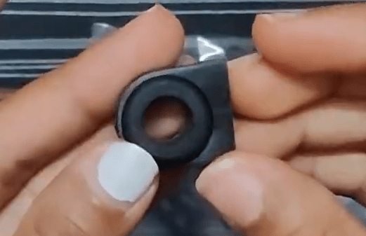
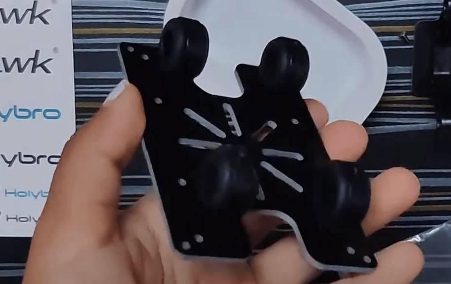
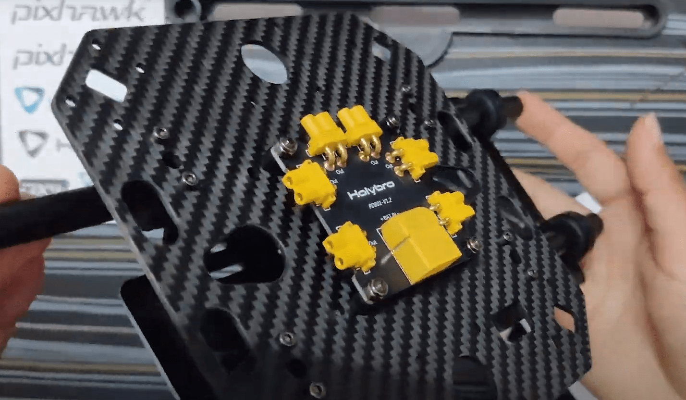
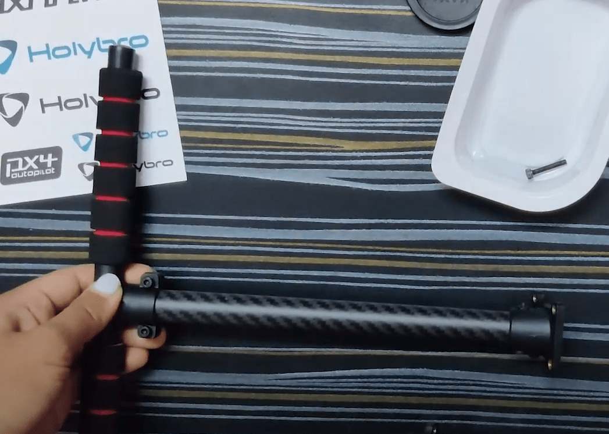

# Holybro X500 V2 + Pixhawk 6C (PX4 Dev Kit)

Ця тема надає повні інструкції для збирання [Комплекту Holybro X500 V2 ARF](https://holybro.com/collections/x500-kits), також відомого як Holybro PX4 Dev Kit.

## Збірка

:::info
- Зображення в цьому документі можна вибрати, щоб переглянути відео на youtube крок за кроком.
- Кожний розділ перелічує всі необхідні гвинти у верхній частині.
:::

### Навантаження та тримач батареї

**Саморіз**- Закріпний винт M2.5*6 12шт

1. Вставте резинове кільце підвіски-висувки в кожну з їхніх відповідних підвісок. Не використовуйте гострi предмети для натискання резинок всередині.

   

1. Візьміть плату кріплення батареї і закрутіть її за допомогою затискача зі слайдом за допомогою відвірки винта M2.5*6.

   

1. Закрутіть 4 вішалки на дошку платформи, використовуючи поглиблену винт M2.5*6.

   )

1. Візьміть зациклювальну планку та вставте 4 вісця, щоб прикрутити до нижньої плати пізніше.

   )

1. Зараз вставте тримач батареї та тримачі навантаження, зібрані на кроці 2 & 3

### Модуль живлення

**Шуруп**- Шуруп з шестигранною головкою M2.5*6 8шт | Гайка M3 4шт | Нейлонова опора M3*5 4шт | Шуруп M3*14 4шт

   )

1. Візьміть нижню пластину і вставте 4 гвинти M3*14 та закрутіть нейлонові заглушки на них.

   

1. Розмістіть Планку розподілу живлення та використовуйте гайки-самостопорювачі для їх збирання. Модуль живлення PM02 (для Pixhawk 6C) буде живити цю плату

   

1. Використовуйте винти гніздові з головкою M2.5*6 та закрутіть нижню пластину на 4 вісці (які ми вставили в 2 планки на 3-му кроці збірки тримача навантаження)<!--  @\[youtube\](https://youtu.be/Qjs6pqarRIY) -->### Шасі

1. Для збирання станції шасі відкрутіть заздалегідь складені винти шасі - перекрестна стрічка та вставте шасі - вертикальний стовп і затягніть той же.

   

   

1. Використовуйте Гвинт кришки розетки M3*8, щоб прикрутити посадкові шасі до нижньої пластини

   

   

Оскільки важко вставити проводи після того, як верхня плита складена, зробіть проводку заздалегідь. Хоча дизайн добре спроектований таким чином, що ви зможете зробити це пізніше також.

### Потужність

Pixhawk 6C запитується за допомогою плати живлення PM02 (у цьому випадку). Цей модуль живлення постачається від батареї (4S 16.8V 5200 мАг)

Двигуни живляться через розподільчу дошку живлення, як показано на наведеній нижче схемі.

Зверніть увагу, що роз'єми ESC мають кольорову кодировку і повинні бути вставлені в PWM out так, що білий кабель зверху.

### Зброя

**Винт-** болт з гніздовою головкою M3*38 16шт | Фланцева гайка M3 16шт

1. Поставити руки досить просто, оскільки двигуни поставляються вже зібраними.
   - Переконайтесь, що у вас є правильна пронумерована рука з мотором на відповідному боці.

   

   :::tip
Використовуйте свої ключі аллен / будь-який витягнутий предмет і вставте його на протилежний бік болта, який ви намагаєтеся закрутити.
:::

1. Возьміть одну руку та вставте прямокутний виступ всередину прямокутного порожнини на нижній плиті.

   

1. Під час встановлення верхньої пластини поверх цієї 3-шарової конструкції (нижня пластина, верхня пластина і плечі) необхідно закрутити гвинтом з шестигранною головкою M3*38 та гайкою з фланцем M3.
1. Утримуйте одну сторону, використовуючи міні-гайковий ключ, який надається у розробницькому комплекті.

   

1. Не зав'язуйте жодних болтів, поки всі 3 мотори не будуть на місці, оскільки це може зробити складним збирання 3-го та 4-го моторів.

   

### Пропелери

- Нижня пластина вказує напрямок двигуна.
- Пропелери, які мають біле/сріблясте покриття, йдуть на відповідний двигун із подібним покриттям.
- The unlocking and locking of the propeller is indicated on the propeller itself.
- Use the 4 propellers and insert them on the motors keeping the above 3 points in mind.

The following parts can be placed as per usual.

### GPS

**Screw-** Locknut M3 4 pcs | Screw M3*10 4pcs

1. Assemble the GPS by following the video.

   

   This guide uses the GPS mount location suggested in Holybro’s guide.
1. Screw the GPS mount’s bottom end on the payload holder side using Locknut M3 & Screw M3*10

   

### Pixhawk 6C

- The wire from the PM02 goes to POWER1 in Pixhawk
- The telemetry goes to TELEM1
- The GPS to GPS1

### Companion Computer (Optional)

**Screw-** Socket Cap Screw M2.5*12 4pcs | Nylon Standoff M2.5*5 4pcs Locknut M2.5 4pcs

The X500 kit is provides space for a companion computer, such as Raspberry Pi or Jetson nano can be placed here [TBD].
- Insert 4 Socket Cap Screw M2.5*12 and put the standoffs on the same.
- Now place the companion computer and assemble it using Locknut M2.5

### Камера

- Cameras such as Intel Realsense depth/ tracking camera or Structure Core can be mounted using the Depth Camera Mount
- Simply insert the mount inside the 2 bars and use the screws according to the camera you’re using.

## Встановлення/Налаштування PX4

:::tip
Full instructions for installing and configuring PX4 can be found in [Basic Configuration](../config/index.md).
:::

*QGroundControl* is used to install the PX4 autopilot and configure/tune it for the X500 frame. [Download and install](http://qgroundcontrol.com/downloads/) *QGroundControl* for your platform.

First update the firmware, airframe, and actuator mappings:

- [Firmware](../config/firmware.md)
- [Airframe](../config/airframe.md)

  You will need to select the *Holybro X500 V2* airframe (**Quadrotor x > Holybro 500 V2**)

  

- [Актуатори](../config/actuators.md)
  - You should not need to update the vehicle geometry (as this is a preconfigured airframe).
  - Призначте функції приводу до актуаторів, щоб відповідати вашому підключенню. The airframe is preconfigured with the motors on the **FMU PWM Out**.
  - Перевірте конфігурацію, використовуючи слайдери.

Потім виконайте обов'язкове налаштування / калібрування:

- [Орієнтація сенсора](../config/flight_controller_orientation.md)
- [Компас](../config/compass.md)
- [Акселерометр](../config/accelerometer.md)
- [Калібрування рівня горизонту](../config/level_horizon_calibration.md)
- [Налаштування радіо](../config/radio.md)
- [Режими польоту](../config/flight_mode.md)

В ідеалі ви також повинні зробити:

- [Калібрування ESC](../advanced_config/esc_calibration.md)
- [Регулювання оцінки заряду акумулятора](../config/battery.md)
- [Загальна безпека](../config/safety.md)

## Вдосконалення

Airframe selection sets *default* autopilot parameters for the frame. These are good enough to fly with, but it is a good idea to tune the parameters for a specific frame build.

For instructions on how, start from [Auto-tune](../config/autotune.md).

## Подяки

Цей журнал збірки був наданий Акшата та Хамішем Віллі з великими подяками компанії Holybro та Dronecode за апаратне забезпечення та технічну підтримку.