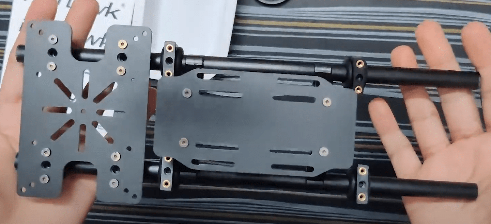
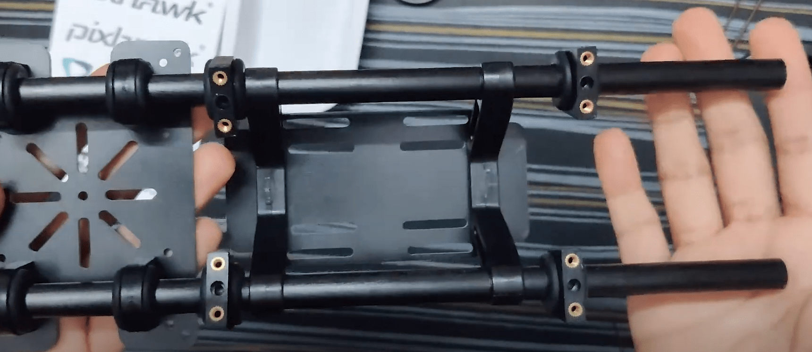
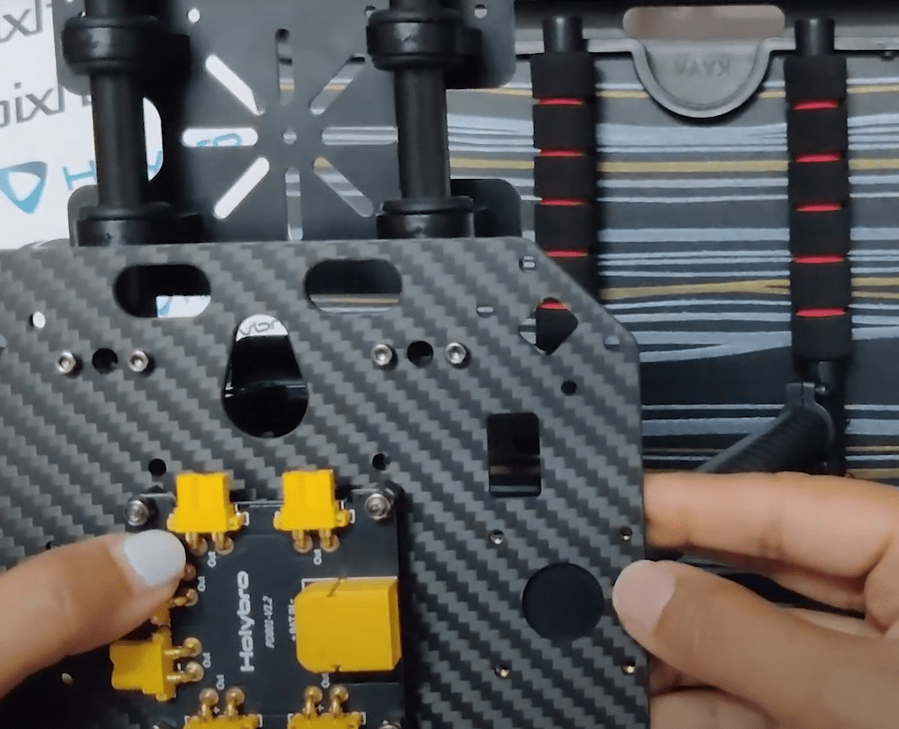
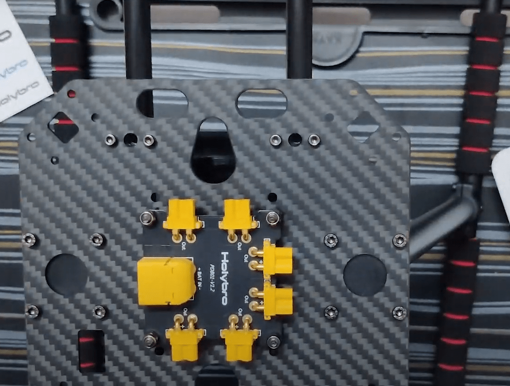
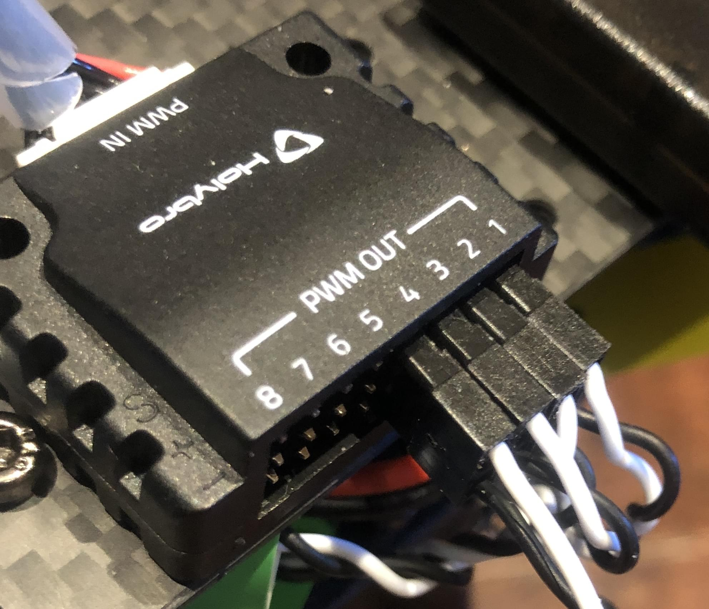

# Holybro X500 V2 + Pixhawk 6C (PX4 Dev Kit)

Ця тема надає повні інструкції для збирання [Комплекту Holybro X500 V2 ARF](https://holybro.com/collections/x500-kits), також відомого як Holybro PX4 Dev Kit.

## Збірка

:::info
- Зображення в цьому документі можна вибрати, щоб переглянути відео на youtube крок за кроком.
- Кожний розділ перелічує всі необхідні гвинти у верхній частині.
:::

### Навантаження та тримач батареї

**Саморіз**- Закріпний винт M2.5*6 12шт

1. Вставте резинове кільце підвіски-висувки в кожну з їхніх відповідних підвісок. Не використовуйте гострi предмети для натискання резинок всередині.

   

1. Візьміть плату кріплення батареї і закрутіть її за допомогою затискача зі слайдом за допомогою відвірки винта M2.5*6.

   

1. Закрутіть 4 вішалки на дошку платформи, використовуючи поглиблену винт M2.5*6.

   )

1. Візьміть зациклювальну планку та вставте 4 вісця, щоб прикрутити до нижньої плати пізніше.

   )

1. Зараз вставте тримач батареї та тримачі навантаження, зібрані на кроці 2 & 3

### Модуль живлення

**Шуруп**- Шуруп з шестигранною головкою M2.5*6 8шт | Гайка M3 4шт | Нейлонова опора M3*5 4шт | Шуруп M3*14 4шт

   )

1. Візьміть нижню пластину і вставте 4 гвинти M3*14 та закрутіть нейлонові заглушки на них.

   

1. Розмістіть Планку розподілу живлення та використовуйте гайки-самостопорювачі для їх збирання. Модуль живлення PM02 (для Pixhawk 6C) буде живити цю плату

   

1. Use Socket Cap Screws M2.5*6 and screw the bottom plate on the 4 hangers (that we inserted in the 2 bars on the 3rd step of the payload holder assembly)

### Шасі

1. Для збирання станції шасі відкрутіть заздалегідь складені винти шасі - перекрестна стрічка та вставте шасі - вертикальний стовп і затягніть той же.

   

   

1. Використовуйте Гвинт кришки розетки M3*8, щоб прикрутити посадкові шасі до нижньої пластини

   

   

Оскільки важко вставити проводи після того, як верхня плита складена, зробіть проводку заздалегідь. Хоча дизайн добре спроектований таким чином, що ви зможете зробити це пізніше також.

### Потужність

Pixhawk 6C запитується за допомогою плати живлення PM02 (у цьому випадку). Цей модуль живлення постачається від батареї (4S 16.8V 5200 мАг)

Двигуни живляться через розподільчу дошку живлення, як показано на наведеній нижче схемі.

Зверніть увагу, що роз'єми ESC мають кольорову кодировку і повинні бути вставлені в PWM out так, що білий кабель зверху.

### Зброя

**Винт-** болт з гніздовою головкою M3*38 16шт | Фланцева гайка M3 16шт

1. Поставити руки досить просто, оскільки двигуни поставляються вже зібраними.
   - Переконайтесь, що у вас є правильна пронумерована рука з мотором на відповідному боці.

   

   :::tip
Використовуйте свої ключі аллен / будь-який витягнутий предмет і вставте його на протилежний бік болта, який ви намагаєтеся закрутити.
:::

1. Возьміть одну руку та вставте прямокутний виступ всередину прямокутного порожнини на нижній плиті.

   

1. Під час встановлення верхньої пластини поверх цієї 3-шарової конструкції (нижня пластина, верхня пластина і плечі) необхідно закрутити гвинтом з шестигранною головкою M3*38 та гайкою з фланцем M3.
1. Утримуйте одну сторону, використовуючи міні-гайковий ключ, який надається у розробницькому комплекті.

   

1. Не зав'язуйте жодних болтів, поки всі 3 мотори не будуть на місці, оскільки це може зробити складним збирання 3-го та 4-го моторів.

   

### Пропелери

- Нижня пластина вказує напрямок двигуна.
- Пропелери, які мають біле/сріблясте покриття, йдуть на відповідний двигун із подібним покриттям.
- Розблокування та блокування пропелера вказано на самому пропелері.
- Використовуйте 4 пропелери та вставте їх у мотори, пам’ятаючи про 3 пункти вище.

Наступні частини можна розмістити, як завжди.

### GPS

**Гвинт-** гайка M3 4 шт | Гвинт М3*10 4шт

1. Зберіть GPS, дотримуючись відео.

   

   У цьому посібнику використовується місце кріплення GPS, запропоноване в посібнику Holybro.
1. Прикрутіть нижній кінець кріплення GPS до тримача корисного навантаження за допомогою гайки M3 та гвинта М3*10

   

### Pixhawk 6C

- Дріт від PM02 йде до POWER1 в Pixhawk
- Телеметрія йде на TELEM1
- GPS до GPS1

### Супутній комп'ютер (необов'язково)

**Гвинт-** Socket Cap Screw M2.5*12 4pcs | Nylon Standoff M2.5*5 4pcs Locknut M2.5 4pcs

Набір X500 забезпечує місце для супутнього комп'ютера, такого як Raspberry Pi або Jetson nano, що можуть бути розміщені тут [TBD].
- Вставте 4 гвинти з головкою M2.5*12 та поставте штифти на те ж саме місце.
- Тепер розмістіть супутній комп'ютер і змонтуйте його, використовуючи гайку з фіксацією M2.5

### Камера

- Камери, такі як камера глибини / відстеження Intel Realsense або Structure Core, можна встановити за допомогою кріплення для Depth Camera
- Просто вставте кріплення всередину 2-х планок і використовуйте гвинти залежно від камери, яку ви використовуєте.

## Встановлення/Налаштування PX4

:::tip
Повні інструкції щодо встановлення та налаштування PX4 можна знайти в [Базова конфігурація](../config/index.md).
:::

*QGroundControl* використовується для встановлення автопілота PX4 та його налаштування / відладки для рами X500. [Завантажте та встановіть](http://qgroundcontrol.com/downloads/) *QGroundControl* для вашої платформи.

Спочатку оновіть прошивку, раму та зіставлення актуаторів:

- [Прошивка](../config/firmware.md)
- [Рама](../config/airframe.md)

  Вам потрібно буде вибрати раму *Holybro X500 V2* (**Квадрокоптер x > Holybro 500 V2**)

  

- [Актуатори](../config/actuators.md)
  - Вам не потрібно оновлювати геометрію апарту (оскільки це попередньо сконфігурована рама).
  - Призначте функції приводу до актуаторів, щоб відповідати вашому підключенню. Рама попередньо налаштована з моторами на **FMU PWM Out**.
  - Перевірте конфігурацію, використовуючи слайдери.

Потім виконайте обов'язкове налаштування / калібрування:

- [Орієнтація сенсора](../config/flight_controller_orientation.md)
- [Компас](../config/compass.md)
- [Акселерометр](../config/accelerometer.md)
- [Калібрування рівня горизонту](../config/level_horizon_calibration.md)
- [Налаштування радіо](../config/radio.md)
- [Режими польоту](../config/flight_mode.md)

В ідеалі ви також повинні зробити:

- [Калібрування ESC](../advanced_config/esc_calibration.md)
- [Регулювання оцінки заряду акумулятора](../config/battery.md)
- [Загальна безпека](../config/safety.md)

## Вдосконалення

Вибір рами встановлює параметри автопілота *за замовчуванням* для рами. Вони достатньо хороші для польоту, але гарною ідеєю є тюнінг параметрів для конкретної конструкції рами.

For instructions on how, start from [Auto-tune](../config/autotune_mc.md).

## Подяки

Цей журнал збірки був наданий Акшата та Хамішем Віллі з великими подяками компанії Holybro та Dronecode за апаратне забезпечення та технічну підтримку.