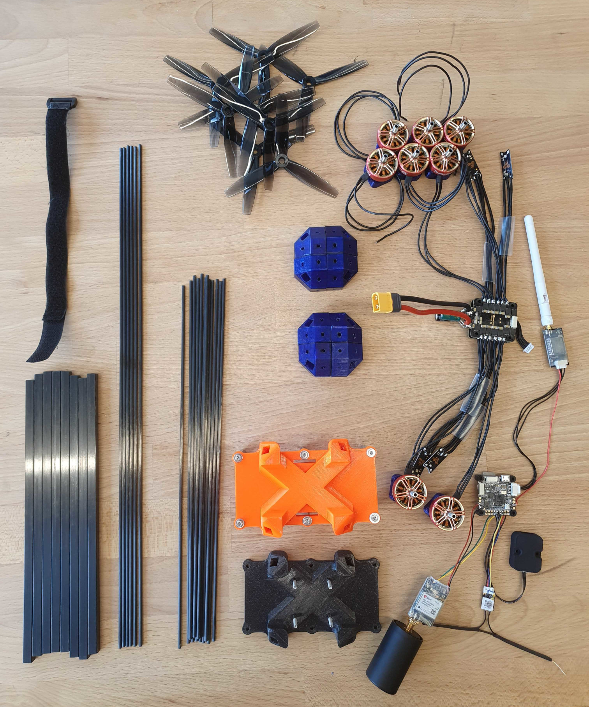
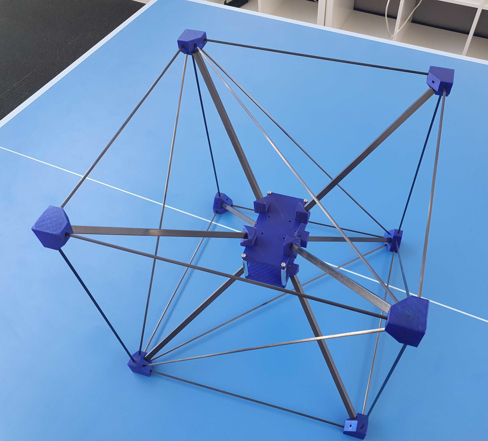
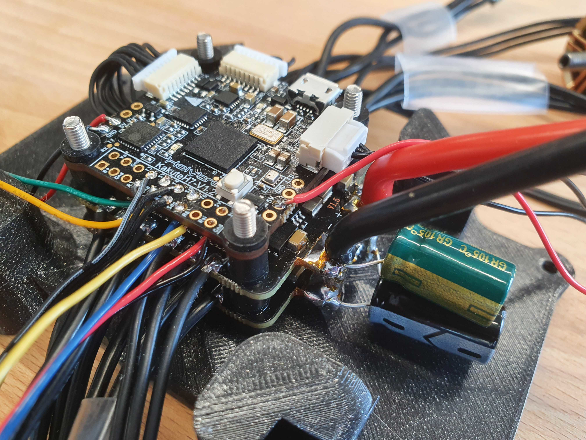
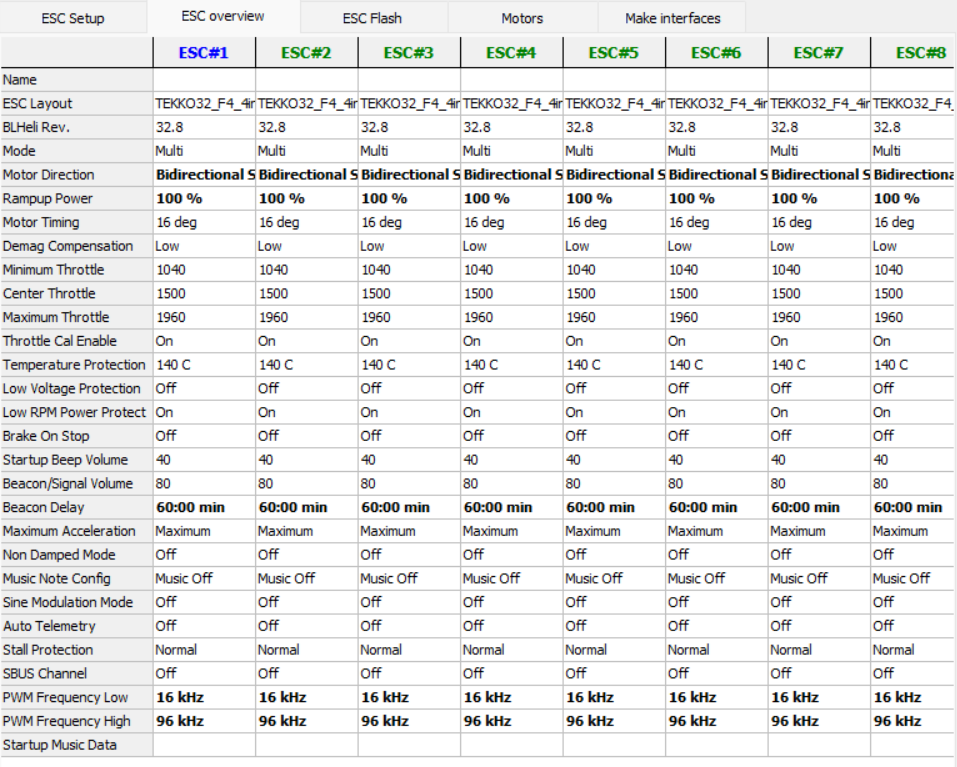
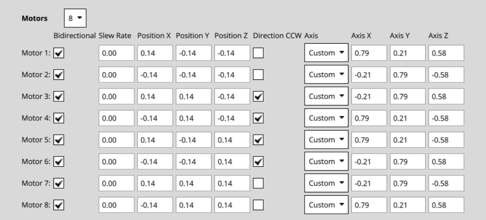
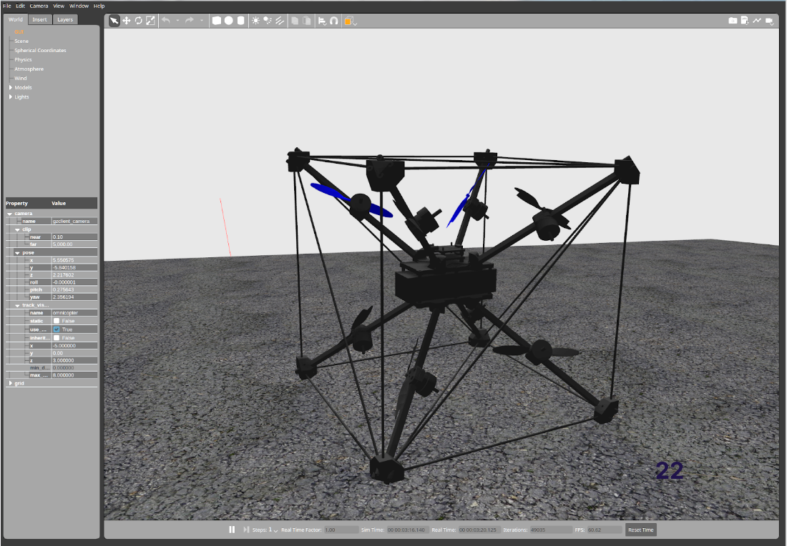

# Омнікоптер

Омнікоптер - це мультикоптер, який може забезпечити тягу в усіх напрямках (6 ступенів свободи). Це дозволяє йому рухатися в будь-якому напрямку без нахилу, і він може зависати під довільним кутом нахилу. Все це досягається шляхом розташування позицій двигуна і вісі тяги у певних способах:


Ця конструкція слідує оригінальному дизайну від [Бресчіаніні, Даріо та Рафаелло Д'Андреа](https://www.youtube.com/watch?v=sIi80LMLJSY).

## Специфікація матеріалів

Компоненти, необхідні для цієї збірки, є:

- Електроніка:
  - Контролер польоту: [Holybro KakuteH7](../flight_controller/kakuteh7.md)
  - Пара з 2x [Tekko32 F4 4in1 ESCs](https://holybro.com/products/tekko32-f4-4in1-50a-esc) :::info
Ви можете вибрати свій власний контролер польоту за власним вибором, він просто повинен підтримувати 8 виходів DShot.
:::
  - GPS: [ZED-F9P](https://www.gnss.store/gnss-gps-modules/105-ublox-zed-f9p-rtk-gnss-receiver-board-with-sma-base-or-rover.html?search_query=ZED-F9P&results=11)
  - [GPS спіральна антена](https://www.gnss.store/rf-gps-antennas/28-high-performance-multi-band-gnss-active-quad-helix-antenna-for-rtk.html) ::: info
Будь-який інший GPS також може працювати, однак очікується, що спіральна антена буде працювати краще для перевернутих польотів.
:::
  - Будь-який RC приймач
  - Зовнішній магнітометр. Ми використовували [RM-3100](https://store-drotek.com/893-professional-grade-magnetometer-rm3100.html).
  - Телеметричний зв'язок, наприклад, [WiFi](../telemetry/telemetry_wifi.md)
- Пропульсія:
  - Двигуни: 8x [BrotherHobby LPD 2306.5 2000KV/2450KV/2650KV](https://www.getfpv.com/brotherhobby-lpd-2306-5-2000kv-2450kv-2650kv-motor.html)
  - 3D Гвинти: 2x [HQProp 3D 5X3.5X3 3-х лопастний гвинт (набір з 4)](https://www.getfpv.com/hqprop-3d-5x3-5x3-3-blade-propeller-set-of-4.html) або 2x [Gemfan 513D 3-х лопастний 3D гвинт (набір з 4)](https://www.getfpv.com/gemfan-513d-durable-3-blade-propeller-set-of-4.html)
  - Акумулятор: ми використовували LiPo на 6S 3300mAh. Обов'язково перевірте розміри, щоб він підійшов до рами.
  - Ремінь для акумулятора
- Рама:
  - Карбонова квадратна труба R 8мм X 7мм X 1000мм, наприклад, [тут](https://shop.swiss-composite.ch/pi/Halbfabrikate/Rohre/Vierkant-Rohre/CFK-Vierkantrohr-8x8-7x7mm.html)
  - Вуглецеві стержні R 3мм X 2мм X 1000мм, наприклад, [тут](https://shop.swiss-composite.ch/pi/Halbfabrikate/Rohre/CFK-Rohre-pultrudiert-pullwinding/Carbon-Microtubes-100cm-x-20-3mm.html)
  - Необхідні довжини:
    - квадратна трубка: 8 штук довжиною 248 мм
    - стрижні: 12x328мм, 6x465мм
  - Гвинти:
    - Двигуни та стійки: 40x M3x12мм
    - FC кріплення: 4x M3x35mm, 4x M3 гайки
  - Опори: 4x 40мм
- [3D модель](https://cad.onshape.com/documents/eaff30985f1298dc6ce8ce13/w/2f662e604240c4082682e5e3/e/ad2b2245b73393cf369132f7)



## Збірка

### Рамка

- Друкуйте деталі 3D :::info
Орієнтація кутових частин має значення.
Ви помітите, якщо це неправильно, коли кути важеля не вірні.
:::
- Відріжте важелі
- Перевірте, що все працює, з'єднуючи частини рамки разом:

  
- Розмістіть двигуни якомога далі від центру, без торкання гвинтів до важелів.

### Електроніка

Пропаяйте периферійні пристрої до керуючого контролера. Ми використовували наступні завдання:
- Регулятори швидкості: 2 регулятори швидкості можуть бути підключені безпосередньо до двох роз'ємів KakuteH7. Щоб уникнути конфліктів, ми видалили контакт живлення (праворуч) з одного з'єднувачів.
- Телеметрія до UART1
- GPS до UART4
- RC до UART6 

Зауваження:

- Переконайтеся, що магнітометр розташований подалі від джерел живлення. Ми закінчили тим, що розмістили його внизу центрального елементу з пінопластом товщиною 4 см.
- Покладіть деяку стрічку на барометр (не заклеюючи отвору!) для уникнення будь-якого впливу світла.
- Ми не склеїли рамку. Це безумовно рекомендується зробити після початкових випробувань, але воно може працювати без цього.


## Конфігурація програмного забезпечення

### ESC

Спочатку налаштуйте ESC на режим 3D (бідирекційний). Ми мали проблеми з налаштуваннями запасних ESC в режимі 3D: коли спробували змінити напрямок, мотор іноді більше не запускався, поки ESC не був перезавантажений. Так що нам довелося змінити налаштування ESC.

Для цього ви можете використовувати Betaflight на контролері польоту, а потім використовувати режим пропуску і набір BL Heli (переконайтеся, що в Betaflight налаштовано повітряну раму з 8 моторами). Це налаштування:



Зокрема:
- встановіть напрямок руху двигуна на **Обидва напрямки**
- збільшити потужність розгону до **100%** (це консервативно і може знизити ефективність)

:::info
Переконайтеся, що двигуни не перегріваються зі зміненими налаштуваннями.
:::

### PX4

- Виберіть загальний корпус багатокоптерного повітряного каркасу
- Використовуйте перемикач увімкнення [зброювання](../advanced_config/prearm_arm_disarm.md#arming-button-switch), не використовуйте увімкнення палицею
- [Виберіть DShot](../config/actuators.md) як протокол виводу на всіх восьми виходах
- Налаштуйте двигуни відповідно до цього:  Ми використовували наступну конвенцію: двигуни спрямовані в напрямку, куди вказує вісь. Напрям обертання відповідає напряму позитивного тяги (переміщення слайдера двигуна вгору). Переконайтеся, що використовуєте правильні пропси, оскільки є версія CCW та CW.
- Параметри:
  - Змініть логіку десатурації для кращого відстеження настрою: встановіть [CA_METHOD](../advanced_config/parameter_reference.md#CA_METHOD) на 0.
  - Вимкнути виявлення відмов: встановити [FD_FAIL_P](../advanced_config/parameter_reference.md#FD_FAIL_P) та [FD_FAIL_R](../advanced_config/parameter_reference.md#FD_FAIL_R) на 0.
- [Цей файл](https://github.com/PX4/PX4-user_guide/raw/main/assets/airframes/multicopter/omnicopter/omnicopter.params) містить всі відповідні параметри.

## Відео

@[youtube](https://www.youtube.com/watch?v=nsPkQYugfzs)

## Моделювання

Є мішень імітації омнікоптера в Gazebo Classic:

```sh
make px4_sitl gazebo-classic_omnicopter
```


## Зауваження

Деякі загальні зауваження:

- Швидкість реакції газу становить близько 30%.
- Час польоту становить близько 4-5 хвилин. Можливо, це можна трохи покращити, використовуючи більші пропелери.
