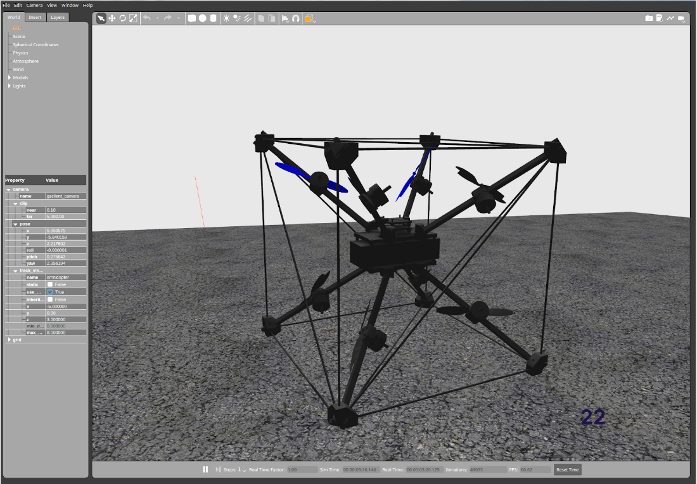

# Омнікоптер

Омнікоптер - це мультикоптер, який може забезпечити тягу в усіх напрямках (6 ступенів свободи). Це дозволяє йому рухатися в будь-якому напрямку без нахилу, і він може зависати під довільним кутом нахилу. Все це досягається шляхом розташування позицій двигуна і вісі тяги у певних способах:


Ця конструкція слідує оригінальному дизайну від [Бресчіаніні, Даріо та Рафаелло Д'Андреа](https://www.youtube.com/watch?v=sIi80LMLJSY).

## Специфікація матеріалів

Компоненти, необхідні для цієї збірки, є:

- Електроніка:
  - Flight controller: [Holybro KakuteH7](../flight_controller/kakuteh7.md)
  - Coupled with 2x [Tekko32 F4 4in1 ESCs](https://holybro.com/products/tekko32-f4-4in1-50a-esc) ::: info
You can select your own flight controller of choice, it just needs to support 8 DShot outputs.
:::
  - GPS: [ZED-F9P](https://www.gnss.store/gnss-gps-modules/105-ublox-zed-f9p-rtk-gnss-receiver-board-with-sma-base-or-rover.html?search_query=ZED-F9P&results=11)
  - [GPS helix antenna](https://www.gnss.store/rf-gps-antennas/28-high-performance-multi-band-gnss-active-quad-helix-antenna-for-rtk.html) ::: info
Any other GPS may work as well, however a helix antenna is expected to perform better for inverted flights.
:::
  - Any RC receiver
  - An external Magnetometer. We used the [RM-3100](https://store-drotek.com/893-professional-grade-magnetometer-rm3100.html).
  - Telemetry link, e.g. [WiFi](../telemetry/telemetry_wifi.md)
- Propulsion:
  - Motors: 8x [BrotherHobby LPD 2306.5 2000KV/2450KV/2650KV](https://www.getfpv.com/brotherhobby-lpd-2306-5-2000kv-2450kv-2650kv-motor.html)
  - 3D Propellers: 2x [HQProp 3D 5X3.5X3 3-Blade Propeller (Set of 4)](https://www.getfpv.com/hqprop-3d-5x3-5x3-3-blade-propeller-set-of-4.html) or 2x [Gemfan 513D 3-Blade 3D Propeller (Set of 4)](https://www.getfpv.com/gemfan-513d-durable-3-blade-propeller-set-of-4.html)
  - Battery: we used a 6S 3300mAh LiPo. Make sure to check the dimensions so it fits the frame.
  - Battery strap
- Frame:
  - Carbon square tube R 8mm X 7mm X 1000mm, e.g. [here](https://shop.swiss-composite.ch/pi/Halbfabrikate/Rohre/Vierkant-Rohre/CFK-Vierkantrohr-8x8-7x7mm.html)
  - Carbon Rods R 3mm X 2mm X 1000mm, e.g. [here](https://shop.swiss-composite.ch/pi/Halbfabrikate/Rohre/CFK-Rohre-pultrudiert-pullwinding/Carbon-Microtubes-100cm-x-20-3mm.html)
  - Required lengths:
    - square tube: 8 pieces with length of 248mm
    - rods: 12x328mm, 6x465mm
  - Screws:
    - Motors and standoffs: 40x M3x12mm
    - FC mount: 4x M3x35mm, 4x M3 nuts
  - Standoffs: 4x 40mm
- [3D model](https://cad.onshape.com/documents/eaff30985f1298dc6ce8ce13/w/2f662e604240c4082682e5e3/e/ad2b2245b73393cf369132f7)


## Assembly

### Frame

- Print the 3D parts ::: info
The orientation of the corner pieces matters.
You will notice if it's wrong when the angles of the rods are not correct.
:::
- Cut the rods
- Test that it all works by connecting the frame pieces together:

  
- Place the motors as far out as possible, without the propellers touching the rods.

### Електроніка

Solder the peripherals to the flight controller. We used the following assignments:
- ESCs: the 2 ESCs can be connected directly to the two connectors of the KakuteH7. To avoid conflicts we removed the power pin (right-most pin) from one of the connectors.
- Telemetry to UART1
- GPS до UART4
- RC до UART6 

Зауваження:

- Make sure the magnetometer is placed away from power. We ended up placing it to the bottom of the center-piece with a 4cm padding styrofoam.
- Put some tape on the barometer (without taping the opening!) to avoid any influence from light.
- We did not glue the frame. It is certainly advisible to do so after initial test flights, but it might work without.


## Конфігурація програмного забезпечення

### ESC

Спочатку налаштуйте ESC на режим 3D (бідирекційний). Ми мали проблеми з налаштуваннями запасних ESC в режимі 3D: коли спробували змінити напрямок, мотор іноді більше не запускався, поки ESC не був перезавантажений. Так що нам довелося змінити налаштування ESC.

Для цього ви можете використовувати Betaflight на контролері польоту, а потім використовувати режим пропуску і набір BL Heli (переконайтеся, що в Betaflight налаштовано повітряну раму з 8 моторами). Це налаштування:


Зокрема:
- встановіть напрямок руху двигуна на **Обидва напрямки**
- збільшити потужність розгону до **100%** (це консервативно і може знизити ефективність)

:::info
Переконайтеся, що двигуни не перегріваються зі зміненими налаштуваннями.
:::

### PX4

- Виберіть загальний корпус багатокоптерного повітряного каркасу
- Використовуйте перемикач увімкнення [зброювання](../advanced_config/prearm_arm_disarm.md#arming-button-switch), не використовуйте увімкнення палицею
- [Виберіть DShot](../config/actuators.md) як протокол виводу на всіх восьми виходах
- Налаштуйте двигуни відповідно до цього:  Ми використовували наступну конвенцію: двигуни спрямовані в напрямку, куди вказує вісь. Напрям обертання відповідає напряму позитивного тяги (переміщення слайдера двигуна вгору). Переконайтеся, що використовуєте правильні пропси, оскільки є версія CCW та CW.
- Параметри:
  - Змініть логіку десатурації для кращого відстеження настрою: встановіть [CA_METHOD](../advanced_config/parameter_reference.md#CA_METHOD) на 0.
  - Вимкнути виявлення відмов: встановити [FD_FAIL_P](../advanced_config/parameter_reference.md#FD_FAIL_P) та [FD_FAIL_R](../advanced_config/parameter_reference.md#FD_FAIL_R) на 0.
- [Цей файл](https://github.com/PX4/PX4-user_guide/raw/main/assets/airframes/multicopter/omnicopter/omnicopter.params) містить всі відповідні параметри.

## Відео

@[youtube](https://www.youtube.com/watch?v=nsPkQYugfzs)

## Моделювання

Є мішень імітації омнікоптера в Gazebo Classic:

```sh
make px4_sitl gazebo-classic_omnicopter
```


## Зауваження

Деякі загальні зауваження:

- Швидкість реакції газу становить близько 30%.
- Час польоту становить близько 4-5 хвилин. Можливо, це можна трохи покращити, використовуючи більші пропелери.
