# Lumenier QAV-R 5" Racer (Pixracer)

Lumenier QAV-R 5" FPV Гоночний квадрокоптер - це жорсткий, легкий та швидкий гоночний квадрокоптер FPV з від'ємними руками. Ця тема надає повні інструкції зі збірки та налаштування для використання рамки з контролером польоту *Pixracer* та регуляторами швидкості *KISS 24A Race Edition* ESCs. Також надає інформацію про (необов'язкове) налаштування FPV.

Основна Інформація:

- **Каркас:** [Lumenier QAV-R 5"](http://www.getfpv.com/qav-r-fpv-racing-quadcopter-5.html)
- **Контролер польоту:** [ Pixracer](../flight_controller/pixracer.md)

@[youtube](https://youtu.be/wMYgqvsNEwQ)

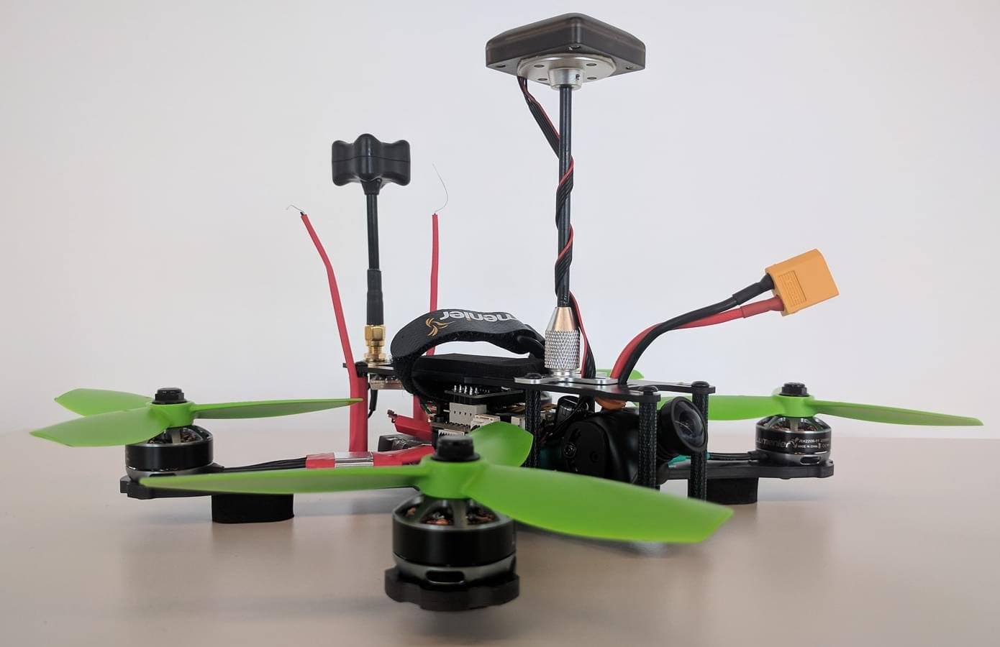 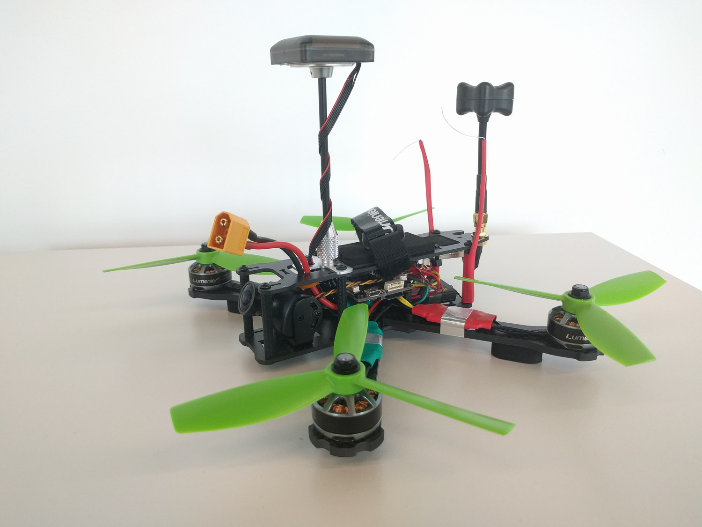

## Список деталей

### Транспортний засіб (потрібний для польоту)

* Автопілот: [Pixracer](../flight_controller/pixracer.md) від [AUAV](https://store.mrobotics.io/mRo-PixRacer-R14-Official-p/auav-pxrcr-r14-mr.htm) з WiFi-модулем ESP8266 та силовим модулем [ACSP5](https://store.mrobotics.io/product-p/auav-acsp5-mr.htm)
* Рама:  [Lumenier QAV-R 5"](http://www.getfpv.com/qav-r-fpv-racing-quadcopter-5.html)
* Двигуни:  [Lumenier RX2206-11 2350KV](http://www.getfpv.com/lumenier-rx2206-11-2350kv-motor.html)
* ESCs:  [KISS 24A Race Edition](http://www.getfpv.com/kiss-24a-esc-race-edition-32bit-brushless-motor-ctrl.html)
* Пропелери: HQProp 5x4.5x3 [CW](http://www.getfpv.com/hqprop-5x4-5x3rg-cw-propeller-3-blade-2-pack-green-nylon-glass-fiber.html) [CCW](http://www.getfpv.com/hqprop-5x4-5x3g-ccw-propeller-3-blade-2-pack-green-nylon-glass-fiber.html)
* GPS / Ext. Магнітометр.: M8N взятий з [Pixhawk Mini (Discontinued)](../flight_controller/pixhawk_mini.md) встановлений та перепрошитий
* Акумулятор: [TATTU 1800mAh 4s 75c Lipo](http://www.getfpv.com/tattu-1800mah-4s-75c-lipo-battery.html)
* RC Приймач: [FrSky X4R-SB](http://www.getfpv.com/frsky-x4r-sb-3-16-channel-receiver-w-sbus.html)
* RC Трансмітер: [FrSky Taranis](http://www.getfpv.com/frsky-taranis-x9d-plus-2-4ghz-accst-radio-w-soft-case-mode-2.html)
* FC dampening: [O-Rings](http://www.getfpv.com/multipurpose-o-ring-set-of-8.html)
* GPS Кріплення: [GPS mast](http://www.getfpv.com/folding-aluminum-gps-mast-for-dji.html)

### FPV (необов'язково)

* Camera: [RunCam Swift RR Edition](https://www.getfpv.com/runcam-swift-rotor-riot-special-edition-ir-block-black.html) **includes must-have high quality wide angle lens from GoPro!**
* Video Tx: [ImmersionRC Tramp HV 5.8GHz 600mW](https://www.getfpv.com/immersionrc-tramp-hv-5-8ghz-video-tx-us-version.html) (Discontinued).
* Video Antennas: [TBS Triumph 5.8GHz CP](http://www.getfpv.com/fpv/antennas/tbs-triumph-5-8ghz-cp-fpv-antenna-3275.html) (SMA port fits ImmercionRC Tx)
* FPV voltage source plug: [Male JST Battery Pigtail](http://www.getfpv.com/male-jst-battery-pigtail-10cm-10pcs-bag.html)

::: info
These parts cover the sending side for standard FPV 5.8GHz analog FM video. You need to have a compatible receiver and display device to actually consume the live video stream.
:::

## Assembling the Basic Frame

Я зібрав основну центральну плату та руки, як показано у цьому відео між 09:25 та 13:26:

@[youtube](https://youtu.be/7SIpJccXZjM)

Я закріпив чотири двигуни на рамі з кабелями, що виходять у напрямку центру рами. Я використав два з довших від винтів для мотора, які йдуть разом з рамою, для кожного мотора і вставив їх у дві отвори, які знаходяться далі один від одного.

## Побудова силової передачі

Регулятори швидкості KISS відомі своєю високою продуктивністю, але вони також мають два недоліки:

- Використовуване програмне забезпечення не є відкритим джерелом (на відміну від BLHeli)
- Немає апаратного пакету з попередньо припаяними дротами та/або вилками (наскільки мені відомо)

Це означає, що нам потрібно злити принаймні 6 з'єднань на кожному ESC, але це все ще повністю варте цього.

:::tip
Завжди припаюйте обидві сторони, які ви хочете з'єднати припоєм, перед тим як їх фактично паяти разом.
Це зробить його набагато простіше, і ймовірність холодних припояних швів буде меншою.
:::

:::tip
Переконайтеся, що використовуєте відповідний калібр кабелю для живлення, який транспортує високий струм усім шляхом від батареї до двигунів.
Всі сигнальні кабелі можуть бути дуже тонкими у порівнянні.
:::

:::tip
Поставте термоусадку на кабелі, перш ніж почнете паяти!
Після успішного функціонального тесту термоусадження регуляторів швидкості, модуля живлення та вільно плаваючих незізольованих припоєних з'єднань захистить їх від бруду, вологи та фізичних пошкоджень.
:::

### Двигуни

Спочатку я відрізав всі три кабелі двигуна, щоб вони безпосередньо відповідали, коли регулятори швидкості монтуються на руки, зсунуті до центру, але все ще залишають достатньо вільного місця для легкого розміщення деталей і не створюють жодного напруження на кабелях. Потім я їх паяв у порядку, у якому вони виходять з мотора, на вихідні контакти регуляторів швидкості, які орієнтовані так, щоб перемикаючі MOS-FET-перетворювачі були спрямовані вгору для забезпечення хорошого охолодження повітрям під час польоту. Вибір цього кабеля призвів до того, що всі двигуни оберталися проти годинникової стрілки у моїх тестах, і я змінив напрямок обертання за необхідності, з'єднавши відповідний [паяльний перемичку JP1](https://1.bp.blogspot.com/-JZoWC1LjLis/VtMP6XdU9AI/AAAAAAAAAiU/4dygNp0hpwc/s640/KISS-ESC-2-5S-24A-race-edition-32bit-brushless-motor-ctrl.jpg) для відповідності конфігурації [Квадрокоптер x](../airframes/airframe_reference.md#quadrotor-x).

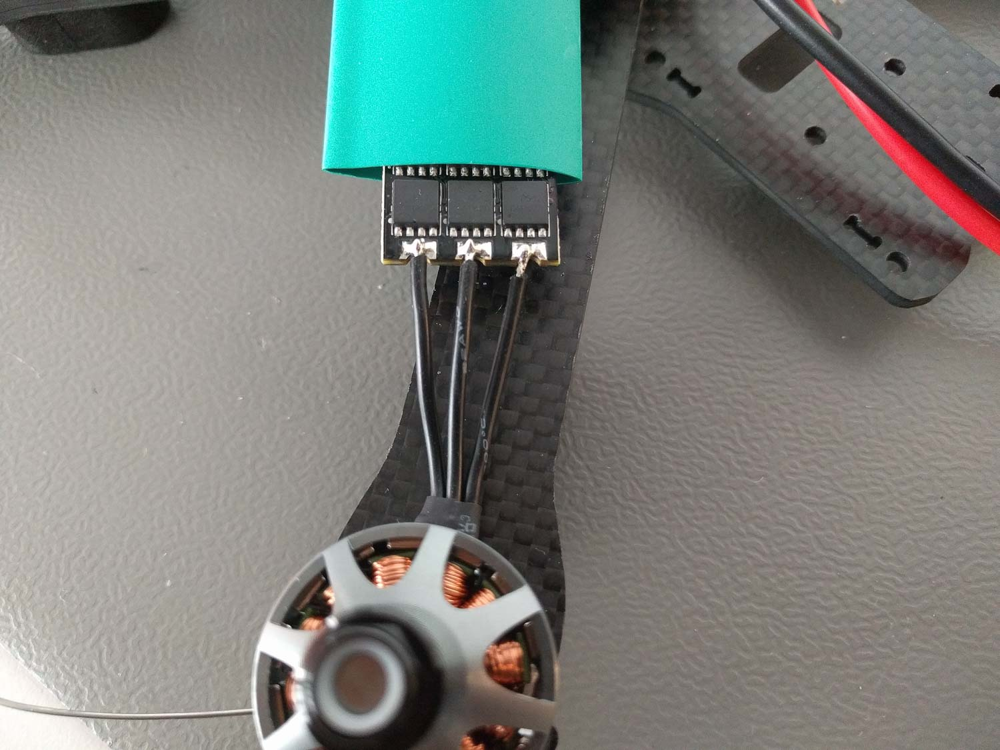

### Модуль живлення

Спочатку я припаяв роз'єм XT60, що йде в комплекті з рамою, до маркованого боку батареї модуля живлення *ACSP5*, який поставляється з Pixracer, і додав конденсатор elco, що поставляється з модулем живлення, з правильною полярністю на тій же стороні.

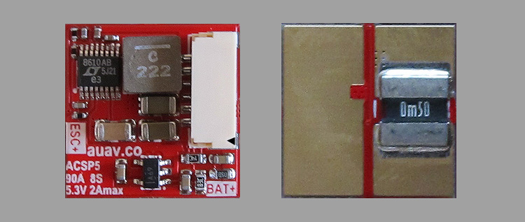

Тепер настає складна частина. Я зварив всі чотири порти напруги ESC + та - до відповідного патча на позначеному боці виходу ESC модуля живлення. Переконайтеся, що тут немає жодного холодного припою, оскільки квадрокоптер не завершиться добре з вільним з'єднанням у польоті. Використання додаткової плати розподілу потужності рами зробило би роботу набагато простіше, але також займає занадто багато місця на такій маленькій рамі...

:::tip
Якщо ви також включаєте частини FPV, не забудьте також припаяти свій чоловічий роз'єм живлення JST до вихідного боку модуля живлення. Вам знадобиться це для вашого [налаштування FPV](#fpv-setup) пізніше.
:::

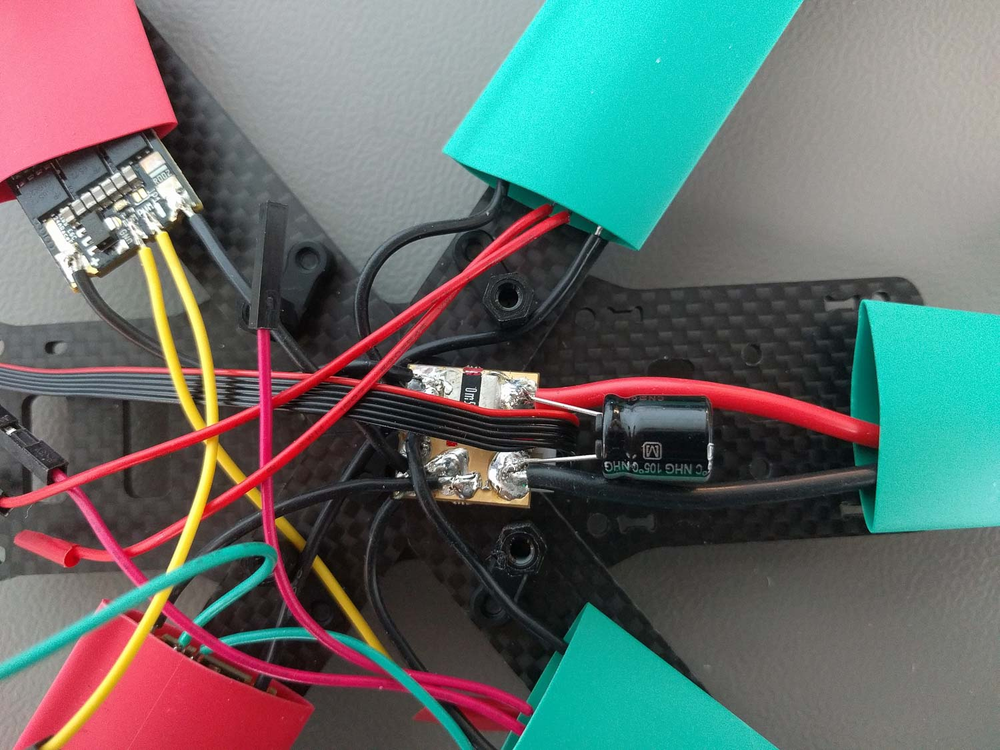

### Сигнальні кабелі

Я використовував тонкі кабелі зі стандартизованим роз'ємом заголовка шпильки, які були вирізані навпіл для сигналу ESC, оскільки це дозволить легко вставити їх на контакти Pixracer пізніше. Лише позначений порт `PWM` на [KISS ESCs](https://1.bp.blogspot.com/-0huvLXoOygM/VtMNAOGkE5I/AAAAAAAAAiA/eNNuuySFeRY/s640/KISS-ESC-2-5S-24A-race-edition-32bit-brushless-motor-ctrl.jpg) є необхідним для польоту. Вони будуть підключені до правильного вихідного сигналу двигуна pixracer. Порт `TLM` призначений для телеметрії ESC, і я їх припаяв для майбутнього використання, оскільки необхідний протокол наразі не підтримується PX4.

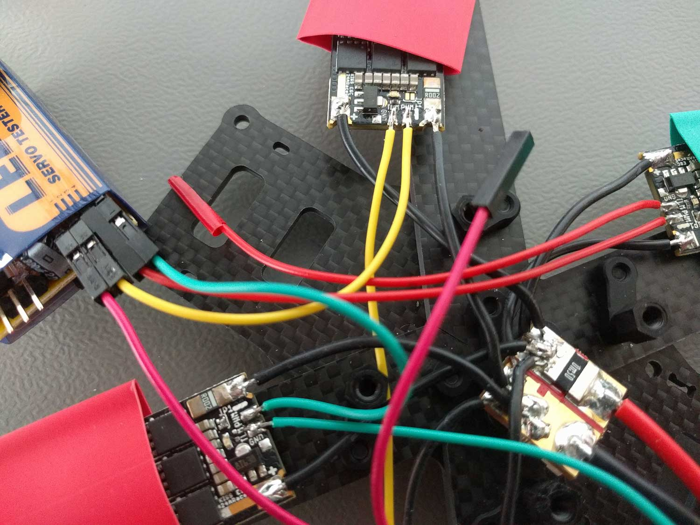

Я протестував всі пари моторів ESC та їх напрямки обертання за допомогою дешевого тестера PWM серво до продовження.

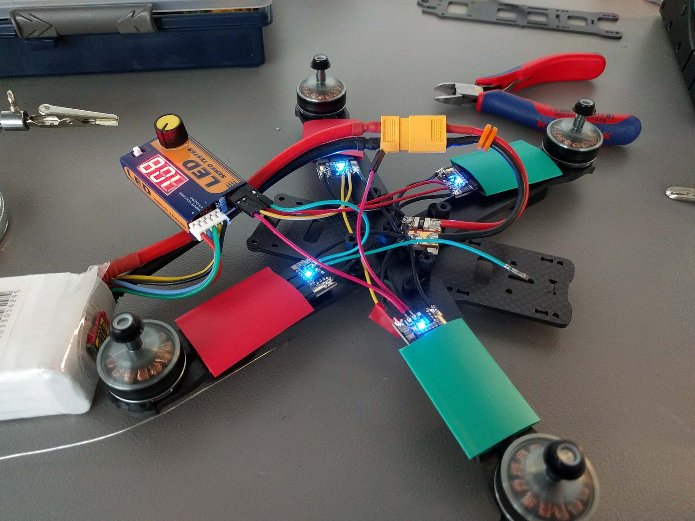

## Підключення & встановлення електроніки

:::tip
Перевірте подвійно призначення контактів кожного підключеного вами компонента.
На жаль, не кожен апаратний компонент там є підключенням і грою, навіть якщо на перший погляд може здатися, що це так.
:::

Для цього кроку вам знадобиться [технічна документація Pixracer](../flight_controller/pixracer.md), щоб знайти всі необхідні роз'єми. Я намагався прокласти всі кабелі під дошкою Pixracer, щоб мати чисту конструкцію та заощадити місце для камери FPV та передавача у майбутньому.

Я змонтував Pixracer, використовуючи нейлонові прокладки та гвинти, які поставляються разом із рамою QAV-R, але **поклав кілька невеликих ущільнювачів O-кільців** між платою та прокладками, щоб додати трохи амортизації вібрацій. Переконайтеся, що ви **не затягуєте гвинти занадто сильно або слабко**, робіть це так, щоб дошка чітко доторкалася до обох сторін, але не була затиснута з будь-якою напругою. Дошка не повинна ніяк висіти, але трохи рухатися, якщо ви натиснете на неї пальцями.

:::warning
Це може суттєво впливати на рівень шуму вібрації, який вимірюють датчики гіроскопа та акселерометра під час польоту.
:::

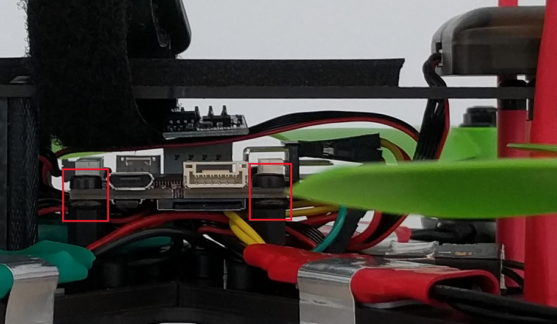

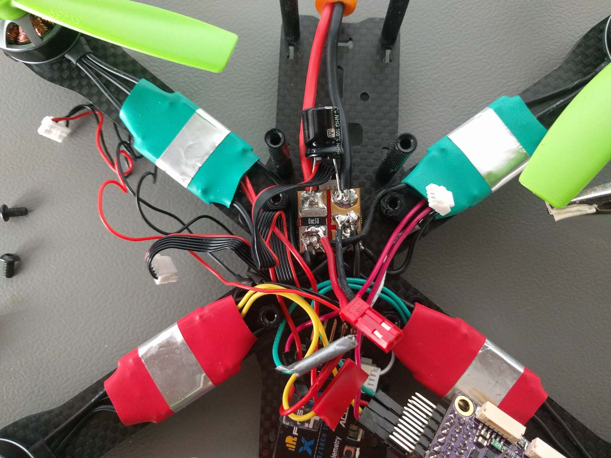 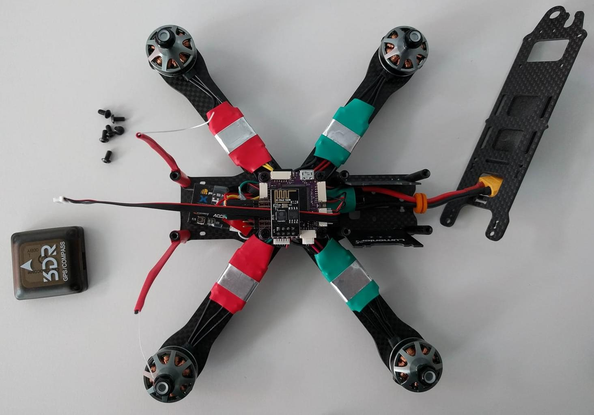

### Приймач RC

Я підключив приймач FrSky S-BUS за допомогою кабелю, відправленого з Pixracer, але відгалуження з непотрібним кабелем відрізав.

Для розумного порту телеметрії я використав кабель, який поставляється з приймачем. Я видалив усі непотрібні шпильки з роз'єму за допомогою пінцета і перемкнув білий вільний кінець кабелю на правильну шпильку роз'єму, щоб мати підключений сигнал "розумний". Потім я припаяв вільний кінець до кабельного вводу порту FrSky, дотримуючись цієї схеми:

Я також пропустив земельний (GND) контакт, оскільки, подібно до позитивного контакту живлення напруги, він вже підключений через кабель RCin S-BUS.

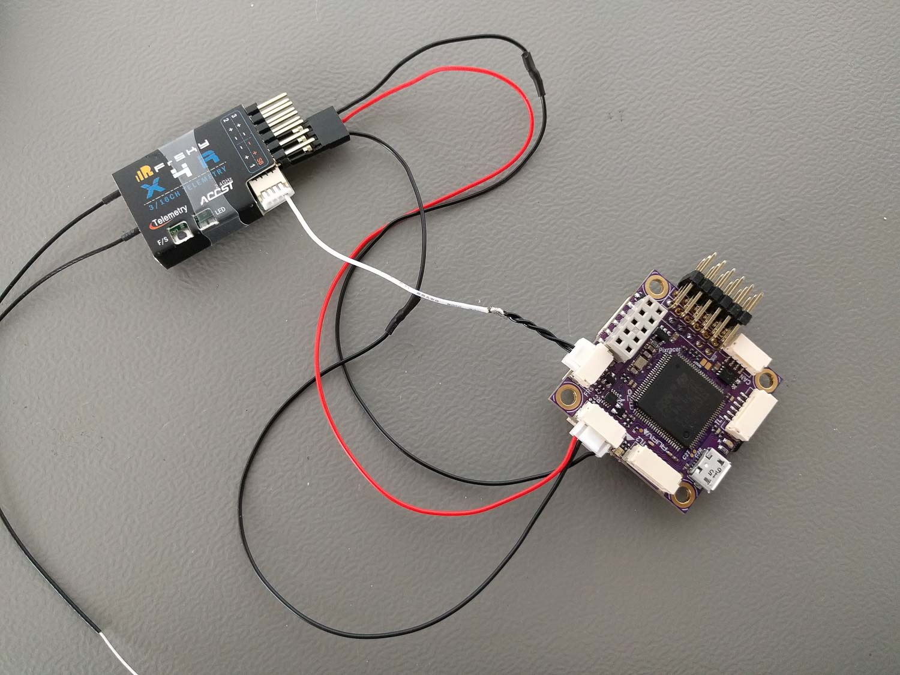

### RC Antenna Mount

Щоб мати хороше з'єднання RC, не ризикуючи мати антену в гвинтах, я використовував метод міцного кріплення за допомогою термоусадки та затяжок.

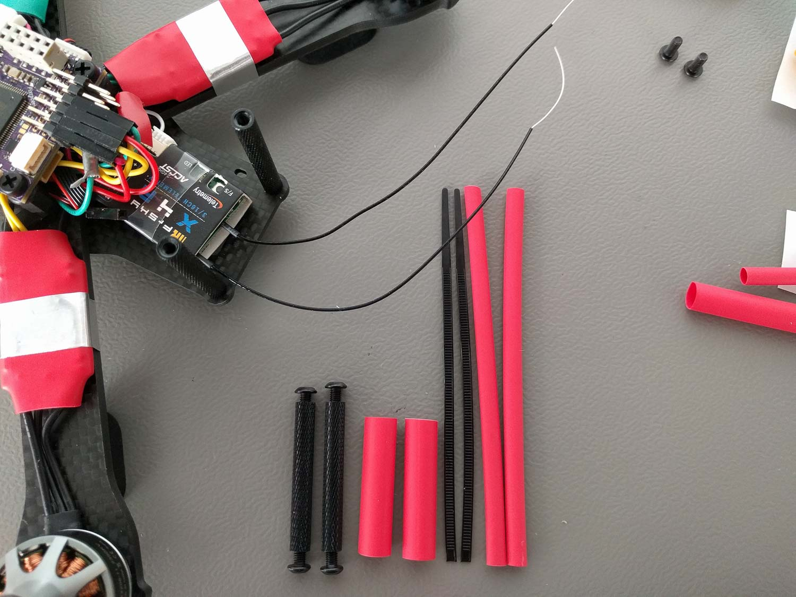

Для цього методу ви відрізаєте великий кінець з отвором від застібки-ґудзика, складаєте решту разом з антенним кабелем через довгий термоусадку та монтуєте це на ваших рамних просторах, використовуючи більшу, але коротшу термоусадку.

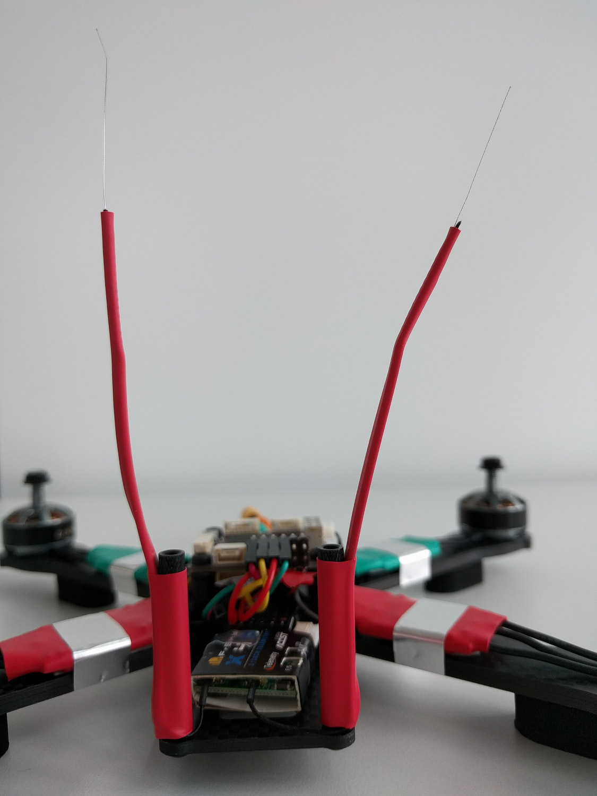

### ESC Signal

Для сигналів ESC я дотримувався [апаратної документації Pixracer](../flight_controller/pixracer.md) та схеми нумерації моторів [Quadrotor x configuration](../airframes/airframe_reference.md#quadrotor-x). Оскільки у нас немає з'єднань землі або позитивного напруги BEC, ми підключаємо кабелі сигналу ESC `PWM` кожен до його верхніх контактів відповідного вихідного роз'єму.

### GPS / External Magnetometer

Я взяв кабель GPS, який підходить до роз'єму використаного GPS і поставляється ​​з набором Pixracer. На жаль, призначення контакту було абсолютно неправильним, і я знову повторно використовував ханцерів згідно з [3DR Pixhawk посібник користувача](../flight_controller/pixhawk_mini.md#connector-pin-assignments-pin-outs) з GPS портом.

#### Pixracer GPS/I2C Port

| Pin | Assignment |
| --- | ---------- |
| 1   | GND        |
| 2   | SDA        |
| 3   | SCL        |
| 4   | RX         |
| 5   | TX         |
| 6   | +5V        |

#### M8N 3DR Pixhawk mini GPS Connector

| Pin     | Призначення | Connect to Pixracer Pin |
| ------- | ----------- | ----------------------- |
| 1 (red) | SCL         | 3                       |
| 2       | SDA         | 2                       |
| 3       | VCC 5V      | 6                       |
| 4       | RX          | 5                       |
| 5       | TX          | 4                       |
| 6       | GND         | 1                       |

Я встановив модуль GPS, використовуючи перерахований загальний мультікоптерний стійку GPS, оскільки встановлення його ближче до основного корпусу зробило показання магнітометра абсолютно непридатними для використання. Експеримент, в якому модуль було прямо закріплено на далекому задньому краї рами, показав, що шум величини магнітометра в шість разів ймовірно спричинений магнітним полем струмів ESC. Зверніть увагу, що я скоротив мачту на ~2 см, щоб вона краще підходила за довжиною кабелю та розмірами рами. Модуль GPS приклеєний двостороннім скотчем до верхньої плити мачти.

## Налаштування FPV

Це інструкція для необов'язкової передачі відео у реальному часі FPV на частоті 5,8 ГГц. Вам знадобляться додаткові частини FPV, перераховані в початковій частині. Трансляція FPV, описана тут, є електронно незалежною від контролера польоту, вона бере тільки напругу батареї після модуля живлення.

Спочатку я зробив контрольний тест, щоб переконатися, що все працює правильно. Для цього підключіть кабель відеосигналу, який постачається разом з вашим передавачем, і підключіть його до задньої частини вашої FPV-камери та до відповідного роз'єму передавача. Закрутіть, а потім підключіть штекер живлення JST до вашого транспортного засобу або до іншого джерела напруги. Світлодіод передавача повинен загорітися. Використовуйте свій пристрій приймача 5,8 Ггц, налаштований на правильний канал, щоб перевірити відео. Щоб налаштувати передавач на інший канал і налаштувати потужність передачі, зверніться до [Посібника користувача Tramp HV](https://www.immersionrc.com/?download=5016).

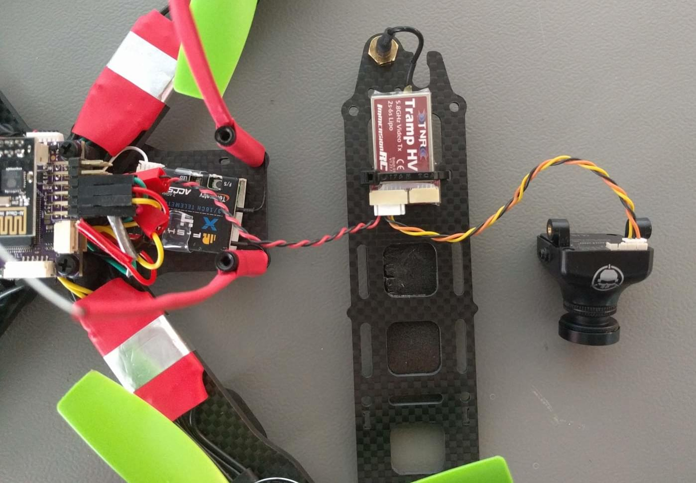

Як ви можете побачити, я закріпив передавач зсередини на "даху" рами, використовуючи затискач. Завжди вставляйте самоклеючий шматок піни між, коли монтуєте електроніку, як цю, щоб уникнути фізичних пошкоджень під час польоту. Переконайтеся, що передавач розташований таким чином, щоб роз'єм антени відповідав відведеній отвору рамки.

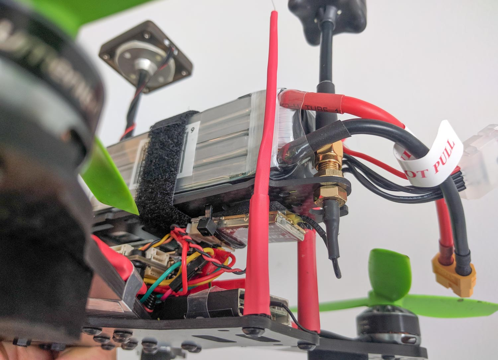

Величезна камера FPV, встановлена в частині списку, має не лише найкращий об'єктив FPV, який я бачив до цього, але також включає кілька кріплень для камери, одне з яких дуже гнучке для налаштування кута камери і гарно вписується в рамку QAV-R. Я змонтував це, як ви можете побачити на наступному зображенні. Два гвинти та гайки для фіксації кронштейну камери до рами були взяті з запасних, що залишилися від комплекту рами.

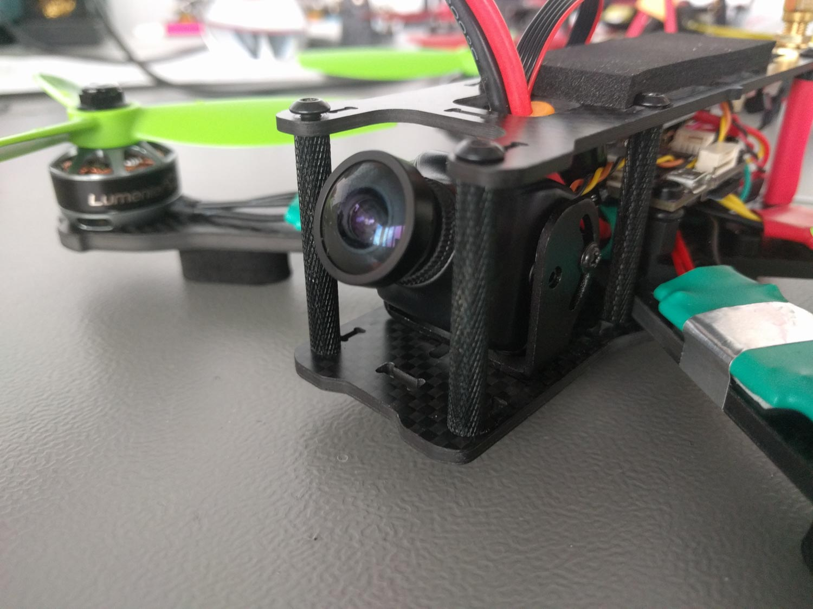

## Налаштування PX4

*QGroundControl* використовується для встановлення автопілота PX4 та його налаштування / налаштування для рами. [Завантажте та встановіть](http://qgroundcontrol.com/downloads/) *QGroundControl* для вашої платформи.

:::tip
Повні інструкції щодо встановлення та налаштування PX4 можна знайти в [Основна конфігурація](../config/index.md).
:::

:::warning
Завжди переконайтеся, що під час будь-якої початкової конфігурації вашого транспортного засобу або батарею, або гвинти фізично вилучено.
Better safe than sorry!
:::

First update the firmware, airframe, and actuator mappings:

- [Firmware](../config/firmware.md)
- [Airframe](../config/airframe.md)

  You will need to select the *Generic 250 Racer* airframe (**Quadrotor x > Generic 250 Racer**).

  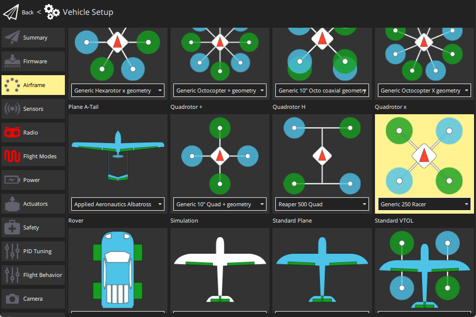

- [Actuators](../config/actuators.md)
  - You should not need to update the vehicle geometry.
  - Assign actuator functions to outputs to match your wiring.
  - Test the configuration using the sliders.

Then perform the mandatory setup/calibration:

* [Sensor Orientation](../config/flight_controller_orientation.md)
* [Compass](../config/compass.md)
* [Accelerometer](../config/accelerometer.md)
* [Level Horizon Calibration](../config/level_horizon_calibration.md)
* [Radio Setup](../config/radio.md)
* [Flight Modes](../config/flight_mode.md)

Ideally you should also do:

- [ESC Calibration](../advanced_config/esc_calibration.md)
- [Battery Estimation Tuning](../config/battery.md)
  - 4S (4 cell LiPo) with charged cell voltage 4.15V and empty cell voltage 3.5V (or appropriate values for your battery).
- [Safety](../config/safety.md)

### Tuning

Набори вибору конструкції встановлюють параметри автопілота *за замовчуванням* для рами. Ці вистачають для польоту, але це добра ідея налаштувати параметри для конкретної конструкції рами.

For instructions on how, start from [Autotune](../config/autotune.md).
