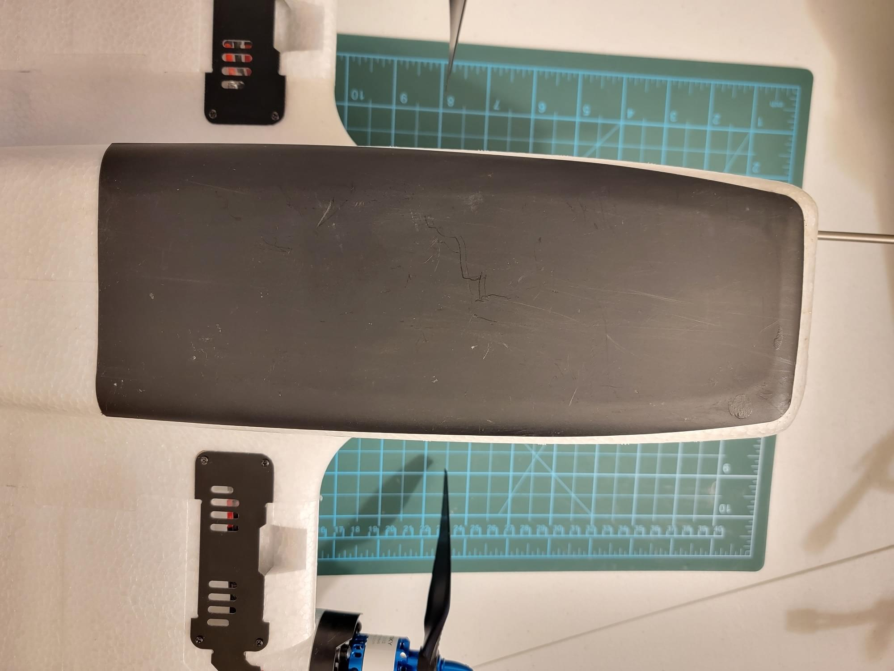
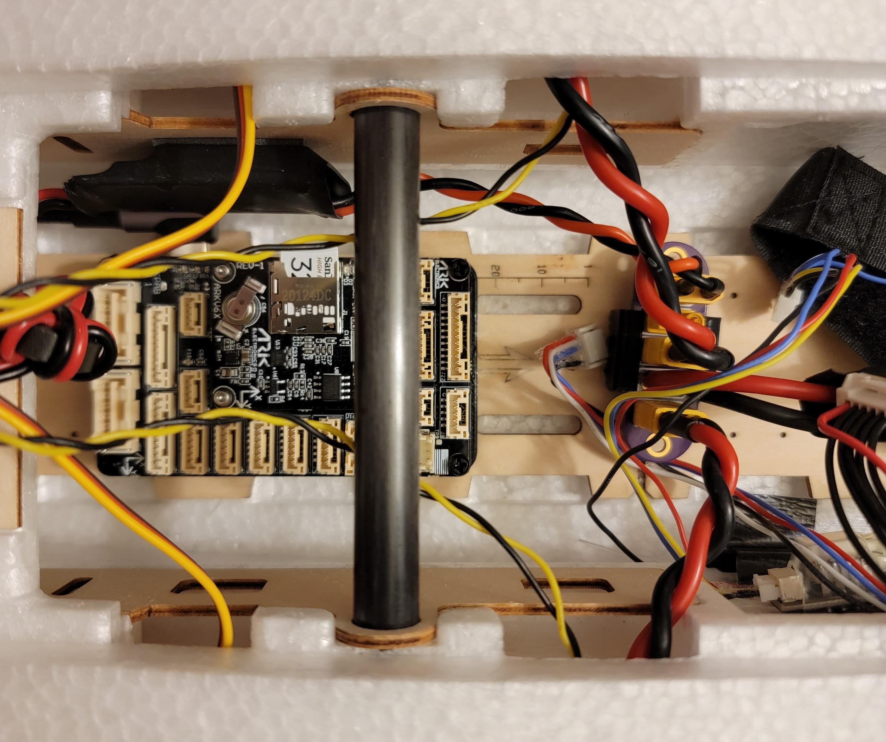

# Reptile Dragon 2 (RD2) Build

The Reptile Dragon 2 is a twin motor RC airplane specifically designed for efficient FPV [(first person view)](https://en.wikipedia.org/wiki/First-person_view_(radio_control)) flying. Being specific for FPV, the RD2 is optimized for easy mounting of cameras, sensors, logic electronics, large batteries, antennas, and other payload components which would be found on a typical FPV airplane. This emphasis on payload makes this airplane an ideal candidate for a PX4 installation.


## Загальний огляд

The goal of this build was to create an efficient, long endurance FPV platform to be used for general PX4 testing and development.

Key airframe features:

- Spacious interior
- Easy access to the entire fuselage cavity with large top hatch
- Rear hatch
- Removable V tail or conventional tail options included
- Threaded inserts in the wings and fuselage top for external mounting
- Numerous mounting features
  - Top antenna hole
  - Top GPS cover
  - Side "T" antenna mounts
  - Rear electronics tray
  - Front facing "action cam" cutout
  - Front facing FPV camera cutout
- Removable wings
- Low stall speed
- Gentle handling

Key build features

- Easy overall build
- Easy access to Pixhawk and all peripherals
- FPV with camera pan mount
- Air data from pitot/static probe
- ~40 minute long flight times

## Parts list

- [Reptile Dragon 2 kit](https://usa.banggood.com/REPTILE-DRAGON-2-1200mm-Wingspan-Twin-Motor-Double-Tail-EPP-FPV-RC-Airplane-KIT-or-PNP-p-1805237.html?cur_warehouse=CN&ID=531466)

- [ARK6X FMU](https://arkelectron.com/product/arkv6x/)
- [ARK6X carrier](https://arkelectron.com/product/ark-pixhawk-autopilot-bus-carrier/)
- [Alternative FMU carrier: Holybro Pixhawk 5x Carrier board](https://holybro.com/products/pixhawk-baseboards)
- [Holybro power module](https://holybro.com/products/pm02d-power-module)
- [Holybro M9N GPS module](https://holybro.com/products/m9n-gps)
- Holybro PWM breakout board
- MS4525DO differential pressure module and pitot tube
- [Caddx Vista FPV air unit](https://caddxfpv.com/products/caddx-vista-kit)
- [Emax ES08MA ii](https://emaxmodel.com/products/emax-es08ma-ii-12g-mini-metal-gear-analog-servo-for-rc-model-robot-pwm-servo)
- [DJI FPV Goggles](https://www.dji.com/fpv)
- [ExpressLRS Matek Diversity RX](http://www.mateksys.com/?portfolio=elrs-r24)
- [5V BEC](https://www.readymaderc.com/products/details/rmrc-3a-power-regulator-5-to-6-volt-ubec)
- [4s2p 18650 LiIon flight battery](https://www.upgradeenergytech.com/product-page/6s-22-2v-5200mah-30c-dark-lithium-xt60)
- [Custom designed 3D printed parts](https://github.com/PX4/PX4-user_guide/raw/main/assets/airframes/fw/reptile_dragon_2/rd2_3d_printed_parts.zip)
  - ARK6X carrier mount
  - Holybro Pixhawk 5x carrier mount
  - FPV pod and camera mount
  - Pitot static probe "plug" adapter
- [Custom designed power distribution PCB](https://github.com/PX4/PX4-user_guide/raw/main/assets/airframes/fw/reptile_dragon_2/xt30_power_distro_pcb.zip)
- Misc hardware: M3 hardware (standoffs, washers, O-rings, bolts), M2.5 nylon standoffs and screws, XT30 connectors, hot glue, heatshrink, Molex Microfit connectors
- Silicone wiring (14awg for high current, 16awg for low current, 22awg for low power and signals)

## Інструменти

The following tools were used in this assembly.

- Servo tester (with centering button)
- Screw driver set
- 3D printer
- Wrench set
- Glue: Hot glue, CA (Cyanoacrylate) glue, "Foamtac" glue
- Sandpaper

## Airframe Build

The airplane needs some assembly out of the box. Servos, wings, and the tail will need to be installed.

::: info

For this portion of assembly, the instructions included with the kit should be sufficent, but some helpful tips are listed below.
:::


### Gluing Foam

When gluing foam parts of the RD2 together, use sandpaper to rough the mating surface, then use CA glue. If the foam is not roughed with sandpaper, the glue will not have a surface to be able to "grab" the foam and the bond will be poor.

Foamtac doesn't seem to stick well to this foam, so I used CA glue for all foam-to-foam mates.

### Skid Plate

The skid plate that comes with the RD2 needs to be trimmed to fit.



Trim off the mold flashing from the flat side of the skid plate. Use coarse sandpaper to rough the inside surface of the skid plate as well as the mating surface on the underside of the airframe. After checking for fit, use CA glue to glue the skid plate to the bottom of the RD2.

### Servo Installation

::: info

Prior to servo installation, it is recommended to use the sandpaper to rough the side of the servo facing the servo cover. During final installation, put a drop of Foamtac between the servo and the cover. This will prevent the servo from moving once installed.
:::


The servos on the RD2 are connected to control surfaces with adjustable servo linkages. The RD2 instructions will note that each control surface uses a specific length of linkage (included in the kit). Make sure to measure each linkage before installation to be sure that it is the right length linkage for that control surface. It's very important to align the servos such that the mechanical range of the servo is well aligned with the mechanical range of the control surface. When the servo is at it's center point, the servo arm should be at a 90 degree angle to the servo, and the control surface should be roughly centered. It might not be possible to get this alignment perfect, so any remaining offset will be adjusted out in software.

The following steps can be used to perform servo alignment:

1. Begin with the servo outside of the airplane
2. Use the servo tester to move the servo to its center point
3. Install the servo horn with the included retaining screw, taking care to align the horn to extend as close as possible to 90 degrees out on the correct side of the servo
4. Install the servo in the servo pocket on the airplane
5. Install the linkage, and twist to adjust it such that the control surface is as close to centered as possible

::: info

The servo horn will likely not sit exactly at a 90 degree angle to the servo due to the teeth on the servo shaft. You can see this in the above example setup image. Just get it close enough to 90 degrees, and the remaining offset will be removed either with the linkage, or later in software.
:::


## GPS/Compass Module Mounting

The GPS/Compass should be mounted in the rear electronics shelf included with the RD2. This location is far aft of power wiring (and anything else that might cause magnetic disturbances), which makes for an ideal location for the GPS/compass module


The GPS module can be removed from its plastic case to allow the use of the mounting holes. Then use the nylon M3 hardware to attach it to the rear electronics shelf.

Two of the three required holes are already coincidentally located in the electronics tray, so I used a marker and a drill to mark and drill the third hole.


## FPV Pod

### FPV Pod Assembly

First, mount the ES08MA ii servo in the servo pocket of the FPV pod. The servo should simply slip in, with the cable exiting the FPV Pod through the hole in the servo pocket. Use a dot of Foamtac glue to secure the servo.


Use one of the servo horns included in the ES08ma ii package. Cut the horn such that it fits in the slot in the FPV pod camera carrier. It should sit flush to the bottom of the slot. Secure the horn with CA glue.

Use the servo tester to center the servo. Attach the camera carrier servo horn directly to the top of the servo and secure it with the included screw. Secure the DJI FPV camera into the carrier with the two side screws.

To finish the FPV pod assembly, install the Caddx Vista to the back of the pod using long M2 bolts, 1mm standoffs, and nylock nuts.


### FPV Pod Airframe Installation

The FPV pod was mounted on top of the battery hatch using nylon M3 bolts with two O-rings to space the FPV pod base plate from the battery hatch.

## Flight Computer Installation

::: info

This build is compatible with both the ARK6X carrier and the Holybro 5X Carrier. Instructions are provided for both.
:::


 The RD2 comes with a wooden electronics mount baseplate preglued in the airframe. In this image, two sets of marker ticks are used to indicate where the mounts for each carrier mount should back up to; the single tik for the Holybro 5X carrier mount, and the two ticks for the ARK5X carrier mount.

### ARK6X Carrier (Recommended)

A custom 3D printed mount was made for the ARK6X carrier. M2.5 nylon hardware was used to secure the ARK6X carrier to the mount.

 

The ARK6X carrier doesn't have normal servo output connectors. Instead, it has a single JST GH connector which carries the 8 FMU servo outputs. A Holybro PWM breakout board was used to split the single JST GH PWM output connector into 8 individual servo channels.


The ARK6X carrier is shown here mounted to the base plate. Note the aft end of the carrier aligned against the two tick marks.


Finally, the ARK6X was installed on top of the mount.




### Holybro 5X Carrier (Optional)

An alternative carrier board is the Holybro Pixhawk 5X carrier.

The carrier comes installed in a plastic case. While the case does look nice, it is extra weight, so the carrier was removed from the case. Once removed from the case, the ARK6X was installed, and a protective cover fitted ontop.


A custom mount for the Pixhawk 5X carrier board was designed and 3D printed. This mount adapts the RD2's internal mounting plate hole pattern to the mounting holes on the Pixhawk 5X carrier board.


It's important to install this mount in the correct location inside the RD2; as far aft as possible. With a large battery and the FPV pod up front, the airplane will tend to be noseheavy. Mounting the flight computer far aft will help to keep the airframe center of gravity (CG) in the correct location.


The images above show the fully completed and connected Holybro 5X carrier installation.

 


## Electrical

### Battery Power Distribution

Battery power is routed through the Holybro Power module, then to a custom designed power distribution PCB (printed circuit board). From the power distribution board, battery power is split to the BEC, both ESCs, and Caddx Vista through separate XT30 connectors.


Without the custom PCB, it's still easy to distribute power to all the components in the airplane. This image shows an alternative solution constructed from an XT60 connecter wired to several XT30 connectors. The servo power BEC is also shown in this image.


### Servo Power

Because the Holybro carrier does not include an onboard servo power supply, an external ["BEC"](https://en.wikipedia.org/wiki/Battery_eliminator_circuit) is used to provide power to the servos. The input leads of the EC were soldered to a XT30 connector which was plugged into the power distribution board. The output of the BEC can be plugged into any unused servo output (I chose IO output 8).

### ESCs & Motors


Bullet connectors were soldered to 16awg leads, which were then soldered to each phase output on each ESC. Heatshrink was shrunk over the finished ESCs and the bullet connectors from the ESCs were connected to their respective motors.

Motor direction depends on the order of the motor leads connected to the ESC. For now, take a guess on each side. If either motor is spinning the wrong way, the direction can be swapped by swapping any two connections. Correct motor direction will be checked in the final preflight checks.

### Servos & ESC Signal Leads

Servos were wired to the FMU out port in the order left aileron, right aileron, left ESC, right ESC, elevator, rudder, FPV pan.

::: info

[DSHOT ESC](../peripherals/dshot.md#wiring-connections) were used (not PWM as for the servos). To make efficient use of the [DSHOT output port restrictions](../peripherals/dshot.md#wiring-connections), the two ESCs must be wired to FMU output channels 3 and 4.
:::


### Датчик швидкості повітря та пітот-трубка

Датчик швидкості повітря був підключений до порту I2C на платі-адаптері FMU за допомогою постачального кабелю з роз'ємом JST GH I2C.


Пітот-трубка була протиснута через кріплення пітот-трубки та встановлена в виріз для Fpv-камери спереду.

Шланги пітоту/статики були вирізані на потрібну довжину та встановлені для з'єднання пітот-статичної зонди з датчиком швидкості повітря. Нарешті, датчик пітот-статики був приклеєний до бічної стінки корпусу літального апарата (за допомогою двостороннього скотчу).

### ELRS RX

Був виготовлений спеціальний кабель для підключення ELRS RX до порту `TELEM2` з роз'ємом JST GH на платі-адаптері FMU.


Інший кінець кабелю був завершений роз'ємом Dupont для підключення до стандартно розміщених роз'ємів на ELRS RX. ELRS RX був підключений до кабелю, після чого термоусадка використовувалася для їх фіксації разом.


Тонка антенна трубка була протиснута через верх корпусу літального апарата, щоб установити одну з двох антен ELRS в вертикальне положення. Друга антена для різноманітності була приклеєна до бічної стінки корпусу літального апарата під кутом 90 градусів від положення першої антени. ELRS RX був прикріплений до бічної стінки корпусу літального апарата поруч з датчиком пітот-статики за допомогою двостороннього скотчу.

### USB

Був використаний кабель з USB-портом типу C з прямим кутом, щоб забезпечити легкий доступ до USB-порту типу C на FMU.


Кабель був встановлений таким чином, що він виходить з Pixhawk, спрямований до тильної частини літального апарата. Кабель продовжується до задньої кришки, де зайва довжина може бути безпечно змотана в вузол. Доступ до цього кабелю можна здійснити, просто вийшовши задню кришку і розплутавши кабель.

## Збірка прошивки

Ви не можете використовувати заздалегідь побудовану прошивку PX4 (або основну), оскільки вона залежить від модулів PX4 [crsf_rc](../modules/modules_driver.md#crsf-rc) та [msp_osd](../modules/modules_driver.md#msp-osd), які за замовчуванням не включені.

Для їх використання потрібна деяка налаштування.

Спочатку слід дотримуватися [цього посібника для налаштування середовища розробки](../dev_setup/dev_env.md) і [цього посібника для отримання вихідного коду PX4](../dev_setup/building_px4.md).

Once a build environment has been setup, open a terminal and `cd` into the `PX4-Autopilot` directory. Щоб запустити інструмент конфігурації [плати PX4 (`menuconfig`)](../hardware/porting_guide_config.md#px4-menuconfig-setup), виконайте:

```
make ark_fmu-v6x_default boardconfig
```

### `crsf_rc` Модуль

PX4 включає автономний модуль розбору CRSF, який підтримує телеметрію та CRSF LinkStatistics. Для використання цього модуля потрібно вимкнути модуль `rc_input` за замовчуванням та увімкнути модуль `crsf_rc`.

1. У інструменті конфігурації плати PX4 перейдіть до підменю `драйверів`, прокрутіть вниз, щоб виділити `rc_input`.
2. Використовуйте клавішу Enter, щоб видалити `*` з прапорця `rc_input`.
3. Прокрутіть вниз, щоб виділити підменю `RC`, а потім натисніть Enter, щоб відкрити його.
4. Прокрутіть вниз, щоб виділити `crsf_rc` і натисніть Enter, щоб увімкнути його.
5. Збережіть і вийдіть з інструменту конфігурації плати PX4.

Для отримання додаткової інформації див. [TBS Crossfire (CRSF) Telemetry](../telemetry/crsf_telemetry.md).

### Модуль `msp_osd`

Модуль `msp_osd` передає телеметрію MSP на вибраний серійний порт. Пристрій Caddx Vista Air підтримує прослуховування телеметрії MSP і відображає отримані значення телеметрії на своєму OSD (екрані).

1. У інструменті конфігурації плати PX4 перейдіть до підменю `драйверів`, прокрутіть вниз, щоб виділити `OSD`.
2. Використовуйте клавішу Enter, щоб відкрити підменю `OSD`
3. Прокрутіть вниз, щоб виділити `msp_osd` і натисніть Enter, щоб увімкнути його

### Побудова & Прошивання

Після увімкнення модулів `msp_osd` та `crsf_rc` та вимкнення модуля `rc_input`, потрібно скомпілювати вихідний код прошивки та збудувати образ, який потім буде прошитий в FMU.

Для компіляції та прошивання прошивки підключіть FMU/Carrier до ПК-хоста збудови через USB і виконайте:

```
make ark_fmu-v6x_default upload
```

## Конфігурація PX4

### Конфігурація параметрів

Цей файл параметрів містить настроювану конфігурацію параметрів PX4 для цієї збірки, включаючи налаштування радіо, налаштування і датчиків. Load the file via QGC using the instructions at [Parameters> Tools](https://docs.qgroundcontrol.com/master/en/qgc-user-guide/setup_view/parameters.html#tools) (QGC User Guide).

- [Знімок параметрів аеродинамічної рами PX4](https://github.com/PX4/PX4-user_guide/raw/main/assets/airframes/fw/reptile_dragon_2/reptile_dragon_2_params.params)


Можливо, вам доведеться змінити деякі параметри для вашої збірки, зокрема вам слід перевірити:

- Параметр [MSP_OSD_CONFIG](../advanced_config/parameter_reference.md#MSP_OSD_CONFIG) повинен відповідати послідовному порту, який підключений до Caddx Vista (у цій збірці, `/dev/ttyS7`).
- Параметр [RC_CRSF_PRT_CFG](../advanced_config/parameter_reference.md#RC_CRSF_PRT_CFG) повинен відповідати послідовному порту, який підключений до ELRS RX (у цій збірці, `Telem 1`).

### Налаштування радіо

Вам слід активувати ручні, акро та позиційні режими на вашому контролері (принаймні для першого польоту). Інструкції дивіться у [Flight mode Configuration](../config/flight_mode.md)

Ми також рекомендуємо налаштувати [перемикач автоматичного](../config/autotune.md#enable-disable-autotune-switch-fixed-wing) налаштування для першого польоту, так як це полегшить включення / вимкнення автоматичного налаштування під час польоту.

Мапування каналів для цієї збірки включено в постачальний [файл параметрів](#parameter-config). Порядок каналів - це керування газом, крен, тангаж, рульове керування, (порожнє), і режим польоту

::: info

ExpressLRS потребує `AUX1` як "канал вибору режиму". Цей канал вибору режиму є окремим від механізму зброювання PX4 і використовується для повідомлення ELRS TX, що він може перемикатися в режим високої потужності передачі.

У мапуванні каналів PX4 я просто пропускаю цей канал. На моєму передавачі цей канал завжди встановлений на "високий", тому ELRS завжди в зброї.
:::


### Налаштування мотора & встановлення пропелера

Мотори та налаштування керування повітряними поверхнями виконуються в розділі [Actuator](../config/actuators.md). Постачений [файл параметрів](#parameter-config) відображає актуатори, як описано в цій збірці.

Комплект RD2 поставляється з годинними та проти годинною пропелерами для протиопорних двигунів. З протиопорними пропелерами літак може бути налаштований таким чином, що в нього не буде [критичних двигунів](https://en.wikipedia.org/wiki/Critical_engine).

З відсутністю критичних двигунів, керованість буде максимальною в разі виходу з ладу одного з двигунів. Напрямок обертання двигунів слід встановити таким чином, щоб пропелери оберталися до фюзеляжу зверху літака. Іншими словами, якщо ви дивитесь на лівий двигун, обертаючись від вас від літака, він повинен обертатися за годинниковою стрілкою, тоді як правий двигун повинен обертатися проти годинникової стрілки.

Після зняття пропелерів включіть живлення літака та використайте тест актуатора в QGC для запуску моторів. Якщо лівий або правий двигун не обертається у правильному напрямку, поміняйте місцями два з його кабелів ESC та перевірте ще раз. Наприкінці, коли обидва двигуни обертаються у правильному напрямку, скористайтеся ключем для закріплення пропелерів.

## Останні перевірки

Перед першим польотом необхідно провести всебічний попередній огляд.

Я рекомендую перевірити наступні елементи:

- Sensor calibration (QGC)
  - Mag calibration
  - Accelerometer calibration
  - Airspeed calibration
  - Level horizon calibration
- Check control surface deflection
 - Right stick -> Right aileron goes up, left aileron goes down
 - Left stick -> Left aileron goes up, right aileron goes down
 - Stick back -> elevator goes up -Stick forward -> elevator goes down
 - Left rudder -> Rudder goes left
 - Right rudder -> Rudder goes right
- Check Px4 inputs (in `stabilized mode`)
 - Roll right -> Right Aileron goes down
 - Roll left -> Left aileron goes down
 - Pitch up -> Elevator goes down
 - Pitch down -> Elevator goes up


## First Flight

I recommend performing the first takeoff in manual mode. Because this airplane has no landing gear, you will either need to throw the airplane yourself, or ideally have a helper throw it. When throwing any airplane, throw at a slightly nose up attitude with full throttle.

It's critical to be ready to give aft stick input to prevent the airplane from impacting the ground if it happens to be trimmed nosedown. Once the airplane is successfully airborne, cruise up to an altitude of a few hundred feet and switch to [Acro mode](../flight_modes_fw/acro.md). This is a good time to use [Autotuning](../config/autotune.md) to tune the airframe.

If the airplane is well behaved in _Acro mode_, switch to [Position mode](../flight_modes_fw/position.md).

## Build Results & Performance

Overall, this build was a success. The RD2 flies well in this configuration and has plenty of room onboard for sensors and additional hardware.

### Performance

- Stall speed: 15mph indicated
- Cruise speed: 35-50mph
- Endurance: ~40 minutes at 28mph

### Videos & Flight Logs

[Demo Flight log](https://review.px4.io/plot_app?log=6a1a279c-1df8-4736-9f55-70ec16656d1e)

FPV video of flight log:

@[youtube](https://www.youtube.com/watch?v=VqNWwIPWJb0&ab_channel=ChrisSeto)
