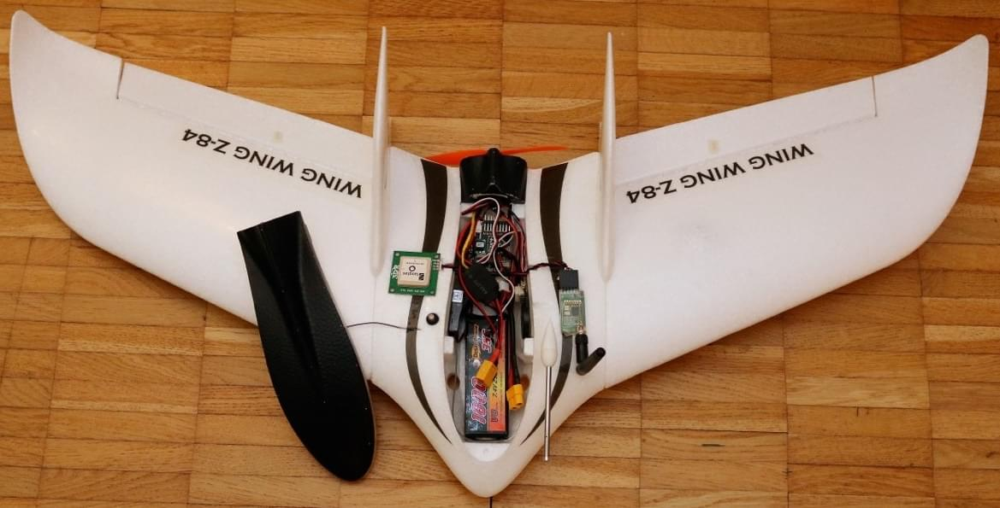
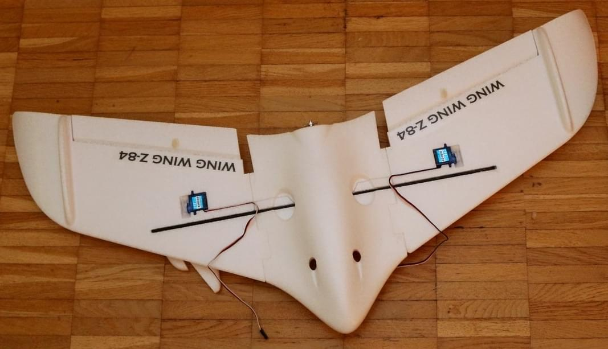

# Wing Wing Z84 Pixracer Збірка

Літаюче крило Wing Wing Z-84 - це каркас літаючого крила. Це невелике, міцне і достатньо велике, щоб розмістити [Pixracer](../flight_controller/pixracer.md).

Основна Інформація:

- **Каркас:** Wing Wing Z-84
- **Контролер польоту:** Pixracer

## Список деталей

### Z-84 Plug n' Fly (PNF/PNP) або Комплект

Один з цих:
- [Banggood](https://www.banggood.com/Wing-Wing-Z-84-Z84-EPO-845mm-Wingspan-Flying-Wing-PNP-p-973125.html)
- [Склад Hobbyking у США](https://hobbyking.com/en_us/wing-wing-z-84-epo-845mm-kit.html)

:::tip
Версії PNF (або "PNP") включають двигун, гвинт і електронний регулятор швидкості.
Версія "комплекту" не включає ці компоненти, які слід окремо придбати.
:::

### Електронний регулятор швидкості (ESC)

Один з цих (будь-який малий (>=12A) ESC підійде):

- [Turnigy 20A Brushed ESC ESC](https://hobbyking.com/en_us/turnigy-20a-brushed-esc.html) (Hobbyking)
- [Регулятор Lumenier 30A BLHeli_S ESC OPTO](https://www.getfpv.com/lumenier-30a-blheli-s-esc-opto-2-4s.html) (GetFPV)

### Автопілот та основні компоненти

- Набір [Pixracer](../flight_controller/pixracer.md) (включаючи GPS та модуль живлення)
- Приймач FrSky D4R-II або йому еквівалентний (з'єднаний за допомогою перемички з виходом PPM sum відповідно до інструкції)
- [Міні набір телеметрії](../flight_controller/pixfalcon.md#availability) для Holybro pix32
- [Цифровий датчик швидкості повітря](../flight_controller/pixfalcon.md#availability) для Holybro pix32 / Pixfalcon
- 1800 mAh 2S LiPo Battery - наприклад, [Team Orion 1800mAh 7.4V 50C 2S1P](https://teamorion.com/en/batteries-en/lipo/soft-case/team-orion-lipo-1800-2s-7-4v-50c-xt60-en/)

### Рекомендовані запасні частини

- 1 см діаметр ущільнювача O-кільце для зберігача пропелера ([Hobbyking](https://hobbyking.com/en_us/wing-wing-z-84-o-ring-10pcs.html))
- 125x110 мм пропелери ([Гобікінг](https://hobbyking.com/en_us/gws-ep-propeller-dd-5043-125x110mm-green-6pcs-set.html))

## Підключення

Проведіть дроти до сервоприводів та двигунів, як показано. Використовуйте виходи `MAIN` (не ті, які позначені як AUX). Регулятор обертань потрібно мати вбудований BEC, оскільки автопілот не живить рейку сервопривода.

| Порт   | Підключення                 |
| ------ | --------------------------- |
| RC IN  | PPM або вхід S.BUS / S.BUS2 |
| MAIN 1 | Left Aileron                |
| MAIN 2 | Right Aileron               |
| MAIN 3 | Empty                       |
| MAIN 4 | Motor 1                     |

## Журнал збірки

Зображення нижче дають уявлення про процес збирання, який є простим і може бути виконаний за допомогою паяльної пістолета.

     

## Налаштування PX4

### Конфігурація планера

Виберіть **Літаюче крило > Загальне літаюче крило** у конфігурації [Конфігурація повітряної рами](../config/airframe.md) QGroundControl:

### Відображення приводів

Налаштуйте [Конфігурацію приводів](../config/actuators.md), щоб відповідати з'єднанню для елеронів та керування, як [вказано вище](#wiring).

### Інша Конфігурація

Виконайте всі інші [Основні налаштування](../config/index.md), включаючи [Автоналаштування](../config/autotune.md).

Розширене налаштування є необов'язковим - див. [Конфігурацію повітряного судна з фіксованим крилом](../config_fw/index.md).
