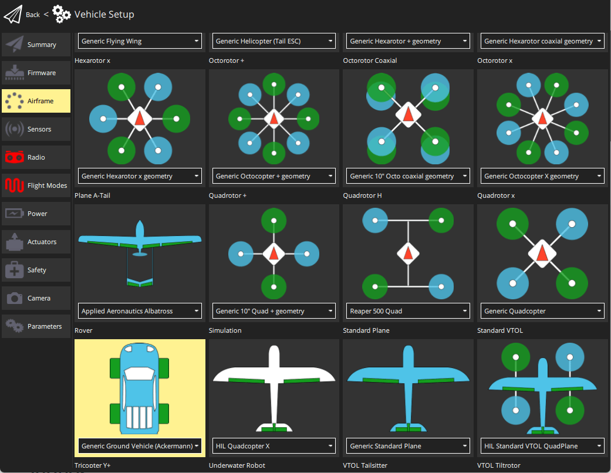

# Ackermann Rover (v1)

<LinkedBadge type="warning" text="Experimental" url="../airframes/#experimental-vehicles"/>

:::warning
This information applies to the original generic rover module that was derived from the fixed wing controller.
This is the same code that is used for [Differential steering rovers.](../frames_rover/differential_rover_v1.md)

For the new ackermann-specific module see [Ackermann Rover (v2)](../frames_rover/ackermann_rover_v2.md).
:::

An _Ackermann rover_ controls its direction by pointing the front wheels in the direction of travel — the [Ackermann steering geometry](https://en.wikipedia.org/wiki/Ackermann_steering_geometry) compensates for the fact that wheels on the inside and outside of the turn move at different rates.
This kind of steering is used on most commercial vehicles, including cars, trucks etc.

## PX4 Configuration

Setting up a rover with Ackermann steering (v1) is straightforward:

1. In the [Airframe](../config/airframe.md) configuration, select the _Generic Ground Vehicle_.

   

   Select the **Apply and Restart** button.

2. Open the [Actuators Configuration & Testing](../config/actuators.md) to map the steering and throttle functions to flight controller outputs.

## Drive Modes

Drive modes (aka "Flight modes") provide autopilot support to make it easier to manually drive the vehicle, to execute autonomous missions, or to defer control to an external system.

PX4 ground vehicles only support [manual mode](#manual-mode), [mission mode](#mission-mode) and [offboard mode](#offboard-mode) (other modes may be offered in a ground station, but these all behave just like manual mode).

### Manual Mode

_Manual mode_ is the only manual mode for ground vehicles on PX4, and requires a manual controller (RC controller, gamepad, joystick etc.).

In this mode, motors are stopped when RC control sticks are centered.
To move the vehicle you move the sticks outside of the center.

As soon as you release the control sticks they will return to the center deadzone.
This will turn off the motors and center the wheels.
There is no active braking, so the vehicle may continue to move until its momentum dissipates.

### Mission Mode

[Mission mode](../flight_modes/mission.md) is an automatic mode that causes the vehicle to execute a predefined autonomous [mission](../flying/missions.md) plan that has been uploaded to the flight controller.
The mission is typically created and uploaded with a Ground Control Station (GCS) application, such as [QGroundControl](https://docs.qgroundcontrol.com/master/en/).

### Offboard Mode

[Offboard mode](../flight_modes/offboard.md) causes the vehicle to obey position, velocity, or attitude, setpoints provided over MAVLink.
Not all setpoint types make sense for a ground vehicle, or are supported.

:::info
This mode is intended for vehicle control from companion computers and ground stations!
:::

## Simulation

[Gazebo Classic](../sim_gazebo_classic/index.md) provides simulations for Ackermann Rovers (v1):

- [ackermann rover](../sim_gazebo_classic/vehicles.md#ackermann-ugv)

## Videos

This video shows the [Traxxas Stampede Rover](../frames_rover/traxxas_stampede.md) (an Ackermann vehicle).

<lite-youtube videoid="N3HvSKS3nCw" title="Traxxas Stampede VXL Autonomous navigation with Pixhawk Mini"/>
