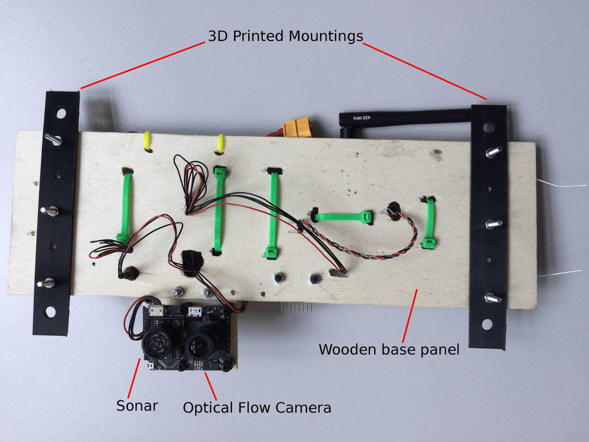
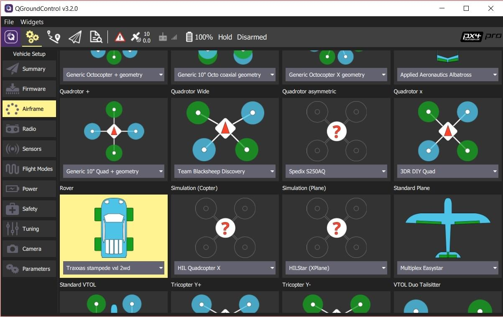

# Traxxas Stampede VXL

Це транспортний засіб було обрано для розуміння того, як Pixhawk може бути використаний для колісних платформ. Ми вибрали використовувати автомобіль Traxxas, оскільки вони дуже популярні і це дуже сильний бренд у спільноті RC. Ідея полягала в розробці платформи, яка дозволяє легко керувати колісними UGV з автопілотом.

## Список деталей

* [Traxxas Stampede](https://traxxas.com/products/models/electric/stampede-vxl-tsm) Все це використовується за винятком верхньої пластикової кришки.
* [Pixhawk Mini (Припинено)](../flight_controller/pixhawk_mini.md)
  * 3DR 10S Power Module
  * Модуль телеметрії 3DR 433МГц (ЄС)
* [Контролер Spektrum Dxe](http://www.spektrumrc.com/Products/Default.aspx?ProdId=SPM1000) або інші сумісні пультів керування з PX4
* [Приймач серійного прийому Spektrum Quad Race з різноманіттям](http://www.spektrumrc.com/Products/Default.aspx?ProdID=SPM4648)
* [PX4Flow](../sensor/px4flow.md) (Застарілий)

## Збірка

Збірка складається з дерев'яної рами, на яку були закріплені всі частини автопілота. Тести показали, що слід використовувати кращу віброізоляцію, особливо для Pixhawk та модуля Flow.

Для цього конкретного кріплення ми вирішили використовувати прищіпку, яка постачається з ровером, щоб прикріпити верхню пластину. Для цього було надруковано дві опори з використанням 3D-друку. Файли CAD надані [тут](https://github.com/PX4/PX4-user_guide/raw/v1.15/assets/airframes/rover/traxxas_stampede_vxl/plane_holders.zip).

:::warning
Рекомендується **НАДЗВИЧАЙНО РЕКОМЕНДОВАНО** встановити ESC в режим навчання (див. посібник Traxxas Stampede), що знижує потужність до 50%.
:::

## Підключення виводу

| PWM Output | Актуатор             |
| ---------- | -------------------- |
| MAIN2      | Рульовий сервопривід |
| MAIN4      | Дросель (вхід ESC)   |

:::info Як документовано в Посиланні на конструкцію повітряного корпусу: [Загальний наземний транспортний засіб (Ackermann)](../airframes/airframe_reference.md#rover_rover_generic_ground_vehicle_(ackermann)).
:::

## Конфігурація

Ровери налаштовані за допомогою *QGroundControl* так само, як будь-який інший транспортний засіб.

Основна конфігурація, специфічна для ровера, полягає в налаштуванні правильної рамки:
1. Перейдіть до розділу [Основна конфігурація](../config/index.md) в *QGroundControl*
1. Виберіть вкладку [Планер](../config/airframe.md).
1. Прокрутіть список вниз, щоб знайти значок **Rover**.
1. Виберіть **Traxxas stampede vxl 2wd** зі списку випадаючих пунктів.

## Використання

На даний момент PX4 підтримує лише режими Місія та Ручний, коли підключений дистанційне керування RC. Для використання режиму місії спочатку завантажте нову місію на транспортний засіб за допомогою QGC. Потім, ПЕРЕД ОЗБРОЄННЯМ, виберіть `MISSION`, а потім озбройтеся.

:::warning
Дуже важливо виконати місію, складену *тільки** зі звичайних точок маршруту (тобто без точок зльоту тощо), і важливо встановити висоту точки маршруту **кожної** точки на 0 для правильного виконання. Не виконання цього призведе до того, що ровер буде безперервно обертатися навколо пункту маршруту.
:::

Правильна налаштування місії виглядає наступним чином:

## Відео

<iframe width="740" height="416" src="https://www.youtube.com/embed/N3HvSKS3nCw" frameborder="0" allow="accelerometer; autoplay; clipboard-write; encrypted-media; gyroscope; picture-in-picture" allowfullscreen></iframe>
