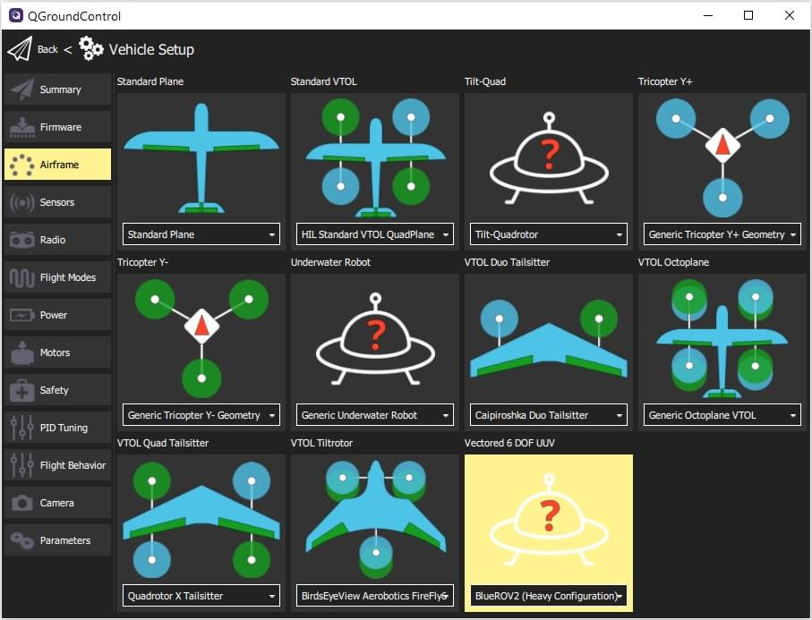

# BlueROV2 (UUV)

<Badge type="tip" text="PX4 v1.12" />

[BlueROV2](https://bluerobotics.com/store/rov/bluerov2-upgrade-kits/brov2-heavy-retrofit-r1-rp/BlueROV2) - це доступний високопродуктивний підводний апарат, який ідеально підходить для інспекцій, досліджень та пригод.

PX4 забезпечує [експериментальну підтримку](README.md) восьмипропелерної конфігурації з векторним керуванням, відомої як _BlueROV2 Heavy Configuration_.

## Де купити

[BlueROV2](https://bluerobotics.com/store/rov/bluerov2/) + [Комплект модернізації для важкої конфігурації BlueROV2](https://bluerobotics.com/store/rov/bluerov2-upgrade-kits/brov2-heavy-retrofit-r1-rp/)

### Відповідність двигунів/підключення

Мотори повинні бути підключені до контролера польоту відповідно до стандартних інструкцій, наданих BlueRobotics для цього транспортного засобу.

Транспортний засіб буде відповідати конфігурації, описаній в [Довіднику з конструкції літальних апаратів](../airframes/airframe_reference.md#vectored-6-dof-uuv):

- **MAIN1:** motor 1 CCW, bow starboard horizontal, , propeller CCW
- **MAIN2:** motor 2 CCW, bow port horizontal, propeller CCW
- **MAIN3:** motor 3 CCW, stern starboard horizontal, propeller CW
- **MAIN4:** motor 4 CCW, stern port horizontal, propeller CW
- **MAIN5:** motor 5 CCW, bow starboard vertical, propeller CCW
- **MAIN6:** motor 6 CCW, bow port vertical, propeller CW
- **MAIN7:** motor 7 CCW, stern starboard vertical, propeller CW
- **MAIN8:** motor 8 CCW, stern port vertical, propeller CCW

## Airframe Configuration

BlueROV2 не йде з предвстановленою версією з PX4. Вам потрібно:

1. [Встановіть прошивку PX4](../config/firmware.md#installing-px4-main-beta-or-custom-firmware)
1. [Налаштуйте планер](../config/airframe.md). Вам потрібно буде вибрати "BlueROV2 Важка конфігурація" як показано: 

<!-- what other tuning/testing/ etc? -->

## Відео

@[youtube](https://www.youtube.com/watch?v=1sUaURmlmT8)

<!-- @DanielDuecker on github is good person to ask about this frame -->
