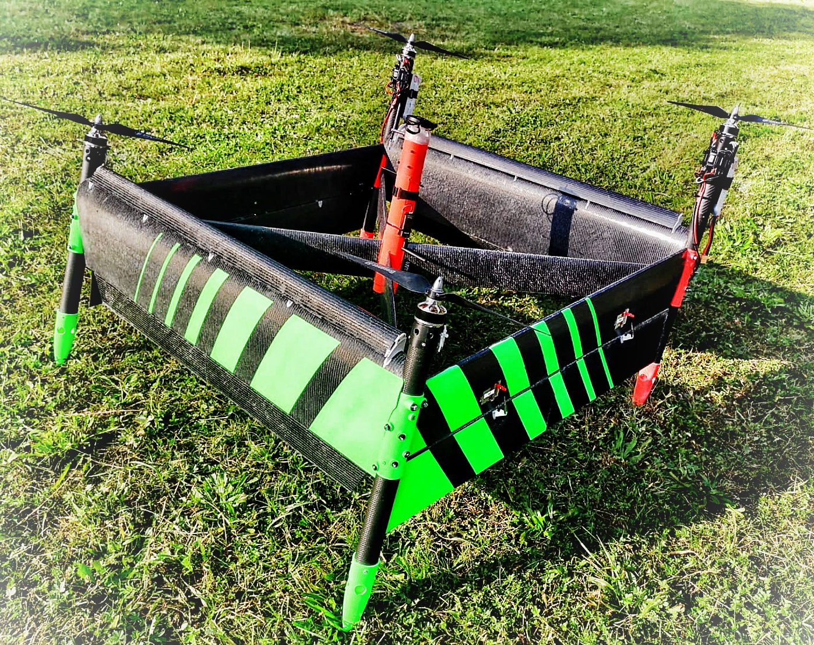
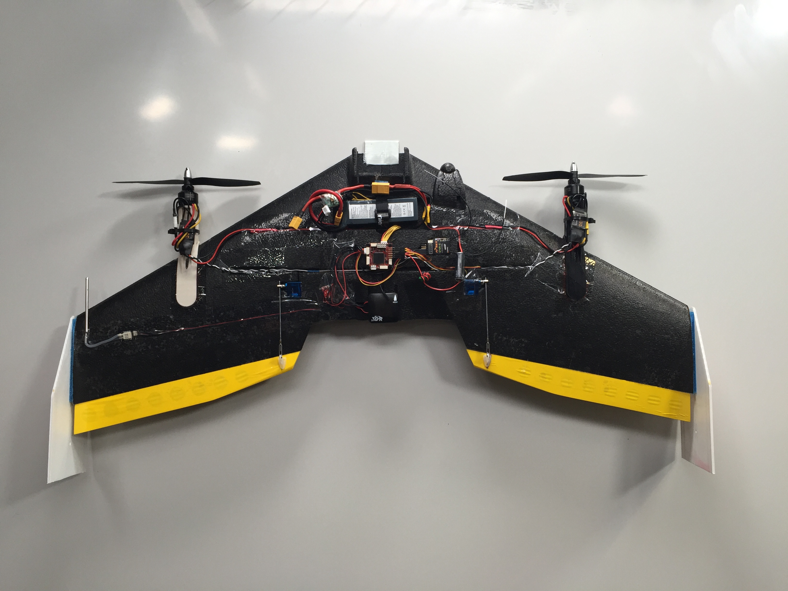
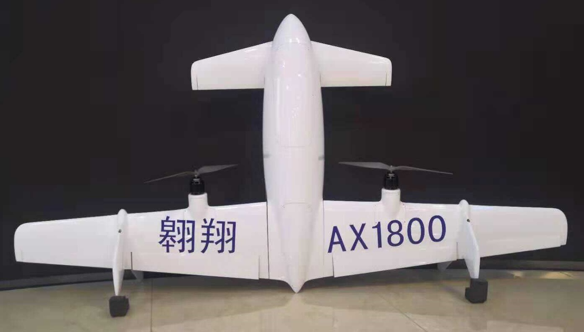
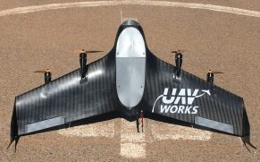

# Тейлсіттер

** Тейлсіттер** злітає і приземляється на хвіст, але під час звичайного польоту переходить в режим фіксованого крила. Ротори тейлсіттера постійно зафіксовані в положенні для польоту вперед.

Тейлсіттери, як правило, механічно менш складні, ніж [інші типи літальні апарат із вертикальним зльотом і посадкою (VTOL)](../frames_vtol/index.md), а отже, можуть бути дешевшими у виробництві та обслуговуванні. Однак вони мають складнішу аеродинаміку, їх важче налаштовувати і керувати ними в режимі вертикального зльоту і переходу, особливо у вітряну погоду.

## Тейлсіттер фрейми

  

    
<big><a href="../airframes/airframe_reference.html#vtol-tailsitter">VTOL Duo Tailsitter</a></big>

    

    Двороторний VTOL, який використовує елевони для переходу від зависання до польоту на фіксованому крилі.  
     
    <ul>
      <li>Прямолінійний політ більш ефективний</li>
      <li>Важче зависати в повітрі, особливо під час вітру</li>
      <li>Важче налаштувати наведення та перехід</li>
      <li>Більш компактний форм-фактор</li>
    </ul>
    

  

  
<big><a href="../airframes/airframe_reference.html#vtol-tailsitter">VTOL Tailsitter</a></big>

  VTOL з можливістю встановлення опціональних елеронів. Використовує ротори для переходу між режимами (разом з елеронами, якщо вони є).
  

  
  <ul>
    <li>У режимі зависання керувати літальним апаратом легше, він є більш стабільним</li>
    <li>Менш компактний форм-фактор (важче транспортувати)</li>
    <li>Підтримується конфігурація роторів "X" та "+" (див. Airframe Reference)</li>
  </ul>
  

Duo Tailsitters зазвичай більш ефективні в крейсерському польоті (4 менших гвинта менш ефективні, ніж 2 більших) і фізично більш компактні. However as they are aerodynamically much more complex in hover mode, they are much harder to tune for both hover and transition. Quad tailsitters are easier to fly in hover mode, and more stable in windy conditions. Both are supported using the same aiframe type in PX4.

## Setup/Flying

VTOL setup and flying are covered in the [VTOL](../frames_vtol/index.md) parent topic.

::: info
The instructions are essentially the same for all VTOL.
The main frame-specific differences are the motor wiring, and some aspects of tuning the configuration.
:::

## Build Logs

Step-by-step guides of how to set up PX4 on tailsitter frames are listed below:

- [TBS Caipiroshka Tailsitter Build (Pixracer)](../frames_vtol/vtol_tailsitter_caipiroshka_pixracer.md)

:::tip
We recommend that you also review build logs for other PX4 VTOL, and Copter vehicles (most of the setup is the same).
:::

## Відео

This section contains videos that are specific to Tailsitter VTOL (videos that apply to all VTOL types can be found in [VTOL](../frames_vtol/index.md)).

### Duo

---

[TBS Caipiroshka](../frames_vtol/vtol_tailsitter_caipiroshka_pixracer.md) - Tailsitter takeoff (close up), hover, level flight, transitions.

@[youtube](https://www.youtube.com/watch?v=acG0aTuf3f8&vq=hd720)

---

[Woshark](http://uav-cas.ac.cn/WOSHARK/) *PX4 Tailsitter prototype* - Tailsitter takeoff, transition, landing. 
<!-- provided by slack user xdwgood: https://github.com/PX4/PX4-user_guide/issues/2328#issuecomment-1467234118 -->
<!-- Update issue https://github.com/PX4/PX4-user_guide/issues/3007 -->
@[youtube](https://youtu.be/gjHj6YsxcZk)

### Quad

<!-- 
[Skypull](https://www.skypull.technology/) Tethered quad tailsitter (promotional video)
@[youtube](https://youtu.be/6s-Izqb_GVs)
-->

[UAV Works VALAQ Patrol Tailsitter](https://www.valaqpatrol.com/valaq_patrol_technical_data/) - Tailsitter takeoff, transition, landing.

@[youtube](https://youtu.be/pWt6uoqpPIw)

## Gallery

  

    
<big><a href="https://wingtra.com/mapping-drone-wingtraone/">WingtraOne</a></big>

    

     
    

  

  

    
<big><a href="https://www.skypull.technology/">Skypull</a></big>

    

      
    

  

  

    
<big><a href="../frames_vtol/vtol_tailsitter_caipiroshka_pixracer.html">TBS Caipiroshka</a></big>

    

      
    

  

  

    
<big><a href="http://uav-cas.ac.cn/WOSHARK/">Woshark</a></big>

    

      
    

  

  

    
<big><a href="https://www.valaqpatrol.com/valaq_patrol_technical_data/">UAV Works VALAQ Patrol Tailsitter</a></big>

    

      
    

  

