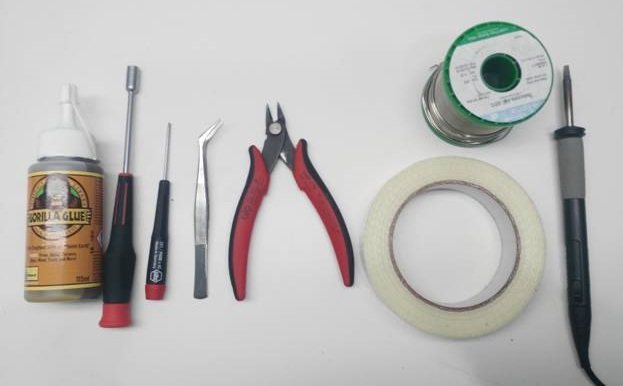
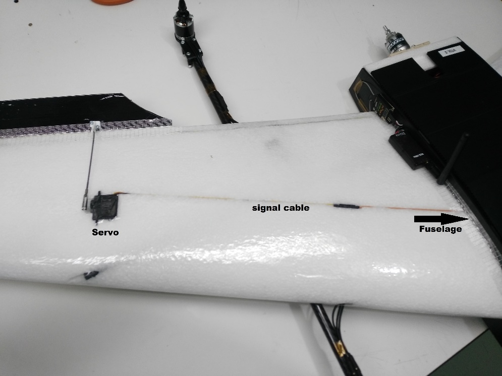
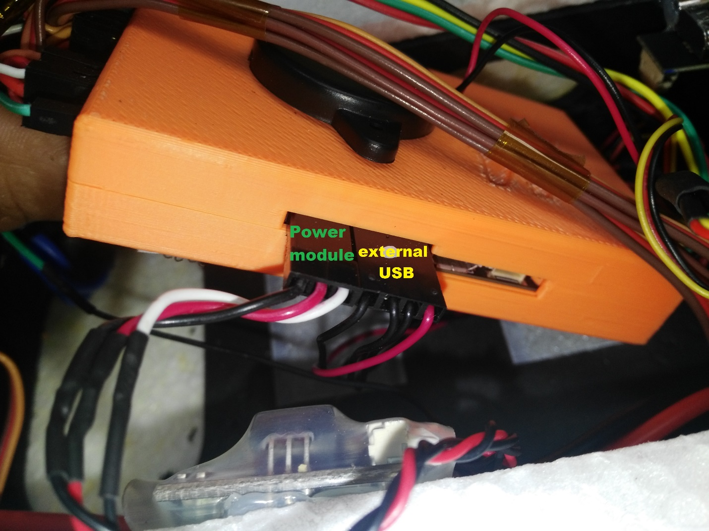
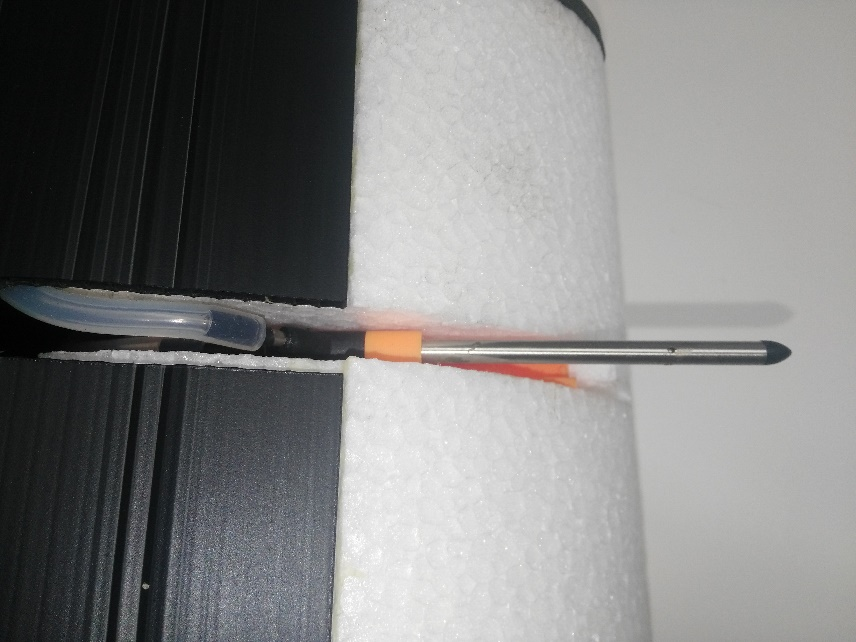
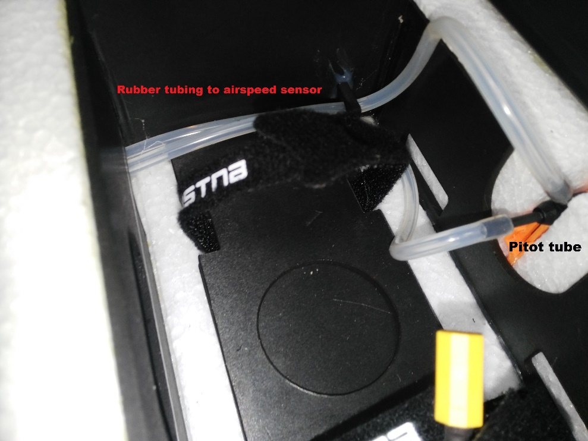
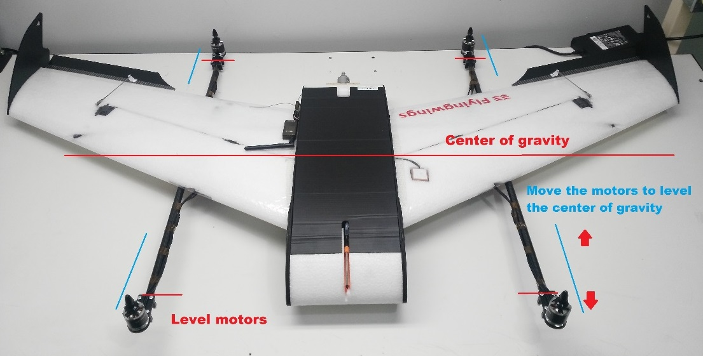

# Припинено: Falcon Vertigo Hybrid VTOL RTF (Dropix)

:::попередження Виробляється
Каркас для польотів з переглядом на місцевості Falcon Venturi FPV Wing, на якому базується ця транспортний засіб, більше недоступний.
:::

*Falcon Vertigo Hybrid VTOL* - це квадропланний літальний апарат VTOL, що був розроблений для роботи з PX4 та керування польотом Dropix (сумісне з Pixhawk). Він може нести невелику камеру GoPro.

Набір RTF містить все необхідне для повної системи, за винятком приймача RC та телеметричного модуля. Компоненти також можуть бути куплені окремо.

Основна Інформація:

- **Каркас:** Falcon Vertigo Hybrid VTOL
- **Контролер польоту:** Dropix
- **Розмах крил:** 1.3м

## Специфікація матеріалів

Майже все необхідне надається в комплекті RTF (посилання поруч з компонентами нижче надаються у випадку, якщо ви бажаєте придбати будь-який компонент окремо):

* Попередньо ламіновані крила з EPP
* Кінчики крил і повне обладнання
* Контролер польоту Dropix (знято з виробництва) з
  * GPS u-blox M8N
  * Датник живлення
  * [Датчик швидкості](https://store-drotek.com/793-digital-differential-airspeed-sensor-kit-.html)
* Чотирьохмоторний набір потужності [Tiger Motor MT-2216-11 900kv V2](https://www.getfpv.com/tiger-motor-mt-2216-11-900kv-v2.html) (виробництва припинено)
* 4 x пропелер 10”x 5” (квадро-мотори)
* 4 x [ESC 25A](http://www.getfpv.com/tiger-motor-flame-25a-esc.html)
* 1 x пропелер 10” x 5” (двигун-штовхач)
* 1 x ESC 30A
* Система потужності двигуна-штовхача
* Вуглецеві труби та кріплення
* Кронштейни для мотора G10
* 1 x [3700mah 4S 30C Lipo акумулятор](https://www.overlander.co.uk/batteries/lipo-batteries/power-packs/3700mah-4s-14-8v-25c-lipo-battery-overlander-sport.html)
* Плата розподілу живлення Dropix та кабель

Набір не постачається з радіоприймачем або (опціональними) модулями телеметрії. Для цієї конфігурації ми використали наступні компоненти:

- Отримувач: [FrSSKY D4R-II](https://www.frsky-rc.com/product/d4r-ii/)
- Телеметрія: [Модулі Holybro 100 мВт 915МГц](https://www.getfpv.com/holybro-100mw-fpv-transceiver-telemetry-radio-set-915mhz.html) (Припинено)

## Необхідні інструменти

Наступні інструменти використовувалися для збирання корпусу повітряного судна:

* Шуруповерт Phillips
* 5.5 мм шестигранник гайковерт
* Кусачки
* 1x паяльник та припій
* Hobby пінцет з нержавіючої сталі
* Клей Gorilla
* Скловолоконна армована стрічка

## Кроки збірки

Набір RTF потребує наступного монтажу.

### Крок 1: Прикріпіть кріплення двигунів

1. Spread gorilla glue inside the wing brackets as shown.

   

1. Attach the carbon tube in the brackets. The bracket and tube must be aligned using the white mark (as shown in the picture).

   ::: info
This is very important because the white mark indicates the center of gravity.
:::

   

1. The following images show the alignment of rods from other viewpoints:

    

### Step 2: Attach the wings

1. Insert both carbon tubes into the fuselage.

   

1. Spread gorilla glue between the two white marks on each tube (indicated by the red arrows). The white mark in the center (blue arrow) will be placed in the center of the fuselage and the other marks on the sides.

   

1. Once the carbon tubes are inside the fuselage, spread gorilla glue on the rest of the tube and attach the wings.

1. The fuselage has two holes for the motor and servo cables. Pass the cables through the holes and then join the wings to the fuselage.

   

1. Within the fuselage connect the signal cables you just passed through from the wings to the ESC using the provided connectors. The ESC are already connected to the motors and set up to turn in the correct order (you will need to connect the ESC PDB to a power module in a later step).

   

1. As with the ESCs, the servos are already installed. Connect the signal cable from the wing (passed through the fuselage) to the flight controller.

   

1. Repeat these steps for the other wing.

### Step 3: Connect the electronics

This kit includes Dropix flight controller with most of the required electronics pre-connected (if you use another Pixhawk-compatible flight controller the connections are similar).

::: info General information about connecting Dropix can be found in [Dropix Flight Controller](../flight_controller/dropix.md). :::

#### Connect the ESC power connector and pass the signals cables to the flight controller

1. Connect the ESC to the power module using the XT60 connector

   

1. Pass the signals cables through to the flight controller

   

#### Motor Wiring

Motor and servo wiring is nearly entirely up to you, but should match the [Generic Standard VTOL](../airframes/airframe_reference.md#vtol_standard_vtol_generic_standard_vtol) configuration, as shown in the airframe reference. The geometry and output assignment can be configured in the [Actuators Configuration](../config/actuators.md#actuator-outputs)

For example, you might wire it up like this example (orientation as if "sitting in the plane"):

| Port   | Connection             |
| ------ | ---------------------- |
| MAIN 1 | Front right motor, CCW |
| MAIN 2 | Back left motor, CCW   |
| MAIN 3 | Front left motor, CW   |
| MAIN 4 | Back right motor, CW   |
| AUX  1 | Left aileron           |
| AUX  2 | Right aileron          |
| AUX  3 | Elevator               |
| AUX  4 | Rudder                 |
| AUX  5 | Throttle               |

#### Flight Controller Connections: Motors, Servos, RC receiver, current sensor

The image below shows back of the dropix flight controller, highlighting the outputs pins to connect quad motors cables, aileron signal cables, throttle motor, and the current sensor and receiver (RC IN) input pins.

1. Connect quad motors signal cables.

1. Connect the aileron cables and throttle motor in the auxiliary outputs.

1. Connect the throttle motor signal cable from the ESC to the appropriate flight controller auxiliary port. Connect the ESC to the throttle motor.

   

1. Connect the receiver (RC IN).

#### Flight Controller Connections: Telemetry, Airspeed Sensor, GPS, Buzzer and Safety Switch

The sensor inputs, telemetry, buzzer and safety switch are located in the front of the flight controller, as shown in the connection diagram below.

1. Connect the telemetry, airspeed sensor, GPS, buzzer and safety switch as shown.

   

#### Flight Controller: Connect power module and external USB

The inputs for the USB port, power module and external USB are located on the right side of the flight controller.

1. Connect power and USB as shown

   

:::tip
The external USB is optional.
It should be used if access to the USB port is difficult once the flight controller is mounted.
:::

#### Install the pitot tube (airspeed sensor)

The pitot tube is installed on the front of the plane and connected to the airspeed sensor via a tube.

:::warning
It is important that nothing obstructs airflow to the Pitot tube. This is critical for fixed-wing flight and for transitioning from quad to plane.
:::

1. Install the Pitot tube in the front of the plane

   

1. Secure the connecting tubing and ensure that it is not bent/kinked.

   

1. Connect the tubes to the airspeed sensor.

   

#### Install/connect receiver and telemetry module

1. Paste the receiver and telemetry module to the outside of the vehicle frame.

   

1. Connect the receiver to the RC IN port on the *back* of the dropix, as shown above (also see the [flight controller instructions](#dropix_back)).

1. Connect the telemetry module to the *front* of the flight controller as shown below (see the [flight controller instructions](#dropix_front) for more detail on the pins).

   

#### GPS/Compass module

The GPS/Compass module is already mounted on the wing, in the default orientation. You don't need to have to do anything extra for this!

#### Mount and orient the flight controller

1. Set your flight controller orientation to 270 degrees.

   

1. Secure the controller in place using vibration damping foam.

### Step 4: Final Assembly Checks

The final assembly step is to check the vehicle is stable and that the motors have been set up correctly.

1. Check that the motors turn in the correct directions (as in the QuadX diagram below).

   

   ::: info If necessary the servo direction can be reversed using the `Rev Range (for servos)` checkbox associated with each servo output in the QGroundControl [Actuator Output](../config/actuators.md#actuator-outputs) configuration (for servos only) (this sets the [PWM_AUX_REV](../advanced_config/parameter_reference.md#PWM_AUX_REV) or [PWM_AUX_MAIN](../advanced_config/parameter_reference.md#PWM_MAIN_REV) parameter). :::

1. Check the vehicle is balanced around the expected centre of gravity

   * Hold the vehicle with your fingers at the center of gravity and check that the vehicle remains stable.

      

   * If the vehicle leans forward or backwards, move the motors to balance it.

      

## Configuration

Perform the normal [Basic Configuration](../config/index.md).

Notes:

1. For [Airframe](../config/airframe.md) select the vehicle group/type as *Standard VTOL* and the specific vehicle as [Generic Standard VTOL](../airframes/airframe_reference.md#vtol_standard_vtol_generic_standard_vtol) as shown below.

   

1. Set the [Autopilot Orientation](../config/flight_controller_orientation.md) to `ROTATION_YAW_270` as the autopilot is mounted [sideways](#flight_controller_orientation) with respect to the front of the vehicle. The compass is oriented forward, so you can leave that at the default (`ROTATION_NONE`).
1. Configure the outputs and geometry following the instructions in [Actuators Configuration](../config/actuators.md)
1. The default parameters are often sufficient for stable flight. For more detailed tuning information see [Standard VTOL Wiring and Configuration](../config_vtol/vtol_quad_configuration.md).

After you finish calibration the VTOL is ready to fly.

## Video

@[youtube](https://youtu.be/h7OHTigtU0s)

## Support

If you have any questions regarding your VTOL conversion or configuration please visit <https://discuss.px4.io/c/px4/vtol>.
