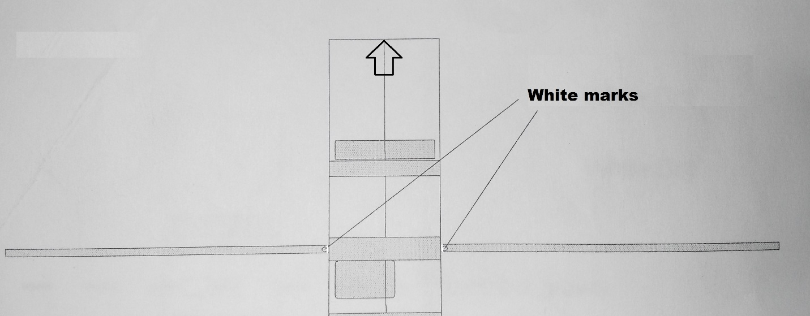
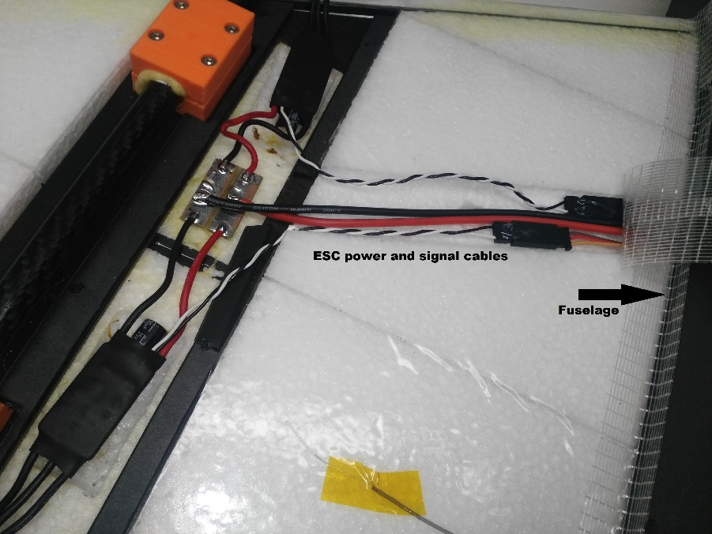
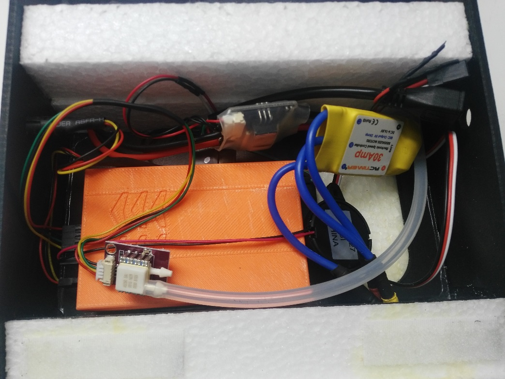
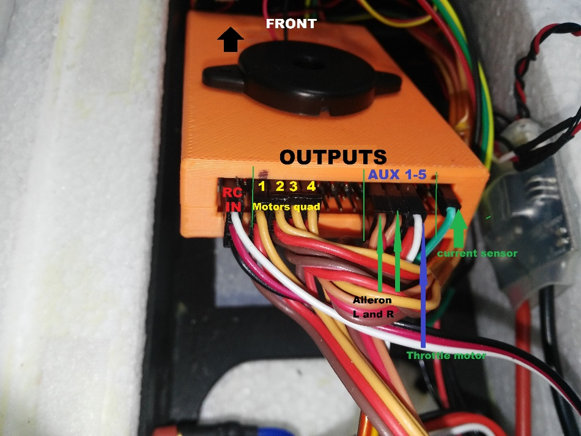
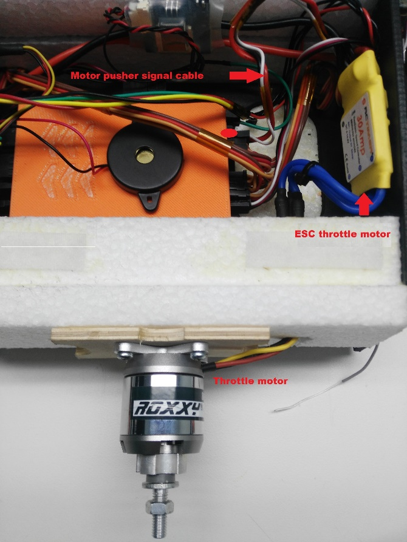
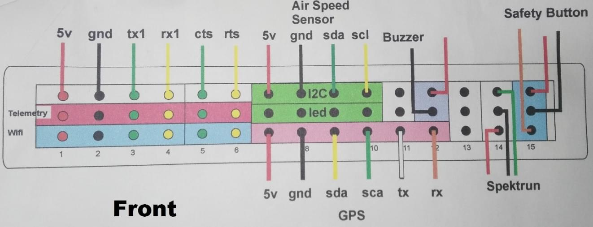
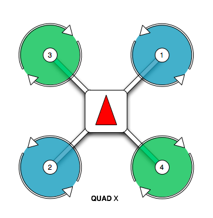

# Припинено: Falcon Vertigo Hybrid VTOL RTF (Dropix)

:::попередження Виробляється
Каркас для польотів з переглядом на місцевості Falcon Venturi FPV Wing, на якому базується ця транспортний засіб, більше недоступний.
:::

*Falcon Vertigo Hybrid VTOL* - це квадропланний літальний апарат VTOL, що був розроблений для роботи з PX4 та керування польотом Dropix (сумісне з Pixhawk). Він може нести невелику камеру GoPro.

Набір RTF містить все необхідне для повної системи, за винятком приймача RC та телеметричного модуля. Компоненти також можуть бути куплені окремо.

Основна Інформація:

- **Каркас:** Falcon Vertigo Hybrid VTOL
- **Контролер польоту:** Dropix
- **Розмах крил:** 1.3м

## Специфікація матеріалів

Майже все необхідне надається в комплекті RTF (посилання поруч з компонентами нижче надаються у випадку, якщо ви бажаєте придбати будь-який компонент окремо):

* Попередньо ламіновані крила з EPP
* Кінчики крил і повне обладнання
* Контролер польоту Dropix (знято з виробництва) з
  * GPS u-blox M8N
  * Датник живлення
  * [Датчик швидкості](https://store-drotek.com/793-digital-differential-airspeed-sensor-kit-.html)
* Чотирьохмоторний набір потужності [Tiger Motor MT-2216-11 900kv V2](https://www.getfpv.com/tiger-motor-mt-2216-11-900kv-v2.html) (виробництва припинено)
* 4 x пропелер 10”x 5” (квадро-мотори)
* 4 x [ESC 25A](http://www.getfpv.com/tiger-motor-flame-25a-esc.html)
* 1 x пропелер 10” x 5” (двигун-штовхач)
* 1 x ESC 30A
* Система потужності двигуна-штовхача
* Вуглецеві труби та кріплення
* Кронштейни для мотора G10
* 1 x [3700mah 4S 30C Lipo акумулятор](https://www.overlander.co.uk/batteries/lipo-batteries/power-packs/3700mah-4s-14-8v-25c-lipo-battery-overlander-sport.html)
* Плата розподілу живлення Dropix та кабель

Набір не постачається з радіоприймачем або (опціональними) модулями телеметрії. Для цієї конфігурації ми використали наступні компоненти:

- Отримувач: [FrSSKY D4R-II](https://www.frsky-rc.com/product/d4r-ii/)
- Телеметрія: [Модулі Holybro 100 мВт 915МГц](https://www.getfpv.com/holybro-100mw-fpv-transceiver-telemetry-radio-set-915mhz.html) (Припинено)

## Необхідні інструменти

Наступні інструменти використовувалися для збирання корпусу повітряного судна:

* Шуруповерт Phillips
* 5.5 мм шестигранник гайковерт
* Кусачки
* 1x паяльник та припій
* Hobby пінцет з нержавіючої сталі
* Клей Gorilla
* Скловолоконна армована стрічка

## Кроки збірки

Набір RTF потребує наступного монтажу.

### Крок 1: Прикріпіть кріплення двигунів

1. Нанесіть клей Gorilla всередину кронштейнів крила, як показано.

   

1. Вкріпіть карбонову трубку в держаки. Для вирівнювання піддона та трубки слід використовувати білу позначку (як показано на зображенні).

   ::: info
Це дуже важливо, оскільки біла позначка вказує на центр мас.
:::

   

1. Наступні зображення показують вирівнювання стержнів з інших точок зору:

    

### Крок 2: Прикріпіть крила

1. Вставте обидві вуглецеві труби в фюзеляж.

   

1. Нанесіть клей gorilla між двома білими позначками на кожну трубку (вказано червоними стрілками). Білий знак по центру (синя стрілка) буде розміщений в центрі фюзеляжу, а інші знаки - по боках.

   

1. Після того, як вуглецеві трубки знаходяться всередині фюзеляжу, розподіліть клей gorilla на решту трубки та прикріпіть крила.

1. Фюзеляж має два отвори для кабелів двигуна та сервоприводів. Пропустіть кабелі через отвори, а потім приєднайте крила до фюзеляжу.

   

1. Усередині фюзеляжу під'єднайте сигнальні кабелі, які ви щойно прокинули з крил до регулятора ESC, використовуючи надані роз'єми. Регулятори швидкості ESC вже підключені до двигунів і налаштовані на обертання в правильному порядку (вам потрібно буде підключити ESC PDB до модуля живлення на пізнішому етапі).

   

1. Так само, як і з ESC, сервопристосування вже встановлені. Підключіть сигнальний кабель з крила (проходить через фюзеляж) до контролера польоту.

   

1. Повторіть ці кроки для іньшого крила.

### Крок 3: Підключіть електроніку

Цей комплект включає контролер польоту Dropix з вже підключеною більшістю необхідної електроніки (якщо ви використовуєте інший контролер польоту, сумісний з Pixhawk, підключення схожі).

::: info Загальну інформацію про підключення Dropix можна знайти в [Контролері польоту Dropix](../flight_controller/dropix.md). :::

#### Підключіть роз'єм живлення ESC та прокладіть кабелі сигналів до контролера польоту

1. Підключіть ЕСС до модуля живлення за допомогою роз'єму XT60

   

1. Передайте кабелі сигналів до контролера польоту

   

#### Підключення двигуна

Проводка двигуна та сервоприводу практично взагалі залежить від вас, але повинна відповідати конфігурації [Загального стандартного VTOL](../airframes/airframe_reference.md#vtol_standard_vtol_generic_standard_vtol), як показано в посиланні на конструкцію корпусу. Геометрія та призначення виводу можуть бути налаштовані в [Конфігурації приводів](../config/actuators.md#actuator-outputs)

Наприклад, ви можете з’єднати його так, як у цьому прикладі (орієнтація як у "сидячи в літаку"):

| Порт   | Підключення                |
| ------ | -------------------------- |
| MAIN 1 | Передній правий мотор, CCW |
| MAIN 2 | Задній лівий мотор, CCW    |
| MAIN 3 | Передній лівий мотор, CW   |
| MAIN 4 | Задній правий мотор, CW    |
| AUX  1 | Лівий елерон               |
| AUX  2 | Правий елерон              |
| AUX  3 | Elevator                   |
| AUX  4 | Rudder                     |
| AUX  5 | Тяга                       |

#### Підключення контролера польоту: Мотори, Сервомеханізми, Приймач RC, датчик струму

Нижче показане зображення задньої плати керування польотом dropix, підкреслюючи вихідні контакти для підключення кабелів квадрокоптерних моторів, кабелів сигналу елерону, мотору, дросельного мотору, а також контактів поточного сенсора та введення радіоприймача (RC IN).

1. Підключіть сигнальні кабелі квадро моторів.

1. Підключіть кабелі елеронів та мотора керування ручкою газу в допоміжні виходи.

1. Підключіть кабель сигналу двигуна дроселя від ESC до відповідного допоміжного порту контролера польоту. Підключіть ESC до регулятора газу.

   

1. Підключіть приймач (RC IN).

#### Підключення контролера польоту: телеметрія, датчик швидкості повітря, GPS, сигналізація та перемикач безпеки

Датчикові входи, телеметрія, сигналізація та безпечний вимикач розташовані з переднього боку керування польотом, як показано на схемі підключення нижче.

1. Підключіть телеметрію, датчик швидкості, GPS, гудок та безпечний перемикач, як показано.

   

#### Контролер польоту: Підключіть модуль живлення та зовнішній USB

Входи для порту USB, модуля живлення та зовнішнього USB розташовані на правому боці контролера польоту.

1. Підключіть живлення та USB, як показано

   

:::tip
Зовнішній USB є необов'язковим.
Він повинен бути використано, якщо доступ до порту USB ускладнений після закріплення контролера польоту.
:::

#### Встановіть пітотрубку (датчик швидкості)

Труба пітота встановлена спереду літака й підключена до датчика швидкості через трубу.

:::warning
Важливо, щоб ніщо не заважало протіканню повітря до труби Піто. Це критично для фіксованих крил та для переходу від квадрокоптера до літака.
:::

1. Встановіть трубку Піто у передній частині літака

   

1. Зафіксуйте з'єднуючі трубки та переконайтеся, що вони не зігнуті / пом'яті.

   

1. Підключіть трубки до датчика швидкості.

   

#### Встановлення/підключення приймача та модуля телеметрії

1. Вставте приймач та телеметричний модуль на зовнішню сторону рами транспортного засобу.

   

1. Підключіть приймач до роз'єму RC IN *ззаду* плати dropix, як показано вище (дивіться також [інструкції з пілотажного контролера](#dropix_back)).

1. Підключіть модуль телеметрії до *передньої* частини регулятора польоту, як показано нижче (див. інструкції регулятора польоту за посиланням [Літачний контролер інструкції](#dropix_front) для більш детальної інформації про контакти).

   

#### Модуль GPS/Компас

Модуль GPS/Компас вже встановлено на крило в типовому положенні. Вам не потрібно робити щось додаткове для цього!

#### Монтаж та орієнтація політного контролера

1. Встановіть орієнтацію вашого політ контролеру на 270 градусів.

   

1. Закріпіть контролер на місці за допомогою піни для поглинання вібрації.

### Крок 4: Перевірка остаточної збірки

Останнім етапом збирання є перевірка стійкості дрона та правильності налаштування двигунів.

1. Перевірте, що двигуни обертаються у правильних напрямках (як у діаграмі QuadX нижче).

   

   ::: info За необхідності може бути виправлено напрямок серводіви за допомогою прапорця `Rev Range (для серводів)`, пов'язаного із кожним вихідним серводвигуном в конфігурації QGroundControl [Актуаторний вихід](../config/actuators.md#actuator-outputs) (тільки для серводвигунів) (це встановлює параметр [PWM_AUX_REV](../advanced_config/parameter_reference.md#PWM_AUX_REV) або [PWM_AUX_MAIN](../advanced_config/parameter_reference.md#PWM_MAIN_REV)). :::

1. Перевірте, чи транспортний засіб збалансований навколо очікуваного центру мас

   * Утримуйте транспортний засіб пальцями у центрі ваги та переконайтеся, що транспортний засіб залишається стабільним.

      

   * Якщо транспортний засіб нахиляється вперед або назад, перемістіть двигуни, щоб утримати рівновагу.

      

## Налаштування

Виконайте звичайну [основну настройку](../config/index.md).

Примітки:

1. Для [Airframe](../config/airframe.md) виберіть групу/тип транспортного засобу як *Standard VTOL* та конкретний транспортний засіб як [Generic Standard VTOL](../airframes/airframe_reference.md#vtol_standard_vtol_generic_standard_vtol), як показано нижче.

   

1. Встановіть [Орієнтацію автопілота](../config/flight_controller_orientation.md) на `ROTATION_YAW_270`, оскільки автопілот встановлений [боком](#flight_controller_orientation) відносно передньої частини транспортного засобу. Компас орієнтований вперед, тому ви можете залишити це на типовому значенні (`ROTATION_NONE`).
1. Налаштуйте виводи та геометрію, дотримуючись інструкцій у [Налаштування приводів](../config/actuators.md)
1. За замовчуванням параметри часто достатні для стабільного польоту. Для отримання докладнішої інформації з настройки дивіться [Стандартна Проводка та Налаштування VTOL](../config_vtol/vtol_quad_configuration.md).

Після завершення калібрування, VTOL готовий до польоту.

## Відео

@[youtube](https://youtu.be/h7OHTigtU0s)

## Підтримка

Якщо у вас виникли запитання щодо перетворення або конфігурації VTOL, зайдіть на <https://discuss.px4.io/c/px4/vtol>.
