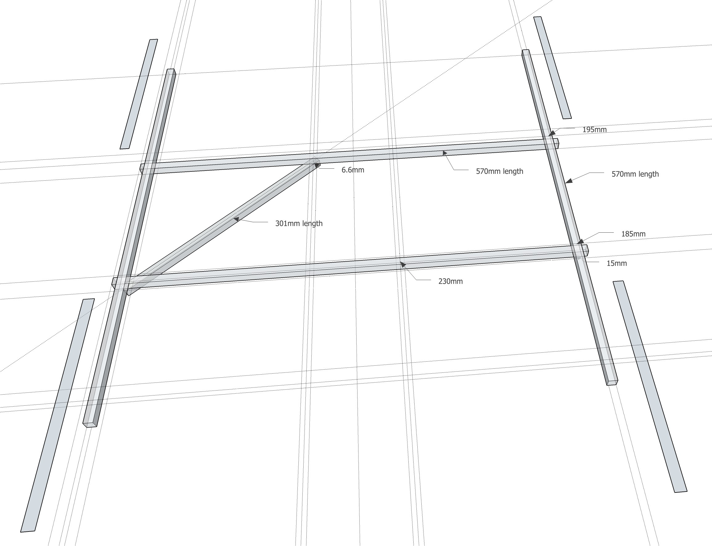

# FunCub QuadPlane (Pixhawk)

QuadPlane VTOL Fun Cub є стандартним повітряним судном з хвостовим оперенням (Multiplex FunCub), яке було модернізовано з системою QuadCopter.

Основна Інформація:

- **Каркас:** Multiplex FunCub
- **Контролер польоту:** Pixhawk

Без змін, Fun Cub - це відносно доступний літак і відносно легкий у польоті. Після конвертації літак стає значно важчим і менш аеродинамічним. Він все ще досить добре літає, але потребує близько 75% газу у польоті вперед.

## Специфікація матеріалів

Справжній літак приблизно виглядає так, як показано на зображенні вище (інші схожі моделі також підійдуть добре - це Multiplex Fun Cub).

Мінімально необхідне обладнання:

- Multiplex FunCub (або подібний)
- Pixhawk або сумісний
- Цифровий датчик швидкості польоту
- 900 кВ двигуни (наприклад, комплект пропульсії Iris - двигуни та регулятори швидкості)
- 10" пропелери для квадрокоптерів (10х45 або 10х47)
- 10" гвинт для мотора фіксованого крила (10×7)
- Модуль GPS
- Батарея 4S
- Алюмінієва рама для кріплення двигунів квадрокоптера (квадратна труба 10х10 мм, стінка 1 мм)
- TOW важить ~2.3кг з батареєю 4S на 4200mAh

## Структура

Структура виготовлена з алюмінієвих стрижнів, як показано нижче.

 

## Підключення

Проводка двигуна та сервоприводу практично взагалі залежить від вас, але повинна відповідати конфігурації [Загального стандартного VTOL](../airframes/airframe_reference.md#vtol_standard_vtol_generic_standard_vtol), як показано в посиланні на конструкцію корпусу. Геометрія та призначення виводу можуть бути налаштовані в [Конфігурації приводів](../config/actuators.md#actuator-outputs)

Наприклад, ви можете з’єднати його так, як у цьому прикладі (орієнтація як у "сидячи в літаку"):

| Порт   | Підключення                 |
| ------ | --------------------------- |
| MAIN 1 | Передній правий мотор (CCW) |
| MAIN 2 | Задній лівий мотор (CCW)    |
| MAIN 3 | Передній лівий мотор (CW)   |
| MAIN 4 | Правий задній мотор (CW)    |
| AUX 1  | Лівий елерон TODO           |
| AUX 2  | Правий елерон               |
| AUX 3  | Elevator                    |
| AUX 4  | Rudder                      |
| AUX 5  | Тяга                        |

Для подальших інструкцій щодо проводки та конфігурацій дивіться: [Стандартна Проводка та Налаштування VTOL](../config_vtol/vtol_quad_configuration.md). <!-- replace with Pixhawk Wiring Quickstart -->

## Конфігурація планера

1. Для [планера](../config/airframe.md) виберіть групу/тип транспортного засобу як *Standard VTOL* та конкретний транспортний засіб як [Generic Standard VTOL](../airframes/airframe_reference.md#vtol_standard_vtol_generic_standard_vtol), як показано нижче (не забудьте натиснути **Застосувати та перезапустити** зверху).

   

1. Налаштуйте виводи та геометрію, дотримуючись інструкцій у [Налаштування приводів](../config/actuators.md)
1. За замовчуванням параметри часто достатні для стабільного польоту. Для отримання докладнішої інформації з настройки дивіться [Стандартна Проводка та Налаштування VTOL](../config_vtol/vtol_quad_configuration.md).

Після завершення калібрування, VTOL готовий до польоту.

## Відео

@[youtube](https://youtu.be/4K8yaa6A0ks)

## Підтримка

Якщо у вас виникли запитання щодо перетворення або конфігурації VTOL, зайдіть на <https://discuss.px4.io/c/px4/vtol>.

