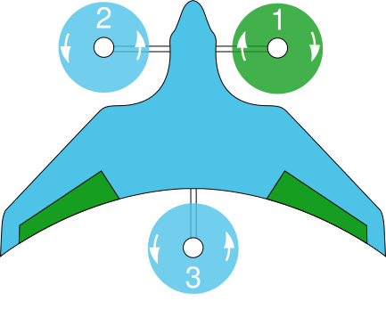
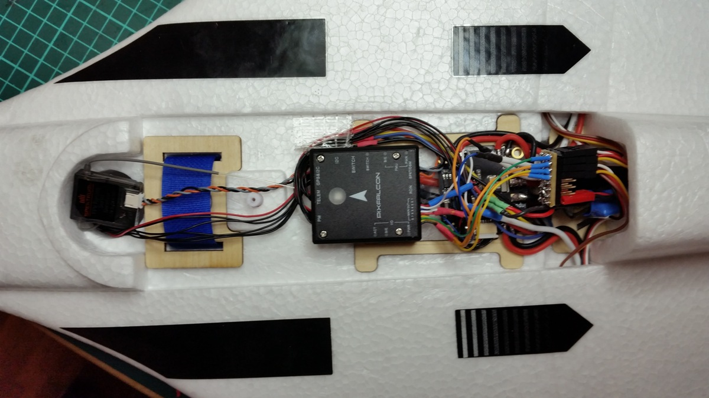
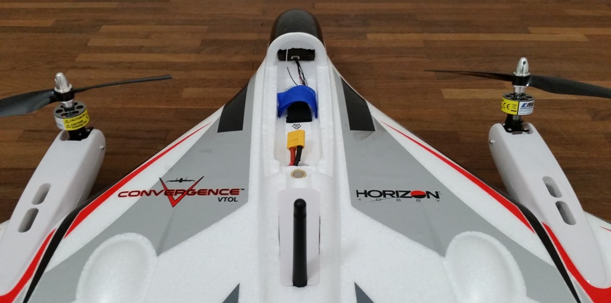

# E-flite Convergence Tiltrotor VTOL (Pixfalcon)

[E-Flite Convergence](https://youtu.be/HNedXQ_jhYo) легко можна перетворити на повністю автономний ВТОЛ з PX4. Тут не так багато місця, але цього вистачить для контролера політного пристрою [Pixfalcon](../flight_controller/pixfalcon.md) з GPS та телеметрією.

:::info Оригінальна рама *E-Flite Convergence* від Horizon Hobby та [Pixfalcon](../flight_controller/pixfalcon.md) були припинені. Альтернативи наведено в розділі [Придбання](#where-to-buy). :::

<lite-youtube videoid="E61P2f2WPNU" title="E-flite Convergence Autonomous Mission Flight"/>

## Де купити

Опції рами транспортного засобу:
- **WL Технологія XK X450** - [AliExpress](https://www.aliexpress.com/item/1005001946025611.html)
- **JJRC M02** - [Banggood (AU)](https://au.banggood.com/JJRC-M02-2_4G-6CH-450mm-Wingspan-EPO-Brushless-6-axis-Gyro-Aerobatic-RC-Airplane-RTF-3D-or-6G-Mode-Aircraft-p-1588201.html), [AliExpress](https://www.aliexpress.com/item/4001031497018.html)

Вибір контролера польоту ():
- [Pixhawk 4 Mini](../flight_controller/pixhawk4_mini.md)
- [Holybro Pixhawk Mini](../flight_controller/pixhawk_mini.md)
- Будь-який інший сумісний контролер польоту з достатньо малим форм-фактором.

## Встановлення обладнання

Транспортний засіб потребує 7 сигналів ШШД для моторів та поверхонь управління:
- Мотор (лівий/правий/задній)
- Сервоприводи нахилу (право/ліво)
- Elevons (вліво/вправо)

Ці можна підключити до виходів регулятора польоту більш-менш у будь-якому порядку (хоча виходи для двигунів повинні бути груповані разом і так далі).

Виводи налаштовані в [Конфігурації приводів](../config/actuators.md) шляхом виконання інструкцій для геометрії VTOL тілтротора та конфігурації виводу. Зверніть увагу, що вам потрібно буде почати з [Загального VTOL Tiltrotor](../airframes/airframe_reference.md#vtol_vtol_tiltrotor_generic_tiltrotor_vtol) фрейму.

Зверніть увагу, що ліворуч і праворуч на екрані конфігурації та посилання на раму визначені з точки зору людини-пілота всередині реального літака (або дивлячись зверху, як показано нижче):

### Політний контролер

Контролер польоту можна встановити там же, де був оригінальний автопілот.

### Телеметрійне радіо

Модуль телеметрії вставляється у відсік, призначений для розміщення механізму передачі FPV.

### GPS

Для GPS ми вирізали частину піни всередині «кабіни». Таким чином GPS може бути поміщений всередину корпусу і ретельно зберігається без порушення зовнішнього вигляду транспортного засобу.

## Налаштування PX4

Дотримуйтеся [Стандартної конфігурації](../config/index.md) в *QGroundControl* (радіо, датчики, режими польоту тощо).

Особливі налаштування, які є важливими для цього транспортного засобу:
- [Планер](../config/airframe.md)
  - Виберіть конфігурацію підфрейму **E-flite Convergence** під **VTOL Tiltrotor** та перезапустіть *QGroundControl*. 
- [Режими польоту / перемикачі](../config/flight_mode.md)
  - Оскільки це повітряне судно VTOL, вам потрібно [призначити перемикач RC-контролера](../config/flight_mode.md#what-flight-modes-and-switches-should-i-set) для переходу між режимами багатокоптера та фіксованого крила.
