# OMP Hobby ZMO FPV

OMP Hobby ZMO - це невеликий [апарат вертикального зльоту та посадки](../frames_vtol/tiltrotor.md), який доступний в наборі RTF. Цей посібник збірки показує, як додати політний контролер (використовуючи [Auterion Skynode evaluation kit](../companion_computer/auterion_skynode.md), [Pixhawk 6C](../flight_controller/pixhawk6c.md) або [Pixhawk 6C mini](../flight_controller/pixhawk6c_mini.md)) та налаштувати PX4.

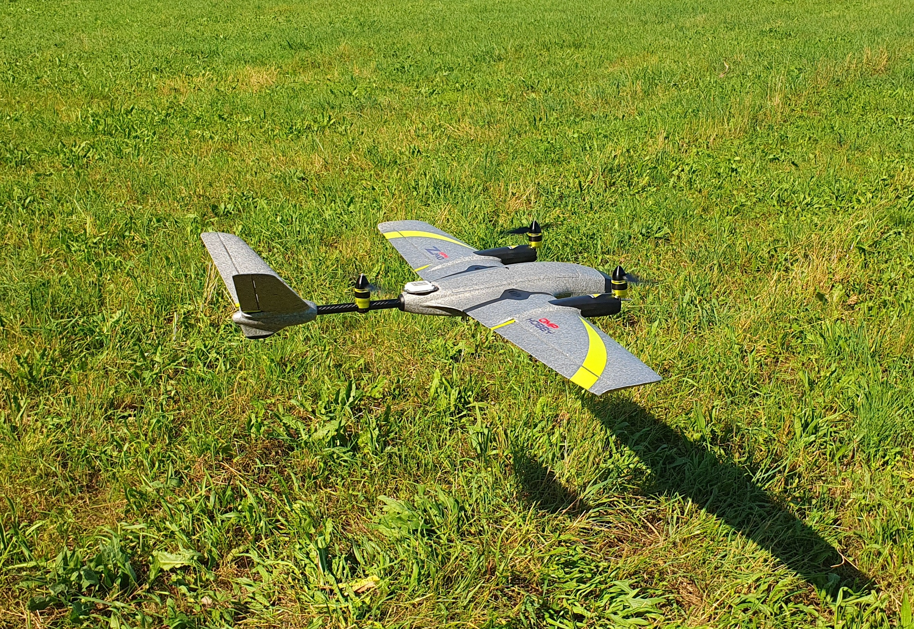

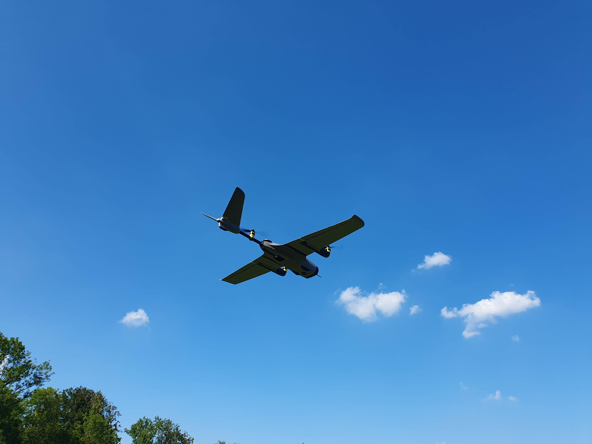

## Загальний огляд

Основні особливості конструкції фюзеляжу:

- Компактна і легка для транспортування
- Попередньо встановлені приводи
- Система швидкого від'єднання крил
- Кейс для транспортування у комплекті
- ~35 хвилинний час польоту (залежить від ваги зльоту)
- VTOL дозволяє літати в місцях, де не може літати дрон з фіксованим крилом
- Батарея та зарядний пристрій включені в комплект
- Легка загальна збірка
- Місце для монтажу FPV або екшн-камери спереду

Залежно від кінцевої злітної ваги час зависанні може бути обмежений (у фюзеляжі мало циркуляції повітря під час зависання транспортного засобу, тому ESC регулятори швидкості можуть перегрітися).

## Де купити

- [OMP-Hobby](https://www.omphobby.com/OMPHOBBY-ZMO-VTOL-FPV-Aircraft-With-DJI-Goggles-And-Remote-Controller-p3069854.html)
- [GetFPV](https://www.getfpv.com/omphobby-zmo-z3-vtol-fpv-1200mm-arf-plane-kit-no-fpv-system.html)
- [FoxtechFPV](https://www.foxtechfpv.com/zmo-pro-fpv-vtol.html)

## Політний контролер

Наступна конфігурація протестована:

- [Auterion Skynode evaluation kit](../companion_computer/auterion_skynode.md)
- [Pixhawk 6C](../flight_controller/pixhawk6c.md) з [PM02 V3](../power_module/holybro_pm02.md)
- [Pixhawk 6C mini](../flight_controller/pixhawk6c_mini.md) з [PM02 V3](../power_module/holybro_pm02.md)

Приблизний максимальний розмір FC становить: 50x110x22мм

## Додаткові аксесуари

- [GPS F9P (включено в Skynode оціночний набір)](../gps_compass/rtk_gps_holybro_h-rtk-f9p.md)
- [GPS M9N (дешевша альтернатива F9P)](../gps_compass/rtk_gps_holybro_h-rtk-m8p.md)
- [Датчик швидкості (включено в Skynode eval. kit)](https://www.dualrc.com/parts/airspeed-sensor-sdp33) — рекомендований для покращення безпеки та продуктивності
- [Датчик швидкості повітря (дешева альтернатива)](https://holybro.com/products/digital-air-speed-sensor?pr_prod_strat=use_description&pr_rec_id=236dfda00&pr_rec_pid=7150470561981&pr_ref_pid=7150472462525&pr_seq=uniform)
- [Lidar Lightware lw20-c (включено в Skynode eval. kit)](../sensor/sfxx_lidar.md) (необов'язково)
- [Lidar Seeed Studio PSK-CM8JL65-CC5 (дешевша альтернатива)](https://www.seeedstudio.com/PSK-CM8JL65-CC5-Infrared-Distance-Measuring-Sensor-p-4028.html) (необов'язково)
- [5V BEC](http://www.mateksys.com/?portfolio=bec12s-pro)
- [Система радіокерування (RC)](../getting_started/rc_transmitter_receiver.md), за вашим вибором
- [Подовжувач серво кабелю чоловічий 30 см 10 шт](https://www.getfpv.com/male-to-male-servo-extension-cable-twisted-22awg-jr-style-5-pcs.html)
- [USB-C подовжувальний кабель](https://www.digitec.ch/en/s1/product/powerguard-usb-c-usb-c-025-m-usb-cables-22529949?dbq=1&gclid=Cj0KCQjw2cWgBhDYARIsALggUhrh-z-7DSU0wKfLBVa8filkXLQaxUpi7pC0ffQyRzLng8Ph01h2R1gaAp0mEALw_wcB&gclsrc=aw.ds)
- [Стрічка 3M VHB](https://www.amazon.in/3M-VHB-Tape-4910-Length/dp/B00GTABM3Y)
- [Кріплення, надруковані на 3D-принтері](https://github.com/PX4/PX4-user_guide/raw/main/assets/airframes/vtol/omp_hobby_zmo_fpv/omp_hobby_zmo_3d_prints.zip)
  - 2x кріплення для роз’єму крила
  - 1x кріплення датчика швидкості
  - 1x GPS-кріплення
  - 1x кріплення лідару
  - 1x кріплення Skynode
- [USB-камера (включено в Skynode dev kit)](https://www.amazon.com/ELP-megapixel-surveillance-machine-monitor/dp/B015FIKTZC)
- Гвинти, вставки, термоусадка та ін.

## Інструменти

Наступні інструменти використовувалися у цій збірці.

- Набір шестигранних викруток
- Набір гаєчних ключів
- Паяльна станція
- Клей: гарячий клей, епоксидна смола 5 хв
- Скотч
- Двосторонній скотч 3M ([3M VHB скотч](https://www.amazon.in/3M-VHB-Tape-4910-Length/dp/B00GTABM3Y))
- Наждачний папір
- 3D-принтер

## Інтеграція апаратних засобів

### Підготовка

Вийміть оригінальний контролер польоту, ESC регулятор швидкості та кабелі з'єднання крила. Також зніміть пропелери. Це допоможе вам з управлінням транспортного засобу і зменшить ризик отримання травми внаслідок ненавмисного запуску двигуна.

ZMO FPV в його початковому стані.

Контролер польоту та з'єднувачі крила знято з транспортного засобу.

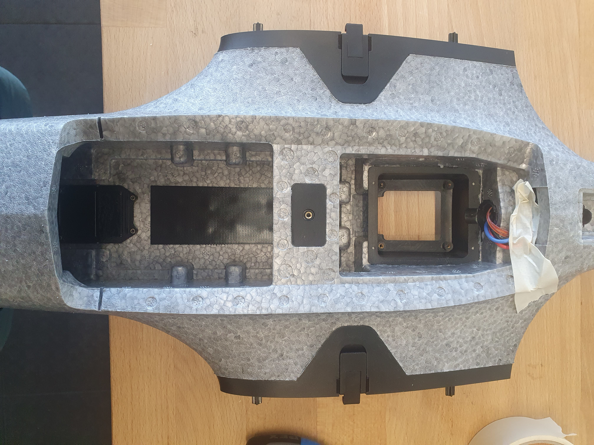

### ESC регулятори швидкості

1. Відпаяйте сигнальні контакти PWM та контакти заземлення ESC регулятора швидкості та припаяйте до контактів подовжувач сервоприводу. Кабель повинен бути достатньо довгим, щоб підключити дріт до контактів FMU плати керування польотом.
1. Розпаяйте 3 роз’єми «банан» заднього двигуна (може не знадобитися для інтеграції Pixhawk 6).
1. Прикрутіть ESC регулятор швидкості назад на місце 4 гвинтами M2.5 x 12.
1. Укоротіть дроти заднього двигуна та припаяйте їх на місце, як показано на малюнку.
1. Припаяйте сигнальні та GND-дроти до входу PWM ESC регулятора швидкості.

   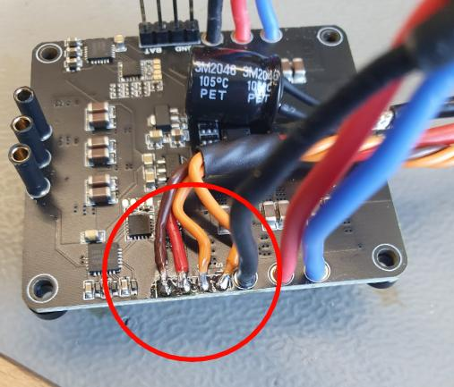

1. Зніміть гніздову вилку на ESC. Це надасть вам більше місця для встановлення польотного контролера.

   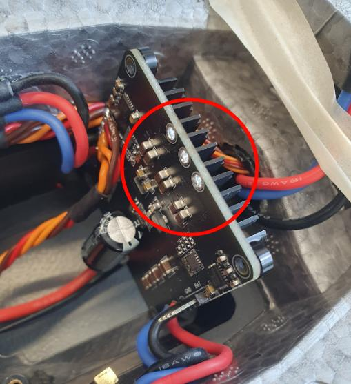

1. Припаяйте проводи заднього двигуна до ESC регулятора швидкості. Переконайтеся, що підключаєте так, щоб двигун обертався у правильному напрямку.

   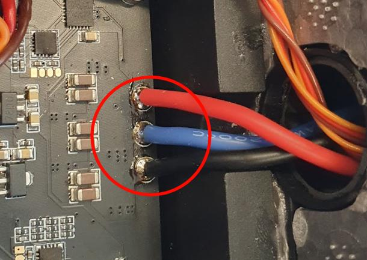

### З'єднувач крила

Для безпосереднього підключення крилового з'єднувача при кріпленні крила потрібні деякі виготовлені на 3D-принтері кріплення, щоб відцентрувати з'єднувач. Цей крок не обов'язковий, але значно полегшує обробку, і вам потрібно буде робити на крок менше, коли будете встановлювати літак у полі.

1. Приклейте з'єднувачі крила до деталі, надрукованої на 3D-принтері, гарячим клеєм або 5 хвилинною епоксидною смолою.
1. Приклейте 3D-друковану частину разом із з'єднувачем у фюзеляж. Переконайтеся, що правильно вирівняли з'єднувач, поки клей сохне.

   Найпростіший спосіб вирівняти роз'єм - встановити крило, поки клей застигає, але переконайтеся, що клей не потрапив між фюзеляжем і крилом, інакше крило може застрягти.

Роз'єм, вклеєний у 3D-друковану частину

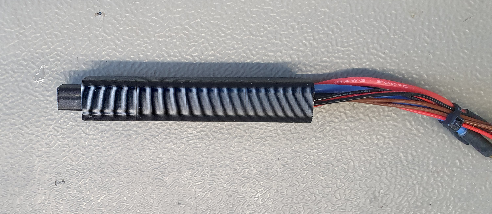

Роз'єм, вклеєний у фюзеляж. Не забудьте належним чином вирівняти конектор.

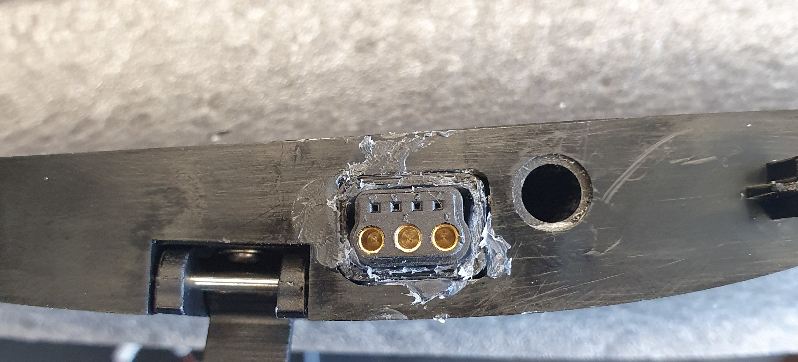

### Плати адаптерів Pixhawk та BEC

1. Виріжте пінопласт, як показано на малюнках, щоб створити простір для кріплення адаптерних плат Pixhawk і BEC двостороннім скотчем. Плата FMU розміщується зліва (у напрямку польоту) від фюзеляжу. Зпаяйте серво конектор та кабель для напруги батареї до BEC.

   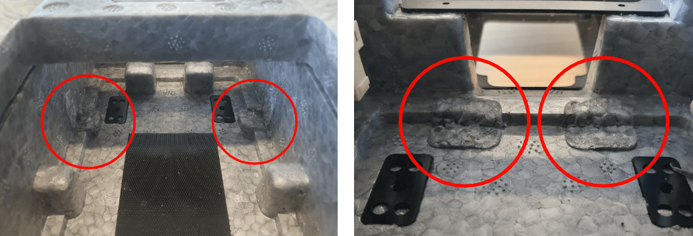 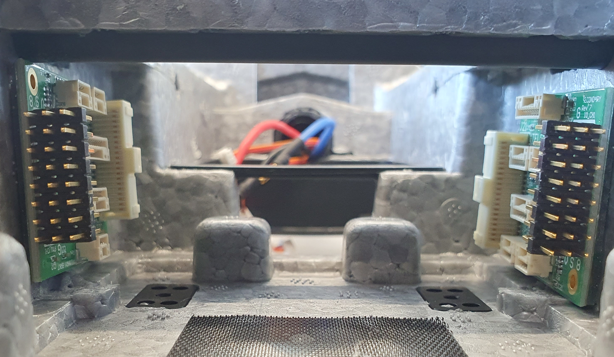

1. Підготуйте BEC для підключення до IO плати та батареї. BEC також можна припаяти безпосередньо до акумуляторних колодок ESC.

   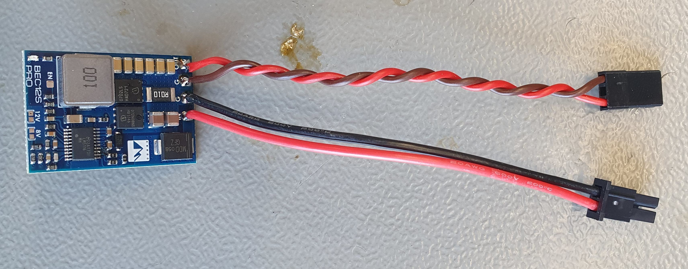

1. Закріпіть BEC двостороннім скотчем.

   

### Кабелі

1. Відріжте роз’єми від сервоприводів і припаяйте подовжувачі сервоприводів до кабелів. Переконайтеся, що кабелі достатньо довгі, щоб дістатися до адаптерної плати Pixhawk. Якщо у вас є обтискний інструмент, ви також можете безпосередньо додати роз’єми без пайки.

1. Під'єднайте кабелі сервоприводу до IO плати адаптера в такому порядку:

   - 1 - Aileron left
   - 2 - Aileron right
   - 3 - V-Tail left
   - 4 - V-Tail right
   - 5 - Tilt left
   - 6 - Tilt right

1. Під'єднайте сигнальні кабелі мотора до адаптерної плати FMU у такому порядку:

   - 1 - Передній лівий
   - 2 - Передній правий
   - 3 - Задній

### Датчики

#### Трубка Піто

1. Спочатку перевірте, чи трубка Піто влазить у кріплення, надруковане на 3D-принтері. Якщо це так, то приклейте трубку Піто на місце у кріплення.

   Щоб вирівняти трубку пропустіть її через другий отвір праворуч від передньої пластини FPV. Кріплення дозволить вам вдавити трубку назад у фюзеляж, щоб захистити її під час транспортування та обробки. Датчик може бути встановлений зверху на кріпленні, надрукованому на 3D-принтері, за допомогою двостороннього скотчу.

1. Приклейте кріплення, надруковане на 3D-принтері, на місце.

   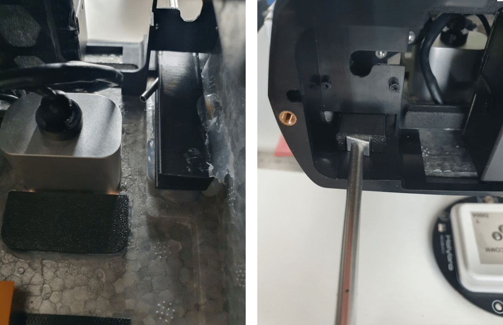

1. Датчик може бути встановлений зверху на кріпленні, надрукованому на 3D-принтері.

   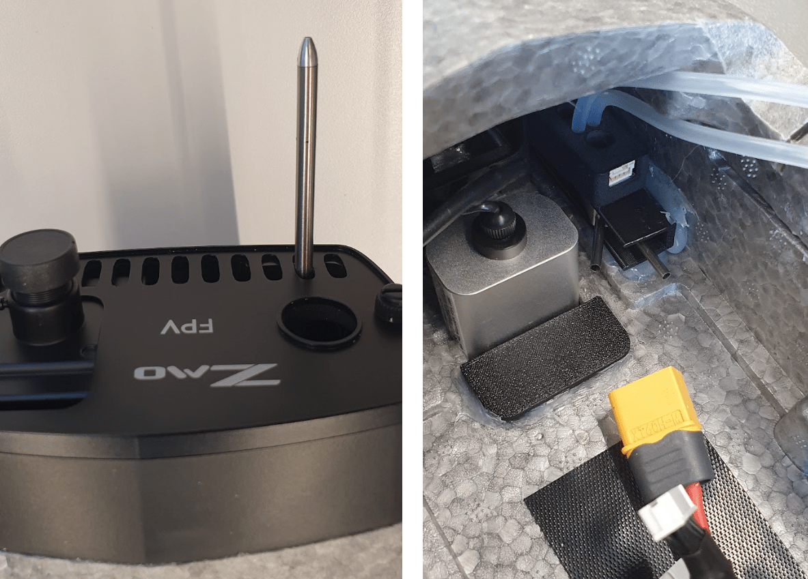

#### Лідар

За потреби лідар можна встановити спереду фюзеляжу.

Щоб встановити Лідар:

1. Зніміть радіатор
1. Приклейте лідар + надруковане на 3D-принтері кріплення для лідара на місце.

#### GPS/компас

Щоб встановити GPS:

1. З’єднайте дві надруковані на 3D-принтері частини трьома гвинтами M3x10.
1. Вийміть GPS із пластикового корпусу та від’єднайте роз’єм.
1. Протягніть кабель через вуглецевий лонжерон.
1. Приклейте 3D-друковану частину епоксидною смолою на 5 хвилин. 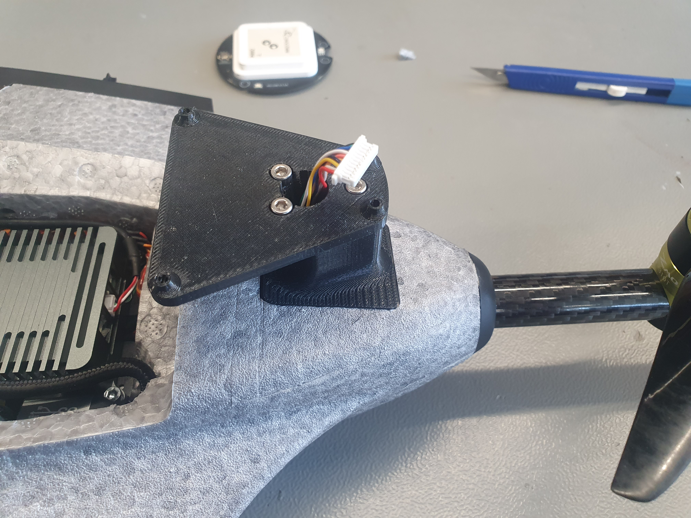
1. Після застигання клею прикрутіть GPS 4x гвинтами M2,5x10 до пластини. 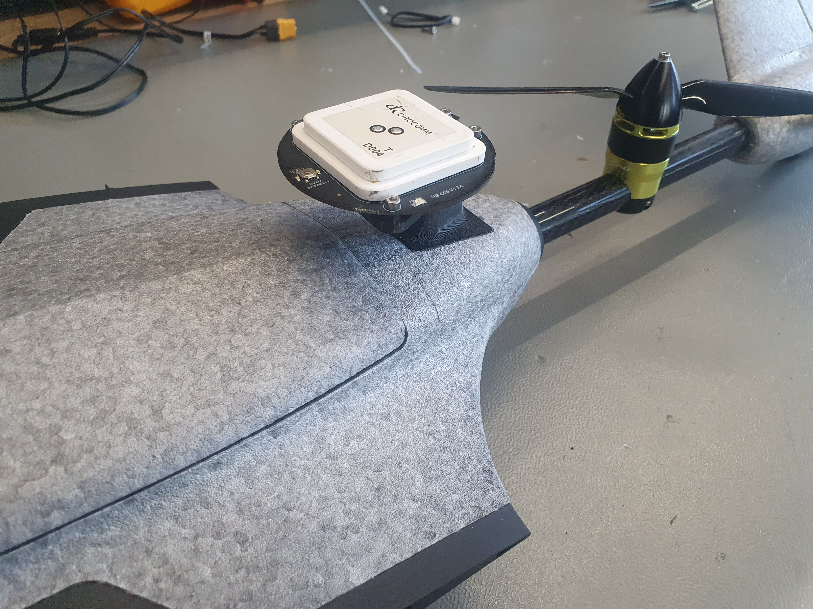

#### USB Камера

1. Обріжте USB-кабель камери так, щоб його довжина становила 15 см.
1. Відріжте кабель USB-адаптера на 25 см і спаяйте два кабелі між собою.
1. Для встановлення камери потрібно вирізати отвір у пінопласті перегородки.

   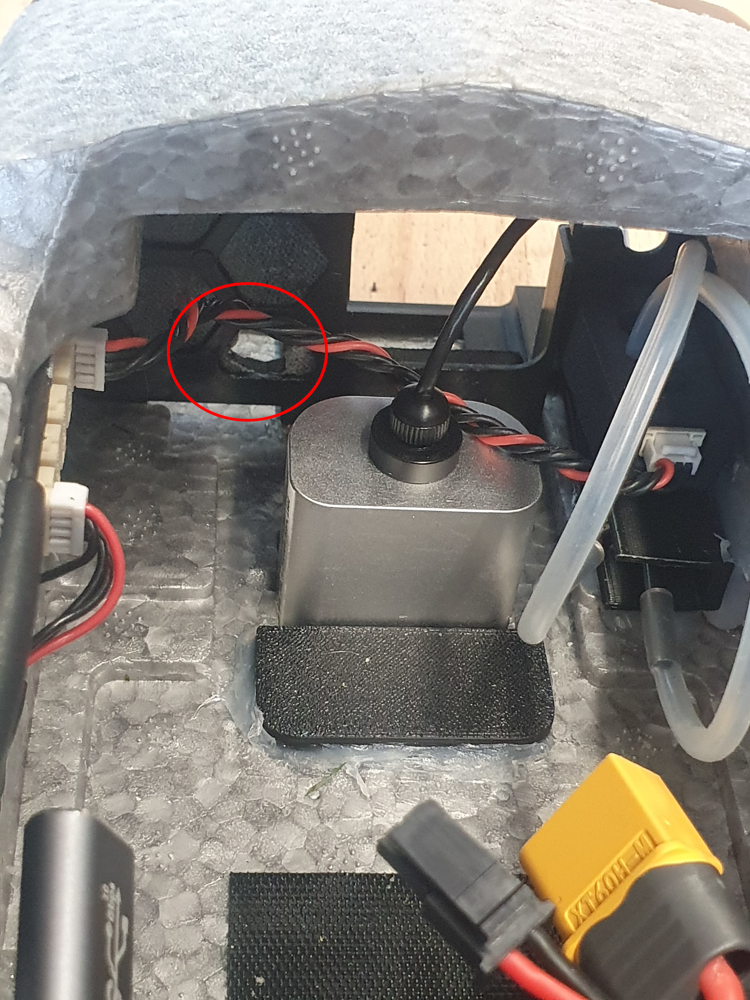

   Потім ви можете закріпити камеру на перегородці за допомогою двостороннього скотча.

### Політний контролер

Польотний контролер може бути встановлений над ESC.

#### Pixhawk 6c/6c mini

Якщо використовується Pixhawk 6c або 6c mini, просто приклейте контролер польоту двостороннім скотчем на місце.

#### Skynode

Якщо використовується Skynode:

1. Помістіть його на верхню частину ESC і позначте 2 задніх місця кріплення на литій пластиковій частині ZMO.
1. Зніміть Skynode з транспортного засобу та просвердліть 2 отвори свердлом 2,8 мм у пластиковій частині. 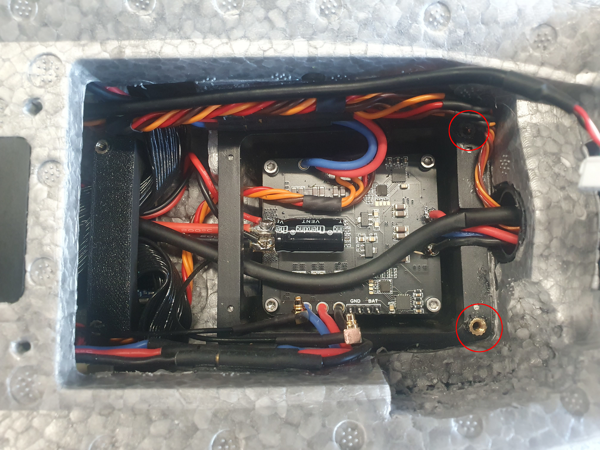
1. Встановіть Skynode на місце і прикрутіть його 2-ма гвинтами M3x10.

Інший варіант - додати в отвори різьбові вставки. Оскільки литі під тиском частини ZMO дуже тонкі, їх потрібно склеїти на місці.

1. Прикрутіть переднє кріплення Skynode 2-ма гвинтами M3x10 до Skynode.
1. Потім додайте трохи епоксидного клею на 5 хвилин в нижню частину кріплення і покладіть вантаж зверху на Skynode, поки клей не затвердіє. Щоб отримати доступ до 2 кріпильних гвинтів спереду, проткніть 2 отвори зверху через пінопласт.

   

### Антени та RC приймач

:::info

Якщо встановлено Skynode, LTE можна використовувати для телеметрії та відеозв'язку. Якщо використовується Pixhawk, потрібне інше [телеметричне сполучення](../telemetry/index.md). Недорогим прикладом може бути телеметричне радіо [SiK Telemetry Radio](../telemetry/sik_radio.md).
:::

1. Одна антена LTE може бути встановлена в нижній частині транспортного засобу. Для цього ви можете протягнути дріт антени через отвір для радіатора ESC.

   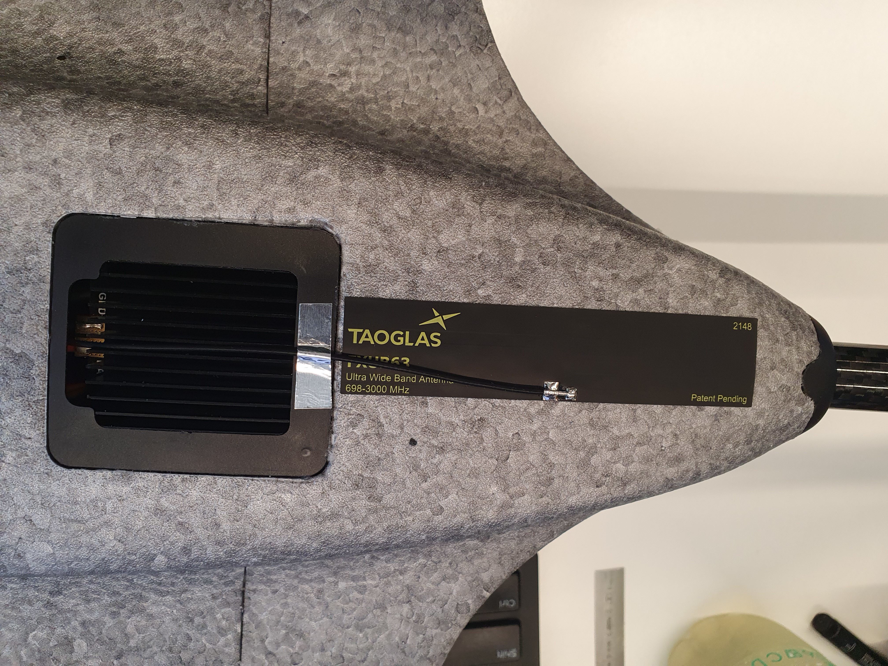

1. Другу антену можна встановити всередині транспортного засобу з лівого боку акумуляторного відсіку. Пульт дистанційного керування також можна розмістити з лівого боку батарейного відсіку.

   

## Налаштування програмного забезпечення

### Вибір планера

1. Відкрийте QGC, виберіть іконку **Q**, а потім виберіть **Vehicle Setup**.
1. Виберіть вкладку [Airframe](../config/airframe.md)

1. Виберіть [Generic Tiltrotor VTOL](../airframes/airframe_reference.md#vtol_vtol_tiltrotor_generic_tiltrotor_vtol) з групи _VTOL Tiltrotor_, а потім натисніть **Apply and Restart**.

### Завантажте файл параметрів

Далі ми завантажуємо файл [параметрів](https://github.com/PX4/PX4-user_guide/raw/main/assets/airframes/vtol/omp_hobby_zmo_fpv/omp_hobby_zmo.params), який містить параметри, що визначають геометрію рами, відображення виводу та значення налаштувань - тож вам не доведеться цього робити! Якщо ви дотримувалися інструкцій з підключення двигунів, вам, ймовірно, не знадобиться багато додаткових налаштувань, окрім калібрування датчиків і фіксації кріплень.

Щоб завантажити файл:

1. Завантажте [файл параметрів](https://github.com/PX4/PX4-user_guide/raw/main/assets/airframes/vtol/omp_hobby_zmo_fpv/omp_hobby_zmo.params).
1. Виберіть вкладку [Parameters](../advanced_config/parameters.md#finding-updating-parameters), а потім натисніть на **Tools** у верхньому правому куті.
1. Виберіть **Load from file**, а потім виберіть файл `omp_hobby_zmo.params`, який ви щойно завантажили.
1. Перезапустіть транспортний засіб.

### Вибір сенсора

Датчик швидкості повітря можна увімкнути на вкладці [Parameters](../advanced_config/parameters.md#finding-updating-parameters).

- Якщо використовується [рекомендований датчик швидкості повітря (SDP33)](https://www.dualrc.com/parts/airspeed-sensor-sdp33), потрібно увімкнути `SENS_EN_SDP3X`.
- Якщо [Lidar Lightware lw20-c (входить до складу Skynode eval. kit)](../sensor/sfxx_lidar.md) використовується, `SENS_EN_SF1XX` потрібно встановити на 6 (SF/LW/20c).

### Калібрування сенсорів

Спочатку переконайтеся, що ви встановили [правильну орієнтацію контролера польоту](../config/flight_controller_orientation.md). Це має бути значення за замовчуванням (`ROTATION_NONE`).

Потім відкалібруйте основні датчики:

- [Компас](../config/compass.md)
- [Гіроскоп](../config/gyroscope.md)
- [Акселерометр](../config/accelerometer.md)
- [Airspeed](../config/airspeed.md)

### RC-налаштування

[Відкалібруйте ваш пульт дистанційного керування](../config/radio.md) та налаштуйте перемикачі [режиму польоту](../config/flight_mode.md).

Ми рекомендуємо призначити RC-перемикачі для набору режимів, визначених у розділі [Конфігурація режимів польоту > Які режими польоту та перемикачі мені слід встановити?](../config/flight_mode.md#what-flight-modes-and-switches-should-i-set). Зокрема, вам слід призначити _перехідний перемикач VTOL_, _перемикач вимкнення_, а також перемикач для вибору [стабілізованого режиму](../flight_modes_fw/stabilized.md) та [позиційного режиму](../flight_modes_fw/position.md).

### Налаштування приводу

:::warning

Переконайтеся, що пропелери зняті! Двигуни легко випадково запустити на вкладці приводів.
:::

Двигуни, поверхні керування та інші приводи конфігуруються в QGroundControl [Actuator Configuration & Testing](../config/actuators.md).

Завантажений раніше файл [параметрів](#load-parameters-file) означає, що цей екран вже має бути правильно налаштований: вам потрібно лише відрегулювати налаштування для вашого транспортного засобу. Якщо двигуни/сервоприводи були підключені до інших виходів, ніж запропоновано, вам потрібно буде змінити відповідність між виходами та функціями в розділі «Виходи приводів».

#### Сервоприводи кута нахилу

1. Переведіть апарат у ручний режим (або за допомогою перемикача режиму польоту, або введіть `commander mode manual` в командній строчці MAVLink).
1. Перевірте, чи двигуни спрямовані вгору. Якщо двигуни спрямовані вперед, то пов'язані з ними сервоприводи нахилу потрібно змінити на протилежні (встановіть прапорець біля кожного сервоприводу).

   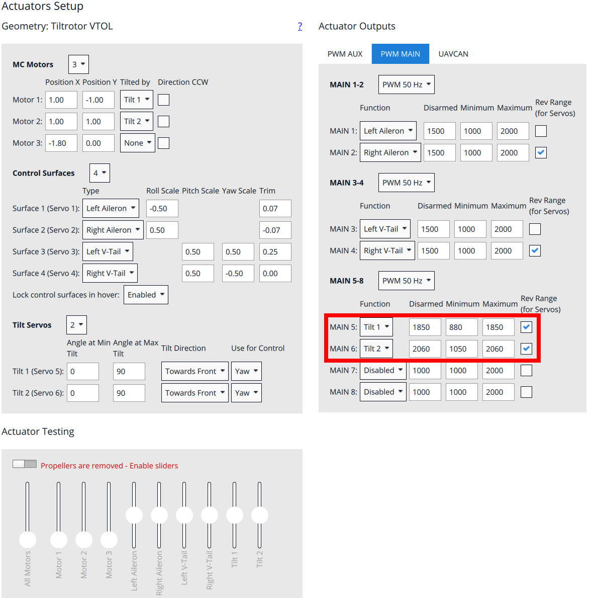

1. Налаштуйте мінімальне або максимальне значення, на яке сервопривід спрямовується вертикально вгору.
1. Потім введіть `commander transition` у командній оболонці MAVLink, щоб відрегулювати горизонтальне положення.

#### Керуючі поверхні

Перевірте, чи потрібно реверсувати приводи за допомогою пульта дистанційного керування:

- Перемістіть стік вправо. Правий елерон повинен піднятися вгору, лівий елерон повинен опуститися вниз.
- Нахили стік назад (політ вверх). Обидві поверхні V-подібного хвоста повинні піднятися.
- Упріть стік вправо. Обидві площини повинні зміститися вправо

Тепер відкоригуйте значення газу так, щоб всі поверхні були в нейтральному положенні.

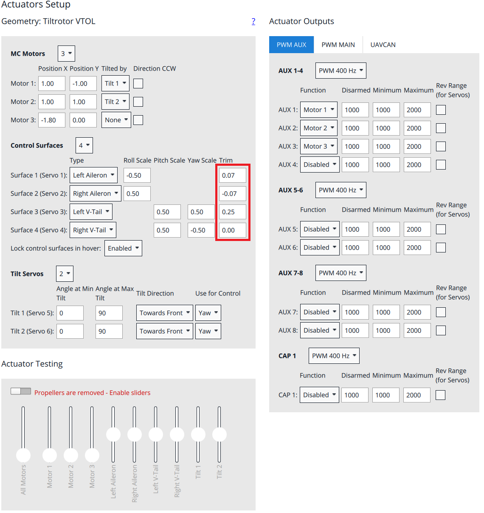

#### Напрямок та орієнтація моторів

Переконайтеся, що пропелери зняті!!

- `Motor 1`: Передній лівий двигун повинен обертатися за годинниковою стрілкою
- `Motor 2`: Передній правий двигун повинен обертатися проти годинникової стрілки
- `Motor 3`: Задній двигун повинен обертатися проти годинникової стрілки

Якщо двигун обертається в неправильному напрямку, необхідно поміняти місцями два з трьох дротів двигуна. Напрямок не може бути змінено програмно, оскільки апарат не використовує [DShot ESC](../peripherals/dshot.md).

## Перший політ

- Перевірте реакцію ротора на нахил у режимі [Стабілізація](../flight_modes_fw/stabilized.md). Keep the throttle stick at the minimum and place the vehicle at the ground. To enable the tilt servos you need to arm the vehicle.
  - Yaw the vehicle to the right (nose to the right) -> left motor should tilt down
  - Yaw the vehicle to the left (nose to the left) -> right motor should tilt down
- Mount the propellers.
- Check center of gravity (GG). Switch the vehicle into forward flight mode. To check the CG lift the vehicle with two fingers up at the markings underneath the wing. The vehicle should balance horizontally. If the vehicle tips to either the tail or to the nose then you need to move the battery into the opposite direction. If you are not able to balance the vehicle with this method you will need to reposition some components or add weight to balance the vehicle.
- Check actuator orientations and neutral trim
- Check control surface reactions in [Stabilized mode](../flight_modes_fw/stabilized.md). Switch the vehicle into forward flight mode.
  - Roll the vehicle to the right. The right aileron should go down. The left aileron should go up.
  - Pitch the vehicle up (nose up). Both elevons should go down.
  - Yaw the vehicle to the right (nose to the right). Both elevons should go to the left.
- If a [kill-switch](../config/safety.md#kill-switch) is used, make sure it's working properly and will not be activated accidentally in flight!
- Arm in [Stabilized mode](../flight_modes_fw/stabilized.md) and check if motors respond to the commands, e.g. roll left increases throttle on the right motor
- Takeoff in [Stabilized mode](../flight_modes_fw/stabilized.md) and make some basic maneuvers
- If everything went without any issue, takeoff in [Position mode](../flight_modes_fw/position.md) and do a transition at around 50m. If something goes wrong switch back to multicopter mode as fast as possible (using the transition switch).
