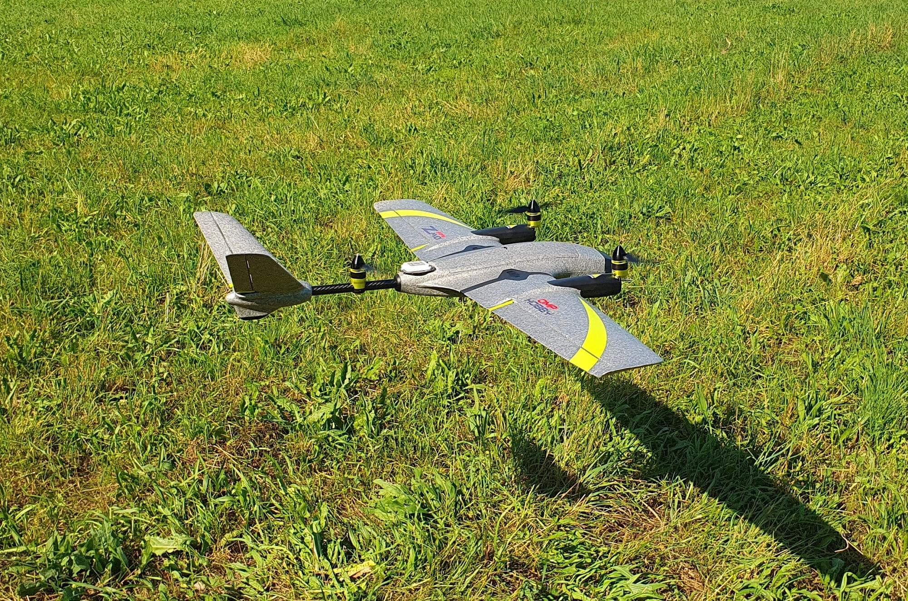
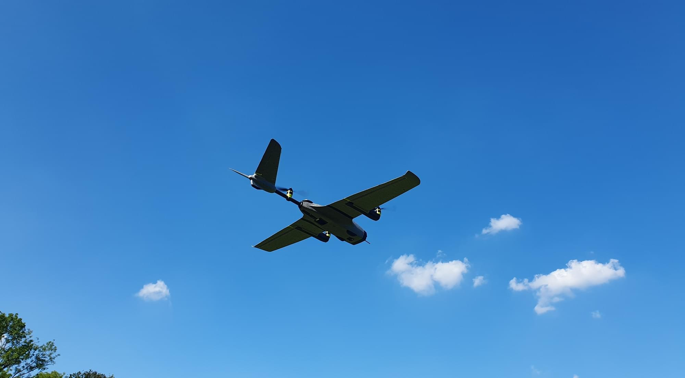
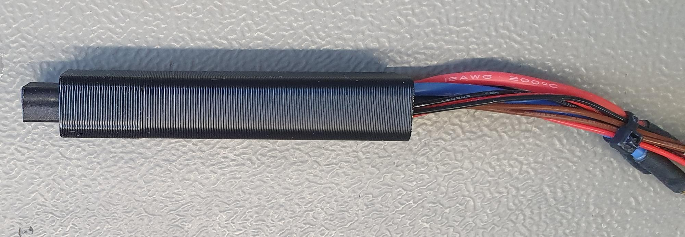
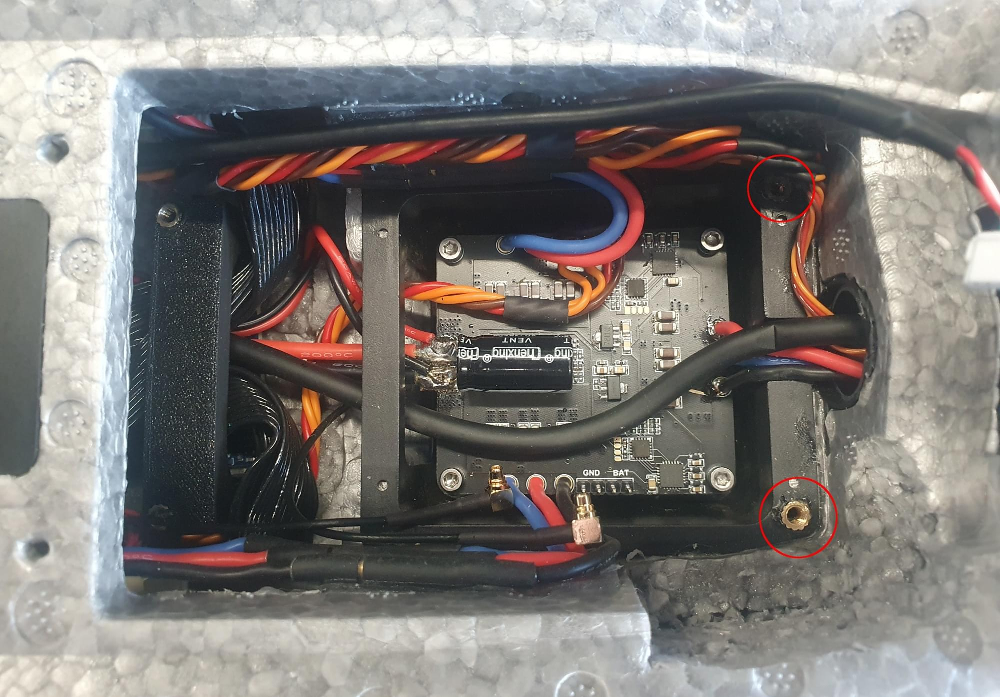

# OMP Hobby ZMO FPV

OMP Hobby ZMO - це невеликий [апарат вертикального зльоту та посадки](../frames_vtol/tiltrotor.md), який доступний в наборі RTF. Цей посібник збірки показує, як додати політний контролер (використовуючи [Auterion Skynode evaluation kit](../companion_computer/auterion_skynode.md), [Pixhawk 6C](../flight_controller/pixhawk6c.md) або [Pixhawk 6C mini](../flight_controller/pixhawk6c_mini.md)) та налаштувати PX4.

## Загальний огляд

Основні особливості конструкції фюзеляжу:

- Компактна і легка для транспортування
- Попередньо встановлені приводи
- Система швидкого від'єднання крил
- Кейс для транспортування у комплекті
- ~35 хвилинний час польоту (залежить від ваги зльоту)
- VTOL дозволяє літати в місцях, де не може літати дрон з фіксованим крилом
- Батарея та зарядний пристрій включені в комплект
- Легка загальна збірка
- Місце для монтажу FPV або екшн-камери спереду

Залежно від кінцевої злітної ваги час зависанні може бути обмежений (у фюзеляжі мало циркуляції повітря під час зависання транспортного засобу, тому ESC регулятори швидкості можуть перегрітися).

## Де купити

- [OMP-Hobby](https://www.omphobby.com/OMPHOBBY-ZMO-VTOL-FPV-Aircraft-With-DJI-Goggles-And-Remote-Controller-p3069854.html)
- [GetFPV](https://www.getfpv.com/omphobby-zmo-z3-vtol-fpv-1200mm-arf-plane-kit-no-fpv-system.html)
- [FoxtechFPV](https://www.foxtechfpv.com/zmo-pro-fpv-vtol.html)

## Політний контролер

Наступна конфігурація протестована:

- [Auterion Skynode evaluation kit](../companion_computer/auterion_skynode.md)
- [Pixhawk 6C](../flight_controller/pixhawk6c.md) з [PM02 V3](../power_module/holybro_pm02.md)
- [Pixhawk 6C mini](../flight_controller/pixhawk6c_mini.md) з [PM02 V3](../power_module/holybro_pm02.md)

Приблизний максимальний розмір FC становить: 50x110x22мм

## Додаткові аксесуари

- [GPS F9P (включено в Skynode оціночний набір)](../gps_compass/rtk_gps_holybro_h-rtk-f9p.md)
- [GPS M9N (дешевша альтернатива F9P)](../gps_compass/rtk_gps_holybro_h-rtk-m8p.md)
- [Датчик швидкості (включено в Skynode eval. kit)](https://www.dualrc.com/parts/airspeed-sensor-sdp33) — рекомендований для покращення безпеки та продуктивності
- [Датчик швидкості повітря (дешева альтернатива)](https://holybro.com/products/digital-air-speed-sensor?pr_prod_strat=use_description&pr_rec_id=236dfda00&pr_rec_pid=7150470561981&pr_ref_pid=7150472462525&pr_seq=uniform)
- [Lidar Lightware lw20-c (включено в Skynode eval. kit)](../sensor/sfxx_lidar.md) (необов'язково)
- [Lidar Seeed Studio PSK-CM8JL65-CC5 (дешевша альтернатива)](https://www.seeedstudio.com/PSK-CM8JL65-CC5-Infrared-Distance-Measuring-Sensor-p-4028.html) (необов'язково)
- [5V BEC](http://www.mateksys.com/?portfolio=bec12s-pro)
- [Система радіокерування (RC)](../getting_started/rc_transmitter_receiver.md), за вашим вибором
- [Подовжувач серво кабелю чоловічий 30 см 10 шт](https://www.getfpv.com/male-to-male-servo-extension-cable-twisted-22awg-jr-style-5-pcs.html)
- [USB-C подовжувальний кабель](https://www.digitec.ch/en/s1/product/powerguard-usb-c-usb-c-025-m-usb-cables-22529949?dbq=1&gclid=Cj0KCQjw2cWgBhDYARIsALggUhrh-z-7DSU0wKfLBVa8filkXLQaxUpi7pC0ffQyRzLng8Ph01h2R1gaAp0mEALw_wcB&gclsrc=aw.ds)
- [Стрічка 3M VHB](https://www.amazon.in/3M-VHB-Tape-4910-Length/dp/B00GTABM3Y)
- [Кріплення, надруковані на 3D-принтері](https://github.com/PX4/PX4-user_guide/raw/main/assets/airframes/vtol/omp_hobby_zmo_fpv/omp_hobby_zmo_3d_prints.zip)
  - 2x кріплення для роз’єму крила
  - 1x кріплення датчика швидкості
  - 1x GPS-кріплення
  - 1x кріплення лідару
  - 1x кріплення Skynode
- [USB-камера (включено в Skynode dev kit)](https://www.amazon.com/ELP-megapixel-surveillance-machine-monitor/dp/B015FIKTZC)
- Гвинти, вставки, термоусадка та ін.

## Інструменти

Наступні інструменти використовувалися у цій збірці.

- Набір шестигранних викруток
- Набір гаєчних ключів
- Паяльна станція
- Клей: гарячий клей, епоксидна смола 5 хв
- Скотч
- Двосторонній скотч 3M ([3M VHB скотч](https://www.amazon.in/3M-VHB-Tape-4910-Length/dp/B00GTABM3Y))
- Наждачний папір
- 3D-принтер

## Інтеграція апаратних засобів

### Підготовка

Вийміть оригінальний контролер польоту, ESC регулятор швидкості та кабелі з'єднання крила. Також зніміть пропелери. Це допоможе вам з управлінням транспортного засобу і зменшить ризик отримання травми внаслідок ненавмисного запуску двигуна.

ZMO FPV в його початковому стані.

Контролер польоту та з'єднувачі крила знято з транспортного засобу.

### ESC регулятори швидкості

1. Відпаяйте сигнальні контакти PWM та контакти заземлення ESC регулятора швидкості та припаяйте до контактів подовжувач сервоприводу. Кабель повинен бути достатньо довгим, щоб підключити дріт до контактів FMU плати керування польотом.
1. Розпаяйте 3 роз’єми «банан» заднього двигуна (може не знадобитися для інтеграції Pixhawk 6).
1. Прикрутіть ESC регулятор швидкості назад на місце 4 гвинтами M2.5 x 12.
1. Укоротіть дроти заднього двигуна та припаяйте їх на місце, як показано на малюнку.
1. Припаяйте сигнальні та GND-дроти до входу PWM ESC регулятора швидкості.

   

1. Зніміть гніздову вилку на ESC. Це надасть вам більше місця для встановлення польотного контролера.

   

1. Припаяйте проводи заднього двигуна до ESC регулятора швидкості. Переконайтеся, що підключаєте так, щоб двигун обертався у правильному напрямку.

   

### З'єднувач крила

Для безпосереднього підключення крилового з'єднувача при кріпленні крила потрібні деякі виготовлені на 3D-принтері кріплення, щоб відцентрувати з'єднувач. Цей крок не обов'язковий, але значно полегшує обробку, і вам потрібно буде робити на крок менше, коли будете встановлювати літак у полі.

1. Приклейте з'єднувачі крила до деталі, надрукованої на 3D-принтері, гарячим клеєм або 5 хвилинною епоксидною смолою.
1. Приклейте 3D-друковану частину разом із з'єднувачем у фюзеляж. Переконайтеся, що правильно вирівняли з'єднувач, поки клей сохне.

   The easiest way to align the connector is to mount the wing while the glue is curing, but make sure that no glue is between the fuselage and the wing, otherwise the wing might get stuck.

The connector glued into the 3D-Printed part

The connector glued into the fuselage. Make sure to properly align the connector.

### Pixhawk Adapter Boards and BEC

1. Cut the foam as shown in the pictures to create space to mount the Pixhawk adapter boards and BEC with double sided tape. The FMU board is placed on the left side (in flight direction) of the fuselage. Solder a servo connector and a cable for the battery voltage to the BEC.

    

1. Prepare the BEC to connect to the IO board and to the battery. The BEC can also be soldered directly to the battery pads of the ESC.

   

1. Mount the BEC with double sided tape.

   

### Кабелі

1. Cut the connectors off the servos and solder the servo extension cables to the cables. Make sure that the cables are long enough to reach the Pixhawk adapter board. If you own a crimp tool, then you can also directly add the connectors without soldering.

1. Plug the servo cables into the adapter IO board in the following order:

   - 1 - Aileron left
   - 2 - Aileron right
   - 3 - V-Tail left
   - 4 - V-Tail right
   - 5 - Tilt left
   - 6 - Tilt right

1. Plug in the motor signal cables into the FMU adapter board in the following order:

   - 1 - Front left
   - 2 - Front right
   - 3 - Rear

### Sensors

#### Трубка Піто

1. Спочатку перевірте, чи трубка Піто влазить у кріплення, надруковане на 3D-принтері. Якщо це так, то приклейте трубку Піто на місце у кріплення.

   Щоб вирівняти трубку пропустіть її через другий отвір праворуч від передньої пластини FPV. Кріплення дозволить вам вдавити трубку назад у фюзеляж, щоб захистити її під час транспортування та обробки. Датчик може бути встановлений зверху на кріпленні, надрукованому на 3D-принтері, за допомогою двостороннього скотчу.

1. Приклейте кріплення, надруковане на 3D-принтері, на місце.

   

1. Датчик може бути встановлений зверху на кріпленні, надрукованому на 3D-принтері.

   

#### Lidar

If needed a lidar can be installed in the front of the fuselage.

To install the Lidar:

1. Remove the heat sink
1. Glue the lidar + 3D-Printed lidar mount into place.

#### GPS/Compass

To mount the GPS:

1. Screw the two 3D-Printed parts with 3x M3x10 screws together.
1. Take the GPS out of the plastic case and unplug the connector.
1. Feed the cable through the carbon spar.
1. Glue the 3D-Printed part with 5 min epoxy in place. 
1. After the glue has cured, screw the GPS with 4x M2.5x10 screws to the plate. 

#### USB Camera

1. Cut the USB cable of the camera so that the length is 15 cm.
1. Cut the USB-Adapter cable to be 25 cm and solder the two cables together.
1. To install the camera you need to cut a hole into the foam of the wall.

   

   Then you can mount the camera with double sided tape to the wall.

### Flight Controller

The Flight Controller can be installed above the ESC.

#### Pixhawk 6c/6c mini

If a Pixhawk 6c or 6c mini is used, simply stick the flight controller with double sided tape into place.

#### Skynode

If a Skynode is used:

1. Place it at the on top of the ESCs and mark the 2 rear mounting locations on the injection molded plastic part of the ZMO.
1. Remove the Skynode from the vehicle and drill 2 holes with a 2.8 mm drill bit into the plastic part. 
1. Put the Skynode back into place and screw it down with 2x M3x10 screws.

Another option is to add some threaded inserts into the holes. Since the injection molded part of the ZMO is very thin, they need to be glued in place.

1. Screw the front Skynode mount with 2x M3x10 screws at the Skynode.
1. Then add some 5 min epoxy at the bottom of the mount and put a weight on top of the Skynode until the glue is cured. To access the 2 mounting screws at the front, poke 2 holes from the top through the foam.

   

### Antennas and RC Receiver

:::info

If a Skynode is installed the LTE can be used as telemetry and video link. If a Pixhawk is used a different [telemetry link](../telemetry/index.md) will be needed. An inexpensive example would be a [SiK Telemetry Radio](../telemetry/sik_radio.md).
:::

1. One LTE antenna can be installed on the bottom of the vehicle. For that you can feed the antenna wire through the opening for the ESC heat-sink.

   

1. The second antenna can be installed on the inside of the vehicle on the left side of the battery compartment. The RC receiver can also be placed at the left side of the battery compartment.

   

## Software Setup

### Select Airframe

1. Open QGC, select the **Q** icon, and then select **Vehicle Setup**.
1. Select the [Airframe](../config/airframe.md) tab

1. Select [Generic Tiltrotor VTOL](../airframes/airframe_reference.md#vtol_vtol_tiltrotor_generic_tiltrotor_vtol) from the _VTOL Tiltrotor_ group, and then and click **Apply and Restart**.

### Load Parameters File

Next we load a [parameter file](https://github.com/PX4/PX4-user_guide/raw/main/assets/airframes/vtol/omp_hobby_zmo_fpv/omp_hobby_zmo.params) that contains parameters that define the frame geometry, output mappings, and tuning values — so you don't have to! If you have followed the wiring instructions for the motors you probably won't need to do much further configuration other than sensor calibration and fixing the trims.

To load the file:

1. Download the [parameter file](https://github.com/PX4/PX4-user_guide/raw/main/assets/airframes/vtol/omp_hobby_zmo_fpv/omp_hobby_zmo.params).
1. Select the [Parameters](../advanced_config/parameters.md#finding-updating-parameters) tab and then click on **Tools** in the top right corner.
1. Select **Load from file** and then choose the `omp_hobby_zmo.params` file you just downloaded.
1. Reboot the vehicle.

### Sensor Selection

The airspeed sensor can be enabled in the [Parameters](../advanced_config/parameters.md#finding-updating-parameters) tab.

- If the [recommended airspeed sensor (SDP33)](https://www.dualrc.com/parts/airspeed-sensor-sdp33) is used, `SENS_EN_SDP3X` needs to be enabled.
- If the [Lidar Lightware lw20-c (included in Skynode eval. kit)](../sensor/sfxx_lidar.md) is used, `SENS_EN_SF1XX` needs to be set to 6 (SF/LW/20c).

### Sensor Calibration

First make sure to set the [correct orientation of the flight controller](../config/flight_controller_orientation.md). This should be the default (`ROTATION_NONE`).

Then calibrate the main sensors:

- [Compass](../config/compass.md)
- [Gyroscope](../config/gyroscope.md)
- [Accelerometer](../config/accelerometer.md)
- [Airspeed](../config/airspeed.md)

### RC-Setup

[Calibrate your RC Controller](../config/radio.md) and setup the [flight mode switches](../config/flight_mode.md).

We recommend you assign RC switches for the set of modes defined in [Flight Mode Configuration > What Flight Modes and Switches Should I Set?](../config/flight_mode.md#what-flight-modes-and-switches-should-i-set). In particular you should assign a _VTOL Transition Switch_, _Kill Switch_, and a switch to select [Stabilized mode](../flight_modes_fw/stabilized.md) and [Position mode](../flight_modes_fw/position.md).

### Actuator Setup

:::warning

Make sure the props are removed! The motors are easy to start in the actuators tab by accident.
:::

Motors, control surfaces, and other actuators are configured in the QGroundControl [Actuator Configuration & Testing](../config/actuators.md).

The [parameter file](#load-parameters-file) loaded previously means that this screen should already be correctly setup: you just need to adjust the trims for your particular vehicle. If motors/servos were connected to different outputs than suggested, you will need to change the output to function mappings in the actuator output section.

#### Tilt Servos

1. Switch the vehicle into manual mode (either via the flight mode switch or type `commander mode manual` into the MAVLink shell).
1. Check if the motors point upwards. If the motors point forwards then their associated Tilt servos need to be reversed (selecting the checkbox next to each servo).

   

1. Adjust the minimum or maximum value that the servo is pointing vertical up.
1. Then type `commander transition` into the MAVLink shell to adjust the horizontal position.

#### Control Surfaces

Check if the actuators need to be reversed using the RC-Controller:

- Roll stick to the right. The right aileron should go up, left aileron should go down.
- Pitch stick to the back (fly upwards). Both V-tail surfaces should move up.
- Yaw stick to the right. Both surfaces should move to the right

Now adjust the trim value so that all the surfaces are in neutral position.

#### Motor Direction and Orientation

Make sure the props are removed!!

- `Motor 1`: Front left motor should spin CW
- `Motor 2`: Front right motor should spin CCW
- `Motor 3`: Rear motor should spin CCW

If the motor spins in the wrong directions two of the three motor wires need to be swapped. The direction can't be changed in software because the vehicle does not use [DShot ESC](../peripherals/dshot.md).

## First Flight

- Check tilt rotor reactions in [Stabilized mode](../flight_modes_fw/stabilized.md). Keep the throttle stick at the minimum and place the vehicle at the ground. To enable the tilt servos you need to arm the vehicle.
  - Yaw the vehicle to the right (nose to the right) -> left motor should tilt down
  - Yaw the vehicle to the left (nose to the left) -> right motor should tilt down
- Mount the propellers.
- Check center of gravity (GG). Switch the vehicle into forward flight mode. To check the CG lift the vehicle with two fingers up at the markings underneath the wing. The vehicle should balance horizontally. If the vehicle tips to either the tail or to the nose then you need to move the battery into the opposite direction. If you are not able to balance the vehicle with this method you will need to reposition some components or add weight to balance the vehicle.
- Check actuator orientations and neutral trim
- Check control surface reactions in [Stabilized mode](../flight_modes_fw/stabilized.md). Switch the vehicle into forward flight mode.
  - Roll the vehicle to the right. The right aileron should go down. The left aileron should go up.
  - Pitch the vehicle up (nose up). Both elevons should go down.
  - Yaw the vehicle to the right (nose to the right). Both elevons should go to the left.
- If a [kill-switch](../config/safety.md#kill-switch) is used, make sure it's working properly and will not be activated accidentally in flight!
- Arm in [Stabilized mode](../flight_modes_fw/stabilized.md) and check if motors respond to the commands, e.g. roll left increases throttle on the right motor
- Takeoff in [Stabilized mode](../flight_modes_fw/stabilized.md) and make some basic maneuvers
- If everything went without any issue, takeoff in [Position mode](../flight_modes_fw/position.md) and do a transition at around 50m. If something goes wrong switch back to multicopter mode as fast as possible (using the transition switch).
