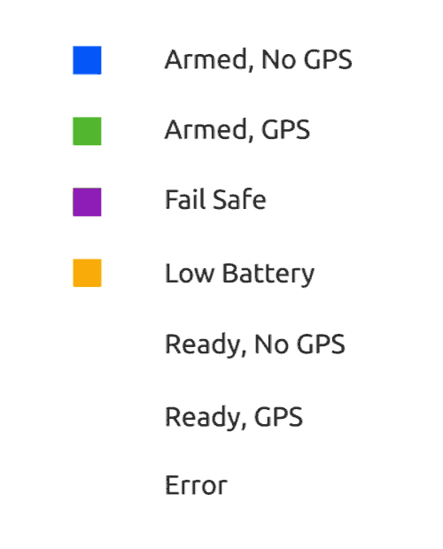

# Значення світлодіодів LED (серія Pixhawk)

[ Контролери польоту серії Pixhawk](../flight_controller/pixhawk_series.md) використовують світлодіоди для індикації поточного стану літального апарату.
- [Світлодіод інтерфейсу користувача (UI LED)](#ui_led) надає користувачеві інформацію про стан, пов'язаний з *готовністю до польоту*.
- Світлодіоди [Статус](#status_led) показують стан PX4IO і FMU SoC. Вони показують заряд, режим і стан бутлоадера, а також помилки.

## Індикатори інтерфейсу (UI LED)

RGB *індикатори інтерфейсу* вказують на поточний стан *готовності до польоту* апарату. Зазвичай це дуже яскравий периферійний пристрій I2C, який може бути встановлений або не встановлений на платі польотного контролера (наприклад,  FMUv4 не має такого на борту, і зазвичай використовує світлодіод, встановлений на GPS).

На зображенні нижче показано взаємозв'язок між світлодіодом і станом апарату.

:::warning
Ви можете мати блокування GPS (зелений світлодіод), але не мати можливості привести апарат в бойову готовність, оскільки PX4 ще не [ пройшов передпольотну перевірку](../flying/pre_flight_checks.md). ** Для зльоту потрібна коректна оцінка глобального положення!**
:::

:::tip
У разі виникнення помилки (блимає червоним кольором), або якщо апарат не може досягти блокування GPS (зміна кольору з синього на зелений), перевірте більш детальну інформацію про стан у *QGroundControl*, включно зі станом калібрування та повідомленнями про помилки, які з'являються у [Передпольотна перевірка (внутрішня)](../flying/pre_flight_checks.md). Також перевірте, чи правильно підключений GPS-модуль, чи правильно Pixhawk зчитує ваш GPS, і чи правильно GPS передає дані про місцеперебування.
:::

* **[Безперервний синій] Стан готовності, без блокування GPS:** Вказує на те, що апарат перебуває в стані готовності й не має блокування положення від GPS-пристрою. Коли апарат в стані готовності, PX4 розблокує керування двигунами, що дозволить вам керувати дроном. Як завжди, будьте обережні під час увімкнення, оскільки великі гвинти можуть бути небезпечними на високих обертах. У цьому режимі апарат не може виконувати керовані місії.

* **[Пульсуючий синій] Приведення в непрацездатний стан, немає блокування GPS:** Подібно до вищесказаного, але ваш апарат приведено в непрацездатний стан. Це означає, що ви не зможете керувати двигунами, але всі інші підсистеми працюють.

* **[Безперервний зелений] Стан готовності, блокування GPS:** Вказує на те, що апарат перебуває в стані готовності та має блокування місцезнаходження від GPS-пристрою. Коли апарат в стані готовності, PX4 розблокує керування двигунами, що дозволить вам керувати дроном. Як завжди, будьте обережні під час увімкнення, оскільки великі гвинти можуть бути небезпечними на високих обертах. У цьому режимі апарат може виконувати керовані місії.

* **[Пульсуючий зелений] Приведення в непрацездатний стан, блокування GPS:** Подібно до вищесказаного, але ваш апарат приведено в непрацездатний стан. Це означає, що ви не зможете керувати двигунами, але всі інші підсистеми, включаючи GPS-фіксацію положення, працюють.

* **[Постійний фіолетовий] Відмовобезпечний (аварійний) режим:** Цей режим активується щоразу, коли апарат стикається з проблемою під час польоту, наприклад, втрата ручного керування, критично низький заряд батареї або внутрішня помилка. Під час аварійного режиму апарат намагатиметься повернутися до місця зльоту або може просто знизитися там, де він зараз перебуває.

* **[Постійний помаранчевий] Попередження про низький рівень заряду акумулятора:** Вказує на небезпечний розряд акумулятора вашого апарату. Після певного моменту пристрій перейде в відмовобезпечний режим. Однак цей режим повинен сигналізувати про те, що настав час завершити цей політ.

* **[Блимаючий червоний] Помилка/потрібне налаштування:** Вказує на те, що автопілот потрібно налаштувати або відкалібрувати перед польотом. Підключіть автопілот до наземної станції керування, щоб перевірити, в чому проблема. Якщо ви завершили процес налаштування, а автопілот все ще відображається червоним і блимає, можливо, виникла інша помилка.

## Індикатор стану

Три світлодіоди *індикатори стану* показують стан мікросхеми FMU, а ще три - стан PX4IO (за наявності). Вони показують заряд, режим і стан бутлоадера, а також помилки.

Після ввімкнення живлення процесори FMU та PX4IO спочатку запускають бутлоадер (BL), а потім додаток (APP). У таблиці нижче показано, як завантажувач, а потім додаток використовують світлодіоди для індикації стану.

| Колір                 | Позначка                     | Використання бутлоадера                | Використання додатку (APP) |
| --------------------- | ---------------------------- | -------------------------------------- | -------------------------- |
| Синій                 | ACT (активність)             | Мерехтить, коли бутлоадер отримує дані | Індикація стану ARM        |
| Червоний/помаранчевий | B/E (В бутлоадері / помилка) | Мерехтить, коли в бутлоадері           | Індикація ERROR            |
| Зелений               | PWR (потужність)             | Не використовується в бутлоадері       | Індикація стану ARM        |

:::note
Світлодіодні позначення, показані вище, є загальноприйнятими, але можуть відрізнятися на деяких панелях.
:::

Більш детальна інформація про те, як інтерпретувати світлодіоди наведені нижче (де "х" означає "будь-який стан")

| Червоний/помаранчевий | Синій  | Зелений | Значення                                                                       |
| --------------------- | ------ | ------- | ------------------------------------------------------------------------------ |
| 10 Гц                 | x      | x       | Перевантаження CPU  > 80%, або використання RAM (оперативної памʼяті) > 98%    |
| ВИМК.                 | x      | x       | Перевантаження CPU  <= 80%,, або використання RAM (оперативної памʼяті) <= 98% |
| NA                    | ВИМК.  | 4 Гц    | actuator_armed->armed && failsafe                                              |
| NA                    | УВІМК. | 4 Гц    | actuator_armed->armed && !failsafe                                             |
| NA                    | ВИМК.  | 1 Гц    | !actuator_armed-> armed && actuator_armed->ready_to_arm                    |
| NA                    | ВИМК.  | 10 Гц   | !actuator_armed->armed  && !actuator_armed->ready_to_arm                   | 
