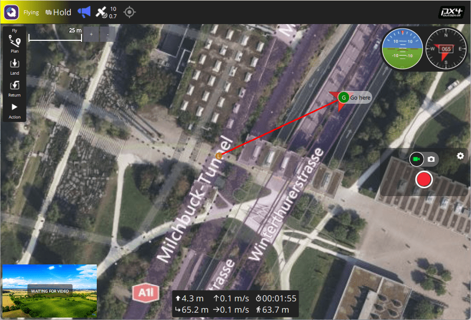

# Основні поняття

Цей розділ надає базовий вступ до безпілотників та використання PX4 (призначений в основному для користувачів початківців, але також є хорошим введенням для досвідчених користувачів).

Якщо ви вже знайомі з основними поняттями, ви можете перейти до [Базової Збірки](../assembly/README.md) щоби вивчити як збирати певне обладнання для автопілота. Для завантаження прошивки й налаштування рухомого засобу за допомогою _QGroundControl_, див. [Основні налаштування](../config/README.md).

## Що таке безпілотник?

Безпілотник, або Безпілотні Транспортні Засоби (БТЗ), - це безпілотний "роботизований" рухомий засіб, яким можна дистанційно або автономно керувати. Вони можуть подорожувати в повітрі, на землі, на/під водою, і використовуються для багатьох [споживчих, промислових, урядових та військових цілей](https://px4.io/ecosystem/commercial-systems/), включаючи аерофотозйомку/відеозйомку, перевезення вантажів, перегони, пошук та обстеження тощо.

Дрони більш формально називаються Безпілотними Повітряними Літальними Апаратами (UAV), Безпілотними Наземними Транспортними Засобами (UGV), Безпілотними Надводними Транспортними Засобами (USV), Безпілотними Підводними Транспортними Засобами (UUV).

:::info
Термін Безпілотна авіаційна система (UAS) зазвичай відноситься до БПЛА та всіх інших компонентів повної системи, включаючи станцію земного керування та / або радіокерування, а також будь-які інші системи, які використовуються для управління дроном, захоплення та обробки даних.
:::

## Типи дронів

Існує багато різних рам автомобілів (типів), і всередині типів є багато варіацій. Деякі типи, разом з використанням для яких вони найбільш підходять, перераховані нижче.

- [Мультикоптери](../frames_multicopter/index.md) — Multi-rotors надають точність зависання та вертикальний зліт коштом коротшого та, як правило, повільнішого польоту. Вони є найпопулярнішим типом літаючого транспорту, частково через те, що їх легко складати, і PX4 має режими, які роблять їх легкими у керуванні та дуже підходять як платформа для камери.
- [Гелікоптери](../frames_helicopter/index.md) — Гелікоптери мають подібні переваги до мультикоптерів, але механічно складніші та ефективніші. Також їм набагато складніше літати.
- [Літаки (літальні апарати з фіксованим крилом)](../frames_plane/index.md) — Літаки або літальні апарати з фіксованим крилом надають довший та швидший політ, а отже краще покриття для обстеження поверхні землі й т. ін. Однак літати та приземлятися ними важче ніж мультикоптерами, а також вони не придатні до зависання або дуже повільного польоту (тобто для обстеження вертикальних структур).
- [VTOL](../frames_vtol/index.md) (Vertical Takeoff and Landing) - Гібридні літальні апарати з фіксованим крилом / багтропники пропонують краще з обох світів: злітайте у вертикальному режимі і зависайте, як багтропник, але переходьте до польоту вперед, як літак, щоб пройти більше дистанції. Апарати VTOL часто дорожчі за мультикоптери або апарати літакового типу, а також їх важче збирати та налаштовувати. Вони існують у ряді типів: тілтротори, тейлсітери, квадроплани тощо.
- [Дирижаблі](../frames_airship/index.md)/[Повітряні кулі](../frames_balloon/index.md) — Повітряні засоби легші за повітря, які зазвичай надають довгу тривалість польоту на значній висоті, часто коштом обмеженої (або відсутньої) здатності керувати швидкістю та напрямком польоту.
- [Ровери](../frames_rover/index.md) — Транспортні засоби на землі, схожі на автомобілі. Вони прості в керуванні та часто приємні у використанні. Вони не можуть рухатися так швидко, як більшість повітряних суден, але можуть нести важчі вантажі, і не використовують багато енергії, коли стоять.
- **Човни** — Надводні рухомі засоби.
- [Підводні апарати](../frames_sub/index.md) — Підводні транспортні засоби.

Для отримання додаткової інформації:

- [Vehicle Types & Setup](../airframes/index.md)
- [Airframe setup](../config/airframe.md)
- [Airframe Reference](../airframes/airframe_reference.md).

## Автопілоти

"Мізками" дрону є автопілот.

Він мінімально складається з програмного забезпечення _політного стека_ яке працює на операційній системі реального часу ("RTOS") на апаратному забезпеченні _політного контролера_ (FC). Політний стек забезпечує основну стабілізацію та функції безпеки, а зазвичай також певний рівень допомоги пілоту для ручного польоту та автоматизації загальних завдань, таких як зліт, посадка та виконання попередньо визначених місій.

Деякі автопілоти також включають універсальну обчислювальну систему, яка може забезпечувати "вищий рівень" управління та контролю, а також підтримувати більш просунуті мережеві технології, машинний зір та інші можливості. Це може бути реалізовано у вигляді окремого [супутнього комп'ютера](#offboard-companion-computer), але в майбутньому все більш імовірно, що це буде повністю інтегрований компонент.

## Політний стек PX4

[PX4](https://px4.io/) is powerful open source autopilot _flight stack_ running on the NuttX RTOS.

Деякі ключові можливості PX4:

- Supports many different vehicle frames/types, including: [multicopters](../frames_multicopter/index.md), [fixed-wing aircraft](../frames_plane/index.md) (planes), [VTOLs](../frames_vtol/index.md) (hybrid multicopter/fixed-wing), [ground vehicles](../frames_rover/index.md), and [underwater vehicles](../frames_sub/index.md).
- Great choice of drone components for [flight controller](#flight-controller), [sensors](#sensors), [payloads](#payloads), and other peripherals.
- Гнучкі та потужні [режими польоту](#flight-modes) та [функції безпеки](#safety-settings-failsafe).
- Robust and deep integration with [companion computers](#offboard-companion-computer) and [robotics APIs](../robotics/index.md) such as [ROS 2](../ros/ros2_comm.md) and [MAVSDK](http://mavsdk.mavlink.io)).

PX4 є основною частиною ширшої платформи для безпілотників що включає програмне забезпечення для наземної станції керування [QGroundControl](#qgc), апаратне забезпечення [Pixhawk](https://pixhawk.org/) та [MAVSDK](http://mavsdk.mavlink.io) для інтеграції з companion комп'ютерами, камерами та іншим обладнанням за допомогою протоколу MAVLink. PX4 підтримується [Dronecode Project](https://www.dronecode.org/).

## Наземні станції керування

Станції земного контролю (GCS) - це системи на землі, які дозволяють операторам УЗ контролювати і керувати безпілотником та його вантажем. Підмножина продуктів, які відомо, що працюють з PX4, перераховані нижче.

### QGroundControl {#qgc}

Програмне забезпечення наземної станції керування від Dronecode називається [QGroundControl](http://qgroundcontrol.com/) ("QGC"). Він працює на апаратному забезпеченні Windows, Android, MacOS або Linux і підтримує широкий спектр форм факторів екрану. Ви можете завантажити його (безкоштовно) з [тут](http://qgroundcontrol.com/downloads/).

QGroundControl спілкується з дроном за допомогою телеметричного радіо (двостороннє зв'язок з даними), що дозволяє отримувати інформацію про польот у реальному часі та безпеку, а також керувати транспортним засобом, камерою та іншими корисними навантаженнями за допомогою інтерфейсу з точковим вибором. На апаратному забезпеченні, яке їх підтримує, ви також можете вручну керувати транспортним засобом за допомогою джойстиків. QGC також може бути використаний для візуального планування, виконання та моніторингу автономних місій, встановлення геозахисту та багато іншого.

Настільні версії QGroundControl також використовуються для встановлення (прошивки) PX4 та налаштування PX4 на автопілоті/контролері польоту дрона.

### Керування місією Auterion (AMC) {#amc}

[Auterion Контроль місії](https://auterion.com/product/mission-control/) - це потужна та повнофункціональна програма станції керування землею, яка оптимізована для _пілотів_, а не для конфігурації транспортного засобу. Хоча призначений для роботи з продуктами Auterion, його можна використовувати з "ванільним" PX4.

Для додаткової інформації дивіться:

- [Документи AMC](https://docs.auterion.com/vehicle-operation/auterion-mission-control)
- [AMC на Google Play](https://play.google.com/store/apps/details?id=com.auterion.auteriongs)

## Компоненти &  частини дрона

### Політний контролер

Контролери польоту (FC) - це апаратне забезпечення, на яке завантажується та виконується прошивка стеку польоту PX4. Вони підключені до датчиків, за допомогою яких PX4 визначає свій стан, а також до виконавчих пристроїв/двигунів, які він використовує для стабілізації та переміщення транспортного засобу.

PX4 може працювати на багатьох різних типах апаратного забезпечення [Контролер польоту](../flight_controller/index.md), починаючи від контролерів серії [Pixhawk Series](../flight_controller/pixhawk_series.md) до комп'ютерів з операційною системою Linux. Серед них [Стандартні Pixhawk](../flight_controller/autopilot_pixhawk_standard.md) та дошки, що підтримуються [виробниками](../flight_controller/autopilot_manufacturer_supported.md). Вам слід обирати плату, яка відповідає фізичним обмеженням вашого апарату, видам діяльності, які ви хочете виконувати та, за вартістю.

Для отримання додаткової інформації див.: [Вибір контролера польоту](flight_controller_selection.md)

### Датчики

Системи на основі PX4 використовують датчики для визначення стану транспортного засобу, який їй потрібен для стабілізації транспортного засобу та увімкнення автономного керування. Стани транспортного засобу включають: позицію/висоту, курс, швидкість, швидкість польоту, орієнтацію (відносно чогось), швидкість обертання в різних вісях, рівень заряду батареї тощо.

PX4 _мінімально потребує_ гіроскоп, [гіроскоп](../sensor/gyroscope.md), [акселерометр](../sensor/accelerometer.md), [магнітомер](../gps_compass/magnetometer.md) (компас) та [барометр](../sensor/barometer.md). Для активації всіх автоматичних режимів, а також деяких ручних/допоміжних режимів потрібен [GNSS/GPS](../gps_compass/index.md) або інший джерело глобального позиціонування. Дрони літакового типу, а також апарати VTOL повинні додатково включати датчик швидкості польоту (дуже рекомендується).

Мінімальний набір датчиків вбудований в політні контролери [Pixhawk Series](../flight_controller/pixhawk_series.md) (а також він може бути в контролерах інших платформ). До контролера можна приєднати додаткові/зовнішні датчики.

Для отримання додаткової інформації дивіться: [Апаратне забезпечення та налаштування датчиків](../sensor/index.md)

### Виводи: Двигуни, Сервоприводи, Актуатори, або приводи

PX4 використовує _виводи_ для керування: швидкістю двигуна (наприклад через [ESC](#escs-motors)), аеродинамічними поверхнями, наприклад елеронами та закрилками, тригерами камер, парашутів, захватів, а також багатьма іншими типами корисного навантаження.

Такі виводи можуть бути PWM портами або вузлами DroneCAN (наприклад [контролери двигунів](../dronecan/escs.md) DroneCAN). Зображення нижче показують порти виводу PWM для [Pixhawk 4](../flight_controller/pixhawk4.md) і [Pixhawk 4 mini](../flight_controller/pixhawk4_mini.md).

 

Виводи розділені на `MAIN` і `AUX` та індивідуально пронумеровані (тобто `MAINn` та `AUXn`, де `n` змінюється від 1 до зазвичай 6 або 8). Також вони можуть бути позначені як `IO PWM Out` та `FMU PWM OUT` (або подібним чином).

:::warning
Політний контролер може мати тільки `MAIN` PWM виводи (як _Pixhawk 4 Mini_), або мати тільки 6 виводів `MAIN` чи `AUX`. Переконайтеся, що ви обрали контролер який має достатньо портів/виводів для вашого [планера](../airframes/airframe_reference.md).
:::

Ви можете під'єднати майже будь-який вивід до будь-якого мотора чи іншого привода, призначивши пов'язану функцію ("Motor 1") на бажаний вивід ("AUX1") в QGroundControl: [Налаштування і перевірка актуатора](../config/actuators.md). Зверніть увагу, що функції (позиції моторів та приводів) для кожного шасі наведено в [Довіднику планерів](../airframes/airframe_reference.md).

**Примітки:**

- Контролери Pixhawk мають плату FMU та _можуть_ мати окрему плату IO. Якщо плата IO наявна, `AUX` порти під'єднані напряму до FMU, а `MAIN` порти під'єднані до плати IO. В іншому випадку `MAIN` порти під'єднані до FMU, а порти `AUX` відсутні.
- Порти виводу FMU можуть використовувати протоколи [D-shot](../peripherals/dshot.md) або _One-shot_ (так само як PWM), які забезпечують набагато меншу затримку. Це може бути корисним для тих хто займається перегонами та інших планерів які потребують кращої ефективності.
- Існує лише 6-8 виводів в `MAIN` та `AUX` порти оскільки більшість політних контролерів має саме стільки PWM/D-shot/One-shot виводів. В теорії може бути більше виводів, якщо шина підтримує це (наприклад UAVCAN не обмежена такою малою кількістю вузлів).

### ESC & Мотори

Багато безпілотників на базі P4X використовують безколекторні електродвигуни, які керуються польотним контролером через електронний регулятор швидкості (ECS) (ECS перетворює сигнал з політного контролера у відповідний рівень потужності, що передається на мотор).

Для отримання інформації про те, які ESC/мотори підтримуються PX4 дивіться:

- [ESC & Мотори](../peripherals/esc_motors.md)
- [Калібрування ESC](../advanced_config/esc_calibration.md)
- [Прошивки ESC та огляд протоколів](https://oscarliang.com/esc-firmware-protocols/) (oscarliang.com)

### Батарея/Живлення

Безпілотники на базі PX4 найчастіше працюють від літій-полімерних акумуляторів (LiPo). Зазвичай батарея під'єднана до системи за допомогою [Модуля живлення](../power_module/README.md) або _Плати керування живленням_, які забезпечують окреме живлення для політного контролера та ESC (для моторів).

Інформацію про батареї та їх налаштування можна знайти у [Налаштування батарей](../config/battery.md) та в інструкції [Базова збірка](../assembly/README.md) (наприклад у параграфі [Швидкий початок з підключення Pixhawk 4 > Живлення](../assembly/quick_start_pixhawk4.md#power)).

### Ручне керування

Пілоти можуть керувати рухомим засобом вручну використовуючи або пульт [Системи радіокерування (RC)](#radio-control-rc) або [Джойстик/Геймпад](#gcs-joystick-controller) які підключені через QGroundControl.

 

Системи радіокерування використовують спеціалізований наземний радіопередавач та приймач на апараті для передачі сигналів керування. Вони завжди повинні використовуватися, коли ви вперше налаштовуєте/тестуєте нову конструкцію рами або під час польотів на перегонах / акробатичних польотах (та інших випадках коли важлива мала затримка).

Системи з джойстиком використовують QGroundControl для кодування інформації керування з "стандартного" ігрового джойстика комп'ютера у повідомлення MAVLink та надсилають її до апарату за допомогою (спільного) радіоканалу телеметрії. Вони можуть використовуватися для більшості випадків ручного польоту, таких як зліт, обстеження тощо, за умови, що ваш канал телеметрії має достатньо високу пропускну спроможність / низьку затримку.

Джойстики часто використовуються в інтегрованих GCS / системах ручного керування, тому що інтеграція джойстика дешевша та простіша, ніж окремої системи радіокерування, і для більшості випадків використання нижча затримка не має значення. Вони також ідеально підходять для польотів у симуляторі PX4, оскільки їх можна безпосередньо під'єднати до вашого комп'ютера наземної станції керування.

:::info
PX4 не вимагає системи керування для автономних режимів польоту.
:::

### Запобіжний перемикач

Деякі рухомі засоби мають _запобіжний перемикач_ який потрібно увімкнути перед тим як апарат може бути [увімкнено](#arming-and-disarming) (у такому стані, на мотори подається живлення та пропелери готові обертатись).

Зазвичай запобіжний перемикач інтегрується в пристрій GPS, але також може бути окремим фізичним компонентом.

### Радіопередавачі даних/телеметрії

[Радіопередавачі даних/телеметрії](../telemetry/README.md) можуть забезпечувати безпровідне з'єднання за протоколом MAVLink між наземною станцією керування такою як _QGroundControl_ та рухомим засобом на базі PX4. Це дозволяє налаштовувати параметри, коли транспортний засіб в польоті, перевіряти телеметрію в режимі реального часу, змінювати політне завдання на льоту тощо.

### Бортовий / Супутній комп'ютер

[Супутній комп'ютер](../companion_computer/README.md) (також відомий як "комп'ютер місії" або "бортовий комп'ютер"), окремий комп'ютер на рухомому засобі який комунікує з PX4 для забезпечення вищого рівня керування так контролю.

Супутній комп'ютер зазвичай працює на Linux, оскільки це краща платформа для розробки програмного забезпечення та дозволяє безпілотникам отримувати перевагу від наявності передвстановленого програмного забезпечення для машинного зору, мережевої взаємодії тощо.

Політний контролер та супутній комп'ютер можуть бути інтегровані на одній платі, полегшуючи розробку апаратного забезпечення, чи бути окремими пристроями, під'єднаними через serial кабель, Ethernet кабель чи WiFi. Найчастіше супутній комп'ютер спілкується з PX4 використовуючи високорівневе Robotics API, таке як [MAVSDK](https://mavsdk.mavlink.io/) або [ROS 2](../ros/ros2_comm.md).

Відповідні теми:

- [Супутні комп'ютери](../companion_computer/index.md)
- [Режим зовнішнього керування](../flight_modes/offboard.md) - режим польоту для зовнішнього управління PX4 з наземної станції керування або супутнього комп'ютера.
- [Robotics APIs](../robotics/index.md)

### SD-карти (знімна пам'ять)

PX4 використовує SD карти пам'яті для зберігання [журналів польоту](../getting_started/flight_reporting.md), а також вони необхідні для використання периферії UAVCAN та для польоту за [місіями](../flying/missions.md).

За замовчуванням, якщо SD карта не присутня, PX4 подає два рази звуковий сигнал [форматування не вдалося (подвійний писк)](../getting_started/tunes.md#format-failed) протягом запуску (й жодна зі згаданих вище функцій не буде доступна).

::: tip
Максимальний розмір SD-карти що підтримується на платах Pixhawk - 32GB. Карти _SanDisk Extreme U3 32GB_ та _Samsung EVO Plus 32_ [дуже рекомендується](../dev_log/logging.md#sd-cards).
:::

SD карти, однак, не обов'язкові. Політні контролери, які не містять слот для SD карти, можуть:

- Відключати сигнал сповіщення використовуючи параметр [CBRK_BUZZER](../advanced_config/parameter_reference.md#CBRK_BUZZER).
- [Передавати журнали](../dev_log/logging.md#log-streaming) до іншого компонента (супутнього пристрою).
- Зберігати місії в RAM/FLASH.
  <!-- Too low-level for this. But see FLASH_BASED_DATAMAN in  Intel Aero: https://github.com/PX4/PX4-Autopilot/blob/main/boards/intel/aerofc-v1/src/board_config.h#L115 -->

## Корисне навантаження

Корисне навантаження — це обладнання, яке переноситься апаратом для досягнення цілей користувача або місії, такі як камери в місіях з обстеження, інструменти, що використовуються для інспектування, наприклад, детектори радіації, та вантаж, який потрібно доставити. PX4 підтримує багато камер та широкий спектр корисних навантажень.

Корисні навантаження підключаються до [виводів політного контролера](#outputs-motors-servos-actuators) і можуть бути активовані автоматично в місіях, або вручну з радіоконтролера або джойстика, або з наземної станції (через команди MAVLink/MAVSDK).

Для отримання додаткової інформації дивіться: [Payloads & Cameras](../payloads/index.md)

## Увімкнення та вимкнення

Рухомий засіб є увімкненим, тобто у стані _armed_, коли на всі мотори та приводи подається живлення, та є вимкненим, тобто у стані _disarmed_, коли нічого не заживлено. Також є стан _prearmed_ коли живлення подається тільки на приводи.

:::warning
Рухомі засоби в стані armed можуть бути небезпечними оскільки пропелери вже обертаються.
:::

Увімкнення, тобто arming, за замочуванням виконується (на передавачах Mode 2) утримуючи throttle/yaw RC стік в _нижньому правому_ положенні одну секунду (для вимкнення, тобто disarming, утримуйте стік у нижньому лівому положенні). Також альтернативно є можливість налаштувати PX4 для увімкнення за допомогою RC перемикача або кнопки (й можна відправляти MAVLink команди увімкнення з наземної станції).

Для зменшення нещасних випадків, коли рухомі засоби на землі, вони повинні бути увімкненими якомога менше часу. За замовчуванням рухомі засоби:

- _Disarmed_ або _Prearmed_ (мотори не заживлені) коли не використовуються, і повинні бути увімкненими, тобто _armed_ перед злетом.
- Автоматично перемикаються у стан disarmed/prearmed якщо засіб не злетів достатньо швидко після увімкнення (час перемикання налаштовується).
- Автоматично перемикаються у стан disarmed/prearmed незабаром після посадки (час налаштовується).
- Увімкнення запобігається, якщо засіб не в "нормальному" стані.
- Увімкнення запобігається, якщо засіб має [запобіжний перемикач](#safety-switch) який не увімкнений.
- Увімкнення запобігається, якщо VTOL знаходиться в режимі літака ([за замовчуванням](../advanced_config/parameter_reference.md#CBRK_VTOLARMING)).

В стані prearmed можна користуватись приводами, тоді як disarmed вимикає усе живлення. Prearmed та disarmed стани є безпечними, а конкретний рухомий засіб може підтримувати один зі станів або обидва.

:::tip
Іноді рухомий засіб не вмикається з неочевидних причин. QGC v4.2.0 (денна збірка на час написання) та пізніших версій надає звіт про перевірку стану готовності у [Fly View > Arming and Preflight Checks](https://docs.qgroundcontrol.com/master/en/qgc-user-guide/fly_view/fly_view.html#arm). Починаючи з PX4 v1.14 це забезпечує комплексну інформацію про проблеми увімкнення разом з можливими рішеннями.
:::

Огляд з подробицями щодо налаштування увімкнення та вимкнення може бути знайдений тут: [Налаштування Prearm, Arm, Disarm](../advanced_config/prearm_arm_disarm.md).

## Режими польоту

Режими польоту забезпечують різні типи/рівні автоматизації рухомого засобу та підтримки користувача (пілота) з боку автопілоту. _Автономні режими_ повністю керуються автопілотом та не потребують залучення пілота або віддаленого керування. Ці режими використовуються, наприклад, для автоматизації загальних задач на кшталт зльоту, повернення до початкової позиції, приземлення тощо. Інші автономні режими виконують запрограмовані місії, слідують за GPS маяком або приймають команди з бортового комп'ютера або наземної станції.

_Ручні режими_ контролюються користувачем (через RC стіки/джойстики) та з підтримкою автопілота. Різні ручні режими надають різні характеристики польоту, наприклад, в деяких режимах доступні акробатичні трюки, тоді як інші не можливо зрушити й вони будуть утримувати позицію/курс проти вітру.

:::tip
Не всі режими польоту доступні на всіх типах рухомих засобів, а деякі режими можуть використовуватись тільки при виконанні певних умов (наприклад багато режимів потребують оцінки глобальної позиції).
:::

Огляд доступних режимів польоту для кожного засобу можна знайти тут:

- [Режими польоту (Мультикоптер)](../flight_modes_mc/index.md)
- [Режими польоту (Фіксоване крило)](../flight_modes_fw/index.md)
- [Режими польоту (VTOL)](../flight_modes_vtol/index.md)
- [Режими польоту (Ровер)](../flight_modes_rover/index.md)

Інструкції як налаштувати перемикачі вашого засобу віддаленого керування для того, щоби включити різні режими польоту надано в [Налаштування режиму польоту](../config/flight_mode.md).

## Налаштування безпеки (Відмовостійкість)

PX4 має системи відмовостійкості, які можна налаштувати для захисту та повернення вашого засобу якщо щось піде не так! Вони дозволяють вам вказати території й умови, за яких можна безпечно літати, а також дію, що буде виконуватися, якщо відбудеться умова запобігання відмові (наприклад, посадка, утримання позиції або повернення до зазначеної точки).

:::info Ви можете вказати дію тільки для _першої_ запобіжної події. Як тільки запобіжна подія станеться, система перейде в режим спеціального виконання таким чином, що наступні тригери запобігання відмові будуть управлятися окремим рівнем системи та кодом притаманним конкретному рухомому засобу.
:::

Основні запобіжні випадки перераховані нижче:

- Низький заряд батареї
- Втрата дистанційного керування (RC)
- Втрата позиції (якість глобальної оцінки позиції занадто низька).
- Втрата бортового комп'ютера (наприклад втрата зв'язку із супутнім комп'ютером)
- Втрата каналу даних (наприклад втрата з'єднання телеметрії з GCS).
- Порушення геозони (обмеження польоту апарату у віртуальному циліндрі).
- Запобігання відмові місії (запобігає запуску попередньої місії під час зльоту з нової локації).
- Уникнення трафіку (викликається даними з, наприклад ADSB транспондера).

Для додаткової інформації дивіться: [Безпека](../config/safety.md) (Базове налаштування).

## Курс та напрямок руху

Усі транспортні засоби, човни та літаки мають напрям курсу або орієнтацію, що базується на їхньому русі вперед.

:::info
Для засобу з ВЗТП (VTOL) що злітає з хвоста направлення відносне до налаштування мультиротору (тобто стан засобу під час злету, зависання та посадки).
:::

Важливо знати напрямок курсу рухомого засобу з метою приведення автопілота у відповідність з вектором руху. Мультикоптери мають напрямок руху навіть якщо вони симетричні з усіх боків! Зазвичай виробники використовують кольорові позначки або кольорові руки для того, щоб вказати напрямок руху.

В наших ілюстраціях ми будемо використовувати червоне забарвлення для передніх пропелерів мультикоптера для того, щоб вказати напрямок руху.

Більш поглиблено про напрямок руху можна прочитати в [Орієнтація політного контролера](../config/flight_controller_orientation.md)
