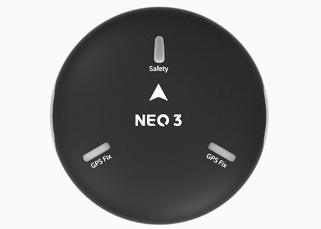
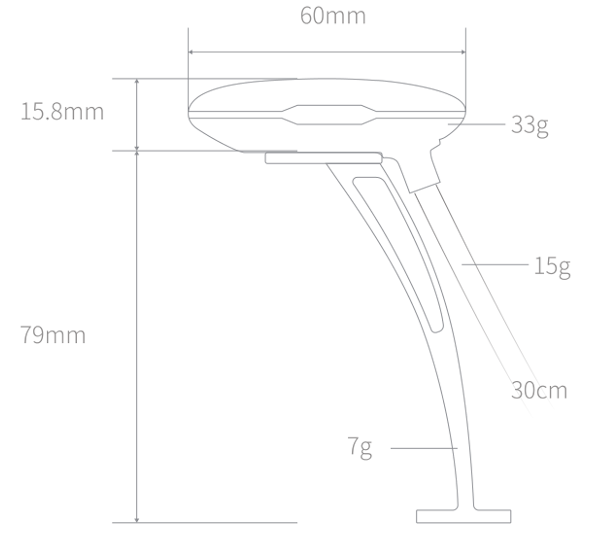
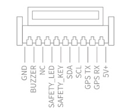
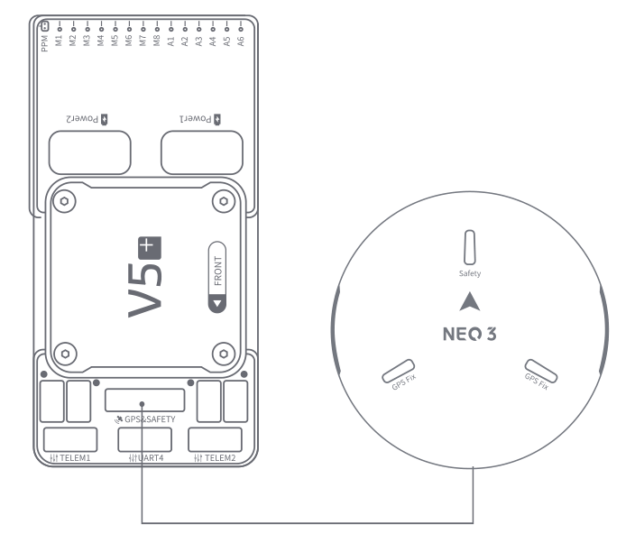

# CUAV NEO 3 GPS

<Badge type="tip" text="PX4 v1.13" />

Цей NEO 3 GPS виготовлений CUAV.
Вона інтегрує Ublox M9N, IST8310, світлодіодні лампи трьох кольорів та безпечні перемикачі, і сумісна з контролерами стандарту CUAV та Pixhawk.

## Технічні характеристики

| Апаратне забезпечення                             | Тип                                                                                                                        |
| :------------------------------------------------ | :------------------------------------------------------------------------------------------------------------------------- |
| Компас                                            | IST8310                                                                                                                    |
| Приймач GNSS                                      | UBLOX NEO M9N                                                                                                              |
| RGB drive                                         | NC5623C                                                                                                                    |
| Buzzer                                            | Passive buzzer                                                                                                             |
| Safety switch                                     | Physical button                                                                                                            |
| GNSS                                              | Beidou, Galileo, GLONASS, GPS                                                                                              |
| GNSS Augmentation System                          | SBAS:WAAS,EGNOS,MSAS QZSS:L1s(SAIF) other：RTCM3.3 |
| Number of concurrent GNSS                         | 4                                                                                                                          |
| Frequency band                                    | GPS:L1C/A GLONASS:L10F Beidou:B1I Galileo:E1B/C   |
| Horizontal accuracy                               | 2.0M                                                                                                       |
| Speed accuracy                                    | 0.05M/S                                                                                                    |
| Nav. update rate                  | 25Hz(Max)                                                                                               |
| Acquisition                                       | Cold start：24S Hot start：2S Aided start:2s                                                           |
| Number of satellites(MAX)      | 32+                                                                                                                        |
| Чутливість                                        | Відстеження та нав-167dBm Холодний старт Гарячий старт-148dBm Повторний збір -160dBm                                 |
| Протокол                                          | UART+IO+I2C                                                                                                                |
| Port TYpe                                         | GHR-10V-S                                                                                                                  |
| Supported flight controller                       | CUAV series, Pixahwk series                                                                                             |
| Wave filtering                                    | SAW+LNA+SAW                                                                                                                |
| Anti-Electromagnetic/radio frequency interference | EMI+RFI                                                                                                                    |
| Upgrade firmware                                  | support                                                                                                                    |
| Input voltage                                     | 5V                                                                                                                         |
| Operating temperature                             | -10~70℃                                                                                                    |
| Size                                              | 60\*60\*16MM                                                                                                               |
| Weight                                            | 33g                                                                                                                        |

## Розміри

## Розпіновка

## Де придбати

- [CUAV](https://cuav.en.alibaba.com/product/1600217379204-820872629/CUAV_NEO_3_M9N_GPS_Module_for_Pixhawk_Compass_gps_tracker_navigation_gps.html?spm=a2700.shop_oth.74.1.636e28725EvVHb)

## Підключення та з'єднання

Схема підключення та з'єднання Neo3

## Додаткова інформація

- [CUAV docs](https://doc.cuav.net/gps/neo-series-gnss/zh-hans/neo-3.html)
