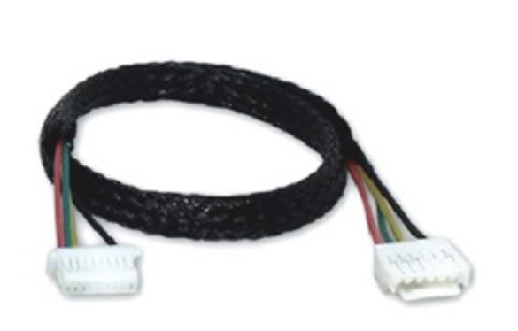

# LOCOSYS Hawk A1 GPS/GNSS

[LOCOSYS HAWK A1 GPS/GNSS приймач](https://www.locosystech.com/en/product/hawk-a1-LU23031-V2.html) - це двочастотний багатосупутниковий GNSS/GPS приймач, сумісний з PX4.

Основні функції включають:
- Одночасний прийом сигналів смуг L1 і L5
- Підтримка GPS, ГЛОНАСС, BEIDOU, GALILEO, QZSS
- Підтримка SBAS (WAAS, EGNOS, MSAS, GAGAN)
- Підтримка GNSS з 135 каналами
- Швидкий TTFF на низькому рівні сигналу
- Безкоштовне прогнозування гібридних ефемерид для швидшого холодного старту
- За замовчуванням 5 Гц, частота оновлення до 10 Гц (SBAS лише з частотою оновлення 5 Гц)
- Вбудований суперконденсатор для резервування системних даних для швидкого отримання супутникових даних
- Три світлодіодного індикатора для живлення, PPS та передачі даних

## Де купити

* [LOCOSYS](https://www.locosystech.com/en/product/hawk-a1-LU23031-V2.html) (Тайвань)

## Налаштування

Ви можете використовувати Hawk A1 як основну або додаткову GPS-систему. Параметри PX4 повинні бути встановлені, як показано нижче, для кожного випадку.

### Головний GNSS

Використовуйте Hawk A1 як основний GPS-пристрій:

| Параметр                                                                     | Значення                                           | Опис                                                                                  |
| ---------------------------------------------------------------------------- | -------------------------------------------------- | ------------------------------------------------------------------------------------- |
| [GPS_1_CONFIG](../advanced_config/parameter_reference.md#GPS_1_CONFIG)     | 102 (Telem 2 або інший доступний послідовний порт) | Налаштування основного порту GPS                                                      |
| [GPS_1_PROTOCOL](../advanced_config/parameter_reference.md#GPS_1_PROTOCOL) | 1 (u-blox)                                         | Налаштування протоколу GPS                                                            |
| [SER_TEL2_BAUD](../advanced_config/parameter_reference.md#SER_TEL2_BAUD)   | 230400                                             | Налаштування швидкості послідовного порту (тут GPS підключено до `TELEM2`, наприклад) |

### Другорядний GNSS

Використовувати Hawk A1 як допоміжний GPS-пристрій (на додаток до основного GPS):

| Параметр                                                                     | Значення                                           | Опис                                                                                |
| ---------------------------------------------------------------------------- | -------------------------------------------------- | ----------------------------------------------------------------------------------- |
| [GPS_2_CONFIG](../advanced_config/parameter_reference.md#GPS_2_CONFIG)     | 102 (Telem 2 або інший доступний послідовний порт) | Налаштування основного порту GPS                                                    |
| [GPS_2_PROTOCOL](../advanced_config/parameter_reference.md#GPS_2_PROTOCOL) | 1 (u-blox)                                         | Налаштування протоколу GPS                                                          |
| [SER_TEL2_BAUD](../advanced_config/parameter_reference.md#SER_TEL2_BAUD)   | 230400                                             | Налаштування швидкості послідовного порту (тут GPS підключено до TELEM2, наприклад) |

## Підключення та з'єднання

Locosys GPS поставляється з 6-контактним роз'ємом JST-GH стандарту Pixhawk, який можна вставити безпосередньо в UART-порт GPS1 (або в UART-порти GPS2 від Pixhawk FMUv5).

### Розпіновка

LOCOSYS схема виводів GPS наведена нижче. Це може бути використано для модифікації роз'єму для інших плат автопілота.

| пін | Locosys GPS | пін | Pixhawk GPS 2 |
| --- | ----------- | --- | ------------- |
| 1   | VCC_5V      | 1   | VCC           |
| 2   | GPS_RX      | 2   | GPS_TX        |
| 3   | GPS_TX      | 3   | GPS_RX        |
| 4   | NC          | 4   | SDA           |
| 5   | NC          | 5   | SCL           |
| 6   | GND         | 6   | GND           |

## Індикатори статусу LEDs

| Колір    | Назва              | Опис                                  |
| -------- | ------------------ | ------------------------------------- |
| Зелений  | Індикатор TX       | Передача даних GNSS                   |
| Червоний | Індикатор живлення | Потужність                            |
| Синій    | PPS                | Активна служба точного позиціонування |

## Характеристики

- **Тип приймача:** 135-канальний двигун LOCOSYS MC-1612-V2b, GPS/QZSS L1 C/A, L5C, ГЛОНАСС L1OF, BeiDou B1I, B2a Galileo:E1, E5a SBAS L1 C/A: WAAS, EGNOS, MSAS, GAGAN
- **Частота оновлення навігації:** Макс: 5 Гц за замовчуванням Макс: 10 Гц
- **Точність позиціювання:** 3D Fix
- **Час до першого виправлення:**
  - **Холодний запуск:** 28с
  - **Допоміжний запуск:** EASY
- **Чутливість:**
  - **Відстеження & навігація:** -165 дБм
- **Підтримка GNSS:** EASY DGPS
- **Осцилятор:** 26Mhz TCXO
- **RTC кристал:** 32.768KHz
- ** Доступні антени:** Багаточастотна антена L1+L5
- ** Цілісність сигналу:** L1+L5 GPS GLONASS GALILEO BEIDOU QZSS SBAS
- **Протоколи & Інтерфейси:**
  - **UART/I2C:** JST_GH Головний інтерфейс, внутрішній перемикач.

## Додаткова інформація

- [Посібник користувача GPS від LOCOSYS](https://www.locosystech.com/Templates/att/LU23031-V2%20datasheet_v0.2.pdf?lng=en)
