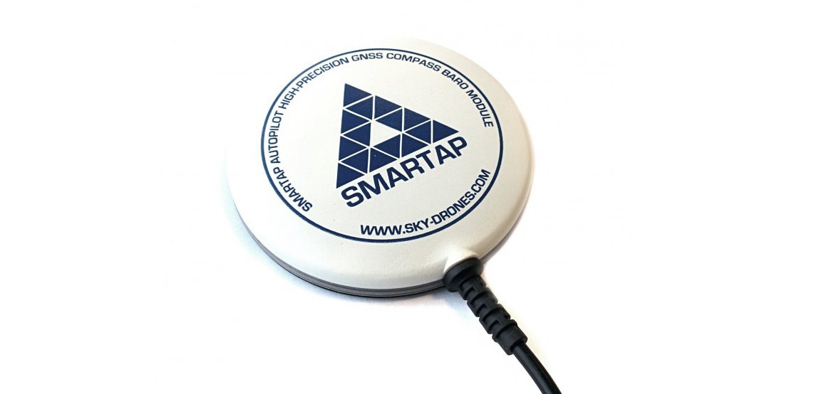

# Sky-Drones SmartAP GPS

[SmartAP GPS](https://sky-drones.com/navigation/smartap-gnss.html) - це GNSS навігаційний модуль з вбудованою антеною, чіпсетом UBlox Neo-M8N, 3x 3-осьовим магнітометром (компасом), 1x датчиком тиску MS-5611 і драйвером RGB LED. SmartAP GPS підтримує одночасний прийом до 3 GNSS (GPS, Galileo, GLONASS, BeiDou).

Основні функції включають:
- Одночасний прийом до 3 GNSS (GPS, Galileo, GLONASS, BeiDou)
- 3х вбудовані магнітометри: HMC5983, IST8310 та LIS3MDL
- 1x вбудований барометр: MS5611
- Драйвер RGB-світлодіодів та індикатори стану

## Де купити

* [Sky-Drones Store](https://sky-drones.com/navigation/smartap-gnss.html)

## Вміст набору

Набір SmartAP GPS включає в себе:
- 1x GPS модуль
- 1x 30cm кабель

## Конфігурація

Для літака слід встановити параметр [SER_GPS1_BAUD](../advanced_config/parameter_reference.md#SER_GPS1_BAUD) на 115200 8N1, щоб переконатися, що PX4 використовує правильну швидкість передачі даних.

## Підключення та з'єднання

SmartAP GPS має 10-контактний роз'єм JST-GH, який можна підключити до польотного контролера Pixhawk (сумісний зі стандартом роз'єму Pixhawk).

| Номер виводу | Назва виводу |
| ------------ | ------------ |
| 1            | 5V           |
| 2            | USART1_RX    |
| 3            | USART1_TX    |
| 4            | I2C1_SCL     |
| 5            | I2C1_SDA     |
| 6            | SAFETY_BTN   |
| 7            | SAFETY_LED   |
| 8            | +3V3         |
| 9            | BUZZER       |
| 10           | GND          |

## Характеристики

- Приймач GPS u-blox M8N
- Магнітометр IST8310
- Магнітометр HMC5983
- Магнітометр LIS3MDL
- Датчик тиску MS5611
- RGB-світлодіоди для індикації стану
  - NCP5623 I2C Driver
- Діаметр: 75 мм
- Вага: 34g

## Подальша інформація

- [Купити SmartAP GPS](https://sky-drones.com/navigation/smartap-gnss.html)
- [Документація](https://docs.sky-drones.com/avionics/smartap-gnss)
- [CAD Моделі](https://docs.sky-drones.com/avionics/smartap-gnss/cad-model)
