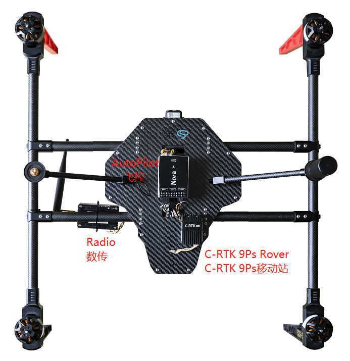

# CUAV C-RTK 9Ps

CUAV [C-RTK 9Ps](https://www.cuav.net/en/c_rtk_9ps/) - це багатосупутникова, багатодіапазонна, сантиметрового рівня RTK GNSS система.

Модуль одночасно приймає сигнали супутників GPS, ГЛОНАСС, Galileo та Beidou, що забезпечує швидке позиціонування та вищу точність. Також підтримує [RTK GPS Heading](../gps_compass/u-blox_f9p_heading.md) за допомогою подвійних модулів.

Використання C-RTK 9Ps надає PX4 точність позиціювання на рівні сантиметрів. Це ідеальний варіант для дронів для зйомки, сільськогосподарських дронів та інших сценаріїв застосування.

## Де придбати

[магазин cuav](https://store.cuav.net/shop/c-rtk-9ps/)

## Характеристики

## Проводка та з'єднання

**C-RTK 9Ps (База)**

- Використовуйте штатив, щоб закріпити антену базової станції зверху, і підключіть антену до базової станції
- Підключіть базову станцію та телеметрію до комп'ютера за допомогою USB-кабелю.

**C-RTK 9Ps (Rover)**

- Встановіть антену C-RTK 9Ps (Rover) вертикально.
- Підключіть антену до C-RTK 9Ps (Rover).
- Підключіть C-RTK 9Ps (Rover) до контролера польоту.
- Підключіть телеметрію до інтерфейсу керування польотом `TELEM1`/`TELEM2`

::: info C-RTK 9P поставляються з 6-контактними і 10-контактними роз'ємами, сумісними з польотними контролерами стандарту Pixhawk. Підключіться до `GPS1` або `GPS2`. Виберіть відповідний кабель для контролера польоту.
:::

## Конфігурація

Налаштування та використання RTK на PX4 за допомогою _QGroundControl_ відбувається за принципом "підключи і працюй" (див. [RTK GPS](../gps_compass/rtk_gps.md) для отримання додаткової інформації).

## Схема розташування виводів

## Фізичні розміри

## Частота оновлення навігації

## Докладніше

[Документація CUAV](https://doc.cuav.net/gps/c-rtk-series/en/c-rtk-9ps/)
