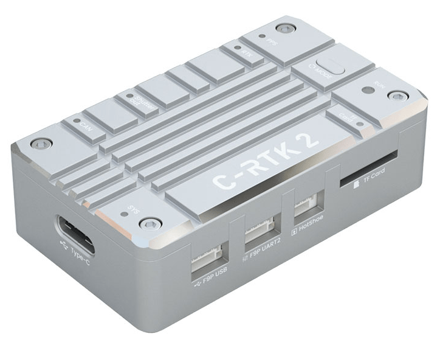
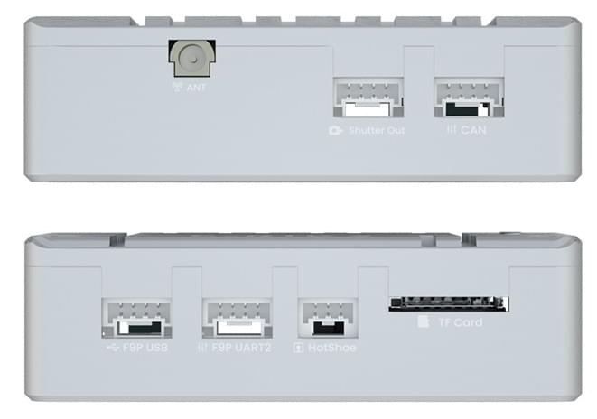
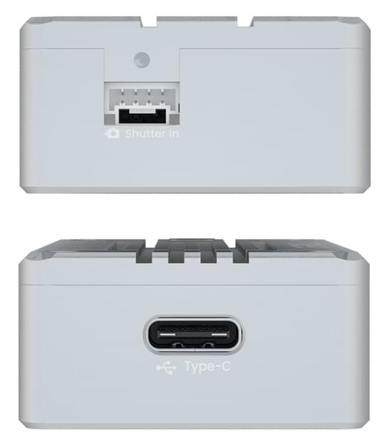
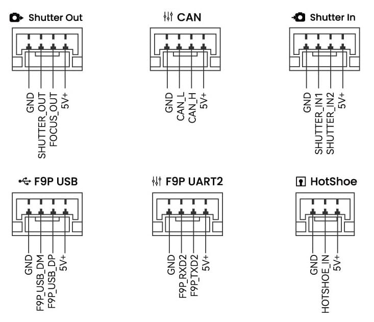

# CUAV C-RTK2 GNSS Module (RTK/PPK)

Приймач [CUAV C-RTK2](https://www.cuav.net/en/c_rtk_9ps/) - це високопродуктивний модуль позиціонування PPK/RTK, створений компанією CUAV для професійних застосувань, таких як аерофотозйомка та картографування з дронів. Він має високоточний IMU і модуль позиціонування, і може зменшити кількість необхідних [ контрольних точок](https://www.youtube.com/watch?v=3k7v5aXyuKQ) більш ніж на 80%. На додаток до зйомки/картографування, він підходить для багатьох інших випадків використання, включаючи: захист сільськогосподарських рослин та рої дронів.

## Інші характеристики

* Потужний процесор H7
* Високоточний IMU промислового класу
* Підтримка RTK та одночасне збереження необроблених даних RAW (PPK)
* Багатосупутникові та багаточастотні приймачі
* Протокол UAVCAN/Dronecan
* Support hotshoe and shutter trigger
* Режими HS_USB та U диск

## Де купити

* [CUAV Store](https://store.cuav.net/shop/c-rtk-2/)
* [CUAV aliexpress](https://pt.aliexpress.com/item/1005003754165772.html?spm=a2g0o.store_pc_groupList.8148356.13.2f893550i0NE4o)

# Короткий опис

* Приймач RTK
  * ZED-F9P
* Канал прийому
  * 184
* Головний FMU процесор
  * STM32H743VIH6(2M flash、1M RAM）
* Бортові сенсори:
  * Акселерометр/Гіроскоп: ICM20689
* Магнітометр: RM3100
  * Барометр: ICP10111
* Розширення TF-карти
  * 32G(MAX)
* PPK(post processed kinematic)
  * підтримка
* RTK(Real - time kinematic)
  * підтримка
* Діапазони GNSS
  * GPS:L1C/A,L2C
  * GLONASS:L1OF,L2OF
  * GALILEO: E1B/C E5b
  * Beidou:B1I B2I
* Покращена система
  * QZSS:L1C/A,L2C,L1S
  * SBAS:L1C/A
* Кількість одночасних GNSS
  * 4(GPS、GLONASS、GALILEO、Beidou）
* Nav. частота оновлення
  * RTK До 20 Гц
  * RAW До 25 Гц
  * default：5hz
* Convergence time
  * RTK < 10 sec
* Position accuracy（RMS)
  * RTK:0.01m+1ppm(level);0.02m+1ppm(vertical)
  * GPS:1.5m(level)
* Acquisition
  * Cold starts 24 s
  * Aided starts 2 s
  * Reacquisition 2 s
* Sensitivity
  * Tracking & Nav –167 dBm
  * Cold starts –148 dBm
  * Hot starts –157 dBm
  * Reacquisition –160 dBm
* Anti-spoofng
  * Advanced anti-spoofng algorithms
* Протоколи
  * NMEA
  * UBX binary
  * RTCM версія 3.x
* Часовий імпульс
  * 0.25 Гц ~ 10 Гц (налаштовується)
* Anti-jamming
  * Active CW detection and removal Onboard band pass flter
* Support flight control type
  * Compatible with flight controllers running PX4 firmware
* інтерфейс
  * 1 Hotshoe
  * 1 shutter in
  * 1 sutter out
  * 1 Type(HS_USB)
  * 1 F9P USB
  * 1 F9P UART
  * 1 Антена(mmcx)
* Напруга живлення
  * 4.5~6v
* Робоча температура
  * -20~85℃
* Розмір
  *  56x33x16.5mm
* Вага
  * 39g

## Налаштування

[CUAV Docs](https://doc.cuav.net/gps/c-rtk2/en/quick-start-c-rtk2.html)

## Розпіновка

## Більше інформації

[CUAV Docs](https://doc.cuav.net/gps/c-rtk-series/en/c-rtk-9ps/)

