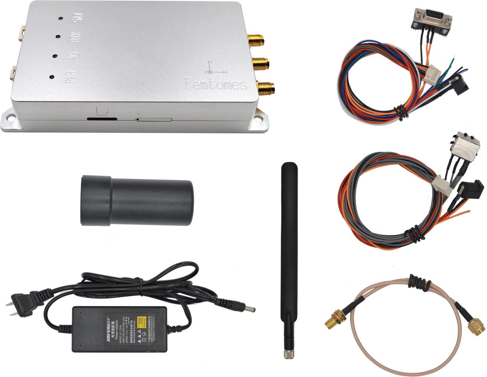

# Femtones MINI2 приймач

[MINI2 Receiver](http://www.femtomes.com/#/MiniII?type=0) - це RTK GPS-отримувач, який забезпечує високу швидкість і надійну ініціалізацію RTK для позиціонування на рівні сантиметрів. Він призначений для застосувань, які вимагають високоточного позиціонування (наприклад, навігація та картографування тощо).

Приймач підключений до PX4 через послідовний порт (UART) і може бути налаштований через Ethernet за допомогою стандартного веб-браузера.

:::info
Драйвери PX4 для Ethernet, CAN та USB знаходяться в стадії розробки.
:::

## Необхідні параметри прошивки

При купівлі пристрою необхідно вибрати наступні параметри вбудованого програмного забезпечення:
- 5Гц, 10Гц, 20Гц
- INS
- ЗАГОЛОВОК
- OBS
- RTK
- BASE

## Де придбати

Звертайтеся безпосередньо до [Femtones](http://www.femtomes.com/) для отримання комерційної пропозиції:
- **Email:** [sales@femtomes.com](mailto:sales@femtomes.com)
- **Телефон:** +86-10-53779838

## Функціональні Порти

## Підключення та з'єднання

[Приймач MINI2](http://www.femtomes.com) підключений до UART на контролері польоту (порт GPS) для передачі даних. Для живлення модуля вам знадобиться окреме джерело живлення 12В. Контакти на 12-контактному роз'ємі позначені, як показано нижче.

## Конфігурація

Для оцінювання заголовку потрібно, щоб дві антени були на одному рівні і були відстані щонайменше 30 см одна від одної. Напрям, у якому вони обертаються, не має значення, оскільки його можна налаштувати за допомогою параметра [GPS_YAW_OFFSET](../advanced_config/parameter_reference.md#GPS_YAW_OFFSET).

Налаштуйте послідовний порт, на якому буде працювати [Приймач MINI2](http://www.femtomes.com/#/MiniII?type=0), використовуючи [GPS_1_CONFIG](../advanced_config/parameter_reference.md#GPS_1_CONFIG), і встановіть швидкість передачі даних на 115200 за допомогою [SER_GPS1_BAUD](../advanced_config/parameter_reference.md#SER_GPS1_BAUD).

Після налаштування приймач використовується так само, як будь-який інший [RTK GPS](../gps_compass/rtk_gps.md) (тобто щодо процесу вивчення території).

## Додаткова інформація

MINI2 включає наступні компоненти:

- [FB672](http://www.femtomes.com/#/FB672): Компактна, подвійної антени, подвійної частоти платформа GNSS OEM (надає позицію з точністю в сантиметрах та точний курс).

  

- [FB6A0](http://www.femtomes.com/#/FB6A0): Компактна чотириразова апаратура GNSS OEM (забезпечує сантиметрову точність позиціювання)

  

Докладні інструкції щодо продукту можна отримати на офіційному веб-сайті або зв'язавшись з нами.
