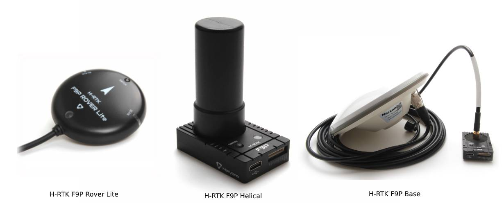

# Holybro H-RTK-F9P GNSS

Модель [Holybro H-RTK F9P GNSS](https://holybro.com/products/h-rtk-f9p-gnss-series) є багатосмуговою високоточною серією систем [RTK GNSS](../gps_compass/rtk_gps.md), запущеною Holybro. Ця сім'я подібна до серії [H-RTK M8P](../gps_compass/rtk_gps_holybro_h-rtk-m8p.md), але використовує багатосмуговий RTK зі швидшими часами зближення і надійною продуктивністю, одночасний прийом GPS, GLONASS, Galileo і BeiDou та швидше оновлення для високодинамічних та великов'язаних застосувань з точністю на рівні сантиметрів. Він використовує модуль u-blox F9P, компас IST8310 та індикатор з триколірним світлодіодом. Також в ньому є інтегрований вимикач безпеки для простої та зручної роботи.

Є три моделі Holybro H-RTK F9P на вибір, кожна з різним дизайном антени, щоб задовольнити різні потреби. Дивіться розділ [Характеристики та порівняння моделей](#specification-and-model-comparison) для отримання додаткової інформації.

Використовуючи RTK, PX4 може отримати своє положення з точністю до сантиметра, що набагато точніше, ніж може забезпечити звичайний GPS.

## Де придбати

* [H-RTK F9P (сайт Holybro)](https://holybro.com/products/h-rtk-f9p-gnss-series)
* [H-RTK Аксесуари (сайт Holybro)](https://holybro.com/collections/h-rtk-gps)

## Налаштування

Налаштування та використання RTK на PX4 за допомогою _QGroundControl_ відбувається за принципом "підключи і працюй" (див. [RTK GPS](../gps_compass/rtk_gps.md) для отримання додаткової інформації).

## Проводка та з'єднання

Моделі ГП-ШТК Вертолітного типу поставляються як з кабелями GH 10-pin, так і з 6-pin, які сумісні з портами GPS1 та GPS2 на контролерах польоту, що використовують Стандартний роз'єм Pixhawk, такі як [Pixhawk 4](../flight_controller/pixhawk4.md) та [Pixhawk 5x](../flight_controller/pixhawk5x.md).

H-RTK Rover Lite доступний у двох версіях. Стандартна версія поставляється з 10-контактним роз'ємом для порту `GPS1`. Версія "2nd GPS" поставляється з роз'ємом на 6 контактів для порту `GPS2`. Це використовується як додатковий GPS для [Подвійних GPS-систем](../gps_compass/index.md#dual_gps).

:::info Кабелі/конектори можуть потребувати модифікації для підключення до інших плат керування польотом (див. [карту штифтів](#pin-map) нижче).
:::

## Карта виводів

## Специфікація та порівняння моделей

## Аксесуари до GPS

[H-RTK кріплення (сайт Holybro)](https://holybro.com/products/vertical-mount-for-h-rtk-helical)

