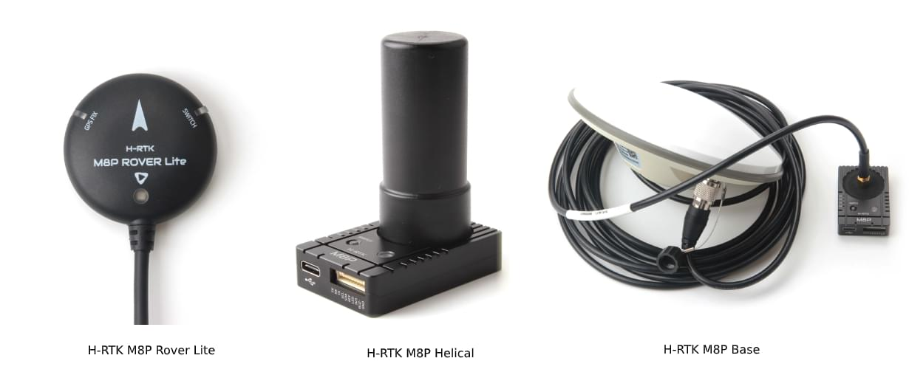

# Holybro H-RTK M8P GNSS (Знято з виробництва)

:::warning
Цей GNSS був вилучений з виробництва і більше не є комерційно доступним.
:::

[Holybro H-RTK M8P GNSS](https://holybro.com/collections/standard-h-rtk-series/products/h-rtk-m8p-gnss-series) - це модульна серія [RTK GNSS](../gps_compass/rtk_gps.md) для масового ринку. Ця родина схожа на серію [H-RTK M9P](../gps_compass/rtk_gps_holybro_h-rtk-f9p.md), але використовує менший, легший і дешевший модуль M8P u-blox RTK GNSS (який все ще забезпечує набагато кращу роздільну здатність позиції, ніж попередні покоління).

Є три моделі Holybro H-RTK M8P на вибір, кожна з різним дизайном антени, щоб задовольнити різні потреби. Дивіться розділ [Характеристики та порівняння моделей](#specification-and-model-comparison) для отримання додаткової інформації.

Використання RTK дозволяє PX4 отримати своє положення з точністю до сантиметрів, що набагато точніше, ніж може забезпечити звичайний GPS.

## Де купити

* [H-RTK M8P (Монтування GPS RTK)](https://holybro.com/products/vertical-mount-for-h-rtk-helical)

## Налаштування

Налаштування та використання RTK на PX4 за допомогою _QGroundControl_ відбувається за принципом "підключи і працюй" (див. [RTK GPS](../gps_compass/rtk_gps.md) для отримання додаткової інформації).

## Проводка та з'єднання

Всі моделі H-RTK GNSS приходяться з з'єднанням GH 10-контакт / кабель, сумісними з [Pixhawk 4](../flight_controller/pixhawk4.md).

:::info Кабелі/конектори можуть потребувати модифікації для підключення до інших плат керування польотом (див. [карту штифтів](#pin_map)нижче).
:::

## Карта виводів

## Специфікація та порівняння моделей

## Аксесуари до GPS

[Аксесуари GPS (Веб-сайт Holybro)](https://holybro.com/collections/gps-accessories)

