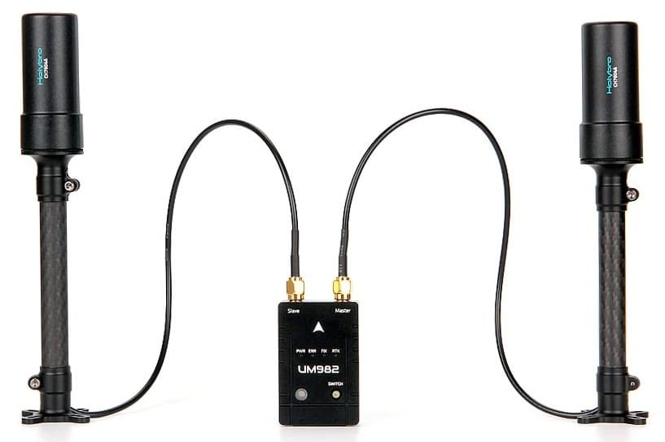

# Holybro H-RTK Unicore UM982 GPS

[Holybro H-RTK Unicore UM982 GPS](https://holybro.com/products/h-rtk-um982) - це багатодіапазонна високоточна [RTK GNSS система](../gps_compass/rtk_gps.md), випущена компанією Holybro.

Цей модуль базується на [Unicore UM982 Chip](https://en.unicorecomm.com/products/detail/24), який підтримує RTK позиціонування і розрахунок курсу з двома антенами.

Це означає, що він може генерувати рухому базову лінію визначення курсу/рискання для автопілотів з одним GPS-модулем і двома антенами - магнітометр не потрібен. На відміну від використання таких модулів, як U-blox F9P, де для обчислення курсового кута потрібно [ два модулі U-blox F9P](../gps_compass/u-blox_f9p_heading.md), з Unicore UM982 GPS вам знадобиться лише один GPS-модуль!

Використання цього GPS замість компаса запобігає виникненню магнітних перешкод, які можуть спричинити неправильні звіти автопілота (на компаси зазвичай впливають двигуни та електричні системи транспортного засобу, а також інші джерела зовнішніх перешкод, такі як металеві конструкції або обладнання). Це працює, навіть якщо GPS не отримує дані RTCM від стаціонарної станції RTK або сервера NTRIP. Він підтримує регулювання позиціонування RTK з сантиметровою точністю, системи глобального позиціонування GPS/ГЛОНАСС, Beidou, Galileo і QZSS.

Модуль також містить магнітометр, світлодіод і кнопку захисного перемикача. Він також слугує як транспортний GPS з RTK-корекцією, з визначенням рухомої базової лінії рискання або без неї, а також як базова станція GPS для надсилання даних RTCM на наземну станцію управління, щоб забезпечити джерело RTK для транспортного засобу за допомогою телеметрії.

Додаткову технічну інформацію можна знайти на сторінці [Holybro Technical Documentation page](https://docs.holybro.com/gps-and-rtk-system/h-rtk-unicore-um982)

## Де придбати

* [Holybro Website](https://holybro.com/products/h-rtk-um982)

## Підключення

Модуль постачається з обома кабелями GH 10-контактним & 6-контактним, які сумісні з портами GPS1 & GPS2 на польотних контролерах, що використовують [Pixhawk Connector Standard](https://github.com/pixhawk/Pixhawk-Standards/blob/master/DS-009%20Pixhawk%20Connector%20Standard.pdf), таких як [Pixhawk 6x](../flight_controller/pixhawk6x.md) і [Pixhawk 6c](../flight_controller/pixhawk6c.md).

Він також може використовуватися з польотним контролером Cubepilot. Кабель 10Pin - 6Pin дозволяє користувачам підключати UM982 до порту `GPS2` на автопілотах Cubepilot і Holybro.

Модуль можна використовувати з однією антеною або з обома антенами. Якщо пристрій використовується лише з однією антеною, необхідно підключити правий/первинний роз'єм антени.

## Конфігурація PX4

### Налаштування порту

Модуль Unicore використовує протокол NMEA, розширений деякими власними повідомленнями Unicore. Швидкість передачі даних (baudrate) для послідовного порту складає 230400.

Наступні параметри PX4 [мають бути встановлені](../advanced_config/parameters.md):

- [SER_GPS1_BAUD](../advanced_config/parameter_reference.md#SER_GPS1_BAUD) -> 230400
- [GPS_1_PROTOCOL](../advanced_config/parameter_reference.md#GPS_1_PROTOCOL) -> 6: NMEA

Зверніть увагу, що вищезазначені параметри передбачають, що ви підключені до `GPS 1`. Якщо ви використовуєте інший порт, вам слід використовувати його параметри для налаштування швидкості передачі даних та протоколу.

### Увімкнути Heading/Yaw GPS

Модуль Unicore поставляється з двома антенами, первинною (правий роз'єм) і вторинною (лівий роз'єм), які можна використовувати для отримання даних про рискання від GPS. Вам потрібно встановити наступні параметри:

- [EKF2_GPS_CTRL](../advanced_config/parameter_reference.md#EKF2_GPS_CTRL): Встановіть біт 3 (8), щоб увімкнути подвійний курс антени в оцінку рискання.
- [GPS_YAW_OFFSET](../advanced_config/parameter_reference.md#GPS_YAW_OFFSET): Встановити зміщення курсу на 0, якщо основна антена знаходиться спереду. Кут збільшується за годинниковою стрілкою, тому встановіть зміщення на 90 градусів, якщо основна антена знаходиться на правому боці транспортного засобу (а додаткова - на лівому).

### RTK Корекції

RTK працює так само, як і модулі uBlox F9P. Поправки RTCMv3, надіслані QGroundControl з базової станції RTK GPS, використовуються модулем Unicore, який потім повинен змінити тип виправлення на `RTK float` або `RTK fixed`.
