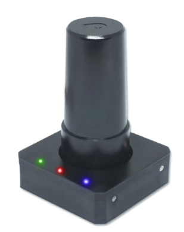
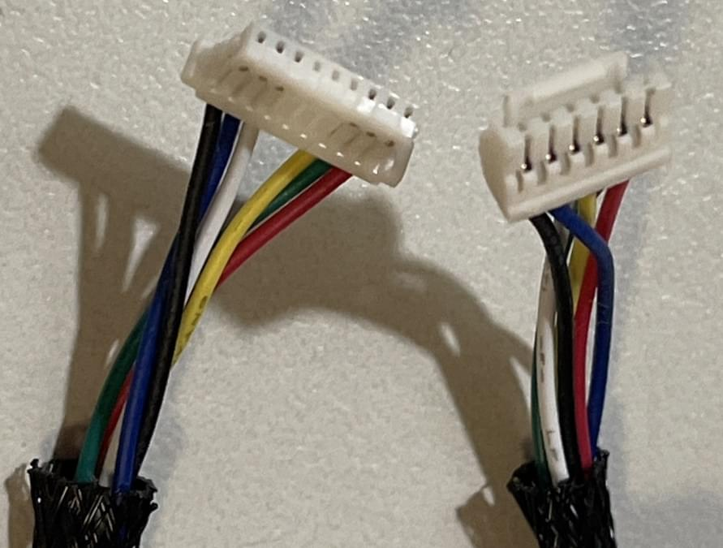
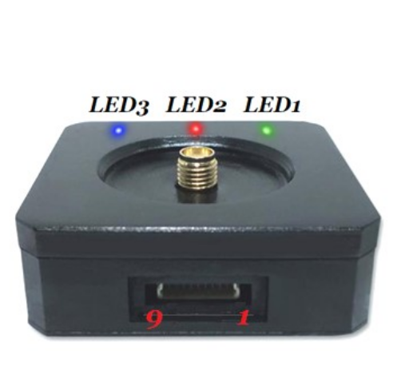

# Геодезичний компас LOCOSYS Hawk R2 RTK-GPS

<Badge type="tip" text="PX4 v1.13" />

[LOCOSYS Hawk R2](https://www.locosystech.com/en/product/hawk-r2.html) є двочастотним модулем [RTK GPS-приймачем](../gps_compass/rtk_gps.md), розробленим для сумісності з Pixhawk. Єдине відмінність між цим модулем та [LOCOSYS Hawk R1](rtk_gps_locosys_r1.md) полягає у наявності магнітометра на Hawk R2.

Модуль може діяти як RTK GPS ровер, коли встановлено на літак.

Отримувач здатний одночасно відстежувати всі глобальні цивільні навігаційні системи, включаючи GPS, GLONASS, GALILEO, BEIDOU і QZSS. Воно одночасно отримує сигнали як L1, так і L5, забезпечуючи точність RTK-позиціонування на рівні сантиметрів.

Вбудована легка гвинтова антена підвищує стабільність позиціювання RTK. Додатково, він обладнаний компасом. Швидкий час першої установки, збіжність RTK, вища чутливість, низьке споживання енергії роблять його кращим вибором для безпілотних літальних апаратів на базі Pixhawk.

## Основні характеристики

- Висока точність позиціонування на рівні сантиметра RTK + інтегрований магнітометр з 3 осями
- Одночасний прийом сигналів смуг L1 і L5
- Підтримка GPS, ГЛОНАСС, BEIDOU, GALILEO, QZSS
- Здатний до SBAS (WAAS, EGNOS, MSAS, GAGAN)
- Підтримка GNSS з 135 каналами
- Швидкий TTFF на низькому рівні сигналу
- Безкоштовне гібридне передбачення ефемерид для досягнення швидкого холодного запуску
- Стандартна частота оновлення 5 Гц, до 10 Гц (підтримка SBAS лише 5 Гц)
- Вбудований суперконденсатор для резервування системних даних для швидкого отримання супутників
- Вбудована функція компасу 3-х вимірів
- Три світлодіодного індикатора для живлення, PPS та передачі даних

## Де купити

* [LOCOSYS Hawk R2](https://www.locosystech.com/en/product/hawk-r2.html)

## Вміст набору

Набір RTK GPS включає в себе:
- 1x Модуль GPS
- 1x Геліксова антена
- 1x 6-пінний кабель готовий до JST

## Проводка та з'єднання

Hawk R2 RTK GPS поставляється з роз'ємом JST на 6 контактів, який можна підключити до порту GPS2 на автопілотах стандарту Pixhawk.

Це також може бути використано на інших портах UART, але вам доведеться підключити й налаштувати використаний порт. Нижче наведено роз'єм для надання вам можливості створити власний кабель.

### Схема розташування виводів

LOCOSYS GPS pinout is provided below.

| Pin | Hawk R2 GPS |
| --- | ----------- |
| 1   | VCC_5V      |
| 2   | GPS_RX      |
| 3   | GPS_TX      |
| 4   | GNSS_PPS    |
| 5   | Null        |
| 6   | Null        |
| 7   | I2C_CLK     |
| 8   | I2C_DAT     |
| 9   | GND         |

## PX4 Configuration

After connecting your Hawk R2 to the `GPS2` port on compatible Pixhawk boards, RTK setup and use on PX4 via *QGroundControl* is largely plug and play. For more information see: [RTK GPS](../gps_compass/rtk_gps.md#positioning-setup-configuration).

Ви також повинні налаштувати послідовний порт, який ви використовуєте на правильну швидкість передачі даних. Якщо ви використовуєте GPS2, встановіть параметр [SER_GPS2_BAUD](../advanced_config/parameter_reference.md#SER_GPS2_BAUD) на 230400 8N1.

Компас вимагає лише звичайного [Калібрування Компасу](../config/compass.md).

## Індикатори статусу LEDs

| Колір | Name            | Опис                               |
| ----- | --------------- | ---------------------------------- |
| Green | TX Indicator    | GNSS Data transmission             |
| Red   | Power Indicator | Power                              |
| Blue  | PPS             | Precise Positioning Service active |

## Специфікація

- Frequency
  - GPS/QZSS: L1 C/A, L5C
  - GLONASS: L1OF
  - BEIDOU: B1I, B2a
  - GALILEO: E1, E5a
- 135 Channels support
- Up to 10 Hz update rate (default to 5Hz)
- Acquisition Time
  - Hot start (Open Sky) in 2 seconds
  - Cold Start (Open Sky) in 28 seconds without AGPS
- PPS with 100ms pulse width, 1.8Vdc
- External, active Helix antenna
  - SMA connector
- UBlox Protocol Support
  - U5Hz:UBX-NAV-PVT,UBX-NAV-DOP
  - 1Hz: UBX-NAV-TIMEGPS
- Connectivity:
  - 6-pin JST-GH UART/I2C (Pixhawk compatible)
- Power:
  - DC supply voltage 3.3V ~ 5.0V input
  - Power consumption <1W

## Докладніше

Більше інформації можна знайти на [LOCOSYS Hawk R2](https://www.locosystech.com/en/product/hawk-r2.html)
