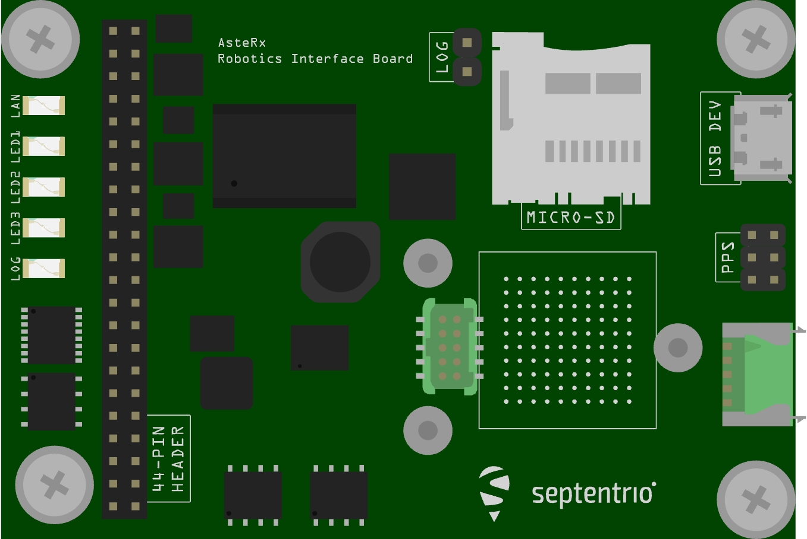
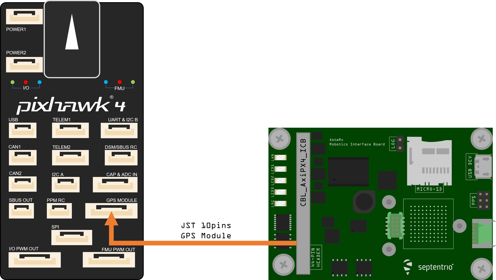

# AsteRx OEM з інтерфейсом робототехніки

Septentrio - провідний постачальник OEM GPS / GNSS приймачів по всьому світу. Пристрої Septentrio OEM надають точні і надійні позиції для вимогливих промислових застосувань у невеликому, легкому форм-факторі. Є кілька варіантів двохполюсного антенного приймача, які дозволяють злити інформацію GPS в заголовок (інша інформація про атитуду також може бути визначена, але PX4 не зливає її).

Інерційна інтеграція сенсорів сімейства AsteRx-i надає повне рішення щодо орієнтації (азимут, крен та кривина), синхронізоване з точним позиціонуванням.

Платка інтерфейсу робототехніки, сполучена з платами приймача GNSS від Septentrio, надає загальні інтерфейси такі як USB, Ethernet, журналювання на платі та інші функції, що призначені для швидкого прототипування, оцінки продукту або ефективної інтеграції.

## Основні характеристики

- Плати розміром з кредитну картку з низьким споживанням енергії
- Легко інтегрується в будь-яку систему
- Найкраща продуктивність RTK з справжньою технологією багаточастотного ГНСС на основі кількох констелляцій
- Advanced Interference Mitigation (AIM+) anti-jamming and anti-spoofing technology
- Resilient to vibrations and shocks
- 44 pins I/O connector for autopilots such as Pixhawk
- On-board logging
- Micro USB connector
- Size: 71.53 x 47.5 x 18.15 mm
- Weight = 50g

## Купівля

Усі приймачі AsteRx та Роботизовані Інтерфейсні Плати можна придбати в інтернет-магазині Septentrio:

- [AsteRx-m3 Pro](https://web.septentrio.com/l/858493/2022-04-19/xgrrz)
- [AsteRx-m3 Pro+](https://web.septentrio.com/l/858493/2022-04-19/xgrs3)

Інші PX4 підтримувані пристрої серфінгу:
- [набір для оцінки mosaic-go](../gps_compass/septentrio_mosaic-go.md)

## Інтерфейси

### USB
_Тип підключення: micro-USB тип._

Роз'єм micro USB типу B може бути підключений до ПК для живлення приймача та спілкування з ним через його USB-порт.

### 44-контактний роз'єм
_Тип роз'єму: SAMTEC TMM-122-03-S-D, крок 2 мм._

44-контактний заголовок можна використовувати для підключення кількох пристроїв GPIO. Дивіться [посібник з апаратного забезпечення](https://web.septentrio.com/l/858493/2022-04-19/xgrsw) для роз'ємов.

### Світлодіоди

Піни світлодіоду можуть бути використані для моніторингу статусу отримувача. Вони можуть бути використані для керування зовнішніми світлодіодами (максимальний струм управління 10 мА). Припускається, що світлодіод загориться, коли електричний рівень відповідного контакту буде високий. Загального призначення світлодіод (пін GPLED) конфігурується командою setLEDMode.

### Заголовок кнопки журнала

Надійне підключення контактів в колодку кнопки ЖУРНАЛУ (.100-дюймова вертикальна колодка) еквівалентно натисканню кнопки «протокол». Плата інтерфейсу відповідає за детектування дребізгу.

### Заголовок PPS/Подій

_Тип роз'єму: SAMTEC TMM-103-03-G-D, крок 2 мм._

6-контактний голівка 2 мм поряд з роз'ємом micro USB виносить перший сигнал PPS.

### Варіанти джерел живлення

Коли кабель USB підключений до роз'єму micro USB, плата інтерфейсу живиться від комп'ютера через роз'єм USB. Альтернативно, живлення може бути подано з контактів PWR_IN роз'єму з 44 контактами. Діапазон напруги при живленні з контактів PWR_IN становить від 4,5В до 30В. Електроживлення можна подавати одночасно з обох джерел. На борту діоди запобігають коротким замиканням. Дошка інтерфейсу надає живлення 3V3 приймачу OEM AsteRx-m3 та напругу постійного струму 5V до контакту VANT приймача OEM AsteRx-m3.

## Встановлення обладнання

1. Переконайтеся, що приймач живиться щонайменше 3,3 В. Ви можете використовувати роз'єм micro USB або відкритий живлення (позначений "PWR & GND") на 44-контактному кабелі для цього.
3. Підключіть одну або дві антени GNSS до зовнішніх антенних портів щодо плати AsteRx-i3 D.
4. Підключіть 44-контактний кабель до плати AsteRx-i3 D на RIB та підключіть 10-контактний роз'єм JST до порту `МОДУЛЯ GPS` на Pixhawk 4, як показано на діаграмі вище.
5. У веб-інтерфейсі або за допомогою інструментів Rx встановіть швидкість передачі даних приймача на 115200 **Admin > Expert Control > Control Panel > Communication > COM Port Settings** (це значення за замовчуванням).

:::info

PX4 забезпечить автоматичну конфігурацію модуля GNSS. Проте, якщо у вас є подвійна антенна установка, вам потрібно налаштувати макет якнай точніше в веб-додатку.
:::

### Подвійна антена

Ставлення (клін/тангаж) може бути обчислене з орієнтації базової лінії між основною та допоміжною антенами GNSS aux1.

Для забезпечення визначення багатоантенного стану слід дотримуватися наступної процедури:

1. Приєднайте дві антени до вашого автомобіля, використовуючи кабелі приблизно однакової довжини. Конфігурація за замовчуванням антени відповідає зображеному на малюнку. Це полягає у розташуванні антен, вирівняних з віссю транспортного засобу, основна антена за AUX1. Для найкращої точності спробуйте максимізувати відстань між антенами та уникайте значних висотних відмінностей між ЛАР антенами.
2. На практиці дві антени ARPs можуть не бути розташовані на однаковій висоті в рамі транспортного засобу, або базова лінія головна-допоміжна1 може не бути абсолютно паралельною або перпендикулярною до поздовжньої вісі транспортного засобу. Це призводить до зміщень у обчислених кутах нахилу. Ці зрушення можна компенсувати за допомогою команди **setAttitudeOffset**.

:::info

Для оптимальних результатів підпису, дві антени повинні бути відокремлені принаймні на 30 см / 11,8 дюйма (ідеально 50 см /19,7 дюйма або більше)

Для додаткової настройки двох антен, будь ласка, зверніться до нашої [бази знань](https://support.septentrio.com/l/858493/2022-04-19/xgrsh) або [керівства з обслуговування](https://web.septentrio.com/l/858493/2022-04-19/xgrsl)
:::

### Веб-додаток

модуль приймача GPS/GNSS з компасом mosaic-H поставляється з повністю задокументованими інтерфейсами, командами та даними повідомленнями. Включене програмне забезпечення керування та аналізу приймача GNSS [RxTools](https://web.septentrio.com/l/858493/2022-04-19/xgrss) дозволяє настроювання приймача, моніторинг, а також реєстрацію та аналіз даних.

Отримувач містить інтуїтивний веб-інтерфейс користувача для легкої роботи та контролю, що дозволяє вам керувати отримувачем з будь-якого мобільного пристрою або комп'ютера. Веб-інтерфейс також використовує легко читані показники якості, ідеальні для контролю операції приймача під час виконання завдання.

## Налаштування PX4

### Одинарна антена

Редагуйте наступні параметри на вкладці GPS:

- [GPS_1_CONFIG](../advanced_config/parameter_reference.md#GPS_1_CONFIG): TELEM1
- [GPS_1_GNSS](../advanced_config/parameter_reference.md#GPS_1_GNSS): 31
- [Протокол GPS_1_PROTOCOL](../advanced_config/parameter_reference.md#GPS_1_PROTOCOL): Автоматичне визначення (або SBF)
- [SER_TEL1_BAUD](../advanced_config/parameter_reference.md#SER_TEL1_BAUD): 115200 8N1

Перейдіть до **Інструменти > Перезавантаження Транспортного Засобу**

### Подвійна антена

Редагуйте наступні параметри на вкладці GPS:

- [GPS_1_CONFIG](../advanced_config/parameter_reference.md#GPS_1_CONFIG): TELEM1
- [GPS_1_GNSS](../advanced_config/parameter_reference.md#GPS_1_GNSS): 31
- [Протокол GPS_1_PROTOCOL](../advanced_config/parameter_reference.md#GPS_1_PROTOCOL): Автоматичне визначення (або SBF)
- [SER_TEL1_BAUD](../advanced_config/parameter_reference.md#SER_TEL1_BAUD): 115200 8N1
- [EKF2_GPS_CTRL](../advanced_config/parameter_reference.md#EKF2_GPS_CTRL): Додайте біт 3 (подвійний кут антени), який додається до
- [GPS_YAW_OFFSET](../advanced_config/parameter_reference.md#GPS_YAW_OFFSET): встановіть згідно з вашим налаштуванням

Перейдіть до **Інструменти > Перезавантаження Транспортного Засобу**

:::tip

Якщо ви хочете отримати більш детальну інформацію про AsteRx та Robotics Interface Board, будь ласка, зверніться до [інструкції з експлуатації апаратного забезпечення](https://web.septentrio.com/l/858493/2022-04-19/xgrsw) або сторінки [підтримки компанії Septentrio](https://support.septentrio.com/l/858493/2022-04-19/xgrsz). :::
