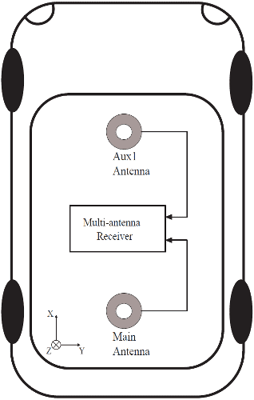

# AsteRx OEM with Robotics Interface Board

Septentrio - провідний постачальник OEM GPS / GNSS приймачів по всьому світу. Пристрої Septentrio OEM надають точні і надійні позиції для вимогливих промислових застосувань у невеликому, легкому форм-факторі. Є кілька варіантів двохполюсного антенного приймача, які дозволяють злити інформацію GPS в заголовок (інша інформація про атитуду також може бути визначена, але PX4 не зливає її).

Інерційна інтеграція сенсорів сімейства AsteRx-i надає повне рішення щодо орієнтації (азимут, крен та кривина), синхронізоване з точним позиціонуванням.

Платка інтерфейсу робототехніки, сполучена з платами приймача GNSS від Septentrio, надає загальні інтерфейси такі як USB, Ethernet, журналювання на платі та інші функції, що призначені для швидкого прототипування, оцінки продукту або ефективної інтеграції.

## Основні характеристики

- Плати розміром з кредитну картку з низьким споживанням енергії
- Легко інтегрується в будь-яку систему
- Найкраща продуктивність RTK з справжньою технологією багаточастотного ГНСС на основі кількох констелляцій
- Advanced Interference Mitigation (AIM+) anti-jamming and anti-spoofing technology
- Resilient to vibrations and shocks
- 44 pins I/O connector for autopilots such as Pixhawk
- On-board logging
- Micro USB connector
- Size: 71.53 x 47.5 x 18.15 mm
- Weight = 50g

## Purchase

Усі приймачі AsteRx та Роботизовані Інтерфейсні Плати можна придбати в інтернет-магазині Septentrio:

- [AsteRx-m3 Pro](https://web.septentrio.com/l/858493/2022-04-19/xgrrz)
- [AsteRx-m3 Pro+](https://web.septentrio.com/l/858493/2022-04-19/xgrs3)

Other PX4 supported devices from Septentrio:
- [mosaic-go evaluation kit](../gps_compass/septentrio_mosaic-go.md)

## Інтерфейси

### USB
_Connector type: micro-USB type B._

Роз'єм micro USB типу B може бути підключений до ПК для живлення приймача та спілкування з ним через його USB-порт.

### 44-контактний роз'єм
_Тип роз'єму: SAMTEC TMM-122-03-S-D, крок 2 мм._

44-контактний заголовок можна використовувати для підключення кількох пристроїв GPIO. Дивіться [посібник з апаратного забезпечення](https://web.septentrio.com/l/858493/2022-04-19/xgrsw) для роз'ємов.

### Світлодіоди

Піни світлодіоду можуть бути використані для моніторингу статусу отримувача. Вони можуть бути використані для керування зовнішніми світлодіодами (максимальний струм управління 10 мА). Припускається, що світлодіод загориться, коли електричний рівень відповідного контакту буде високий. Загального призначення світлодіод (пін GPLED) конфігурується командою setLEDMode.

### Заголовок кнопки журнала

Надійне підключення контактів в колодку кнопки ЖУРНАЛУ (.100-дюймова вертикальна колодка) еквівалентно натисканню кнопки «протокол». The interface board takes care of debouncing.

### PPS/Event Header

_Connector type: SAMTEC TMM-103-03-G-D, 2-mm pitch._

The 6-pin 2mm header next to the micro USB connector exposes the first PPS signal.

### Power Supply Options

Коли кабель USB підключений до роз'єму micro USB, плата інтерфейсу живиться від комп'ютера через роз'єм USB. Альтернативно, живлення може бути подано з контактів PWR_IN роз'єму з 44 контактами. Діапазон напруги при живленні з контактів PWR_IN становить від 4,5В до 30В. Електроживлення можна подавати одночасно з обох джерел. На борту діоди запобігають коротким замиканням. Дошка інтерфейсу надає живлення 3V3 приймачу OEM AsteRx-m3 та напругу постійного струму 5V до контакту VANT приймача OEM AsteRx-m3.

## Встановлення обладнання

1. Переконайтеся, що приймач живиться щонайменше 3,3 В. Ви можете використовувати роз'єм micro USB або відкритий живлення (позначений "PWR & GND") на 44-контактному кабелі для цього.
3. Підключіть одну або дві антени GNSS до зовнішніх антенних портів щодо плати AsteRx-i3 D.
4. Підключіть 44-контактний кабель до плати AsteRx-i3 D на RIB та підключіть 10-контактний роз'єм JST до порту `МОДУЛЯ GPS` на Pixhawk 4, як показано на діаграмі вище.
5. In the web interface or with Rx Tools, set the receiver's baut rate to 115200 **Admin > Expert Control > Control Panel > Communication > COM Port Settings** (this is the default value).

::: info

PX4 забезпечить автоматичну конфігурацію модуля GNSS. Проте, якщо у вас є подвійна антенна установка, вам потрібно налаштувати макет якнай точніше в веб-додатку.
:::

### Dual antenna

Ставлення (клін/тангаж) може бути обчислене з орієнтації базової лінії між основною та допоміжною антенами GNSS aux1.

Для забезпечення визначення багатоантенного стану слід дотримуватися наступної процедури:

1. Приєднайте дві антени до вашого автомобіля, використовуючи кабелі приблизно однакової довжини. Конфігурація за замовчуванням антени відповідає зображеному на малюнку. Це полягає у розташуванні антен, вирівняних з віссю транспортного засобу, основна антена за AUX1. Для найкращої точності спробуйте максимізувати відстань між антенами та уникайте значних висотних відмінностей між ЛАР антенами.
2. На практиці дві антени ARPs можуть не бути розташовані на однаковій висоті в рамі транспортного засобу, або базова лінія головна-допоміжна1 може не бути абсолютно паралельною або перпендикулярною до поздовжньої вісі транспортного засобу. Це призводить до зміщень у обчислених кутах нахилу. Ці зрушення можна компенсувати за допомогою команди **setAttitudeOffset**.

::: info

For optimal heading results, the two antennas should be seperated by at least 30cm / 11.8 in (ideally 50cm / 19.7in or more)

Для додаткової настройки двох антен, будь ласка, зверніться до нашої [бази знань](https://support.septentrio.com/l/858493/2022-04-19/xgrsh) або [керівства з обслуговування](https://web.septentrio.com/l/858493/2022-04-19/xgrsl)
:::

### Веб-додаток

модуль приймача GPS/GNSS з компасом mosaic-H поставляється з повністю задокументованими інтерфейсами, командами та даними повідомленнями. Включене програмне забезпечення керування та аналізу приймача GNSS [RxTools](https://web.septentrio.com/l/858493/2022-04-19/xgrss) дозволяє настроювання приймача, моніторинг, а також реєстрацію та аналіз даних.

Отримувач містить інтуїтивний веб-інтерфейс користувача для легкої роботи та контролю, що дозволяє вам керувати отримувачем з будь-якого мобільного пристрою або комп'ютера. Веб-інтерфейс також використовує легко читані показники якості, ідеальні для контролю операції приймача під час виконання завдання.

## Налаштування PX4

### Single antenna

Edit the following parameters in the GPS tab:

- [GPS_1_CONFIG](../advanced_config/parameter_reference.md#GPS_1_CONFIG): TELEM1
- [GPS_1_GNSS](../advanced_config/parameter_reference.md#GPS_1_GNSS): 31
- [GPS_1_PROTOCOL](../advanced_config/parameter_reference.md#GPS_1_PROTOCOL): Auto detect ( or SBF)
- [SER_TEL1_BAUD](../advanced_config/parameter_reference.md#SER_TEL1_BAUD): 115200 8N1

Go to **Tools > Reboot Vehicle**

### Dual antenna

Edit the following parameters in the GPS tab:

- [GPS_1_CONFIG](../advanced_config/parameter_reference.md#GPS_1_CONFIG): TELEM1
- [GPS_1_GNSS](../advanced_config/parameter_reference.md#GPS_1_GNSS): 31
- [GPS_1_PROTOCOL](../advanced_config/parameter_reference.md#GPS_1_PROTOCOL): Auto detect (or SBF)
- [SER_TEL1_BAUD](../advanced_config/parameter_reference.md#SER_TEL1_BAUD): 115200 8N1
- [EKF2_GPS_CTRL](../advanced_config/parameter_reference.md#EKF2_GPS_CTRL): Bit 3 Dual antenna heading
- [GPS_YAW_OFFSET](../advanced_config/parameter_reference.md#GPS_YAW_OFFSET): set according to your setup

Go to **Tools > Reboot Vehicle**

:::tip

If you want more detailed information about the AsteRx and the Robotics Interface Board, please refer to the [hardware manual](https://web.septentrio.com/l/858493/2022-04-19/xgrsw) or the [Septentrio Support](https://support.septentrio.com/l/858493/2022-04-19/xgrsz) page. :::
