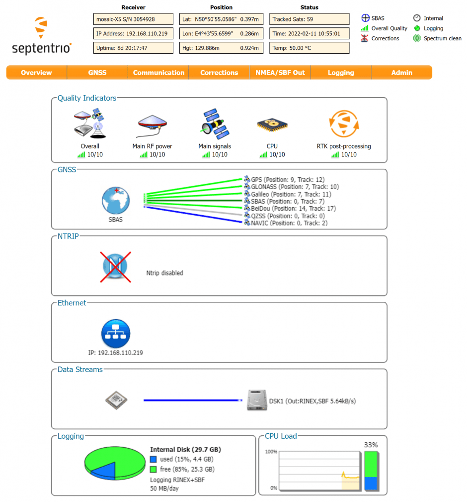

# Діагностичний набір mosaic-go Septentrio

Оціночний комплект mosaic-go складається з модуля mosaic, розпаяного на інтерфейсній платі всередині металевого корпусу.

Розміром всього 71 х 59 х 12 мм і вагою всього 58 г, mosaic-go пропонує неперевершений співвідношення розміру до продуктивності. mosaic-go містить:

- Висока швидкість оновлення (>100 Гц) та низька затримка, обидва важливі для систем управління автономних додатків
- Надійне позиціонування на рівні декількох сантиметрів
- Повна підтримка L2 через код P(Y)

  Номер частини Mosaic-go: Версія з однією антеною, яка включає mosaic-X5: 410386 (включаючи аксесуари). Подвійна антенна версія, включаючи мозаїчне-H: 410397 (включаючи аксесуари).

- Розмір: 71 x 59 x 12 мм ± 1 мм
- Вага: 58г ± 1г

## Купівля

Набір mosaic-go доступний у [офіційному магазині](https://web.septentrio.com/l/858493/2022-04-19/xgrnz) Septentrio.

- [набір для оцінки модуля GNSS mosaic-go](https://web.septentrio.com/l/858493/2022-04-19/xgrp9)
- [набір для оцінки приймача GNSS-модуля mosaic-go](https://web.septentrio.com/l/858493/2022-04-19/xgrpd)

Інші пристрої з підтримкою PX4 від Septentrio:

- [AsteRx OEM з Robotics Interface Board](../gps_compass/septentrio_asterx-rib.md)

## Набір для оцінки заголовка mosaic-go містить:

- 1 модуль mosaic-H або mosaic-X5, зварений на інтерфейсну плату всередині металевого корпусу.
- 1 USB кабель
- Кабель COM1 з відкритими контактами на 6 контактів
- Кабель з відкритим кінцем COM2 на 4 контактній роз'єм
- Довідник користувача карта

## Інтерфейси

### USB-C
_Тип роз'єму: мікро-USB типу B._

Цей мікро-B роз'єм використовується для доступу до mosaic-go через USB. Це також може бути використано для живлення мозаїки-go.

### RSV USB
_Тип підключення: micro-USB type B._

Цей з'єднувач зарезервований і не повинен використовуватися.

### RF_IN1 та RF_IN2
_Тип роз'єму: SMA._

Це основні та додаткові роз'єми антен, підключені до контактів ANT_1 та ANT_2 внутрішнього мозаїчного. Mosaic-go надає живлення постійного струму 5 В по обох роз'ємах антени. Спільне споживання потужності основної та допоміжної антени не повинно перевищувати 150 мА.

Зверніть увагу, що RF_IN2 доступний лише на двох антенах mosaic-go.

### Карта TF
_Тип роз'єму: MicroSD._

Роз'єм для картки micro SD. Модуль може зберігати файли (SBF/NMEA) на картку micro SD у цьому гнізді.

### 6-pin Connector
_Connector type: GH connector, 1.25mm pitch, 6 way. Mating connector housing: GHR-06V-S._

| Назва виводу | Напрямок | Рівень     | Опис                      | Коментар                                                         |
| ------------ | -------- | ---------- | ------------------------- | ---------------------------------------------------------------- |
| VCC          | PWR      | 4.75V-5.5V | Головне джерело живлення  |                                                                  |
| GND          |          | 0          | Ground                    |                                                                  |
| TXD1         | Out      | 3V3_LVTTL  | Serial COM1 transmit line | Підключається безпосередньо до TXD1 внутрішньої mosaic           |
| RXD1         | In       | 3V3_LVTTL  | Serial COM1 receive line  | Підключається безпосередньо до RXD1 внутрішньої mosaic           |
| PPS          | Out      | 3V3_LVTTL  | PPSoutput                 | PPSO з mosaic перетворений на 3,3 В                              |
| EVENT        | In       | 3V3_LVTTL  | Вхідний таймер події      | Підключається до EVENTA mosaic через транслятор рівня 3V3 на 1V8 |

### 4-pin Connector
_Connector type: GH connector, 1.25mm pitch, 4way. Mating connector housing: GHR-04V-S._

| Назва виводу | Напрямок | Рівень    | Опис                      | Коментар                                        |
| ------------ | -------- | --------- | ------------------------- | ----------------------------------------------- |
| NRST         | In       | 3V3_LVTTL | Reset input               | Directly connects to nRST_IN of internal mosaic |
| TXD2         | Out      | 3V3_LVTTL | Serial COM2 transmit line | Directly connects to TXD2 of internal mosaic    |
| RXD2         | In       | 3V3_LVTTL | Serial COM2 receive line  | Directly connects to RXD2 of internal mosaic    |
| GND          |          | 0         | Ground                    |                                                 |

## Налаштування обладнання

1. Переконайтеся, що приймач живиться щонайменше 3,3 В. Ви можете використовувати роз'єм micro USB або 6-контактний роз'єм.
2. Підключіть одну або дві антени GNSS до портів RF-IN на пристрої mosaic-go.
3. Підключіть 6-контактний коннектор (COM1) до роз'єму `GPS MODULE` Pixhawk. Це забезпечить живлення для mosaic-go, і за допомогою цього одного з'єднання він зможе надсилати інформацію про одинарну та подвійну антени до Pixhawk 4.
4. У веб-інтерфейсі або за допомогою інструментів Rx встановіть швидкість передачі даних приймача на 115200 **Admin > Expert Control > Control Panel > Communication > COM Port Settings** (це значення за замовчуванням).

:::warning
Переконайтеся, що кабель JST підключено правильно (оскільки це не стандартний кабель):

:::

::: інформація
PX4 гарантує, що модуль GNSS буде автоматично налаштований, однак, якщо у вас встановлено подвійну антену, необхідно встановити компонування якнайточніше в веб-додатку.
:::

### Подвійна антена

Ставлення (клін/тангаж) може бути обчислене з орієнтації базової лінії між основною та допоміжною антенами GNSS aux1.

Для забезпечення визначення багатоантенного стану слід дотримуватися наступної процедури:

1. Приєднайте дві антени до вашого автомобіля, використовуючи кабелі приблизно однакової довжини. Конфігурація антени за замовчуванням така, як показано на малюнку. Це полягає у розташуванні антен, вирівняних з віссю транспортного засобу, основна антена за AUX1. Для найкращої точності спробуйте максимізувати відстань між антенами та уникайте значних висотних відмінностей між ЛАР антенами.
2. На практиці дві антени ARPs можуть не бути розташовані на однаковій висоті в рамі транспортного засобу, або базова лінія головна-допоміжна1 може не бути абсолютно паралельною або перпендикулярною до поздовжньої вісі транспортного засобу. Це призводить до зміщень у обчислених кутах нахилу. Ці зрушення можна компенсувати за допомогою команди **setAttitudeOffset**.

::: info
Для оптимальних результатів підпису, дві антени повинні бути відокремлені принаймні на 30 см / 11,8 дюйма (ідеально 50 см / 19,7 дюйма або більше)

Для додаткової настройки двох антен, будь ласка, зверніться до нашої [бази знань](https://support.septentrio.com/l/858493/2022-04-19/xgrqd) або [керівства з обслуговування](https://web.septentrio.com/l/858493/2022-04-19/xgrql)
:::

### Веб-додаток

модуль приймача GPS/GNSS з компасом mosaic-H поставляється з повністю задокументованими інтерфейсами, командами та даними повідомленнями. Включене програмне забезпечення керування та аналізу приймача GNSS [RxTools](https://web.septentrio.com/l/858493/2022-04-19/xgrqp) дозволяє настроювання приймача, моніторинг, а також реєстрацію та аналіз даних.

Отримувач містить інтуїтивний веб-інтерфейс користувача для легкої роботи та контролю, що дозволяє вам керувати отримувачем з будь-якого мобільного пристрою або комп'ютера. Веб-інтерфейс також використовує легко читані показники якості, ідеальні для контролю операції приймача під час виконання завдання.

## Налаштування PX4

### Одинарна антена

Відредагуйте наступні параметри на вкладці GPS:

- [GPS_1_CONFIG](../advanced_config/parameter_reference.md#GPS_1_CONFIG): GPS 1
- [GPS_1_GNSS](../advanced_config/parameter_reference.md#GPS_1_GNSS): 31
- [Протокол GPS_1_PROTOCOL](../advanced_config/parameter_reference.md#GPS_1_PROTOCOL): Автоматичне визначення (або SBF)
- [SER_GPS1_BAUD](../advanced_config/parameter_reference.md#SER_GPS1_BAUD): 115200 8N1

Перейдіть до **Інструменти > Перезавантаження Транспортного Засобу**

### Подвійна антена

Редагуйте наступні параметри на вкладці GPS:

- [GPS_1_CONFIG](../advanced_config/parameter_reference.md#GPS_1_CONFIG): GPS 1
- [GPS_1_GNSS](../advanced_config/parameter_reference.md#GPS_1_GNSS): 31
- [Протокол GPS_1_PROTOCOL](../advanced_config/parameter_reference.md#GPS_1_PROTOCOL): Автоматичне визначення (або SBF)
- [SER_GPS1_BAUD](../advanced_config/parameter_reference.md#SER_GPS1_BAUD): 115200 8N1
- [EKF2_GPS_CTRL](../advanced_config/parameter_reference.md#EKF2_GPS_CTRL): Додайте біт 3 (подвійний кут антени), який додається до 15
- [GPS_PITCH_OFFSET](../advanced_config/parameter_reference.md#GPS_PITCH_OFFSET): встановіть відповідно до вашої настройки (зауважте, що Aux впереді під час нульового зміщення)
- [GPS_YAW_OFFSET](../advanced_config/parameter_reference.md#GPS_YAW_OFFSET): встановіть відповідно до вашої настройки (зауважте, що Aux спрямована вперед при нульовому зміщенні)

Перейдіть до **Інструменти > Перезавантаження Транспортного Засобу**

## Статус LED

| Колір світлодіоду | Живлення | SD карта змонтована | PVT Solution | Logging enabled |
| ----------------- |:--------:|:-------------------:|:------------:|:---------------:|
| Red               | &check;️ |                     |              |                 |
| Green             | &check;️ |      &check;️       |              |                 |
| Blue              | &check;️ |      &check;️       |   &check;️   |                 |
| Purple            | &check;️ |                     |   &check;️   |                 |
| Purple + Blue     | &check;️ |      &check;️       |   &check;️   |    &check;️     |
| Red + Green       | &check;️ |      &check;️       |              |    &check;️     |

:::tip
Для більш детальної інформації про mosaic-go та його модуль, будь ласка, зверніться до [посібника з апаратного забезпечення](https://web.septentrio.com/l/858493/2022-04-19/xgrrd) або сторінки [Підтримка Septentrio](https://support.septentrio.com/l/858493/2022-04-19/xgrrl).
:::

