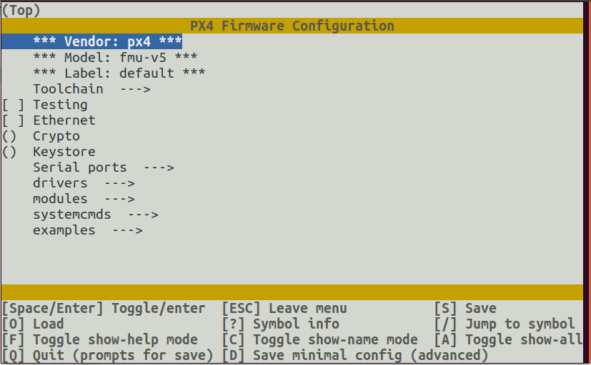

# PX4 Конфігурація плати (kconfig)

Прошивку автопілота PX4 можна налаштувати під час компіляції для пристосування його до спеціалізованих застосувань (фіксований крило, багатокоптер, рухомий об'єкт або інше), щоб увімкнути нові та експериментальні функції (такі як Cyphal) або заощадити використання флеш-пам'яті& RAM, вимкнувши деякі драйвери та підсистеми. Ця конфігурація обробляється через _Kconfig_, який є тим самим [системою конфігурації, що використовується NuttX](../hardware/porting_guide_nuttx.md#nuttx-menuconfig-setup).

Опції конфігурації (часто називаються "символами" мовою _kconfig_) визначаються в файлах `Kconfig` у каталозі **/src**.

## Конвенція найменування символів PX4 Kconfig

За умовчанням символи для модулів/драйверів називаються на основі шляху папки модуля. Наприклад, символ для водія ADC у `src/drivers/adc/board_adc` повинен мати назву `DRIVERS_ADC_BOARD_ADC`.

Для додавання символів для параметрів, специфічних для драйвера/модуля, конвенція найменування полягає в тому, що за ім'ям модуля слідує назва параметра. Наприклад `UAVCAN_V1_GNSS_PUBLISHER`, який є варіантом `GNSS_PUBLISHER` для модуля `UAVCAN_V1`. Параметри повинні бути захищені за допомогою оператора `if`, щоб гарантувати, що вони будуть видимі лише тоді, коли сам модуль увімкнено.

Наприклад:

```
menuconfig DRIVERS_UAVCAN_V1
    bool "UAVCANv1"
    default n
    ---help---
        Enable support for UAVCANv1

if DRIVERS_UAVCAN_V1
    config UAVCAN_V1_GNSS_PUBLISHER
        bool "GNSS Publisher"
        default n
endif #DRIVERS_UAVCAN_V1
```

:::info Збірки будуть беззвучно ігнорувати будь-які відсутні або неправильно написані модулі у конфігураційному файлі `*.px4board`
:::

## Успадкування мітки PX4 Kconfig

Кожній платі PX4 повинна мати конфігурацію `default.px4board` і може мати необов'язкову конфігурацію `bootloader.px4board configuration`. Проте ви також можете додати окремі конфігурації під іншою міткою, наприклад `cyphal.px4board`. Зверніть увагу, що за замовчуванням конфігурація `cyphal.px4board` успадковує всі налаштування, встановлені в `default.px4board`. При зміні `cyphal.px4board` воно зберігає лише дельту ключів Kconfig, які відрізняються від `default.px4board`, це корисно для спрощення управління конфігураціями

::::info При зміні ключа Kconfig in `за замовчуванням. x4board` буде змінено в усіх конфігураціях похідної таблиці з тими ж самими конфігураціями і в тому ж форматі.
:::

## Налаштування меню PX4 Menuconfig

Інструмент [menuconfig](https://pypi.org/project/kconfiglib/#menuconfig-interfaces) використовується для зміни конфігурації плати PX4, додавання/видалення модулів, драйверів та інших функцій.

Існують варіанти командного рядка та графічного інтерфейсу, які можна запустити за допомогою скорочень збірки PX4:

```
make px4_fmu-v5_default boardconfig
make px4_fmu-v5_default boardguiconfig
```

:::info _Kconfiglib_ та _menuconfig_ поставляються з пакетом python _kconfiglib_, який встановлюється звичайним сценарієм встановлення [ubuntu.sh](https://github.com/PX4/PX4-Autopilot/blob/release/1.15/Tools/setup/ubuntu.sh). Якщо _kconfiglib_ не встановлено, ви можете це зробити за допомогою команди: `pip3 install kconfiglib`
:::

Інтерфейс командного рядка та графічного інтерфейсу показані нижче.

### Інтерфейс командного рядка menuconfig


### Інтерфейс користувача menuconfig GUI


