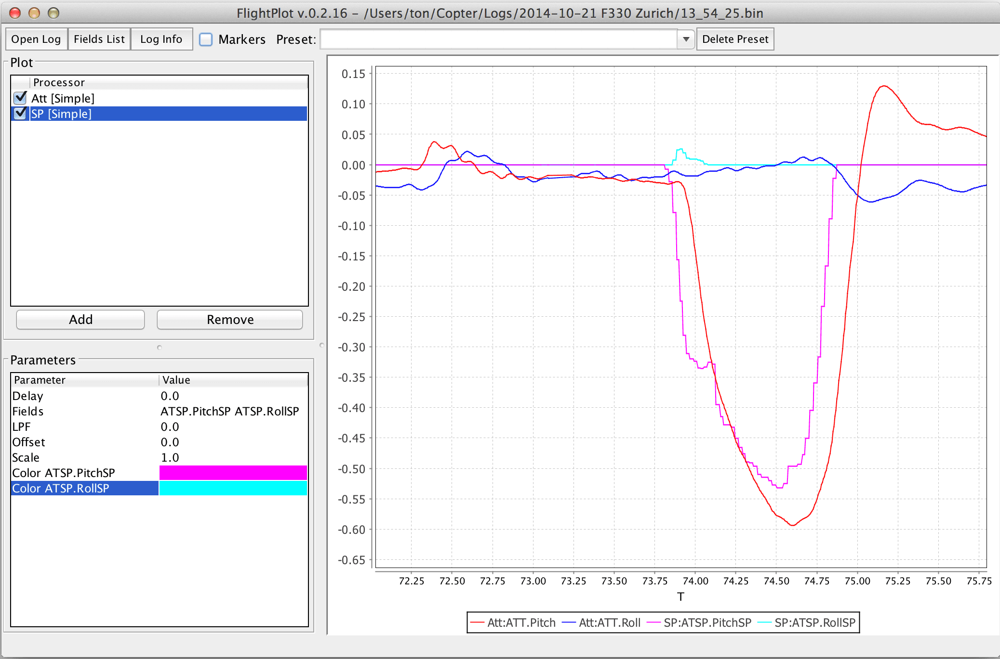

# Аналіз журналу польотів

Ця тема містить огляд інструментів і методів, які можна використовувати для аналізу бортових журналів PX4 (у деяких випадках нижче є посилання на більш детальні теми).

:::info INFO [Flight Reporting](../getting_started/flight_reporting.md) пояснює, як завантажити журнал і повідомити/обговорити проблеми з польотом з командою розробників.
:::

## Структурований аналіз

Перш ніж аналізувати бортовий журнал, важливо визначити його контекст:

- Якщо аналіз проводиться після несправності, чи зафіксував бортовий журнал збій, чи він зупинився в польоті?
- Чи всі контролери відстежували свої посилання? Найпростіший спосіб визначити це - порівняти показники крену і тангажу з їхніми заданими значеннями.
- Чи виглядають дані датчика достовірними? Чи була дуже сильна вібрація (розумним порогом для сильної вібрації є будь-яка вібрація з піковою швидкістю понад 2-3 м/с/с).
- Якщо першопричина не є специфічною для транспортного засобу, обов'язково повідомте про неї з посиланням на файл логу (і відео, якщо таке є) на [PX4 issue tracker](https://github.com/PX4/PX4-Autopilot/issues/new).

## Виключення перебоїв з живленням

Якщо файл журналу завершується в повітрі, можливі дві основні причини: збій живлення _або_ серйозна помилка операційної системи.

На автопілотах на базі серії [STM32](http://www.st.com/en/microcontrollers/stm32-32-bit-arm-cortex-mcus.html) серйозні несправності записуються на SD-карту. Вони розташовані на верхньому рівні SD-карти і мають назву _fault_date.log_, наприклад, **fault_2017_04_03_00_26_05.log**. Ви повинні перевірити наявність цього файлу, якщо журнал польоту раптово закінчується.

## Інструменти аналізу

### Flight Review (Онлайн інструмент)

[Flight Review](http://logs.px4.io) є наступником _Log Muncher_. Використовується у поєднанні з новим форматом ведення журналу [ULog](../dev_log/ulog_file_format.md).

Основні функції:

- Веб-орієнтований, відмінно підходить для кінцевих користувачів.
- Користувачі можуть завантажувати логи через веб-інтерфейс, а потім ділитися звітами з іншими (множинне завантаження підтримується за допомогою скрипта [upload_log.py](https://github.com/PX4/PX4-Autopilot/blob/main/Tools/upload_log.py))
- Інтерактивні графіки.


Дивіться [Аналіз журналу за допомогою Flight Review](../log/flight_review.md) для вступу.

### PlotJuggler

[PlotJuggler](https://github.com/facontidavide/PlotJuggler) - це десктопна програма, яка дозволяє користувачам легко візуалізувати та аналізувати дані, виражені у вигляді часових рядів. Це один з найкращих інструментів аналізу ULog, оскільки він показує всю інформацію в журналі ([Flight Review](#flight-review-online-tool), для порівняння, показує лише невелику підмножину даних).

Підтримує файли ULog (.ulg) починаючи з версії 2.1.4.

Основні функції:

- Інтуїтивний drag & drop інтерфейс.
- Розташовуйте дані на кількох графіках, вкладках або вікнах.
- Всі теми uORB показані і можуть бути відображені на графіку.
- Після того, як ви впорядкували свої дані, збережіть їх у файл "Layout" й завантажуйте багато разів.
- Обробляйте ваші дані всередині _PlotJuggler_ самостійно, використовуючи власні "трансформації даних".

Вихідний код та завантаження доступні на [Github](https://github.com/facontidavide/PlotJuggler).


Для початку дивіться [Аналіз журналу за допомогою Plot Juggler](../log/plotjuggler_log_analysis.md).

### pyulog

[pyulog](https://github.com/PX4/pyulog) - це python пакет для парсингу файлів ULog, а також набір скриптів командного рядка для вилучення/відображення інформації з ULog і перетворення їх у інші формати файлів.

Основні функції:

- Бібліотека Python для розбору файлів ULog. Базова бібліотека, що використовується рядом інших інструментів аналізу та візуалізації ULog.
- Скрипти для вилучення/відображення інформації ULog:
  - _ulog_info_: відображення інформації з файлу ULog.
  - _ulog_messages_: відображення записаних повідомлень з файлу ULog.
  - _ulog_params_: отримати параметри з файлу ULog.
- Скрипти для конвертації ULog файлів в інші формати:
  - _ulog2csv_: конвертувати ULog у (декілька) CSV файли.
  - _ulog2kml_: конвертувати ULog у (декілька) KML файли.

Всі скрипти встановлюються як загальносистемні програми (тобто їх можна викликати з командного рядка, якщо встановлено Python) і підтримують параметр `-h` для отримання інструкцій з використання. Наприклад:

```sh
$ ulog_info -h
usage: ulog_info [-h] [-v] file.ulg

Display information from an ULog file

positional arguments:
  file.ulg       ULog input file

optional arguments:
  -h, --help     show this help message and exit
  -v, --verbose  Verbose output
```

Нижче показано вигляд інформації, експортованої з прикладу файлу за допомогою _ulog_info_.

```sh
$ ulog_info sample.ulg
Logging start time: 0:01:52, duration: 0:01:08
Dropouts: count: 4, total duration: 0.1 s, max: 62 ms, mean: 29 ms
Info Messages:
 sys_name: PX4
 time_ref_utc: 0
 ver_hw: AUAV_X21
 ver_sw: fd483321a5cf50ead91164356d15aa474643aa73

Name (multi id, message size in bytes)    number of data points, total bytes
 actuator_controls_0 (0, 48)                 3269     156912
 actuator_outputs (0, 76)                    1311      99636
 commander_state (0, 9)                       678       6102
 control_state (0, 122)                      3268     398696
 cpuload (0, 16)                               69       1104
 ekf2_innovations (0, 140)                   3271     457940
 estimator_status (0, 309)                   1311     405099
 sensor_combined (0, 72)                    17070    1229040
 sensor_preflight (0, 16)                   17072     273152
 telemetry_status (0, 36)                      70       2520
 vehicle_attitude (0, 36)                    6461     232596
 vehicle_attitude_setpoint (0, 55)           3272     179960
 vehicle_local_position (0, 123)              678      83394
 vehicle_rates_setpoint (0, 24)              6448     154752
 vehicle_status (0, 45)                       294      13230
```

### FlightPlot

[FlightPlot](https://github.com/PX4/FlightPlot) це десктопний інструмент для аналізу логів. Його можна завантажити з [FlightPlot Downloads](https://github.com/PX4/FlightPlot/releases) (Linux, MacOS, Windows).

Основні функції:

- На основі Java, кросплатформенний.
- Інтуїтивний GUI, не потрібні знання програмування.
- Підтримує як нові, так і старі формати журналів PX4 (.ulg, .px4log, .bin)
- Дозволяє зберігати графіки як зображення.



### PX4Tools

[PX4Tools](https://github.com/dronecrew/px4tools) - інструментарій для аналізу логів для автопілота PX4, написаний на Python. Рекомендованою процедурою встановлення є використання [anaconda3](https://conda.io/docs/index.html). Дивіться [сторінку px4tools на github](https://github.com/dronecrew/px4tools) для отримання подробиць.

Основні функції:

- Користувачі можуть легко ділитися на Github (наприклад, [15-09-30 Kabir Log.ipynb](https://github.com/jgoppert/lpe-analysis/blob/master/15-09-30%20Kabir%20Log.ipynb))
- На основі Python, кросплатформенний, працює з anaconda 2 та anaconda3
- Блокноти iPython/jupyter можна використовувати для легкого обміну аналізом
- Розширені можливості графіків для детального аналізу


### MAVGCL

[MAVGCL](https://github.com/ecmnet/MAVGCL) це аналізатор логів польоту для PX4. Його також можна використовувати в офлайн режимі із завантаженими файлами uLog.

Основні функції:

- Збір даних в реальному часі (вибірка 50 мс, відображення 100 мс) на основі повідомлень MAVLink або даних ULOG через MAVLink
- Часова діаграма, анотована повідомленнями (MAVLink та ULog) та змінами параметрів (тільки MAVLink)
- XY-аналіз для обраних ключових фігур
- 3D-вигляд (перспектива транспортного засобу та спостерігача)
- Інспектор MAVLink (звітування про необроблені повідомлення MAVLink)
- Офлайн-режим: Імпорт ключових показників з PX4Log/ULog (файл або останній лог з пристрою через WiFi)
- На основі Java. Відомо, що працює в macOS та Ubuntu.
- Та багато іншого...


### Data Comets

[Data Comets](https://github.com/dsaffo/DataComets) - це інтерактивний інструмент аналізу журналу польотів PX4, який дозволяє кодувати польотні дані на траєкторію польоту, фільтрувати і чистити дані за часом - і багато іншого!

Ви можете використовувати онлайн-версію інструменту для невеликих лог-файлів (< 32Mb) або запустити його локально, щоб проаналізувати довші польоти.


