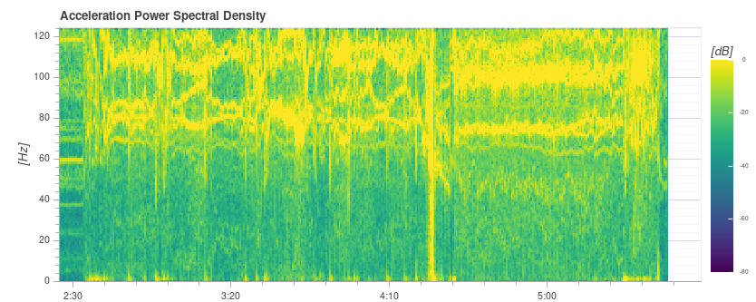
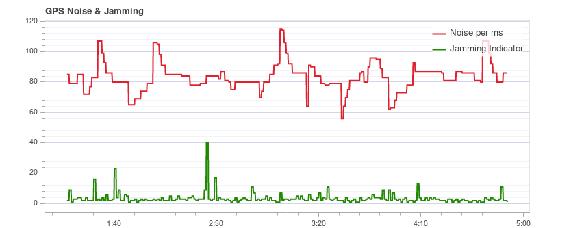

# Log Analysis using Flight Review

The [Flight Review](http://logs.px4.io) plots for a flight can be used to analyze general vehicle condition.

Сюжети мають бути зрозумілими самі по собі, але для того, щоб знати, які діапазони є прийнятними і як повинен виглядати сюжет, потрібен деякий досвід.
Ця сторінка пояснює, як інтерпретувати графіки та визначити загальні проблеми.

## Загальне використання

Особливості, які є загальними для багатьох сюжетів:

- Plot background color is used to indicate flight mode during recording (where graphs depend on mode):
  
  - **Flight mode:** Background colour on the body of the plot indicates flight mode.
    Наведення курсору миші на діаграму показує мітки режиму польоту.
  - **VTOL flight mode:** VTOL vehicles additionally show the VTOL mode as background colour in the bottom part of the plot (blue for multicopter, yellow for fixed-wing, and red for transition).
- Прокручування мишею на певній вісі графіка зумовлює збільшення цієї вісі (горизонтально або вертикально).
- Прокручування миші всередині графіка збільшує обидва вісі.

## Виконання відстеження PID

Залежно від режиму польоту, контролери транспортного засобу можуть намагатися відстежувати установочні точки положення, швидкості, висоти або швидкості (відстежувані установочні точки залежать від режиму, наприклад: в режимі стабілізації немає установочної точки швидкості).

The **Estimated** line (red) should closely match with the **Setpoint** (green).
Якщо вони цього не роблять, у більшості випадків потрібно налаштувати коефіцієнти ПІД цього контролера.

The [Multicopter PID Tuning Guide](../config_mc/pid_tuning_guide_multicopter.md) contains example plots and information about analysing tracking performance.

:::tip
For the rate controller in particular, it is useful to enable the high-rate logging profile ([SDLOG_PROFILE](../advanced_config/parameter_reference.md#SDLOG_PROFILE)) to get more details when zooming in.
:::

## Вібрація

Вібрація є однією з найпоширеніших проблем для багатороторних транспортних засобів.
Високі рівні вібрації можуть призвести до:

- менш ефективний польот і скорочений час польоту
- двигуни можуть нагрітися
- збільшене зношування матеріалу
- неможливість налаштувати транспортний засіб тісно, що призводить до погіршення польотних характеристик.
- обрізання сенсора
- оцінка позиції провалилася, що потенційно призводить до збоїв.

Тому важливо слідкувати за рівнем вібрації та вдосконалювати налаштування у разі необхідності.

Є точка, де рівень вібрації однозначно занадто високий, і, як правило, нижчі рівні вібрації краще.
Однак є широкий діапазон між 'все в порядку' та 'рівні занадто високі'.
Цей діапазон залежить від кількох факторів, включаючи розмір транспортного засобу - оскільки більші транспортні засоби мають вищу інерцію, що дозволяє більше програмного фільтрування (у той ж час вібрації на більших транспортних засобах мають меншу частоту).

Наступні абзаци та розділи надають інформацію про те, які графіки використовувати для перевірки рівнів вібрації, та як їх аналізувати.

:::tip
It is worth looking at multiple charts when analyzing vibration (different charts can better highlight some issues).
:::

### Керування приводами FFT

:::info
You need to enable the high-rate logging profile ([SDLOG_PROFILE](../advanced_config/parameter_reference.md#SDLOG_PROFILE)) to see this plot.
:::

Цей графік показує частотний графік для відвалу, крена та осі курсу на основі сигналу керування приводами (вихід PID від контролера швидкості).
Це допомагає визначити частотні піки та налаштувати програмні фільтри.
Повинен бути лише один пік на найнижчому кінці (нижче близько 20 Гц), решта повинна бути низькою та плоскою.

Зверніть увагу, що масштабування по осі Y відрізняється для різних транспортних засобів, але журнали з одного й того ж транспортного засобу можуть бути безпосередньо порівняні між собою.

#### Приклади: Хороша вібрація

[QAV-R 5" Racer](../frames_multicopter/qav_r_5_kiss_esc_racer.md) frame (excellent vibration).

:::info
The excellent vibration characteristics of the above frame mean that we can considerably increase the cutoff frequency of the [software filters](../config_mc/filter_tuning.md) (reducing control latency).
:::

Каркас DJI F450 (добре вібрує).

Каркас S500:

:::info
While the plot above looks good, the [Raw Acceleration graph for the same flight](#raw_acc_s500) shows that the vibration levels are a bit high for x and y.
Це хороший приклад того, чому варто перевіряти кілька графіків!
:::

#### Приклади: Погана вібрація

Цей приклад показує пік частоти близько 50 Гц (у цьому випадку через "вільне" шасі).

### Спектральна густина потужності прискорення

Це двовимірний графік частот, що показує частотну відповідь сирих даних акселерометра з часом (він відображає суму для вісей x, y та z).
Чим більше жовтий ділянка, тим вище частотна відповідь в цей час і частоту.

Ідеально лише найнижча частина до кількох Гц є жовтою, а решта в основному зелена або синя.

#### Приклади: Хороша вібрація

[QAV-R 5" Racer](../frames_multicopter/qav_r_5_kiss_esc_racer.md) frame (excellent vibration).

<!-- https://logs.px4.io/plot_app?log=cd88b091-ec89-457c-85f6-e63e4fa0f51d -->

Каркас DJI F450 (добре вібрує).

:::info
Above you can see the blade passing frequency of the propellers at around 100 Hz.
:::

S500 frame:

#### Приклади: Погана вібрація

Міцні жовті лінії приблизно на 100 Гц вказують на можливу проблему, яка вимагає подальшого вивчення (починаючи з перегляду інших діаграм).

Цей графік нижче показує пік частоти близько 50 Гц (у цьому випадку через "вільне" шасі).

:::tip
This indicates a possible problem because it is a strong single low frequency that is close to the vehicle dynamics.
Зі стандартними налаштуваннями фільтрації на частоті 80 Гц вібрації на частоті 50 Гц не будуть фільтруватися.
:::

Дуже висока (небезпечна) вібрація! Зверніть увагу, що графік майже повністю жовтий.

:::warning
You should not fly with such high vibration levels.
:::

### Прискорення без обробки

Цей графік показує сирі вимірювання акселерометра для вісей x, y та z.
Ідеально, якщо кожна лінія тонка і чітко показує прискорення транспортного засобу.

Зазвичай, якщо графік по осі z торкається графіка по осях x/y під час наведення або повільного польоту, рівні вібрації є занадто високими.

:::tip
The best way to use this graph is to zoom in a bit to a part where the vehicle is hovering.
:::

#### Приклади: Хороша вібрація

[QAV-R 5" Racer](../frames_multicopter/qav_r_5_kiss_esc_racer.md) frame (excellent vibration).

Каркас DJI F450 (добре вібрує).

<!-- https://logs.px4.io/plot_app?log=cd88b091-ec89-457c-85f6-e63e4fa0f51d -->

#### Приклади: Погана вібрація

S500 frame. Рівні вібрації на межі - трохи високі для x та y (що є типовим для конструкції S500).
Це на межі, де це починає негативно впливати на польотові характеристики.

Вібрація занадто висока. Зверніть увагу, як графік вісі z накладається на графік вісі x/y:

Рівні вібрації занадто високі. Зверніть увагу, як графік вісі z накладається на графік вісі x/y:

Дуже високі (небезпечні) рівні вібрації.

:::warning
You should not fly with such high vibration levels.
:::

### Графіки даних високошвидкісних ІМУ

Для детального аналізу є можливість реєструвати сирові дані ІМП на повну швидкість (кілька кГц, в залежності від ІМП).
Це дозволяє інспекцію набагато вищих частот, ніж при звичайному веденні журналування, що може допомогти при виборі віброізоляторів або налаштуванні нижніх та полосних фільтрів належним чином.

Щоб використовувати його, деякі параметри потрібно змінити:

- Set [IMU_GYRO_RATEMAX](../advanced_config/parameter_reference.md#IMU_GYRO_RATEMAX) to 400.
  Це забезпечує те, що сирові дані датчика ефективніше упаковані при відсиланні з датчика до решти системи та зменшує розмір звітів (не зменшуючи корисних даних).
  <!-- Explanation in https://github.com/PX4/PX4-user_guide/pull/751/files#r440509688
  Data is sent in a fixed size array that will largely empty if sent at higher rate. The "empty data" is also logged.-->

- Використовуйте хороший SD-картку, оскільки дані ІМП потребують високої ширини смуги реєстрації (Огляд польотів покаже втрати, якщо швидкість реєстрації стане занадто великою).

  :::tip
  See [Logging > SD Cards](../dev_log/logging.md#sd-cards) for a comparison of popular SD card.

:::

- Enable either the gyro or accel high-rate FIFO profile in [SDLOG_PROFILE](../advanced_config/parameter_reference.md#SDLOG_PROFILE) and disable the rest of the entries.
  Якщо ви використовуєте дійсно хорошу SD-карту (бачите кілька / немає викидів), ви можете:
  - або увімкніть обидві профілі прискорення та гіроскопу
  - або увімкніть аксел/гіроскоп плюс профіль реєстрації за замовчуванням

Приклад графіка:

:::info
Data of the first IMU is logged, which is not necessarily the same as the one used for flying.
Це в основному важливо лише у випадках, коли ІХА встановлені по-різному (наприклад, жорстко кріплені проти м'яко кріплених).
:::

:::info
Do not forget to restore the parameters after testing.
:::

### Виправлення проблем з вібрацією

Дуже часто джерело вібрації (або поєднання декількох джерел) не може бути ідентифіковано тільки з журналів.

У цьому випадку транспортний засіб слід перевірити.
[Vibration Isolation](../assembly/vibration_isolation.md) explains some basic things you can check (and do) to reduce vibration levels.

## Виводи приводу

The _Actuator Outputs_ graph shows the signals that are sent to the individual actuators (motors/servos).
Загалом воно знаходиться в діапазоні між мінімальним і максимальним налаштованими значеннями ШІМ (наприклад, від 1000 до 2000).

This is an example for a quadrotor where everything is OK (all of the signals are within the range, approximately overlap each other, and are not too noisy):

Сюжет може допомогти виявити різні проблеми:

- If one or more of the signals is at the maximum over a longer time, it means the controller runs into **saturation**.
  Не обов'язково, що це проблема, наприклад, коли літаєте на повному газі, це очікується.
  Але якщо це стається, наприклад, під час місії, це ознака того, що транспортний засіб перевищує вагою кількість тяги, яку він може забезпечити.
- For a multicopter the plot can be a good indication if the vehicle is **imbalanced**.
  Показано на графіку, що один або більше сусідніх двигунів (два у випадку квадрокоптера) мають працювати з вищим потужностю в середньому.
  Зверніть увагу, що це також може бути справа, якщо деякі двигуни надають більше тяги, ніж інші, або РПТ не відкалібровані.
  Дисбалансний транспортний засіб, як правило, не є великою проблемою, оскільки автопілот автоматично врахує це.
  Однак це зменшує максимальний досяжний тягун і навантажує деякі двигуни більше, тому краще збалансувати літальний апарат.
- Дисбаланс також може виникнути від осі рискання.
  Сюжет буде схожий з попереднім випадком, але протилежні двигуни будуть працювати вище або нижче відповідно.
  Причина ймовірно у тому, що один або кілька моторів нахилений.

  This is an example from a hexarotor: motors 1, 3 and 6 run at higher thrust:
  

  <!-- https://logs.px4.io/plot_app?log=9eca6934-b657-4976-a32f-b2e56535f05f -->
- If the signals look very **noisy** (with high amplitudes), it can have two causes: sensor noise or vibrations passing through the controller (this shows up in other plots as well, see previous section) or too high PID gains.
  This is an extreme example:
  

## Невизначеність GPS

The _GPS Uncertainty_ plot shows information from the GPS device:

- Кількість використаних супутників (повинна бути близько 12 або вище)
- Точність горизонтального положення (має бути менше 1 метра)
- Точність вертикального положення (має бути менше 2 метрів)
- GPS фіксація: це 3 для 3D GPS фіксації, 4 для GPS + Dead Reckoning, 5 для RTK float та 6 для RTK фіксованого типу

## GPS Noise & Jamming

The GPS Noise & Jamming plot is useful to check for GPS signal interferences and jamming.
Сигнал GPS дуже слабкий і, отже, його легко можна порушити / перешкодити компонентами, що передають (через кабель) або випромінюють на частоті, яку використовує GPS.

:::tip
USB 3 is [known to be](https://www.usb.org/sites/default/files/327216.pdf) an effective GPS jamming source.
:::

The **jamming indicator** should be around or below 40.
Значення навколо 80 або вище є занадто високими, і налаштування повинні бути перевірені.
Перешкоди сигналу також помітні як зменшення точності та менша кількість супутників до того моменту, коли неможливо отримати фіксацію GPS.

Це приклад без будь-якого втручання:

## Тяга та магнітне поле

The _Thrust and Magnetic Field_ plot shows the thrust and the norm of the magnetic sensor measurement vector.

Норма повинна бути постійною протягом усього польоту і не пов'язана з тягою.
This is a good example where the norm is very close to constant:

_If it is correlated_, it means that the current drawn by the motors (or other consumers) is influencing the magnetic field.
Це слід уникати, оскільки це призводить до невірної оцінки кута розвороту.
The following plot shows a strong correlation between the thrust and the norm of the magnetometer:

Рішення для цього є:

- Використовуйте зовнішній магнітомер (уникайте використання внутрішнього магнітомера)
- Якщо використовується зовнішній магнітометр, перемістіть його подалі від сильних течій (тобто за допомогою (довшої) GPS-стійки).

Якщо норма не корелює, але не постійна, найімовірніше вона не відкалібрована належним чином.
Проте це також може бути пов'язано з зовнішніми перешкодами (наприклад, коли літаєте близько до металевих конструкцій).

This example shows that the norm is non-constant, but it does not correlate with the thrust:

## Сторожовий оцінювач

The _Estimator Watchdog_ plot shows the health report of the estimator.
Воно має бути постійним нулем.

This is what it should look like if there are no problems:

Якщо один з прапорців не є нульовим, оцінювач виявив проблему, яку потрібно додатково вивчити.
У більшості випадків це проблема з сенсором, наприклад, перешкоди магнітомера.
Зазвичай це допомагає глянути на графіки відповідного сенсора.

<!-- TODO: separate page for estimator issues? -->

Here is an example with magnetometer problems:

## Регулярність вибірки даних сенсора

Графік регулярного вибіркового відтворення надає уявлення про проблеми з системою ведення журналу та плануванням.

The amount of **logging dropouts** start to increase if the log buffer is too small, the logging rate is too high or a low-quality SD card is used.

:::info
Occasional dropouts can be expected on medium quality cards.
:::

The **delta t** shows the time difference between two logged IMU samples.
Це повинно бути близько до 4 мс, оскільки швидкість публікації даних становить 250 Гц.
Якщо є піки, які є кратними цьому (і затримка часу оцінювача не збільшується), це означає, що журналізатор пропустив деякі зразки.
Іноді це може трапитися через те, що реєстратор працює з нижчою пріоритетністю.
Якщо є шипи, які не є кратними, це вказує на неправильне планування драйвера датчика, яке потрібно дослідити.

The **estimator timeslip** shows the difference between the current time and the time of the integrated sensor intervals up to that time.
Якщо це змінюється, це означає, що або оцінювач пропустив дані датчика, або водій публікує невірні інтервали інтеграції.
Воно повинно залишатися на нулі, але може трохи збільшуватися при змінах параметрів в польоті, що, як правило, не є проблемою.

This is a good example:

The following example contains too many dropouts, the quality of the used SD card was too low in that case
(see [here](../dev_log/logging.md#sd-cards) for good SD cards):

## Зареєстровані повідомлення

Це таблиця з повідомленнями про системні помилки та попередження.
Наприклад, вони показують, коли завдання стає низьким за об'ємом стеку.

Повідомлення потрібно розглядати індивідуально, і не всі з них вказують на проблему.
For example the following shows a kill-switch test:

## Приклади огляду журналу польотів / кадру

Часто варто розглянути кілька графіків для певного польоту при аналізі стану транспортного засобу (різні графіки можуть краще підкреслити деякі проблеми).
Це особливо важливо при перегляді можливих проблем з вібрацією.

Розділ нижче групує кілька (раніше презентованих) графіків за рейс/транспортний засіб.

### QAV-R 5" Racer

These charts are all from the same flight of a [QAV-R 5" Racer](../frames_multicopter/qav_r_5_kiss_esc_racer.md).

<!-- https://logs.px4.io/plot_app?log=cd88b091-ec89-457c-85f6-e63e4fa0f51d -->

Вони показують транспортний засіб, який має дуже низькі вібрації:

- Контролер приводу FFT показує лише один пік в найнижчій частині, а решта низька та плоска.
- Спектральна щільність в основному зелена, лише трохи жовта на низьких частотах.
- Прискорення в сирому вигляді має слід по осі z, чітко відокремлений від слідів по осі x/y.

### DJI F450

These charts are all from the same flight of a _DJI F450_.

<!-- https://logs.px4.io/plot_app?log=cd88b091-ec89-457c-85f6-e63e4fa0f51d -->

Вони показують автомобіль, який має низьку вібрацію (але не таку низьку, як у QAV-R вище!):

- Контрольні Фурнкції FFT показують пік в найнижчій точці.
  Більшість решти є плоскою, за винятком випинання на близько 100 Гц (це частота проходження лопастей гвинтів).
- Спектральна густина переважно зелена. Частота проходження леза знову видима.
- Прискорення в сирому вигляді має слід по осі z, чітко відокремлений від слідів по осі x/y.

### S500

Ці діаграми усі з одного рейсу літака S500.

Вони показують транспортний засіб, який має майже прийнятні вібрації:

- Контрольні Фурнкції FFT показують пік в найнижчій точці.
  Більшість решти є плоскою, за винятком виступу близько 100 Гц.
- Спектральна щільність в основному зелена, але жовта більше, ніж у DJI F450 на частоті 100 Гц.
- Прискорення в сирому вигляді має слід зісипу в напрямку осі z, досить близький до слідів по осі x/y.
  Це на межі, де це починає негативно впливати на польотові характеристики.

