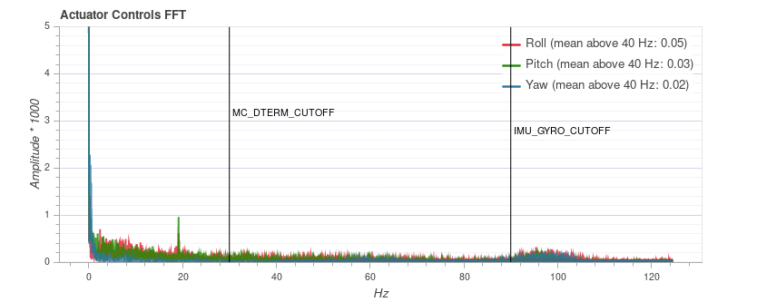
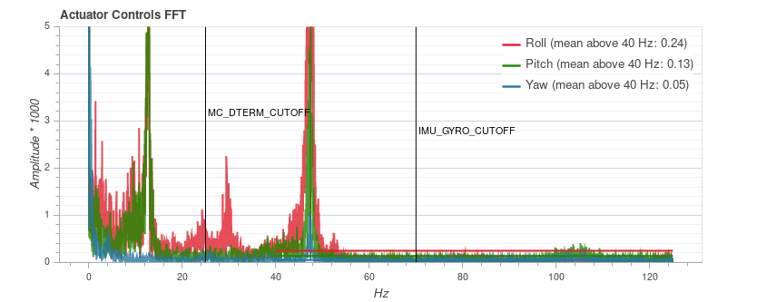
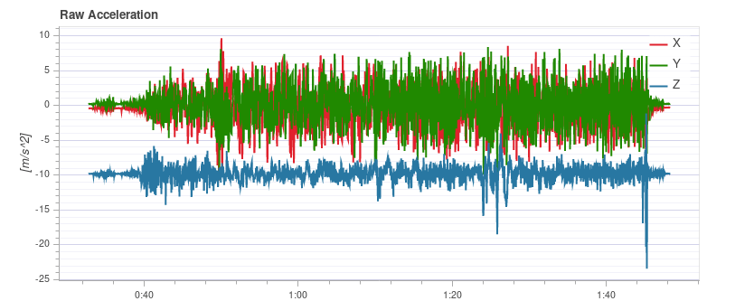
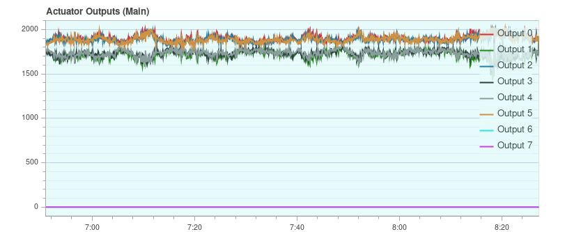
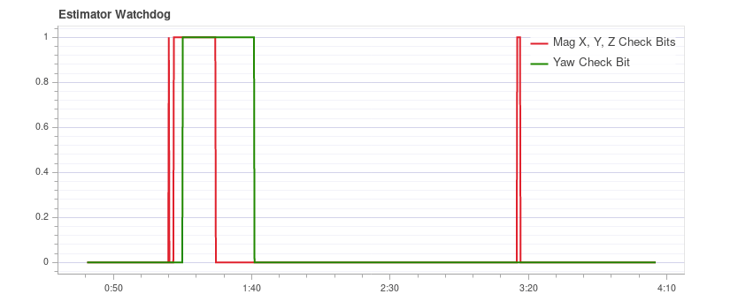

# Аналіз журналу за допомогою огляду польоту

Діаграми [огляду польоту](http://logs.px4.io) для польоту можуть бути використані для аналізу загального стану транспортного засобу.

Сюжети мають бути зрозумілими самі по собі, але для того, щоб знати, які діапазони є прийнятними і як повинен виглядати сюжет, потрібен деякий досвід. Ця сторінка пояснює, як інтерпретувати графіки та визначити загальні проблеми.

## Загальне використання

Особливості, які є загальними для багатьох сюжетів:

- Колір фону сюжету використовується для позначення режиму польоту під час запису (де графіки залежать від режиму): 
  - **Режим польоту:** Колір фону на тілі графіку вказує на режим польоту. Наведення курсору миші на діаграму показує мітки режиму польоту.
  - **Режим польоту VTOL:** Транспортні засоби VTOL додатково показують режим VTOL як фоновий колір у нижній частині графіку (синій для багатокоптерних, жовтий для фіксованих крил та червоний для переходу).
- Прокручування мишею на певній вісі графіка зумовлює збільшення цієї вісі (горизонтально або вертикально).
- Прокручування миші всередині графіка збільшує обидва вісі.

## Виконання відстеження PID

Залежно від режиму польоту, контролери транспортного засобу можуть намагатися відстежувати установочні точки положення, швидкості, висоти або швидкості (відстежувані установочні точки залежать від режиму, наприклад: в режимі стабілізації немає установочної точки швидкості).

Лінія **Оцінена** (червона) повинна бути якомога ближчою до **Установленої точки** (зелена). Якщо вони цього не роблять, у більшості випадків потрібно налаштувати коефіцієнти ПІД цього контролера.

[Посібник з налаштування PID для багатокоптерів](../config_mc/pid_tuning_guide_multicopter.md) містить приклади графіків та інформацію про аналіз результатів слідкування.

:::tip
Для контролера швидкості важливо увімкнути профіль високої швидкості журналювання ([SDLOG_PROFILE](../advanced_config/parameter_reference.md#SDLOG_PROFILE)), щоб отримати більше деталей при збільшенні масштабу.
:::

## Вібрація

Вібрація є однією з найпоширеніших проблем для багатороторних транспортних засобів. Високі рівні вібрації можуть призвести до:
- менш ефективний польот і скорочений час польоту
- двигуни можуть нагрітися
- збільшене зношування матеріалу
- неможливість налаштувати транспортний засіб тісно, що призводить до погіршення польотних характеристик.
- обрізання сенсора
- оцінка позиції провалилася, що потенційно призводить до збоїв.

Тому важливо слідкувати за рівнем вібрації та вдосконалювати налаштування у разі необхідності.

Є точка, де рівень вібрації однозначно занадто високий, і, як правило, нижчі рівні вібрації краще. Однак є широкий діапазон між 'все в порядку' та 'рівні занадто високі'. Цей діапазон залежить від кількох факторів, включаючи розмір транспортного засобу - оскільки більші транспортні засоби мають вищу інерцію, що дозволяє більше програмного фільтрування (у той ж час вібрації на більших транспортних засобах мають меншу частоту).

Наступні абзаци та розділи надають інформацію про те, які графіки використовувати для перевірки рівнів вібрації, та як їх аналізувати.

:::tip
Варто розглянути кілька графіків при аналізі вібрації (різні графіки можуть краще підкреслити деякі проблеми).
:::

### Керування приводами FFT

:::info Необхідно активувати профіль високочастотного ведення журналу ([SDLOG_PROFILE](../advanced_config/parameter_reference.md#SDLOG_PROFILE)), щоб побачити цей графік.
:::

Цей графік показує частотний графік для відвалу, крена та осі курсу на основі сигналу керування приводами (вихід PID від контролера швидкості). Це допомагає визначити частотні піки та налаштувати програмні фільтри. Повинен бути лише один пік на найнижчому кінці (нижче близько 20 Гц), решта повинна бути низькою та плоскою.

Зверніть увагу, що масштабування по осі Y відрізняється для різних транспортних засобів, але журнали з одного й того ж транспортного засобу можуть бути безпосередньо порівняні між собою.

#### Приклади: Хороша вібрація

[QAV-R 5" Гонщик](../frames_multicopter/qav_r_5_kiss_esc_racer.md) рамка (відмінна вібрація).

:::info Відмінні вібраційні характеристики вищезазначеної рами означають, що ми можемо значно збільшити частоту відсічення [програмних фільтрів](../config_mc/filter_tuning.md) (зменшуючи затримку управління).
:::

Каркас DJI F450 (добре вібрує).

Каркас S500:

:::info Хоча графік вище виглядає добре, графік сирового прискорення для цього ж польоту показує, що рівні вібрації трохи високі для x та y. [Raw Acceleration graph for the same flight](#raw_acc_s500) Це хороший приклад того, чому варто перевіряти кілька графіків!
:::

#### Приклади: Погана вібрація

Цей приклад показує пік частоти близько 50 Гц (у цьому випадку через "вільне" шасі).

### Спектральна густина потужності прискорення

Це двовимірний графік частот, що показує частотну відповідь сирих даних акселерометра з часом (він відображає суму для вісей x, y та z). Чим більше жовтий ділянка, тим вище частотна відповідь в цей час і частоту.

Ідеально лише найнижча частина до кількох Гц є жовтою, а решта в основному зелена або синя.

#### Приклади: Гарна вібрація

[QAV-R 5" Гонщик](../frames_multicopter/qav_r_5_kiss_esc_racer.md) рамка (відмінна вібрація).

<!-- https://logs.px4.io/plot_app?log=cd88b091-ec89-457c-85f6-e63e4fa0f51d -->

Каркас DJI F450 (добре вібрує). 

:::info
Вище ви можете побачити частоту проходження лопатей гвинтів приблизно 100 Гц.
:::

Каркас S500: 

#### Приклади: Погана вібрація

Міцні жовті лінії приблизно на 100 Гц вказують на можливу проблему, яка вимагає подальшого вивчення (починаючи з перегляду інших діаграм).

Цей графік нижче показує пік частоти близько 50 Гц (у цьому випадку через "вільне" шасі).

:::tip
Це вказує на можливу проблему тому, що це сильна низька частота, що близька до динаміки автомобіля.
Зі стандартними налаштуваннями фільтрації на частоті 80 Гц вібрації на частоті 50 Гц не будуть фільтруватися.
:::

Дуже висока (небезпечна) вібрація! Зверніть увагу, що графік майже повністю жовтий.

:::warning
Не слід літати з такими високими рівнями вібрації.
:::

### Прискорення без обробки

Цей графік показує сирі вимірювання акселерометра для вісей x, y та z. Ідеально, якщо кожна лінія тонка і чітко показує прискорення транспортного засобу.

Зазвичай, якщо графік по осі z торкається графіка по осях x/y під час наведення або повільного польоту, рівні вібрації є занадто високими.

:::tip
Найкращий спосіб використання цього графіка - трохи збільшити масштаб, де транспортний засіб перебуває в повітрі.
:::

#### Приклади: Хороша вібрація

[QAV-R 5" Гонщик](../frames_multicopter/qav_r_5_kiss_esc_racer.md) рамка (відмінна вібрація).

DJI F450 кадр (добра вібрація). 

<!-- https://logs.px4.io/plot_app?log=cd88b091-ec89-457c-85f6-e63e4fa0f51d -->

#### Приклади: Погана вібрація

Каркас S500. Рівні вібрації на межі - трохи високі для x та y (що є типовим для конструкції S500). Це на межі, де це починає негативно впливати на польотові характеристики.

Вібрація занадто висока. Зверніть увагу, як графік вісі z накладається на графік вісі x/y:

Рівні вібрації занадто високі. Зверніть увагу, як графік вісі z накладається на графік вісі x/y:

Дуже високі (небезпечні) рівні вібрації.

:::warning
Не слід літати з такими високими рівнями вібрації.
:::

### Графіки даних високошвидкісних ІМУ

Для детального аналізу є можливість реєструвати сирові дані ІМП на повну швидкість (кілька кГц, в залежності від ІМП). Це дозволяє інспекцію набагато вищих частот, ніж при звичайному веденні журналування, що може допомогти при виборі віброізоляторів або налаштуванні нижніх та полосних фільтрів належним чином.

Щоб використовувати його, деякі параметри потрібно змінити:
- Встановіть [IMU_GYRO_RATEMAX](../advanced_config/parameter_reference.md#IMU_GYRO_RATEMAX) на 400. Це забезпечує те, що сирові дані датчика ефективніше упаковані при відсиланні з датчика до решти системи та зменшує розмір звітів (не зменшуючи корисних даних). 
  <!-- Explanation in https://github.com/PX4/PX4-user_guide/pull/751/files#r440509688
  Data is sent in a fixed size array that will largely empty if sent at higher rate. The "empty data" is also logged.-->
- Використовуйте хороший SD-картку, оскільки дані ІМП потребують високої ширини смуги реєстрації (Огляд польотів покаже втрати, якщо швидкість реєстрації стане занадто великою).

:::tip
Див. [Ведення журнала > SD-карти](../dev_log/logging.md#sd-cards) для порівняння популярних SD-карт.
:::

- Увімкніть профіль високочастотного FIFO або гіроскопа або акселерометра в [SDLOG_PROFILE](../advanced_config/parameter_reference.md#SDLOG_PROFILE) та вимкніть решту записів. Якщо ви використовуєте дійсно хорошу SD-карту (бачите кілька / немає викидів), ви можете:
  - або увімкніть обидві профілі прискорення та гіроскопу
  - або увімкніть аксел/гіроскоп плюс профіль реєстрації за замовчуванням

Приклад графіка:

:::info
Зберігаються дані першого ІМП, який не обов'язково співпадає з тим, що використовується для польоту.
Це в основному важливо лише у випадках, коли ІХА встановлені по-різному (наприклад, жорстко кріплені проти м'яко кріплених).
:::

:::info
Не забудьте відновити параметри після тестування.
:::

### Виправлення проблем з вібрацією

Дуже часто джерело вібрації (або поєднання декількох джерел) не може бути ідентифіковано тільки з журналів.

У цьому випадку транспортний засіб слід перевірити. [Ізоляція вібрації](../assembly/vibration_isolation.md) пояснює деякі основні речі, які ви можете перевірити (і зробити), щоб зменшити рівні вібрації.

## Виводи приводу

Графік *Виводи приводів* показує сигнали, що надсилаються до окремих приводів (двигуни/сервоприводи). Загалом воно знаходиться в діапазоні між мінімальним і максимальним налаштованими значеннями ШІМ (наприклад, від 1000 до 2000).

Це приклад для квадрокоптера, коли все в порядку (всі сигнали знаходяться в межах діапазону, приблизно перекривають один одного і не занадто шумні): 

Сюжет може допомогти виявити різні проблеми:
- Якщо один або кілька сигналів протягом тривалого часу перебувають на максимальному рівні, це означає, що контролер потрапив у **насичення**. Не обов'язково, що це проблема, наприклад, коли літаєте на повному газі, це очікується. Але якщо це стається, наприклад, під час місії, це ознака того, що транспортний засіб перевищує вагою кількість тяги, яку він може забезпечити.
- Для багатокоптера графік може бути хорошою індикацією того, чи є транспортний засіб **незбалансованим**. Показано на графіку, що один або більше сусідніх двигунів (два у випадку квадрокоптера) мають працювати з вищим потужностю в середньому. Зверніть увагу, що це також може бути справа, якщо деякі двигуни надають більше тяги, ніж інші, або РПТ не відкалібровані. Дисбалансний транспортний засіб, як правило, не є великою проблемою, оскільки автопілот автоматично врахує це. Однак це зменшує максимальний досяжний тягун і навантажує деякі двигуни більше, тому краще збалансувати літальний апарат.
- Дисбаланс також може виникнути від осі рискання. Сюжет буде схожий з попереднім випадком, але протилежні двигуни будуть працювати вище або нижче відповідно. Причина ймовірно у тому, що один або кілька моторів нахилений.

  Це приклад з гексаротора: двигуни 1, 3 та 6 працюють з більшим тяговим зусиллям: 
  <!-- https://logs.px4.io/plot_app?log=9eca6934-b657-4976-a32f-b2e56535f05f -->
- Якщо сигнали виглядають дуже **шумними** (з високими амплітудами), це може мати дві причини: шум датчика або вібрації, які проходять через контролер (це також проявляється в інших графіках, див. попередній розділ) або надто високі значення PID. Це є крайнім прикладом: 

## Невизначеність GPS

Графік *Невизначеності GPS* показує інформацію від пристрою GPS:
- Кількість використаних супутників (повинна бути близько 12 або вище)
- Точність горизонтального положення (має бути менше 1 метра)
- Точність вертикального положення (має бути менше 2 метрів)
- GPS фіксація: це 3 для 3D GPS фіксації, 4 для GPS + Dead Reckoning, 5 для RTK float та 6 для RTK фіксованого типу

## Перешкоди GPS & перешкоди

Графік шуму &перешкод GPS корисний для перевірки перешкод сигналу GPS та блокування. Сигнал GPS дуже слабкий і, отже, його легко можна порушити / перешкодити компонентами, що передають (через кабель) або випромінюють на частоті, яку використовує GPS.

:::tip USB
3 це [відомий](https://www.usb.org/sites/default/files/327216.pdf) ефективний джемер GPS.
:::

Індикатор перешкод **джемінгу** повинен бути близько або нижче 40. Значення навколо 80 або вище є занадто високими, і налаштування повинні бути перевірені. Перешкоди сигналу також помітні як зменшення точності та менша кількість супутників до того моменту, коли неможливо отримати фіксацію GPS.

Це приклад без будь-якого втручання:

## Тяга та магнітне поле

Діаграма *Тяги та Магнітного Поля* показує тягу та норму вектора вимірювання магнітного датчика.

Норма повинна бути постійною протягом усього польоту і не пов'язана з тягою. Це добрий приклад того, де норма дуже близька до постійної: 

*Якщо воно корелює*, це означає, що струм, який споживають двигуни (або інші споживачі), впливає на магнітне поле. Це слід уникати, оскільки це призводить до невірної оцінки кута розвороту. Наступний сюжет показує сильну кореляцію між тягою та нормою магнітоскопа: 

Рішення для цього є:
- Використовуйте зовнішній магнітомер (уникайте використання внутрішнього магнітомера)
- Якщо використовується зовнішній магнітометр, перемістіть його подалі від сильних течій (тобто за допомогою (довшої) GPS-стійки).

Якщо норма не корелює, але не постійна, найімовірніше вона не відкалібрована належним чином. Проте це також може бути пов'язано з зовнішніми перешкодами (наприклад, коли літаєте близько до металевих конструкцій).

Цей приклад показує, що норма є незмінною, але вона не корелює з тягою: 

## Сторожовий оцінювач

Графік *Спостерігача оцінювача* показує звіт про стан здоров'я оцінювача. Воно має бути постійним нулем.

Отак виглядатиме, якщо немає проблем:

Якщо один з прапорців не є нульовим, оцінювач виявив проблему, яку потрібно додатково вивчити. У більшості випадків це проблема з сенсором, наприклад, перешкоди магнітомера. Зазвичай це допомагає глянути на графіки відповідного сенсора.
<!-- TODO: separate page for estimator issues? -->

Ось приклад з проблемами магнітометра: 

## Регулярність вибірки даних сенсора

Графік регулярного вибіркового відтворення надає уявлення про проблеми з системою ведення журналу та плануванням.

Кількість випадків **відвалів журналювання** починає зростати, якщо буфер журналювання занадто малий, швидкість журналювання занадто висока або використовується карта SD низької якості.

:::info
Час від часу можна очікувати випадки відключень у картах середньої якості.
:::

**Дельта t** показує різницю в часі між двома записаними вибірками IMU. Це повинно бути близько до 4 мс, оскільки швидкість публікації даних становить 250 Гц. Якщо є піки, які є кратними цьому (і затримка часу оцінювача не збільшується), це означає, що журналізатор пропустив деякі зразки. Іноді це може трапитися через те, що реєстратор працює з нижчою пріоритетністю. Якщо є шипи, які не є кратними, це вказує на неправильне планування драйвера датчика, яке потрібно дослідити.

Час вимірювача **затримки** показує різницю між поточним часом та часом інтервалів інтегрованого сенсора до цього часу. Якщо це змінюється, це означає, що або оцінювач пропустив дані датчика, або водій публікує невірні інтервали інтеграції. Воно повинно залишатися на нулі, але може трохи збільшуватися при змінах параметрів в польоті, що, як правило, не є проблемою.

Це хороший приклад: 

Наведений приклад містить занадто багато випадань, якість використаної SD-карти була занадто низькою в цьому випадку (див. [тут](../dev_log/logging.md#sd-cards) для хороших SD-карт):

## Зареєстровані повідомлення

Це таблиця з повідомленнями про системні помилки та попередження. Наприклад, вони показують, коли завдання стає низьким за об'ємом стеку.

Повідомлення потрібно розглядати індивідуально, і не всі з них вказують на проблему. Наприклад, нижче наведено тест вимикача аварійного вимкнення: 

## Приклади огляду журналу польотів / кадру

Часто варто розглянути кілька графіків для певного польоту при аналізі стану транспортного засобу (різні графіки можуть краще підкреслити деякі проблеми). Це особливо важливо при перегляді можливих проблем з вібрацією.

Розділ нижче групує кілька (раніше презентованих) графіків за рейс/транспортний засіб.

### QAV-R 5" Racer

Ці діаграми всі з того ж польоту квадрокоптера [QAV-R 5" Racer](../frames_multicopter/qav_r_5_kiss_esc_racer.md).
<!-- https://logs.px4.io/plot_app?log=cd88b091-ec89-457c-85f6-e63e4fa0f51d -->

Вони показують транспортний засіб, який має дуже низькі вібрації:
- Контролер приводу FFT показує лише один пік в найнижчій частині, а решта низька та плоска.
- Спектральна щільність в основному зелена, лише трохи жовта на низьких частотах.
- Прискорення в сирому вигляді має слід по осі z, чітко відокремлений від слідів по осі x/y.

### DJI F450

Ці діаграми усі з одного рейсу літака *DJI F450*.
<!-- https://logs.px4.io/plot_app?log=cd88b091-ec89-457c-85f6-e63e4fa0f51d -->

Вони показують автомобіль, який має низьку вібрацію (але не таку низьку, як у QAV-R вище!):
- Контрольні Фурнкції FFT показують пік в найнижчій точці. Більшість решти є плоскою, за винятком випинання на близько 100 Гц (це частота проходження лопастей гвинтів).
- Спектральна густина переважно зелена. Частота проходження леза знову видима.
- Прискорення в сирому вигляді має слід по осі z, який добре відокремлений від слідів по осі x/y.

### S500

Ці діаграми усі з одного рейсу літака S500.

Вони показують транспортний засіб, який має майже прийнятні вібрації:
- Контрольні Фурнкції FFT показують пік в найнижчій точці. Більшість решти є плоскою, за винятком виступу близько 100 Гц.
- Спектральна щільність в основному зелена, але жовта більше, ніж у DJI F450 на частоті 100 Гц.
- Прискорення в сирому вигляді має слід зісипу в напрямку осі z, досить близький до слідів по осі x/y. Це на межі, де це починає негативно впливати на польотові характеристики.

