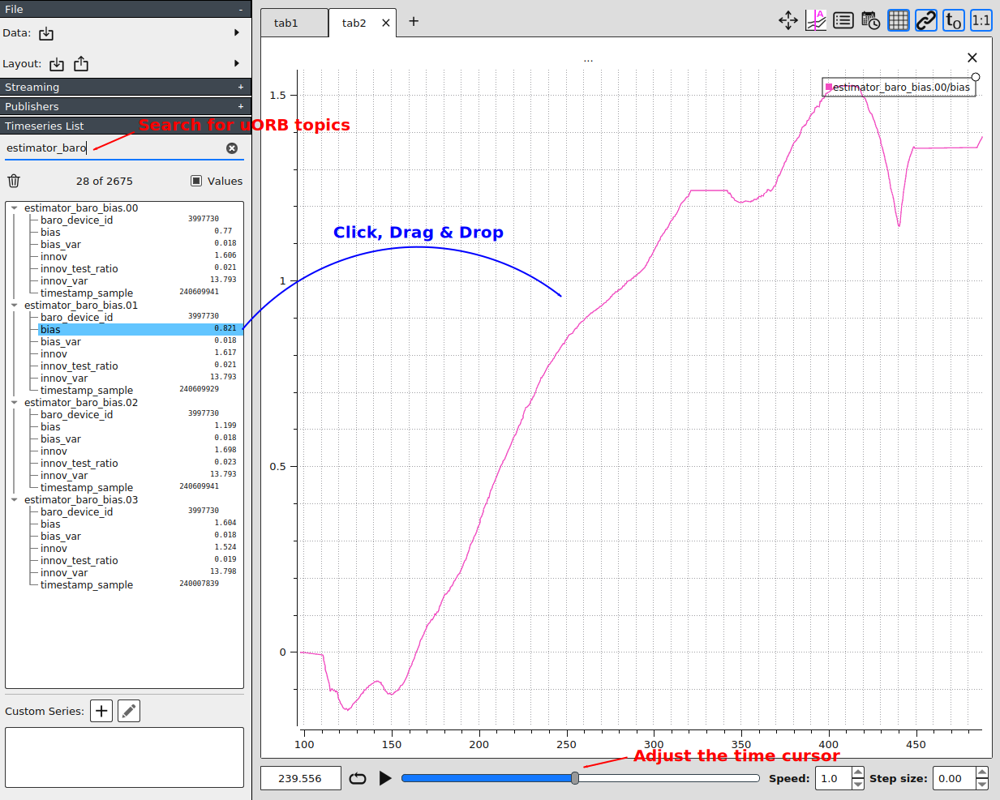
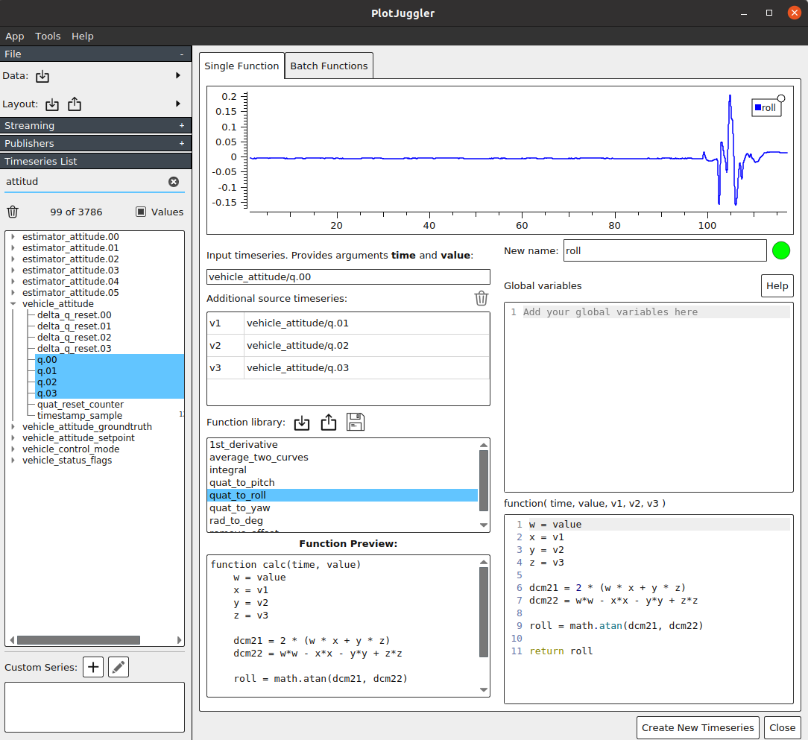
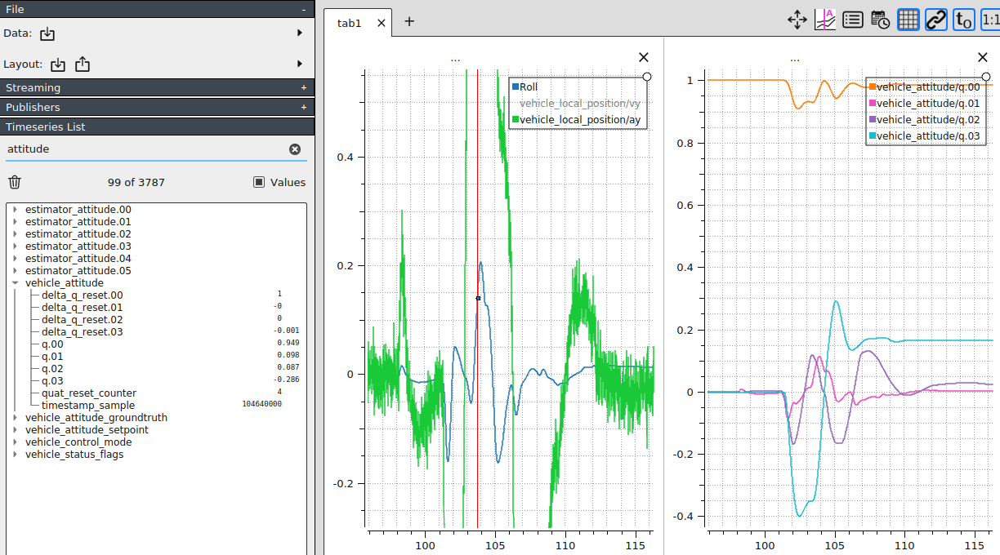

# Аналіз журналу за допомогою PlotJuggler

[PlotJuggler](https://github.com/facontidavide/PlotJuggler) може бути використаний для аналізу ULogs для більш глибоких розробок. Це надзвичайно корисно, оскільки кожна тема uORB відкрита / може бути побудована на графіку, а також має власні функції для зміни даних (наприклад, зі значень кватерніону на Крен / Тангаж / Риштування).

## Встановлення

Ви можете знайти останні версії Plot Juggler [тут](https://github.com/facontidavide/PlotJuggler/releases).

#### Примітки щодо розподілу Windows

Остання версія PlotJuggler для Windows може не працювати. У цьому випадку використовуйте [v2.8.4 тут](https://github.com/facontidavide/PlotJuggler/releases/tag/2.8.4) (відомо, що це працює з Windows).

#### Примітки про AppImage для дистрибутивів Linux

Якщо завантажений AppImage не відкривається, можливо, вам потрібно змінити його налаштування доступу. Це робиться в терміналі за допомогою наступної команди:

```sh
chmod 777 <Path-To-PlotJuggler-AppImage>
```

## Загальне використання

Два найпоширеніші завдання - "Пошук" залогованої теми уORB та "Перетягування та Відпускання" поля в певну тему на графічний вигляд. Це показано на діаграмі нижче.



### Розбиття по горизонталі / вертикалі: Багатопанельний

Одна з найбільш потужних функцій - розділення екрану у горизонтальному або вертикальному положенні та відображення різних графіків одночасно (з синхронізованою панеллю часу зверху, якщо переміщуєте курсор часу внизу).

Це показано на анімації нижче:


У цьому прикладі складові `ax`, `ay` та `az` (Оцінка прискорення) теми `vehicle_local_position` були спочатку графічно відобразжені, ділячи екран на 3 секції. Потім компонент `vz` (оцінка швидкості) був доданий під праву панель, і наостанок графік `current_a` (струм акумулятора) теми `battery_status` був побудований у нижній середній панелі.

Хоча спочатку це не очевидно, ви можете помітити, що кожного разу, коли автомобіль починає рухатися (значення поточного заряду батареї зростає), значення прискорення та швидкості також починають змінюватися. Це тому, що всі дані відображаються як часова послідовність, яка показує кожне значення на певному міткостемпу.

Це корисно для отримання загального уявлення про те, що сталося і чому. Часто важко вирішувати проблеми, просто глянувши на один графік, але якщо відображені кілька графіків, набагато легше зрозуміти, що відбувалося в системі.

### Відображення даних у 2D

Іншою потужною функцією є можливість відображення 2D даних на площині XY (кожні дані на вісі X, Y) у вигляді діаграми розсіювання. Це робиться шляхом вибору двох точок даних, утримуючи клавішу `Ctrl` під час вибору кожної з них (наприклад, компоненти `x` та `y` теми `vehicle_local_position`), і перетягуючи їх з натиснутою правою клавішею миші.


У цьому прикладі положення оціненого транспортного засобу в локальній координатній системі графічно відображено на площині XY, яка показує двовимірний вид оціненого положення, а компоненти `vx` та `vy` (оцінка швидкості) графічно відображено справа, і `vz` (оцінка вертикальної швидкості) відображено під ним на розділеному вигляді.

Це в свою чергу показує взаємозв'язок між позицією та швидкістю руху транспортного засобу інтуїтивно. Наприклад, зверніть увагу, що коли транспортний засіб рухається в напрямку X-осі, значення `vx` зростає, і коли транспортний засіб повертається у напрямку Y-осі, значення `vy` також починає змінюватись.

#### Використання кнопки 'Play'

Тут кнопка **Відтворити** використовується для програвання записаних даних в реальному часі (коефіцієнт швидкості можна налаштувати в правому нижньому куті). Це показує детально зв'язок позиції / швидкості, описаний вище.


:::info Спробуйте самі аналізувати журнал тестування човна, завантаживши вищезазначений файл ULog та макет!
- [Тестування човна ULog](https://github.com/PX4/PX4-user_guide/raw/main/assets/flight_log_analysis/plot_juggler/sample_log_boat_testing_2022-7-28-13-31-16.ulg)
- [Макет аналізу тестування човна](https://raw.githubusercontent.com/PX4/PX4-user_guide/main/assets/flight_log_analysis/plot_juggler/sample_log_boat_testing_layout.xml)
:::

### Шаблони макетів

Існує кілька файлів розташування PlotJuggler, якими діляться розробники PX4. Кожен може бути використаний для конкретної мети (настройка багтрекера, настройка VTOL, налагодження човна і т. Д.):

* [Зразок макету перегляду](https://github.com/PX4/PX4-user_guide/blob/main/assets/flight_log_analysis/plot_juggler/plotjuggler_sample_view.xml) : Шаблон, який використовується у [прикладі з декількома панелями](#splitting-horizontally-vertically-multi-panel) вище.


## Розширене використання

### Створення власних часових рядів за допомогою LUA скрипта

Plot Juggler підтримує використання LUA скриптів для обробки та відображення даних. Це потужна функція, яка може робити такі речі, як інтегрування кривої, усереднювання двох кривих, видалення зміщень та інше.

#### Розрахунок кута крену/тангажу/риск з кватеріону



Щоб знати ставлення транспортного засобу, PX4 реєструє оцінку кватерніону ставлення в темі `vehicle_attitude` у масиві значень з плаваючою комою (q[4]). Оскільки ці значення не надають контекстної інформації (наприклад, `roll`), вони потребують перетворення за допомогою тригонометричних функцій.

1. Пошукати тему `vehicle_attitude` у панелі списку часових рядів зліва
2. Виберіть 4 кватерніони (`q.00, q.01, q.02, q.03`) , натиснувши спершу `q.00`, а потім утримуючи Shift + натискайте `q.03`. Вони всі повинні бути вибрані
3. Клацніть на символ '+' у нижньому лівому розділі 'Користувацькі серії', щоб створити нову серію
4. Виберіть ще 4 члени кватерніона та перетягніть їх на вкладку 'Вхідний часовий ряд + Додатковий джереловий часовий ряд' у верхньому лівому куті
5. Подвійне клацання на `quat_to_roll` у бібліотеці функцій. Тепер ви маєте сюжет на верхній секції
6. Призначте назву для графіку (наприклад, `roll`) у полі вводу в верхньому правому куті
7. Клацніть 'Створити нову часову послідовність'. Тепер ви маєте сюжет у 'Спеціальній серії'

Тут серія власної `Roll` відображається разом з іншими часовими рядами, включаючи його початкову форму в кватерніоні справа, яка не є придатною для сприйняття людиною (використовуючи PlotJuggler 3.5.0):



Функція `quat_to_roll` виглядає так:
```lua
w = value
x = v1
y = v2
z = v3

dcm21 = 2 * (w * x + y * z)
dcm22 = w*w - x*x - y*y + z*z

roll = math.atan(dcm21, dcm22)

return roll
```
