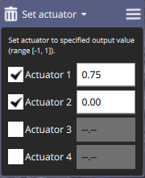

# Приводи та камери

PX4 підтримує широкий спектр приводів та камер.

Приводи підключаються до [виходів Політного Контролера](../getting_started/px4_basic_concepts.md#outputs-motors-servos-actuators) і, як правило, можуть активовуватися автоматично в місіях, або вручну за допомогою Пульта Дистанційного Керування, маппінгу на джойстик, або командами MAVLink/MAVSDK.

:::note
Приводи (актуатори) можуть бути протестовані в [pre-arm стані](../getting_started/px4_basic_concepts.md#arming-and-disarming), який деактивує мотори, але дозволяє актуаторам рухатися. Це може бути безпечнішим, ніж тестування коли апарат активований.
:::

## Дрони для картографування

Дрони для картографування використовують камери для знімання зображень з інтервалами у часі або відстані під час обстежень.

MAVLink камери які підтримують протокол [MAVLink Camera Protocol](https://mavlink.io/en/services/camera.html) забезпечують найкращу інтеграцію з PX4 і QGroundControl. MAVSDK надає простий API для використання цього протоколу як в [окремих діях камери](https://mavsdk.mavlink.io/main/en/cpp/api_reference/classmavsdk_1_1_camera.html) так і в [місіях](https://mavsdk.mavlink.io/main/en/cpp/api_reference/structmavsdk_1_1_mission_1_1_mission_item.html#structmavsdk_1_1_mission_1_1_mission_item_1a0299fbbe7c7b03bc43eb116f96b48df4).

Камери також можуть безпосередньо підключатися до політного контролера за допомогою PWM або GPI виходів. PX4 підтримує наступний набір MAVLink команд/елементів місій для камер, які підключені до політного контролера:

- [MAV_CMD_DO_SET_CAM_TRIGG_INTERVAL](https://mavlink.io/en/messages/common.html#MAV_CMD_DO_SET_CAM_TRIGG_INTERVAL) - встановити інтервал часу між зніманнями.
- [MAV_CMD_DO_SET_CAM_TRIGG_DIST](https://mavlink.io/en/messages/common.html#MAV_CMD_DO_SET_CAM_TRIGG_DIST) - встановити відстань між зніманнями
- [MAV_CMD_DO_TRIGGER_CONTROL](https://mavlink.io/en/messages/common.html#MAV_CMD_DO_TRIGGER_CONTROL) - почати/зупинити знімання (використовуючи відстань або час, як визначено попередніми командами).

Наступні розділи показують як *під'єднати* та налаштувати камеру:

- [Активація Камери](../peripherals/camera.md) через PWM або GPIO виходи політного контролера, або за допомогою MAVLink.
- Результат [Захоплення Камери](../peripherals/camera.md#camera-capture) через вхід hotshoe.


## Вантажні дрони (Доставка посилок)

Вантажні дрони зазвичай використовують захоплювачі, лебідки та інші механізми, щоб розвантажувати пакунки в місцях призначення.

PX4 підтримує _доставку посилок в місіях_ за допомогою [захоплювача](../peripherals/gripper.md). Захоплювачі також можна активовувати за допомогою MAVLink команди [MAV_CMD_DO_GRIPPER](https://mavlink.io/en/messages/common.html#MAV_CMD_DO_GRIPPER) або вручну за допомогою кнопки джойстика.

Для встановлення і інформації про використання:

- [Захоплювач](../peripherals/gripper.md)
- [Політ > Планування Місії Доставки Посилок](../flying/package_delivery_mission.md)

:::note
Також передбачена підтримка для лебідок та інших механізмів розвантаження.

Якщо вам необхідно здійснити доставку вантажу, використовуючи hardware компоненти, які ще не інтегровані, ви можете використати [Управління Загальним Приводом](#generic-actuator-control).
:::

## Спостереження, Пошук і Порятунок

Дрони Спостереження, Пошуку і Порятунку мають вимоги, подібні до картографічних дронів. Основні відмінності полягають у тому, що, окрім польоту в запланованій зоні огляду, їм зазвичай потрібен хороший автономний контроль над камерою для знімання зображень і відео, і їм може знадобитися можливість працювати вдень і вночі.

Використовуйте камеру, яка підтримує протокол [MAVLink Camera Protocol](https://mavlink.io/en/services/camera.html), оскільки він підтримує захоплення зображень і відео, масштабування, керування сховищем, кілька камер на одному апараті та перемикання між ними тощо. Цими камерами можна керувати вручну з QGroundControl або через MAVSDK (як для [окремих операцій камери](https://mavsdk.mavlink.io/main/en/cpp/api_reference/classmavsdk_1_1_camera.html), так і для [місій](https://mavsdk.mavlink.io/main/en/cpp/api_reference/structmavsdk_1_1_mission_1_1_mission_item.html#structmavsdk_1_1_mission_1_1_mission_item_1a0299fbbe7c7b03bc43eb116f96b48df4)). Перегляньте розділ [Запуск камери](../peripherals/camera.md), щоб дізнатися, як налаштувати камеру для роботи з MAVLink.

:::note
Камери, підключені безпосередньо до політного контролера, підтримують _тільки_ активацію камери та навряд чи підходять для більшості діяльностей зі спостереження/пошуку.
:::

Пошуково-рятувальному безпілотнику також може знадобитися транспортувати вантажі, наприклад, для екстреної допомоги туристу, що застряг. Перегляньте [Вантажні дрони](#cargo-drones-package-delivery) вище, щоб отримати інформацію про доставлення корисного вантажу.

## Сільськогосподарські дрони/Обприскування насаджень

Сільськогосподарські безпілотні літальні апарати зазвичай використовуються для картографування стану рослин, виявлення шкідників і догляду за тваринами (випасання, відстеження тощо). Ці варіанти використання подібні до [картографування](#mapping-drones) та [спостереження, пошуку & порятунку](#surveillance-search-rescue) наведених вище. Хоча для окремих культур/тварин можуть знадобитися спеціальні камери, інтеграція з PX4 незмінна.

Сільськогосподарський дрон також можна використовувати для обприскування посівів. У цьому випадку обприскувач має керуватися як [загальний привід](#generic-actuator-control):

- У розділі [Керування Загальним Приводом за допомогою MAVLink](#generic-actuator-control-with-mavlink) пояснюється, як можна під'єднати виходи політного контролера до розпилювача, щоб ним можна було керувати за допомогою MAVLink. Більшість розпилювачів мають засоби керування для ввімкнення/вимкнення помпи; деякі також дозволяють контролювати швидкість потоку або поле розпилення (тобто, керуючи формою сопла або використовуючи спінер для розподілу корисного навантаження).
- Ви можете визначити область розпилювання за допомогою [ Survey патерну](https://docs.qgroundcontrol.com/master/en/PlanView/pattern_survey.html) або визначити сітку для польоту за допомогою маршрутних точок. У будь-якому випадку важливо переконатися, що траєкторія польоту апарату та його висота забезпечують належне покриття для конкретного спрею, що використовується.
- Щоб увімкнути та вимкнути розпилювач, ви повинні додати [елемент "Set actuator"](#generic-actuator-control-in-missions) до вашої місії до та після survey патерну.


## Керування Загальним Приводом

Ви можете під'єднати будь-яке обладнання до невикористаних виходів PX4 і керувати ним за допомогою [Пульту керування](#generic-actuator-control-with-rc) або [MAVLink](#generic-actuator-control-with-mavlink) (у вигляді команд або в [місії](#generic-actuator-control-in-missions)).

Це корисно, коли вам потрібно використовувати тип корисного навантаження, для якого немає відповідної команди MAVLink, або який не підтримується PX4.

:::note
Якщо це можливо, надавайте перевагу використанню інтегрованого обладнання та MAVLink команд що відповідають конкретному типу обладнання, для керування загальним приводом.
Використання інтегрованого обладнання сприяє оптимізованому плануванню місії та поведінці.
:::

### Керування Загальним Приводом за допомогою MAVLink

[MAV_CMD_DO_SET_ACTUATOR](https://mavlink.io/en/messages/common.html#MAV_CMD_DO_SET_ACTUATOR) can be used to set the value of up to 6 actuators (at a time). This command can be used in [missions](#generic-actuator-control-in-missions) by creating a "Set actuator" mission item, or as a stand alone command.

The outputs that are to be controlled are specified in the [Actuators](../config/actuators.md#actuator-outputs) configuration screen by assigning the functions `Peripheral via Actuator Set 1` to `Peripheral via Actuator Set 6` to the desired [actuator outputs](../config/actuators.md#actuator-outputs).


`MAV_CMD_DO_SET_ACTUATOR` `param1` to `param6` control the outputs mapped by `Peripheral via Actuator Set 1` to `Peripheral via Actuator Set 6` respectively.

For example, in the image above, the `AUX5` output is assigned the function `Peripheral via Actuator Set 1` function. To control the actuator attached to `AUX5` you would set the value of `MAV_CMD_DO_SET_ACTUATOR.param1`.

<!-- PX4 v1.14 bug https://github.com/PX4/PX4-Autopilot/issues/21966 -->

### Generic Actuator Control with RC

Up to 6 autopilot PWM or CAN outputs can be controlled using RC channels. The outputs that are to be controlled are specified in the [Actuators](../config/actuators.md#actuator-outputs) configuration screen by assigning the functions `RC AUX 1` to `RC AUX 6` to the desired [actuator outputs](../config/actuators.md#actuator-outputs).

To map a particular RC channel to an output function `RC AUX n` (and hence it's assigned output) you use the [RC_MAP_AUXn](../advanced_config/parameter_reference.md#RC_MAP_AUX1) parameter that has the same `n` number.

For example, to control an actuator attached to AUX pin 3 (say) you would assign the output function `RC AUX 5` to the output `AUX3`. You could then use set the RC channel to control the `AUX3` output using `RC_MAP_AUX5`.

### Generic Actuator Control in Missions

To use generic actuator control in a mission you must first [configure the outputs that you want to control using MAVLink](#generic-actuator-control-with-mavlink).

Then in *QGroundControl* you can set the value of actuator outputs in a mission using the **Set actuator** mission item (this adds a [MAV_CMD_DO_SET_ACTUATOR](https://mavlink.io/en/messages/common.html#MAV_CMD_DO_SET_ACTUATOR) to the uploaded mission plan).

It is important to note that with generic actuator control, neither *QGroundControl* or PX4 know anything about the hardware being triggered. When processing the mission item, PX4 will simply set the outputs to the specified values and then immediately proceed to the next mission item. If the hardware requires time to activate and you need to pause at the current waypoint for this to happen, then you will need to plan the mission with additional items to achieve the desired behaviour.

:::note
This is one reason why integrated hardware is preferred!
It allows missions to be written generically, with any hardware-specific behaviour or timing managed by the flight stack configuration.
:::

To use a generic actuator in a mission:

1. Create a waypoint mission item where you want the actuator command.
1. Change the waypoint mission item to a "Set actuator" mission item:

   

   - Select the header on the waypoint mission editor to open the **Select Mission Command** editor.
   - Select the category **Advanced**, and then the **Set actuator** item (if the item is not present, try a more recent version of *QGroundControl* or a daily build). This will change the mission item type to "Set actuator".

1. Select the actuators that are connected and set their values (these are normalized between -1 and 1).

   

### MAVSDK (Example script)

The following [MAVSDK](https://mavsdk.mavlink.io/main/en/index.html) [example code](https://github.com/mavlink/MAVSDK/blob/main/examples/set_actuator/set_actuator.cpp) shows how to trigger payload release using the MAVSDK Action plugin's [`set_actuator()`](https://mavsdk.mavlink.io/main/en/cpp/api_reference/classmavsdk_1_1_action.html#classmavsdk_1_1_action_1ad30beac27f05c62dcf6a3d0928b86e4c) method.

The `set_actuator()` index values map to the MAVLink payload outputs defined for your airframe.

:::note MAVSDK
sends the [MAV_CMD_DO_SET_ACTUATOR](https://mavlink.io/en/messages/common.html#MAV_CMD_DO_SET_ACTUATOR) MAVLink command under the hood.
:::

```cpp
#include <mavsdk/mavsdk.h>
#include <mavsdk/plugins/action/action.h>
#include <chrono>
#include <cstdint>
#include <iostream>
#include <future>

using namespace mavsdk;

void usage(const std::string& bin_name)
{
    std::cerr << "Usage :" << bin_name << " <connection_url> <actuator_index> <actuator_value>\n"
              << "Connection URL format should be :\n"
              << " For TCP : tcp://[server_host][:server_port]\n"
              << " For UDP : udp://[bind_host][:bind_port]\n"
              << " For Serial : serial:///path/to/serial/dev[:baudrate]\n"
              << "For example, to connect to the simulator use URL: udp://:14540\n";
}

int main(int argc, char** argv)
{
    if (argc != 4) {
        usage(argv[0]);
        return 1;
    }

    const std::string connection_url = argv[1];
    const int index = std::stod(argv[2]);
    const float value = std::stof(argv[3]);

    Mavsdk mavsdk;
    const ConnectionResult connection_result = mavsdk.add_any_connection(connection_url);

    if (connection_result != ConnectionResult::Success) {
        std::cerr << "Connection failed: " << connection_result << '\n';
        return 1;
    }

    std::cout << "Waiting to discover system...\n";
    auto prom = std::promise<std::shared_ptr<System>>{};
    auto fut = prom.get_future();

    // We wait for new systems to be discovered, once we find one that has an
    // autopilot, we decide to use it.
    mavsdk.subscribe_on_new_system([&mavsdk, &prom]() {
        auto system = mavsdk.systems().back();

        if (system->has_autopilot()) {
            std::cout << "Discovered autopilot\n";

            // Unsubscribe again as we only want to find one system.
            mavsdk.subscribe_on_new_system(nullptr);
            prom.set_value(system);
        }
    });

    // We usually receive heartbeats at 1Hz, therefore we should find a
    // system after around 3 seconds max, surely.
    if (fut.wait_for(std::chrono::seconds(3)) == std::future_status::timeout) {
        std::cerr << "No autopilot found, exiting.\n";
        return 1;
    }

    // Get discovered system now.
    auto system = fut.get();

    // Instantiate plugins.
    auto action = Action{system};

    std::cout << "Setting actuator...\n";
    const Action::Result set_actuator_result = action.set_actuator(index, value);

    if (set_actuator_result != Action::Result::Success) {
        std::cerr << "Setting actuator failed:" << set_actuator_result << '\n';
        return 1;
    }

    return 0;
}
```


