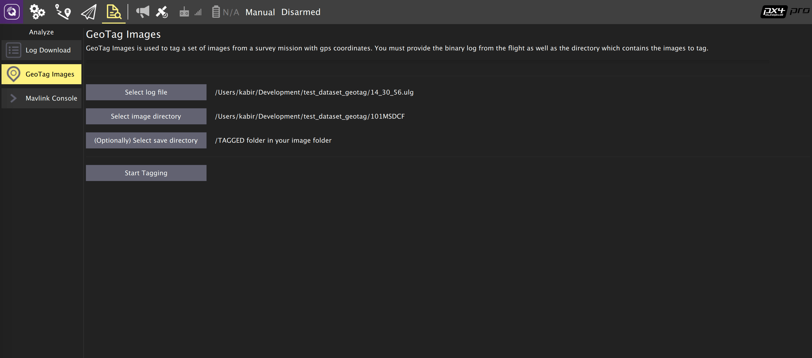

# Налаштування камери

PX4 може бути налаштований для підключення фізичних виходів для спрацювання камери, або його можна використовувати з [камерою MAVLink](#mavlink-cameras).

::: info Ми рекомендуємо використовувати камеру MAVLink, оскільки це дозволяє використовувати всебічний контроль камер через [протокол камери](https://mavlink.io/en/services/camera.html). Камери, що підключені безпосередньо, підтримують лише [невеликий підмножину](#mavlink-command-interface-directly-connected-cameras) команд камери MAVLink.
:::

Кожен раз, коли спрацьовує камера, опубліковано повідомлення MAVLink [CAMERA_TRIGGER](https://mavlink.io/en/messages/common.html#CAMERA_TRIGGER), що містить номер послідовності (тобто поточний номер послідовності зображень сеансу) та відповідний часовий позначення. Цей міткий час може бути використаний для декількох застосувань, включаючи: міткування фотографій для повітряного обстеження та реконструкції, синхронізацію багатокамерної системи або візуально-інерціальної навігації.

Камери також можуть (за бажанням) сигналізувати PX4 у саму точну мить зйомки фото/кадру за допомогою виводу захоплення камери. Це дозволяє більш точне відображення зображень в позиції GPS для геотагування, або правильний приклад IMU для синхронізації VIO тощо.

<!-- Camera trigger driver: https://github.com/PX4/PX4-Autopilot/tree/main/src/drivers/camera_trigger -->
<!-- Camera capture driver: https://github.com/PX4/PX4-Autopilot/tree/main/src/drivers/camera_capture -->

## Налаштування тригера

Спрацювання камери зазвичай налаштовується з розділу _QGroundControl_ [Налаштування ТСП > Камера](https://docs.qgroundcontrol.com/master/en/qgc-user-guide/setup_view/camera.html#px4-camera-setup).


Різні [режими тригера](#trigger-modes), [інтерфейси бекенду](#trigger-interface-backends) та [конфігурація виводу тригера](#trigger-output-pin-configuration) описані нижче (їх також можна встановити безпосередньо з [параметрів](../advanced_config/parameters.md)).

::: info Розділ налаштувань камери за замовчуванням недоступний для польотних контролерів на основі FMUv2 (наприклад, 3DR Pixhawk), оскільки модуль камери не автоматично включений в прошивку. Для отримання додаткової інформації див. [Пошук/Оновлення Параметрів > Параметри, яких немає в прошивці](../advanced_config/parameters.md#parameter-not-in-firmware).
:::

### Режими тригера

Підтримуються чотири різних режими, керовані параметром [TRIG_MODE](../advanced_config/parameter_reference.md#TRIG_MODE):

| Режим | Опис предмету                                                                                                                                                                                                                                        |
| ----- | ---------------------------------------------------------------------------------------------------------------------------------------------------------------------------------------------------------------------------------------------------- |
| 0     | Спрацювання камери вимкнено.                                                                                                                                                                                                                         |
| 1     | Працює як базовий інтервалометр, який можна увімкнути та вимкнути за допомогою команди MAVLink `MAV_CMD_DO_TRIGGER_CONTROL`. Дивіться [інтерфейс команд](#mavlink-command-interface-directly-connected-cameras) для отримання додаткової інформації. |
| 2     | Постійно перемикає інтервалометр.                                                                                                                                                                                                                    |
| 3     | Тригери на основі відстані. Знімок робиться кожного разу, коли перевищується встановлена горизонтальна відстань. Мінімальний інтервал часу між двома пострілами, однак, обмежується встановленим інтервалом спрацьовування.                          |
| 4     | спрацьовує автоматично при виконанні опитування в режимі місії.                                                                                                                                                                                      |

::: info Якщо це ваш перший раз увімкнення додатка спуску камери, пам'ятайте перезавантажити після зміни параметра `TRIG_MODE`.
:::

### Інтерфейси взаємодії з викликами

Драйвер спуску камери підтримує кілька бекендів - кожен для конкретного застосування, керований параметром [TRIG_INTERFACE](../advanced_config/parameter_reference.md#TRIG_INTERFACE):

| Номер | Опис                                                                                                                                                                                                                                                                                                                                                                                                                                                                                                                                         |
| ----- | -------------------------------------------------------------------------------------------------------------------------------------------------------------------------------------------------------------------------------------------------------------------------------------------------------------------------------------------------------------------------------------------------------------------------------------------------------------------------------------------------------------------------------------------- |
| 1     | Вмикає інтерфейс GPIO. Вихідні AUX періодично вмикаються або вимикаються (в залежності від параметра `TRIG_POLARITY`) кожні [TRIG_INTERVAL](../advanced_config/parameter_reference.md#TRIG_INTERVAL) часу. Це може бути використано для прямого спрацьовування більшості стандартних камер для машинного зору. Зверніть увагу, що на апаратному забезпеченні серії PX4FMU (Pixhawk, Pixracer тощо) рівень сигналу на додаткових контактах становить 3,3 В.                                                                                   |
| 2     | Вмикає інтерфейс Seagull MAP2. Це дозволяє використовувати [Seagull MAP2](http://www.seagulluav.com/product/seagull-map2/) для інтерфейсу з безліччю підтримуваних камер. Pin/Channel 1 (camera trigger) та Pin/Channel 2 (вибір режиму) MAP2 повинні бути підключені до нижнього та верхнього сопоставлених [контактів спуску камери](#trigger-output-pin-configuration). За допомогою Seagull MAP2, PX4 також підтримує автоматичний контроль потужності та функціоналість утримання в робочому стані камер Sony Multiport, таких як QX-1. |
| 3     | Вмикає інтерфейс GPIO. У цьому режимі не використовується жодний фактичний апаратний вивід. Лише повідомлення MAVLink `CAMERA_TRIGGER` відправляється автопілотом (за замовчуванням, якщо додаток MAVLink знаходиться у режимі `onboard`. В іншому випадку потрібно буде увімкнути власний потік).                                                                                                                                                                                                                                           |
| 4     | Вмикає загальний інтерфейс ШШІ. Це дозволяє використовувати [інфрачервоні тригери](https://hobbyking.com/en_us/universal-remote-control-infrared-shutter-ir-rc-1g.html) або сервоприводи для спуску затвора вашої камери.                                                                                                                                                                                                                                                                                                                    |

### Налаштування виводу шпильки тригера

Піни запуску камери встановлені на екрані конфігурації _QGroundControl_ [Приводи](../config/actuators.md).

Піни тригера можуть бути встановлені, призначивши функцію `Camera_Trigger` на будь-який вихід FMU. Якщо використовується налаштування тригера, яке потребує двох контактів (наприклад, Seagull MAP2), ви можете призначити будь-які два виходи.

Зверніть увагу, що якщо вихід _PWM_ вже використовувався для запуску камери (наприклад, Seagull MAP2), вся група PWM не може бути використана для чого-небудь іншого (ви не можете використовувати інший вихід у групі для приводу, двигуна або захоплення камери, оскільки таймер вже був використаний).

::: info На момент написання спрацьовування працює лише на контактах FMU:

- На контролері польоту Pixhawk, який має як FMU, так і I/O плати, піни FMU відображаються на виходи `AUX` (наприклад, Pixhawk 4, CUAV v5+).
- Контролер, що має лише FMU, контакти відображаються на виходи `MAIN` (наприклад, Pixhawk 4 mini, CUAV v5 nano).

:::

### Інші параметри

| Параметр                                                                   | Опис                                                                                                                                                                                                                                                              |
| -------------------------------------------------------------------------- | ----------------------------------------------------------------------------------------------------------------------------------------------------------------------------------------------------------------------------------------------------------------- |
| [TRIG_POLARITY](../advanced_config/parameter_reference.md#TRIG_POLARITY)   | Це стосується лише використання інтерфейсу GPIO. Встановлює полярність контакту спрацювання. Активний високий означає, що контакт зазвичай знаходиться у низькому стані і піднімається на високий рівень під час спрацювання тригера. Активний низький - навпаки. |
| [TRIG_INTERVAL](../advanced_config/parameter_reference.md#TRIG_INTERVAL)   | Визначає час між двома послідовними подіями спрацьовування тригера в мілісекундах.                                                                                                                                                                                |
| [TRIG_ACT_TIME](../advanced_config/parameter_reference.md#TRIG_ACT_TIME) | Визначає час у мілісекундах, протягом якого контакт для тригеру відбувається в стані "активний" перед поверненням до нейтрального. У режимах ШІМ мінімум обмежується до 40 мс, щоб завжди вміщувати активний імпульс у сигнал ШІМ з частотою 50 Гц.               |

Повний список параметрів, що стосуються модуля спуску камери, можна знайти на сторінці [довідника параметрів](../advanced_config/parameter_reference.md#camera-trigger).

## Захоплення камери

Камери також можуть (за бажанням) використовувати пін захоплення камери, щоб сигналізувати точний момент зйомки фотографії/кадру. Це дозволяє більш точне відображення зображень в позиції GPS для геотагування, або правильний приклад IMU для синхронізації VIO тощо.

Захоплення / зворотний зв'язок камери увімкнено в PX4, встановивши [CAM_CAP_FBACK = 1](../advanced_config/parameter_reference.md#CAM_CAP_FBACK). Використаний для захоплення камери штифт потім встановлюється на екрані конфігурації _QGroundControl_ [Приводи](../config/actuators.md), призначивши функцію `Camera_Capture` на будь-який вихід FMU.

Зверніть увагу, що якщо вихід _PWM_ використовується як вхід захоплення камери, вся група PWM не може бути використана для чого-небудь іншого (ви не можете використовувати інший вихід у групі для приводу, двигуна або запуску камери, оскільки таймер вже був використаний).

::: info На момент написання захоплення камери працює лише на контактах FMU:

- На контролері польоту Pixhawk, який має як FMU, так і I/O плати, піни FMU відображаються на виходи `AUX` (наприклад, Pixhawk 4, CUAV v5+).
- Контролер, що має лише FMU, контакти відображаються на виходи `MAIN` (наприклад, Pixhawk 4 mini, CUAV v5 nano).

:::

PX4 виявляє зростаючий фронт з відповідним рівнем напруги на позначці захоплення камери (для контролерів польоту Pixhawk це зазвичай 3,3 В). Якщо камера не видає відповідного напруги, то для забезпечення сумісності сигналу буде потрібна додаткова схемотехніка.

Камери, які мають гарячий башмак (для підключення спалаху), зазвичай можна підключити за допомогою адаптера для гарячого башмака. Наприклад, [Адаптер гарячого башмака камери Seagull #SYNC2 Universal](https://www.seagulluav.com/product/seagull-sync2/) - це оптокуплер, який відокремлює та зсуває напругу спалаху до напруги Pixhawk. Це вставляється в роз'єм для спалаху зверху камери. Червоні та чорні виходи підключені до рейки/землі сервоприводу, а білий дріт підключений до піна захоплення введення.


::: info PX4 видає повідомлення MAVLink [CAMERA_TRIGGER](https://mavlink.io/en/messages/common.html#CAMERA_TRIGGER) як при спрацьовуванні камери, так і при захопленні зображення. Якщо налаштований захоплення камери, використовується відмітка часу від драйвера захоплення камери, інакше використовується відмітка часу спрацювання.
:::

## Інтерфейс команд MAVLink (камери, підключені безпосередньо)

При використанні камери, підключеної до керування польотом, як описано в цьому документі (наприклад, використовуючи інтерфейси GPIO, PWM або seagull backend), драйвер камери підтримує наступний піднабір команд MAVLink:

[MAV_CMD_DO_TRIGGER_CONTROL](https://mavlink.io/en/messages/common.html#MAV_CMD_DO_TRIGGER_CONTROL) - Прийнято у режимі "керований командою" (`TRIG_MODE` 1).

| Параметр команди | Опис                                                                                                   |
| ---------------- | ------------------------------------------------------------------------------------------------------ |
| Param #1         | Увімкнення/вимкнення тригера. `1`: увімкнути (почати), `0`: вимкнути.                                  |
| Param #2         | Скинути послідовність тригера. `1`: скидання, будь-яке інше значення нічого не робить.                 |
| Param #3         | Призупинення спрацьовування, але без вимкнення камери або витягування її. `1`: пауза, `0`: перезапуск. |

<!-- https://github.com/PX4/PX4-Autopilot/blob/main/src/drivers/camera_trigger/camera_trigger.cpp#L549 -->

[MAV_CMD_DO_DIGICAM_CONTROL](https://mavlink.io/en/messages/common.html#MAV_CMD_DO_DIGICAM_CONTROL) - Прийнято в усіх режимах.

Це використовується GCS для тестування камери з інтерфейсу користувача. Водій спрацьовувача не підтримує всі параметри керування камерою, визначені специфікацією MAVLink.

| Параметри команди | Опис                                                                                                           |
| ----------------- | -------------------------------------------------------------------------------------------------------------- |
| Param #5          | Спровокувати виконання одноразової команди (встановіть 1, щоб спровокувати виконання одного кадру зображення). |

[MAV_CMD_DO_TRIGGER_CONTROL](https://mavlink.io/en/messages/common.html#MAV_CMD_DO_SET_CAM_TRIGG_DIST) - Прийнято у режимі "керований командою" (`TRIG_MODE` 4)

Ця команда генерується автоматично під час місій для спрацювання камери на основі місій з опитування від GCS.

[MAV_CMD_OBLIQUE_SURVEY](https://mavlink.io/en/messages/common.html#MAV_CMD_OBLIQUE_SURVEY)  - Команда місії для встановлення автоматичного кріплення камери для обертання при обертанні обертального обстеження.

Це приймає `param1` до `param4`, як визначено в визначенні повідомлення MAVLink. Налаштування інтеграції затвору (`param2`) виконується тільки з GPIO backend.

<!-- https://github.com/PX4/PX4-Autopilot/blob/main/src/drivers/camera_trigger/camera_trigger.cpp#L632 -->

## Камери MAVLink

PX4 також може бути налаштований на використання [інтерфейсу заднього кінця MAVLink тригера](#trigger-interface-backends) з камерою MAVLink.

У цьому випадку повідомлення камери MAVLink пересилаються на камеру MAVLink для обробки (хоча PX4 все ще видасть `CAMERA_TRIGGER`, коли отримає команду спуску).

Камери MAVLink рекомендовано, оскільки камери, підключені безпосередньо, підтримують лише [невеликий піднабір](#mavlink-command-interface-directly-connected-cameras) доступних повідомлень та команд камери MAVLink. Камери MAVLink, ймовірно, пропонують набагато більше контролю над камерою за допомогою [Протоколу камери MAVLink](https://mavlink.io/en/services/camera.html).

## Тестування функціональності тригера

:::warning
Наступні розділи застаріли і потребують повторного тестування.
:::

1. На консолі PX4:

   ```
   camera_trigger test
   ```

1. Від _QGroundControl_:

   Клацніть на **Запуск камери** на головній панелі інструментів. Ці знімки не відображаються або не підраховуються для геотегування.

   

## Приклад Sony QX-1 (Фотограметрія)


У цьому прикладі ми використаємо кабель спускового пристрою Seagull MAP2 для інтерфейсу з Sony QX-1 та використаємо налаштування для створення ортомозаїк після проведення повністю автономної місії обстеження.

### Налаштування тригера

Рекомендовані налаштування камери:

- `TRIG_INTERFACE=2` (Seagull MAP2).
- `TRIG_MODE=4` (Контрольований місією).
- Залиште решту параметрів за замовчуванням.

Вам потрібно підключити карту Seagull MAP2 до контактів FMU на вашому автопілоті. Інший кінець кабелю MAP2 буде вставлено в роз'єм "MULTI" QX-1.

### Налаштування камери

Ми використовуємо Sony QX-1 з об'єктивом 16-50 мм f3.5-5.6 для цього прикладу.

Щоб уникнути затримки автофокусу та вимірювання при спрацюванні камери, слід дотримуватися наступних вказівок:

- Ручне фокусування на безкінечність
- Встановіть камеру в режим постійного знімання
- Вручну встановіть експозицію та діафрагму
- ISO повинен бути встановлений якнайнижчим
- Ручний баланс білого, відповідний для сцени

### Планування місії


### Геотегування

Завантажте/скопіюйте файл журналу та зображення з польоту та вказіть QGroundControl на них. Потім клацніть на **Почати позначення**.



Ви можете перевірити геотегування за допомогою безкоштовного онлайн-сервісу, такого як [Pic2Map](https://www.pic2map.com/). Зверніть увагу, що Pic2Map обмежений лише 40 зображеннями.

### Реконструкція

Ми використовуємо [Pix4D](https://pix4d.com/) для реконструкції у 3D.


## Приклад синхронізації камери-ІНУ (VIO)

У цьому прикладі ми розглянемо основи синхронізації вимірювань ІМП з візуальними даними для побудови стерео навігаційної системи Visual-Inertial Navigation System (VINS). Щоб було зрозуміло, ідея тут полягає не в тому, щоб вимірювати IMU точно у той же час, що і ми фотографуємо, а отримувати правильний часовий штамп на наших зображеннях, щоб надавати точні дані нашому алгоритму VIO.

Автопілот та супутник мають різні бази часу (час завантаження для автопілота та UNIX епоха для супутника), тому замість вигинати будь-який з годинників, ми безпосередньо спостерігаємо різницю часу між годинниками. Це зміщення додається або віднімається від міток часу в повідомленнях MAVLink (наприклад, `HIGHRES_IMU`) в компоненті перекладача міжпрограмного забезпечення (наприклад, MAVROS на співмешканці та `mavlink_receiver` в PX4). Фактичний алгоритм синхронізації є модифікованою версією алгоритму мережевого протоколу часу (NTP) та використовує експоненційний рухомий середній для згладжування відстеженого зсуву часу. Ця синхронізація виконується автоматично, якщо використовується MAVROS з високосмуговим зв'язком на борту (режим MAVLink `onboard`).

Для отримання синхронізованих кадрів зображення та інерційних вимірювань ми підключаємо входи тригера двох камер до контакту GPIO на автопілоті. Часовий штамп інерційного вимірювання від початку впливу та номер послідовності зображень записуються й відправляються на спільний комп'ютер (повідомлення `CAMERA_TRIGGER`), який буферизує ці пакети та кадри зображень, отримані з камери. Вони збігаються за порядковим номером (перший кадр зображення - послідовність 0), часовими позначками зображень (з міткою часу від повідомлення `CAMERA_TRIGGER`) та потім публікуються.

Наступна діаграма ілюструє послідовність подій, які повинні відбутися для правильного відміткового зображень.

[](https://mermaid.live/edit#pako:eNqNUs9rwjAU_lceOW-3nXIQpIoIVkftZIdCeTbPNqxJXJI6ivi_L1Er6Dzs9kK-H3lfviOrjCDGmaPvjnRFE4m1RVVogKXxBFbWjQezg_fPN-CQS0Xgel3Bj_QNKDxY40A6EEYTYOeNQi8rbNs-SkTS62g04DgkqMgi5EG2JguWUPR_vaoLSlh5CKAb63reGuMdoBbR96Zwz7kzvQylcrXjPDFKBe71BYnR3po2ClzhkXnZNR1vFlJ_cR6GMkkn5WRV5tl8NptmZbJa5tlqEXmtMXuYBtMe4m05X-bTbDNegJJtKx1VRgv3NIybQTJOp9l4EH94zGMY99ugmqcfa49q_zyER3aKvmpg-G3QndqS_R_17AJSYU3n9PfdNuzXFJq0YC8sgBVKEbp0jHoF8w0pKhgPo6Addq0vWKFPARp7sg4lYtzbjl5Ytxfoh-oxvsPW0ekXb8TjxQ)

<!-- Original

{/% mermaid %/}
sequenceDiagram
  Note right of PX4 : Time sync with mavros is done automatically
  PX4 ->> mavros : Camera Trigger ready
  Note right of camera driver : Camera driver boots and is ready
  camera driver ->> mavros : mavros_msgs::CommandTriggerControl
  mavros ->> PX4 : MAVLink::MAV_CMD_DO_TRIGGER_CONTROL
  loop Every TRIG_INTERVAL milliseconds
  PX4 ->> mavros : MAVLink::CAMERA_TRIGGER
  mavros ->> camera driver : mavros_msgs::CamIMUStamp
  camera driver ->> camera driver : Match sequence number
  camera driver ->> camera driver : Stamp image and publish
end
{/% endmermaid %/}
-->

### Крок 1

Спочатку встановіть TRIG_MODE на 1, щоб драйвер чекав на команду запуску та перезавантажте свій FCU, щоб отримати решту параметрів.

### Крок 2

Для цілей цього прикладу ми налаштуємо тригер для співпраці з камерою Point Grey Firefly MV, що працює з частотою 30 FPS.

- `TRIG_INTERVAL`: 33.33 ms
- `TRIG_POLARITY`: 0 (активний низький)
- `TRIG_ACT_TIME`: 0.5 ms. Ручний номер у цьому випадку має бути не менш ніж 1 мікросекунда.
- `РЕЖИМ_ТРИГЕРА`: 1, тому що ми хочемо, щоб драйвер камери був готовий отримувати зображення перед початком спрацьовування тригера. Це важливо для належної обробки послідовних номерів.

### Крок 3

Підключіть свої камери до роз'єму AUX, підключивши земельний і сигнальний контакти до відповідного місця.

### Крок 4

Вам доведеться змінити свій драйвер, щоб дотримуватися схеми послідовності вище. Доступні публічні посилання для реалізації [камер IDS Imaging UEye](https://github.com/ProjectArtemis/ueye_cam) та для [сумісних з IEEE1394](https://github.com/andre-nguyen/camera1394) камер.
