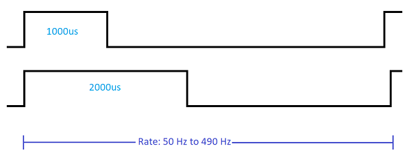

# ESCs & Двигуни

Багато дронів PX4 використовують безшовні двигуни, які керуються контролером польотів через електронний контролер швидкості (ESC). ESC бере сигнал від контролера польоту і використовує його для встановлення рівня потужності, яка постачається до двигуна.

PX4 підтримує кілька поширених протоколів для відправлення сигналів на ESC: [PWM ESCs](../peripherals/pwm_escs_and_servo.md), [OneShot ESCs](../peripherals/oneshot.md), [DShot ESCs](../peripherals/dshot.md), [DroneCAN ESCs](../dronecan/escs.md), ESC PCA9685 (через I2C) та деякі ESC з UART (від Yuneec).

Для додаткової інформації дивіться:

- [PWM ESCs та сервоприводи](../peripherals/pwm_escs_and_servo.md)
- [OneShot ESCs та сервоприводи](../peripherals/oneshot.md)
- [DShot](../peripherals/dshot.md)
- [DroneCAN ESCs](../dronecan/escs.md)
- [Калібрування ESC](../advanced_config/esc_calibration.md)
- [Прошивки ESC та огляд протоколів](https://oscarliang.com/esc-firmware-protocols/) (oscarliang.com)

Огляд високого рівня основних протоколів ESC/Servo, які підтримуються PX4, наведено нижче.

## Протоколи ESC

### PWM

[PWM ESCs](../peripherals/pwm_escs_and_servo.md) є загально використовуваними для повітряних та наземних транспортних засобів (транспортні засоби, які потребують меншої затримки, наприклад, багатоциклові, зазвичай використовують oneshot або dshot ESCs).

PWM ESCs спілкуються за допомогою періодичного імпульсу, де _ширина_ імпульсу вказує на бажаний рівень потужності. Ширина імпульсу зазвичай коливається між 1000 мкс для нульової потужності та 2000 мкс для повної потужності. Періодична частота кадру сигналу залежить від можливості ESC і зазвичай коливається від 50 Гц до 490 Гц (теоретичний максимум становить 500 Гц для дуже малого циклу "вимкнено"). Вища швидкість є кращою для ЕСК, особливо коли потрібна швидка реакція на зміни встановленої точки. Для серводвигунів з ШІМ зазвичай достатньо 50 Гц, і багато з них не підтримують вищі частоти.

Крім того, для відносно повільного протоколу PWM ESCs потрібно [калібрування](../advanced_config/esc_calibration.md), оскільки значення діапазону, що представляють низькі та високі значення, можуть значно відрізнятися. На відміну від [dshot](#dshot) та [DroneCAN ESC](#dronecan) вони не мають можливості надавати телеметрію та зворотний зв'язок щодо стану ESC (або сервопривода).

Установка:

- [Схема підключення ESC](../peripherals/pwm_escs_and_servo.md)
- [Конфігурація PX4](../peripherals/pwm_escs_and_servo.md#px4-configuration)
- [Калібрування ESC](../advanced_config/esc_calibration.md)

### Oneshot 125

[OneShot 125 ESCs](../peripherals/oneshot.md) зазвичай набагато швидше, ніж PWM ESCs, тому вони більш реактивні та легше настроюються. Вони віддають перевагу перед PWM для багатороторних (але не настільки, як [DShot ESCs](#dshot), які не потребують калібрування, і можуть надавати зворотний зв'язок з телеметрії). Існує кілька варіантів протоколу OneShot, які підтримують різні швидкості. PX4 підтримує лише OneShot 125.

OneShot 125 - це те саме, що і PWM, але використовує ширину імпульсів, яка в 8 разів коротша (від 125 мкс до 250 мкс для нуля до повної потужності). Це дозволяє ESC OneShot 125 мати набагато коротший цикл роботи / вищу швидкість. Для PWM теоретичний максимум становить близько 500 Гц, тоді як для OneShot він наближається до 4 кГц. Фактична підтримувана швидкість залежить від використаного ESC.

Установка:

- [Підключення ЕСК](../peripherals/pwm_escs_and_servo.md) (таке ж, як для PWM ЕСК)
- [Конфігурація PX4](../peripherals/oneshot.md#px4-configuration)
- [Калібрування ESC](../advanced_config/esc_calibration.md)

### DShot

[DShot](../peripherals/dshot.md) є цифровим протоколом ESC, який настійно рекомендується для транспортних засобів, які можуть скористатися зменшенням затримки, особливо для гоночних багтрекерів, вертикально-взлітно-посадкових апаратів та інших.

Він має зменшену затримку і є більш надійним, ніж як [PWM](#pwm), так і [OneShot](#oneshot-125). Крім того, для його роботи не потрібна калібрування ESC, телеметрія доступна з деяких ESCs, і ви можете змінити напрямок обертання двигуна

Конфігурація PX4 виконується в [Конфігурації приводів](../config/actuators.md). Вибір ESC DShot з вищою швидкістю в інтерфейсі призводить до зниження затримки, але нижчі швидкості є більш надійними (і, отже, більш підходять для великих літаків з довшими проводами); деякі ESC підтримують лише нижчі швидкості (див. технічні характеристики для отримання інформації).

Установка:

- [Підключення ЕСК](../peripherals/pwm_escs_and_servo.md) (таке ж, як для PWM ЕСК)
- [DShot](../peripherals/dshot.md) також містить інформацію про те, як відправляти команди тощо.

### DroneCAN

[Регулятори швидкості DroneCAN](../dronecan/escs.md) рекомендовано, коли DroneCAN є основною шиною, використованою для вашого транспортного засобу. Реалізація PX4 наразі обмежена частотами оновлення 200 Гц.

DroneCAN має багато схожих переваг з [Dshot](#dshot), включаючи високі швидкості передачі даних, надійне з'єднання по довгих лініях, зворотний зв'язок телеметрії, не потребує калібрування самого ESC.

[Мотори DroneCAN](../dronecan/escs.md) підключені через шину DroneCAN (налаштування та конфігурація описані за цим посиланням).
