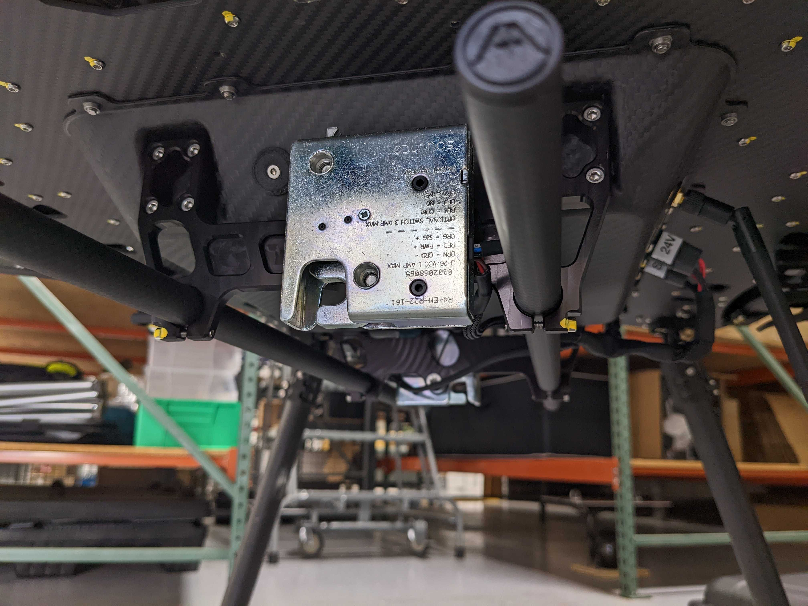
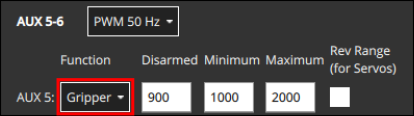
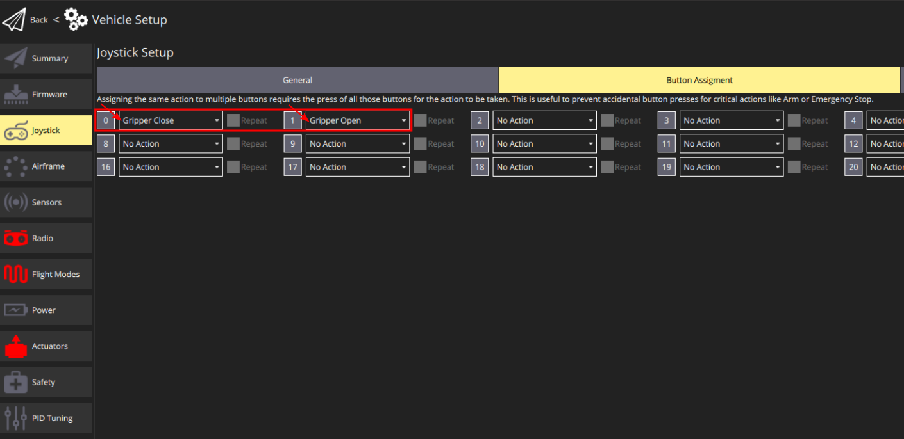

# Захоплювачі

Захвати - це механічні пристрої, які можуть бути інтегровані з безпілотним транспортним засобом для захоплення (утримання) та відпускання вантажів.

PX4 дозволяє викликати захвати автоматично у [Місіях доставки вантажу](../flying/package_delivery_mission.md) або вручну [використовуючи джойстик](#qgc-joystick-configuration).



::: info
Захват замість цього може бути налаштований як [загальний привод RC або MAVLink](../payloads/generic_actuator_control.md#generic-actuator-control-with-rc). Загальний привід не може бути використаний з джойстиком або в місіях з вантажем, але його можна використовувати з пультом дистанційного керування.
:::

## Підтримувані захвати

Існує багато різних механізмів захоплення ("щелепи", "пальці", "електромагніти") та інтерфейсів (PWM, CAN, MAVLink тощо).

PX4 підтримує захвати, які мають прості важелі для утримання та відпускання, та використовують наступні інтерфейси (див. зв'язані документи для деталей):

- [PWM Сервохват](gripper_servo.md) - Схвати, підключені до виходів PWM автопілота
- **MAVLink Захват** (Не тестовано) - Захваты, які підтримують команду MAVLink [MAV_CMD_DO_GRIPPER](https://mavlink.io/en/messages/common.html#MAV_CMD_DO_GRIPPER).

## Використання захоплювача

Для отримання інформації про використання захоплювача в місіях див. [Місії доставки вантажів](../flying/package_delivery_mission.md).

Ви можете вручну спрацьовувати захват вручну з кнопки джойстика, якщо ви відобразили кнопки `gripper open` та `gripper close` в [Конфігурації джойстика QGC](#qgc-joystick-configuration). Зверніть увагу, що якщо ви натиснете кнопку **Grab**, коли захоплювач відкривається, він автоматично припинить поведінку вивільнення і перейде в закрите положення, ефективно скасовуючи команду вивільнення. Якщо ви це робите під час виконання місії, коли відбувається випуск, тоді [доставка буде скасована](../flying/package_delivery_mission.md#manual-control-of-gripper-in-missions).

Підтримка вручного спрацьовування захоплювача з перемикача [керування RC](../getting_started/rc_transmitter_receiver.md) не підтримується.

Додатки MAVLink, такі як земельні станції, також можуть керувати затиском за допомогою команди MAVLink [MAV_CMD_DO_GRIPPER](https://mavlink.io/en/messages/common.html#MAV_CMD_DO_GRIPPER).

## Конфігурація PX4

### Налаштування доставки посилок

Підтримка захоплювача PX4 пов'язана з функцією доставки пакетів, яка повинна бути увімкнена та налаштована для можливості використання захоплювача.

1. Встановіть параметр [PD_GRIPPER_EN](../advanced_config/parameter_reference.md#PD_GRIPPER_EN) на 1 (після зміни потрібно перезавантаження).
1. Встановіть [PD_GRIPPER_TYPE](../advanced_config/parameter_reference.md#PD_GRIPPER_TYPE) для відповідності вашому захоплювачу. Наприклад, встановіть на `Servo` для [Servo Grepper](gripper_servo.md).

### Відображення активатора захоплювача

Захвати, які підключені безпосередньо до контролера польоту, такі як серводвигуни з ШШІ, повинні бути відображені на конкретні виходи під час [Конфігурації приводів](../config/actuators.md#actuator-outputs).

Це виконується шляхом призначення функції `Gripper` для вихідного порту, де підйомник підключений. Наприклад, на зображенні нижче призначається `Gripper` для виходу PWM AUX5.



Додаткову інформацію про відображення приводу надається в документації, специфічній для захоплювача. Наприклад, дивіться [Gripper Servo > Actuator Mapping](../peripherals/gripper_servo.md#actuator-mapping).

### Увімкнути режим попередньої підготовки ARM

Зазвичай ви захочете увімкнути [режим попереднього підготовки до озброєння](../advanced_config/prearm_arm_disarm.md). Цей режим утримує двигуни вимкненими, але дозволяє затискати та відкривати захоплювач для кріплення вантажу (уникнення потенційної небезпеки від обертання пропелерів).

1. Встановіть [COM_PREARM_MODE](../advanced_config/parameter_reference.md#COM_PREARM_MODE) на `Always`.

### Тайм-аут активації захоплювача

Важливо, щоб для доставки посилки захоплювач мав час відпустити перед переходом до наступних точок маршруту. Для захоплювачів, які не надають зворотного зв'язку на основі датчика їхнього стану, що становить більшість з них, використовується налаштований таймаут для сигналізації про те, коли захват _повинен_ бути відкритий або закритий.

Щоб встановити таймаут активації:

1. Виміряйте час, який займає відкриття та закриття захвату, та зафіксуйте більший з цих двох часів.

   Є два простих способи відкрити та закрити захоплювач. Поки дрон знаходиться на лавці і гвинти видалені:

   - Виконайте тест `payload_deliverer` у QGC [MAVLink Shell](../debug/mavlink_shell.md):

     ```
     > payload_deliverer gripper_test
     ```

     :::info Якщо ви отримаєте повідомлення про помилку, подібне до "[payload_deliverer] не працює", повторіть процедури налаштування вище. Ви також можете запустити команду `payload_deliverer start` в оболонці Nuttx.
:::

   - Використовуйте [джойстик](#qgc-joystick-configuration) для виклику дій відкриття та закриття захвата.

1. Встановіть [PD_GRIPPER_TO](../advanced_config/parameter_reference.md#PD_GRIPPER_TO) на те значення, яке є більшим серед часу відкриття та закриття захоплювача.

### Тайм-аут доставки місій

Під час виконання [Місії доставки вантажу](../flying/package_delivery_mission.md) важливо, щоб місія не була зупинена у випадку, коли захват не повідомляє, що він відкрився (або закрився). Це може статися, якщо датчик зворотного зв'язку захвата був пошкоджений або UORB втратив повідомлення про тайм-аут дії захоплювача.

::: інформація
Зворотний зв'язок стану затискача від датчика насправді ще не підтримується, але це можливо у майбутньому.
:::

Таймаут доставки місії забезпечує додатковий захист, продовжуючи місію, якщо підтвердження успішного виконання захоплювача не надійшло.

Щоб встановити таймаут:

1. Встановіть [MIS_PD_TO](../advanced_config/parameter_reference.md#MIS_PD_TO) на значення, більше, ніж тайм-аут активації захоплювача [gripper](#gripper-actuation-timeout).

## Налаштування джойстика QGC

Конфігурація [джойстика](../config/joystick.md) QGroundControl дозволяє вам відображати дії захоплювача на кнопки джойстика, після чого ви зможете відкривати та закривати зхват вручну.

Для відображення кнопок джойстика в QGroundControl:

1. Відкрийте меню: **QGC Логотип (вгорі ліворуч) > Налаштування Транспортного Засобу > Джойстик > Призначення Кнопок** вкладка.

   

1. Виберіть дії `Gripper Open` та `Gripper Close` для бажаних кнопок джойстика, як показано вище.

Ви можете протестувати дії, натиснувши на кнопки зіставлено і перевіривши спосіб пересування. Якщо захоплювач не рухається, як очікувалося, перевірте налаштування доставки пакета та відображення приводу.
