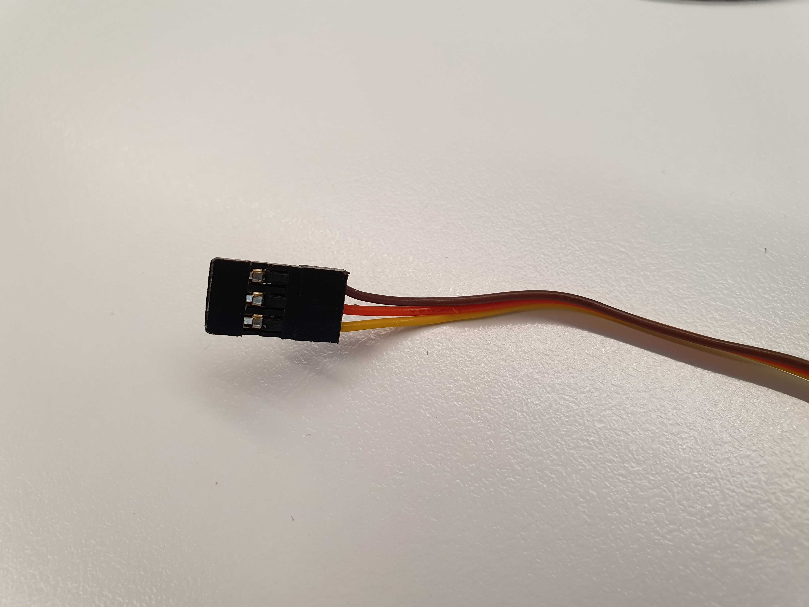
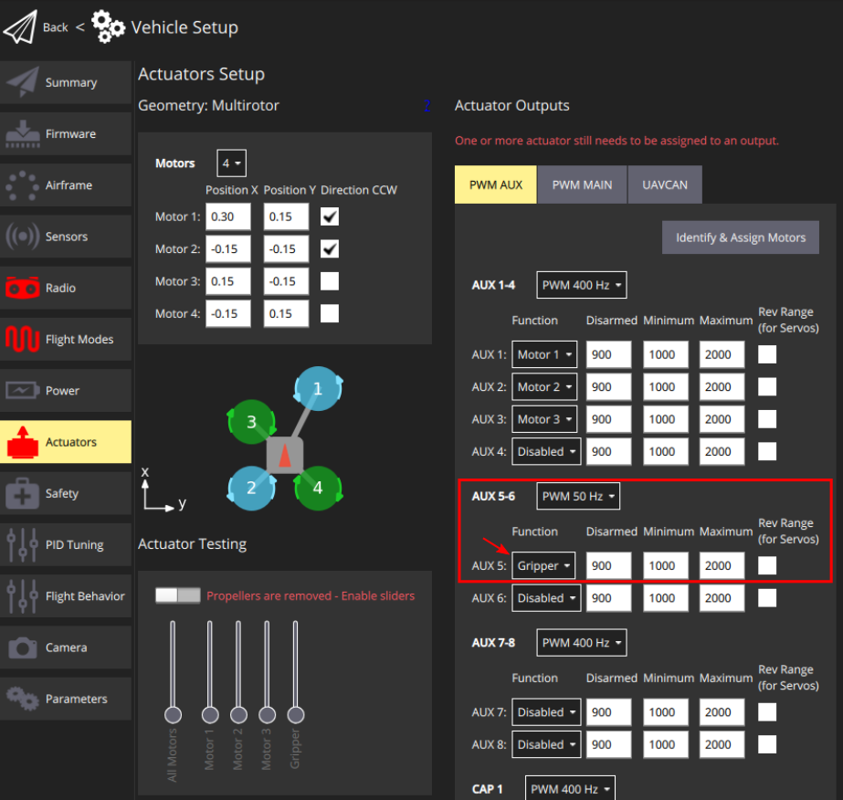

# PWM Сервопривод

Цей розділ пояснює, як підключити та налаштувати [захоплювач](../peripherals/gripper.md), який керується виходом ШШП контролера польоту (серводією).

## Підтримувані захвати

Наступні сервоприводи, підключені за допомогою ШІМ, були протестовані з PX4:

- [R4-EM-R22-161 : електронний замок з витиском для зачинення](https://southco.com/en_any_int/r4-em-r22-161).

## Підключення маніпулятора з керуванням ШІМ

Кабель ШІМ складається з трьох ліній: живлення, земля та сигнал. Типовий роз'єм показаний на зображенні нижче:

На зображенні вище кольори проводів мають наступні значення:

| Колір проводу | Ціль       |
| ------------- | ---------- |
| Brown         | Ground     |
| Red           | Power      |
| Yellow        | Сигнал PWM |

Вам потрібно буде підключити їх до відповідного входу PWM контролера польоту.

### Перевірка сумісності

Перед підключенням кабелю перевірте наступні вимоги:

- **Рівень напруги сигнальної лінії**: Перевірте технічні характеристики механізму захвату, щоб знайти рівень напруги сигнальної лінії. І переконайтеся, що це сумісно з рівнем напруги контактів вашого контролера польоту.
- **Вимоги до живлення захвата**: Перевірте технічний опис механізму, щоб дізнатися вимоги до напруги живлення лінії. Залежно від цього, захоплювач може бути підключений безпосередньо до [модуля живлення](../power_module/index.md) або підключений до лінії 5V. Також можна використовувати спеціалізований регулятор напруги для виведення будь-якої іншої необхідної напруги.

## Конфігурація PX4

Інструкції з налаштування можна знайти в: [Gripper > PX4 Configuration](../peripherals/gripper.md#px4-configuration) документації.

Зокрема, зверніть увагу, що серводатчик повинен бути відображений на вивід, як показано нижче.

### Відображення активатора

PWM сервоприводи, та інші периферійні пристрої, які підключені безпосередньо до виходів PWM, повинні бути відображені на конкретні виходи під час [Конфігурації приводів](../config/actuators.md#actuator-outputs).

Це виконується шляхом призначення функції `Gripper` для вихідного порту, де підйомник підключений. Наприклад, на зображенні нижче призначається `Gripper` для виходу PWM AUX5.

Вам також потрібно встановити правильну частоту ШІМ для вихідного порту захоплювача (для комерційних сервоприводів / захоплювачів це зазвичай 50 Гц).

::: info
Неправильна настройка частоти може пошкодити захват.
:::

Повзунки в розділі [Тестування приводів](../config/actuators.md#actuator-testing) екрану конфігурації можуть бути використані для перевірки того, що відповідний вивід рухається, коли ви переміщуєте повзунок. Мінімальні та максимальні значення ШІМ повинні бути встановлені так, щоб сервопривід був повністю закритий у відключеному положенні і повністю відкритий в максимальному положенні слайдера.
