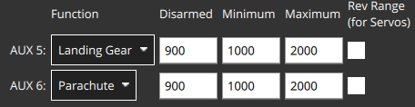

# Парашут

PX4 може бути налаштований для спрацювання парашута під час [припинення польоту](../advanced_config/flight_termination.md).

Парашут може бути підключений до вільного виходу ШІМ або за допомогою MAVLink.

::: info Під час припинення польоту PX4 вимикає всі контролери та встановлює всі вихідні PWM в їхні значення аварійної ситуації (включаючи ті, що підключені до вихідних PWM) та спрацьовує будь-які підключені парашути через MAVLink.

Отже, ви можете використовувати цю функцію для активації кількох додаткових пристроїв безпеки, підключених до різних виходів. Для додаткової інформації дивіться [Конфігурація припинення польоту](../advanced_config/flight_termination.md).
:::

## Використання Парашутів

Нижче наведено кілька важливих моментів при використанні парашутів:

- Парашут не гарантує, що транспортний засіб не буде знищений або не завдасть шкоди! Ви завжди повинні літати з урахуванням безпеки.
- Парашути потребують обережного використання для ефективності. Наприклад, їх треба правильно складати.
- Парашути мають мінімальну ефективну висоту.
- Парашут може спрацювати, коли транспортний засіб перевернутий. Це збільшить час, необхідний для сповільнення, і може призвести до того, що дрон зламає парашут.
- Парашут розгортатиметься лише у випадку, якщо контролер польоту живлений та PX4 працює належним чином (якщо він не спрацьовує незалежно від PX4). Воно не буде розгортатися, якщо щось спричинить аварію стеку польоту.

## Налаштування парашута

Припинення польоту (і відповідно розгортання парашута) може бути спровоковане перевірками безпеки, такими як Втрата RC, порушення геозахисту та іншими, від тригерів ставлення та інших перевірок виявлення відмов або командою з земної станції. Під час припинення польоту PX4 встановлює вихідні сигнали ШІМ на їх "значення аварійної ситуації" (значення аварійної ситуації вимикають двигуни, але можуть бути використані для увімкнення/спрацювання парашуту). Якщо підключено та працює парашут MAVLink, буде відправлено команду на його активацію.

Підготовка парашута передбачає наступне:

- Налаштування [припинення польоту](../advanced_config/flight_termination.md) як відповідної дії для тих випадків безпеки та відмов, де повинен бути розгорнутий парашут.
- Налаштуйте PX4 для розгортання парашуту під час завершення польоту (встановіть відповідні рівні виводу ШШШ або надішліть команду розгортання парашуту через MAVLink).
- Налаштуйте рівні виводу PX4, щоб вимкнути двигуни у випадку аварії. Це типове значення, тому, як правило, нічого не потрібно (для сервоприводів це значення центру).

### Увімкнути припинення польоту

Для включення припинення польоту:

- Встановіть [Безпеку](../config/safety.md) дії на _Припинення польоту_ для перевірок, де ви хочете, щоб парашут спрацював.
- Встановіть кути нахилу детектора відмов [Failure Detector](../config/safety.md#failure-detector), кути крена та викидання та тригери часу для виявлення аварій / перекидань, та вимкніть вимикач аварійного / IMU тайм-ауту (тобто встановіть [CBRK_FLIGHTTERM=0](../advanced_config/parameter_reference.md#CBRK_FLIGHTTERM)).

:::info Ви також можете налаштувати [зовнішню систему автоматичного спрацювання тригера (ATS)](../config/safety.md#external-automatic-trigger-system-ats) для виявлення відмов.
:::

### Налаштування виводів на шині

Якщо парашут спрацьовує через вихід PWM або CAN, то спочатку його слід підключити до не використаного виходу. Можливо, вам також доведеться окремо живити сервопривід парашута. Це може бути зроблено, підключивши 5V BEC до рейки сервоприводу керування польотом та живлячи парашут від нього.

Потім вам потрібно переконатися, що пін парашута буде встановлений на значення, яке спрацює, коли відбудеться аварійне відключення:

- Відкрийте [Виконавчі пристрої](../config/actuators.md) в QGroundControl
- Призначте функцію _Парашут_ для будь-якого не використаного виходу (нижче ми встановлюємо вихід `AUX6`):

  

- Встановіть відповідні значення ШІМ для вашого парашута. Вихідна інформація автоматично встановлюється на максимальне значення ШШІ, коли відбувається аварійне відключення.

  :::info Для пружинного запускача від [Fruity Chutes](https://fruitychutes.com/buyachute/drone-and-uav-parachute-recovery-c-21/harrier-drone-parachute-launcher-c-21_33/) мінімальне значення ШІМ повинно бути між 700 та 1000 мс, а максимальне значення між 1800 та 2200 мс.
:::

### Налаштування парашута MAVLink

PX4 спрацює підключений та здоровий парашут у випадку відмови, відправивши команду [MAV_CMD_DO_PARACHUTE](https://mavlink.io/en/messages/common.html#MAV_CMD_DO_PARACHUTE) з дією [PARACHUTE_RELEASE](https://mavlink.io/en/messages/common.html#PARACHUTE_ACTION).

Підтримка парашуту MAVLink увімкнена шляхом встановлення параметра [COM_PARACHUTE=1](../advanced_config/parameter_reference.md#COM_PARACHUTE). PX4 потім вказує стан парашута, використовуючи біт [MAV_SYS_STATUS_RECOVERY_SYSTEM](https://mavlink.io/en/messages/common.html#MAV_SYS_STATUS_RECOVERY_SYSTEM) у розширених полях датчиків керування на борту [SYS_STATUS](https://mavlink.io/en/messages/common.html#SYS_STATUS)

- `SYS_STATUS.onboard_control_sensors_present_extended`: За наявності серцебиття парашуту MAVLink (на основі виявлення серцебиття).
- `SYS_STATUS.onboard_control_sensors_enabled_extended`: ?
- `SYS_STATUS.onboard_control_sensors_health_extended`: Здоров'я парашуту MAVLink (на основі виявлення серцебиття).

Для випускання [HEARTBEAT](https://mavlink.io/en/messages/common.html#HEARTBEAT) з `HEARTBEAT.type` рівним [MAV_TYPE_PARACHUTE](https://mavlink.io/en/messages/common.html#MAV_TYPE_PARACHUTE) потрібен парашут MAVLink.

<!-- PX4 v1.13 support added here: https://github.com/PX4/PX4-Autopilot/pull/18589 -->

## Тестування парашута

:::warning
Для першого тесту спробуйте на лавці, без підставок та з невантажним парашутним пристроєм!
:::

:::info
Немає можливості відновлення після стану припинення!
Перед тим, як знову використовувати транспортний засіб для наступних тестів.
:::

Парашут спрацює під час [припинення польоту](../advanced_config/flight_termination.md).

Найпростіший спосіб перевірити (справжній) парашут - увімкнути [вимикач виявлення відмови за тригером нахилу](../config/safety.md#attitude-trigger) та нахилити транспортний засіб.

Ви також можете симулювати парашут/припинення польоту: [Gazebo Classic > Симулювання парашута/припинення польоту](../sim_gazebo_classic/index.md#simulated-parachute-flight-termination).
