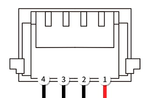

# Віддалений ідентифікатор (відкритий ідентифікатор дрона)

:::warning
Експериментально
Підтримка віддаленого ID є експериментальною.
:::

Віддалений ідентифікатор - це технологія, що регулюється урядом для БПЛА в Японії, Сполучених Штатах Америки та Європейському Союзі, розроблена для забезпечення безпечного спільного використання повітряного простору між БПЛА та іншими повітряними суднами. Специфікація вимагає, щоб БПЛА передавали дані, такі як: реальний час розташування/висота, серійний номер, ідентифікатор оператора/розташування, статус та інше.

PX4 працює з модулями Remote ID, які спрямовані на стандартні правила Remote ID ФАА [стандартні правила Remote ID](https://www.faa.gov/uas/getting_started/remote_id). Ці пристрої призначені для інтеграції в транспортний засіб та відтворення повідомлень відкритого ідентифікатора дрона, використовуючи ідентифікатор, позицію та іншу інформацію, яка надається автопілотом. Модулі "стандартних правил" дозволяють менш обмежену роботу, ніж модулі "правил трансляції", які є автономними модулями з інтегрованим GPS, які не мають жодного зв'язку з автопілотом.

## Підтримуване обладнання

PX4 інтегрується з апаратним засобом Remote ID, який підтримує протокол MAVLink [Open Drone ID](https://mavlink.io/en/services/opendroneid.html) (Open Drone ID - це відкрита реалізація Remote ID).

Було протестовано з наступними пристроями:

- [Cube ID](https://docs.cubepilot.org/user-guides/cube-id/cube-id) (CubePilot)
- [Db201](https://dronescout.co/dronebeacon-mavlink-remote-id-transponder/) (BlueMark)
- [Db202mav](https://dronescout.co/dronebeacon-mavlink-remote-id-transponder/) (BlueMark) - less expensive variant without CAN port.
- [Модуль віддаленого ідентифікатора Holybro](https://holybro.com/products/remote-id) (Holybro)

:::info

- Інші пристрої, які підтримують API MAVLink, повинні працювати (але не були протестовані).
- PX4 не підтримує Remote ID через CAN в PX4 v1.14.

:::

## Налаштування обладнання

Пристрої віддаленого ідентифікатора можуть бути підключені до будь-якого вільного/не використаного послідовного порту на контролері польоту. Зазвичай вони підключені безпосередньо до порту `TELEM2` (якщо він не використовується для інших цілей), оскільки він вже налаштований для MAVLink "за замовчуванням".

### Cube ID

[Ідентифікатор куба](https://docs.cubepilot.org/user-guides/cube-id/cube-id) можна підключити за допомогою його послідовного порту (DroneCAN не може бути використаний). Він постачається з кабелем JST-GH 1.25 мм з 6 контактами, який можна підключити безпосередньо до портів `TELEM` на більшості останніх контролерів польоту Pixhawk.

Якщо використовуєте інший порт або контролер польоту з іншим роз'ємом, можливо, вам доведеться змінити кабель. Схема пінів послідовного порту показана нижче. TX та RX на контролері польоту повинні бути підключені до RX та TX на Remote ID, відповідно.

#### Cube ID Serial Port

| Pin     | Сигнал   | Вольтаж |
| ------- | -------- | ------- |
| 1 (red) | VCC_5V   | 5V      |
| 2 (blk) | TX (OUT) |         |
| 3 (blk) | RX (IN)  |         |
| 4 (blk) | GND      | 0       |

#### Cube ID Firmware

Ідентифікатор куба використовує власне прошивку (не [ArduRemoteID](https://github.com/ArduPilot/ArduRemoteID), як у деяких інших дистанційних маяках ідентифікаторів).

Щоб отримати інструкції з оновлення прошивки, див. [Cube ID > Оновлення](https://docs.cubepilot.org/user-guides/cube-id/cube-id#updating).

### BlueMark Db201/Db202mav

[Db201](https://dronescout.co/dronebeacon-mavlink-remote-id-transponder/) або [Db202mav](https://dronescout.co/dronebeacon-mavlink-remote-id-transponder/) можна підключити за допомогою їхнього послідовного порту (DroneCAN не може бути використаний). Вони постачаються з кабелем JST-GH 1.25 мм з 6 контактами, який можна підключити безпосередньо до портів `TELEM` на більшості останніх контролерів польоту Pixhawk.

Якщо використовуєте інший послідовний порт (тобто з меншою кількістю контактів), або контролер польоту з іншим роз'ємом, можливо, вам доведеться змінити кабель. Інформацію про роз'єм порту можна знайти в [Посібнику користувача](https://download.bluemark.io/db200.pdf).

Сигнальні маяки поставляються з встановленою заздалегідь останньою вбудованою програмною фірмою [ArduRemoteID](https://github.com/ArduPilot/ArduRemoteID). [Керівництво користувача](https://download.bluemark.io/db200.pdf) пояснює, як ви можете оновити прошивку через веб-інтерфейс, якщо потрібно.

Додаткову загальну настройку, включаючи спосіб монтажу маяка, також описано в [Керівництві користувача](https://download.bluemark.io/db200.pdf)

### Holybro Віддалений ID модуль

Модуль віддаленого ідентифікатора [Holybro Remote ID Module](https://holybro.com/products/remote-id)  може бути підключений за допомогою послідовного порту (DroneCAN не може бути використаний на момент написання: PX4 v1.14). Воно постачається з кабелем JST-GH 1.25 мм з 6 контактами, який можна підключити безпосередньо до портів `TELEM` на більшості останніх контролерів польоту Pixhawk, таких як Pixhawk 6C/6X або Cube Orange.

Модуль поставляється з встановленою заздалегідь останньою вбудованою програмною фірмою [ArduRemoteID](https://github.com/ArduPilot/ArduRemoteID). Керівництво користувача [User Guide](https://docs.holybro.com/radio/remote-id) пояснює, як ви можете налаштувати та оновити прошивку через веб-інтерфейс, якщо потрібно.

#### Holybro Pinouts

Зверніть увагу, що порт CAN не підтримується в PX4 v1.14

## Конфігурація PX4

### Конфігурація порту

Апаратне забезпечення віддаленого ідентифікатора налаштоване так само, як будь-який інший [Пристрій MAVLink](../peripherals/mavlink_peripherals.md).

Припускаючи, що ви підключили пристрій до порту `TELEM2`, [встановіть параметри](../advanced_config/parameters.md) так, як показано:

- [MAV_1_CONFIG](../advanced_config/parameter_reference.md#MAV_1_CONFIG) = `TELEM 2`
- [MAV_1_MODE](../advanced_config/parameter_reference.md#MAV_1_MODE) = Нормальний
- [MAV_1_RATE](../advanced_config/parameter_reference.md#MAV_1_RATE) = 0 (швидкість відправлення за замовчуванням для порту).
- [MAV_1_FORWARD](../advanced_config/parameter_reference.md#MAV_1_FORWARD) = Увімкнено

Перезавантажте пристрій.

Тепер ви знайдете новий параметр, який називається [SER_TEL2_BAUD](../advanced_config/parameter_reference.md#SER_TEL2_BAUD). Необхідна швидкість передачі даних залежить від використаного віддаленого ідентифікатора (для Cube ID вона повинна бути встановлена на 57600).

<!-- In theory, a Remote ID (or other MAVLink peripheral) that supports WiFi or wired Ethernet network could also be connected over those links. -->

### Увімкнути віддалений ID

Немає потреби явно увімкнювати Віддалений ідентифікатор (підтримувані повідомлення про Віддалений ідентифікатор транслюються за замовчуванням або повинні бути запитані в поточній реалізації, навіть якщо жоден віддалений ідентифікатор не підключений).

### Запобігання Зброєнню на підставі Віддаленого Ідентифікатора

Для того щоб дозволити озброєння лише тоді, коли готовий Віддалений ідентифікатор, [встановіть](../advanced_config/parameters.md#conditional-parameters) параметр [COM_ARM_ODID](#COM_ARM_ODID) на `2` (за замовчуванням він вимкнений).

| Параметр                                                                                          | Опис                                                                                                                                                                                                                                                                              |
| ------------------------------------------------------------------------------------------------- | --------------------------------------------------------------------------------------------------------------------------------------------------------------------------------------------------------------------------------------------------------------------------------- |
| [COM_ARM_ODID](../advanced_config/parameter_reference.md#COM_ARM_ODID) | Увімкніть систему виявлення та перевірки стану ідентифікатора дрона. `0`: Вимкнути (за замовчуванням), `1`: Попереджувати, якщо відсутній віддалений ідентифікатор, але все ще дозволяти готування, `2`: Дозволяти готування лише у випадку наявності віддаленого ідентифікатора. |

## Тестування мовлення модуля

Інтегратори повинні перевірити, що модуль віддаленого ідентифікатора транслює правильну інформацію, таку як місцезнаходження БПЛА, ідентифікатор, ідентифікатор оператора та інше. Це найлегше зробити за допомогою стороннього додатку на вашому мобільному пристрої:

- [Сканер дронів](https://github.com/dronetag/drone-scanner) (Google Play або Apple App store)
- [OpenDroneID OSM](https://play.google.com/store/apps/details?id=org.opendroneid.android_osm&hl=en&gl=US) (Google Play)

## Реалізація

PX4 v1.14 передає ці повідомлення за замовчуванням (у режимах потокової передачі: звичайний, на борту, через USB, на борту з низькою пропускною здатністю):

- [OPEN_DRONE_ID_LOCATION](https://mavlink.io/en/messages/common.html#OPEN_DRONE_ID_LOCATION) (1 Гц) - Місце знаходження БПЛА, висота, напрямок та швидкість.
- [СИСТЕМА OPEN_DRONE_ID](https://mavlink.io/en/messages/common.html#OPEN_DRONE_ID_SYSTEM) (1 Гц) Місцезнаходження/висота оператора, інформація про кілька літальних апаратів (група/рой, якщо застосовується), повна відмітка часу та можлива інформація про категорію/клас.

  - Реалізація передбачає, що оператор знаходиться в домашньому положенні транспортного засобу (ще не підтримує отримання позиції оператора з ПЗУ). Вважається, що це відповідає вимогам лише для віддалених ідентифікаторів трансляції.

Наступне повідомлення можна транслювати за запитом (використовуючи [MAV_CMD_SET_MESSAGE_INTERVAL](https://mavlink.io/en/messages/common.html#MAV_CMD_SET_MESSAGE_INTERVAL)):

- [OPEN_DRONE_ID_BASIC_ID](https://mavlink.io/en/messages/common.html#OPEN_DRONE_ID_BASIC_ID) - Інформація про ідентифікацію БПЛА (в суті, серійний номер)
  - PX4 v1.14 вказує серійний номер ([MAV_ODID_ID_TYPE_SERIAL_NUMBER](https://mavlink.io/en/messages/common.html#MAV_ODID_ID_TYPE_SERIAL_NUMBER)), але не використовує необхідний формат (формат ANSI/CTA-2063).

PX4 запобігає взбиранню на основі стану віддаленого ідентифікатора, якщо параметр [COM_ARM_ODID](../advanced_config/parameter_reference.md#COM_ARM_ODID) встановлено ​​на `2`. БПЛА потім буде вимагати повідомлення `HEARTBEAT` від ідентифікатора віддаленого керування як умову перед зброюванням БПЛА. Ви також можете встановити параметр на `1`, щоб попереджувати, але все ж дозволяти озброєння, коли не виявлені повідомлення Remote ID `HEARTBEAT`.

Наступні повідомлення Open Drone ID MAVLink не підтримуються в PX4 v1.14 (що буде додано за допомогою [PX4#21647](https://github.com/PX4/PX4-Autopilot/pull/21647)):

- [OPEN_DRONE_ID_AUTHENTICATION](https://mavlink.io/en/messages/common.html#OPEN_DRONE_ID_AUTHENTICATION) - Надає дані аутентифікації для БПЛА.
- [OPEN_DRONE_ID_SELF_ID](https://mavlink.io/en/messages/common.html#OPEN_DRONE_ID_SELF_ID) - Ідентифікація оператора (звичайний текст).
- [OPEN_DRONE_ID_OPERATOR_ID](https://mavlink.io/en/messages/common.html#OPEN_DRONE_ID_OPERATOR_ID) - Ідентифікатор оператора.
- [OPEN_DRONE_ID_ARM_STATUS](https://mavlink.io/en/messages/common.html#OPEN_DRONE_ID_ARM_STATUS) - Статус апаратного забезпечення віддаленого ідентифікатора. Використовуйте як умову для озброєння транспортного засобу, а також для перевірки стану здоров'я віддаленого ідентифікатора.
- [ОНОВЛЕННЯ_СИСТЕМИ_ВІДКРИТОГО_ДРОНУ_ID](https://mavlink.io/en/messages/common.html#OPEN_DRONE_ID_SYSTEM_UPDATE) - Підмножина `OPEN_DRONE_ID_SYSTEM`, яку можна відправляти з інформацією з вищою швидкістю.

## Відповідність

PX4 може не відповідати відповідним специфікаціям у версії 1.14 (тому ця функція наразі експериментальна). Була створена робоча група для оцінки прогалин.

Деякі відомі проблеми:

- Транспортні засоби повинні бути готові до активації після отримання повідомлення Remote ID [OPEN_DRONE_ID_ARM_STATUS](https://mavlink.io/en/messages/common.html#OPEN_DRONE_ID_ARM_STATUS), зі статусом, що вказує на готовність обладнання Remote ID для трансляції.
  - PX4 v1.14 не обробляє `OPEN_DRONE_ID_ARM_STATUS`, і зброювання відбувається лише умовно на пристрої Remote ID `HEARTBEAT`.
- Стан віддаленого ідентифікатора залежить від отримання `HEARTBEAT` та `OPEN_DRONE_ID_ARM_STATUS`. При польоті статус незбройований для Remote ID повинен бути опублікований в [OPEN_DRONE_ID_LOCATION.status](https://mavlink.io/en/messages/common.html#OPEN_DRONE_ID_LOCATION) як несправність Remote ID.
  - PX4 v1.14 ще не отримує `OPEN_DRONE_ID_ARM_STATUS`.
- `OPEN_DRONE_ID_ARM_STATUS` повинен бути перенаправлений на GCS, якщо він є, для додаткової звітності про помилки.
- [OPEN_DRONE_ID_BASIC_ID](https://mavlink.io/en/messages/common.html#OPEN_DRONE_ID_BASIC_ID) вказує на серійний номер у неправильному форматі (не у форматі ANSI/CTA-2063).
- ID транспортного засобу має бути стійким до втручань.

[PX4-Autopilot/21647](https://github.com/PX4/PX4-Autopilot/pull/21647) призначений для вирішення відомих проблем.

## Дивіться також

- [Віддалена ідентифікація дронів](https://www.faa.gov/uas/getting_started/remote_id) (FAA)
