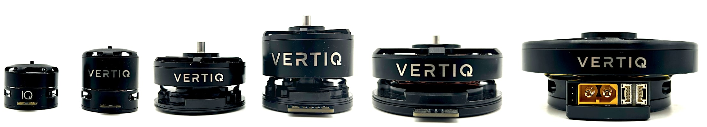

# Модулі Vertiq All-In-One Motor/ESC

Vertiq виготовляє високоефективні пропульсивні системи для комерційних та оборонних БПЛА. Основний дизайн складається з легкого, тісно інтегрованого двигуна та ESC з вбудованим позиційним датчиком. З контролем швидкості з закритим зворотним зв'язком для найшвидшого часу реакції, провідною ефективністю, відсутністю стартових та зворотних вібрацій, що дозволяє керування низькою швидкістю та плавну зворотність, а також вбудованим контролером "стоу" для плавного розміщення пропелерів у режимі очікування у вибраному напрямку, модулі Vertiq мають значні переваги перед іншими ESC.

Всі модулі Vertiq підтримують традиційні [вхідні PWM, DShot, OneShot та Multishot протоколи зв'язку](https://iqmotion.readthedocs.io/en/latest/manual/manual_hobby.html). Більші модулі Vertiq також підтримують управління [DroneCAN](https://iqmotion.readthedocs.io/en/latest/manual/manual_dronecan.html).

## Де купити

Інформацію про покупки можна знайти на веб-сайті [Vertiq](https://www.vertiq.co/).

## Налаштування програмного забезпечення

### Підключення

Підключення вашого модуля Vertiq до виходу ШІМ з вашого керування польотом або шини DroneCAN буде відрізнятися в залежності від вашої моделі. Будь ласка, перегляньте аркуші даних продукту для інформації щодо підключення.

Усі технічні описи Vertiq можна знайти на [vertiq.co](https://www.vertiq.co/).

## Збірка прошивки

Найкращий інструмент для налаштування вашого модуля Vertiq - це додаток IQ Control Center від Vertiq. Ви можете знайти інструкції з встановлення в [Початок роботи з модулями швидкості за допомогою IQ Control Center](https://iqmotion.readthedocs.io/en/latest/tutorials/testing_with_control_center.html).

Щоб розпочати роботу з традиційним введенням ШІМ або DShot з вашим контролером польоту, будь ласка, див. [Керування ШІМ та DSHOT з контролером польоту](https://iqmotion.readthedocs.io/en/latest/tutorials/pwm_control_flight_controller.html).

Для початку роботи з DroneCAN з вашим контролером польоту, будь ласка, перегляньте [Інтеграцію DroneCAN з контролером польоту PX4](https://iqmotion.readthedocs.io/en/latest/tutorials/dronecan_px4_flight_controller.html).

## Налаштування польотного контролера

### Конфігурація DroneCAN

Інструкції з інтеграції двигуна / ESC за допомогою DroneCAN можна знайти в [Конфігурація Польотного Контролера](https://iqmotion.readthedocs.io/en/latest/tutorials/dronecan_px4_flight_controller.html#flight-controller-configuration) (в _Інтеграція DroneCAN з Польотним Контролером PX4_).

Ці інструкції допоможуть вам налаштувати правильні параметри для активації драйверів DroneCAN контролера польоту, встановити правильні конфігураційні параметри для зв'язку з модулями Vertiq на шині DroneCAN, налаштування ESC та перевірку того, що ваш контролер польоту може належним чином керувати вашими модулями по протоколу DroneCAN.

### Конфігурація DShot/PWM

Інструкції з інтеграції двигуна / ESC за допомогою PWM та DShot можна знайти в [Керування PWM та DShot з Польотним Контролером](https://iqmotion.readthedocs.io/en/latest/tutorials/pwm_control_flight_controller.html). DShot рекомендовано.

## Подальша інформація

- <https://www.vertiq.co/> — Дізнайтеся більше про модулі Vertiq
- [Документація Vertiq](https://iqmotion.readthedocs.io/en/latest/index.html) — Додаткова інформація про налаштування вашого модуля Vertiq
